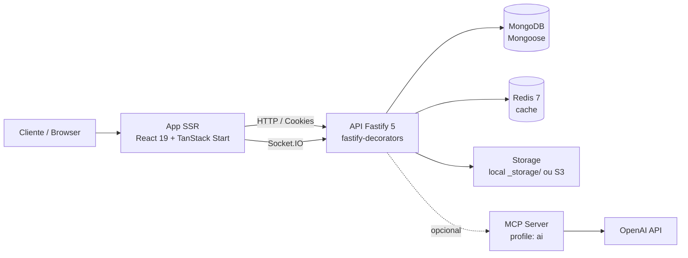

# LowCodeJS

Plataforma low-code para criação de aplicações com tabelas dinâmicas,
formulários, dashboards, menus customizáveis e automações executadas em sandbox.

---

## Sumário

- [Visão geral](#visão-geral)
- [Funcionalidades](#funcionalidades)
- [Arquitetura](#arquitetura)
- [Stack tecnológica](#stack-tecnológica)
- [Estrutura do monorepo](#estrutura-do-monorepo)
- [Pré-requisitos](#pré-requisitos)
- [Instalação rápida (Docker)](#instalação-rápida-docker)
- [Desenvolvimento local](#desenvolvimento-local)
- [Configuração via UI (`/settings`)](#configuração-via-ui-settings)
- [Variáveis de ambiente](#variáveis-de-ambiente)
- [Scripts da raiz](#scripts-da-raiz)
- [Sistema de permissões (RBAC)](#sistema-de-permissões-rbac)
- [Tabelas dinâmicas e sandbox](#tabelas-dinâmicas-e-sandbox)
- [Testes](#testes)
- [Deploy e CI/CD](#deploy-e-cicd)
- [Documentação adicional](#documentação-adicional)

---

## Visão geral

LowCodeJS é uma plataforma para construir aplicações de dados sem escrever
código: o usuário define tabelas com tipos de campo ricos, escolhe entre nove
estilos de visualização (lista, kanban, calendário, gantt, fórum etc.),
configura permissões granulares por papel/visibilidade e expõe formulários
públicos quando necessário. Para casos avançados, scripts JavaScript podem ser
acoplados a eventos do registro (`beforeSave`, `afterSave`, `onLoad`) e rodam
em uma VM Node isolada com timeout.

O backend é uma API Fastify + MongoDB que constrói schemas Mongoose em runtime
a partir da definição de cada tabela. O frontend é uma aplicação React 19 com
SSR (TanStack Start) que consome a mesma API e oferece a UI do low-code.
Storage de arquivos pode ser local ou S3-compatível, e há um chat opcional com
assistente IA via MCP + OpenAI.

A documentação detalhada de cada camada vive em `backend/CLAUDE.md` e
`frontend/CLAUDE.md`.

---

## Funcionalidades

- Tabelas dinâmicas com schema Mongoose gerado em runtime a partir de campos
  configurados pela UI.
- 14 tipos de campo (texto curto/longo, dropdown, data, relacionamento,
  arquivo, grupo de campos, reação, avaliação, categoria, usuário, nativos) e
  formatos como CPF, CNPJ, e-mail, URL, rich text.
- 9 estilos de visualização: `LIST`, `GALLERY`, `DOCUMENT`, `CARD`, `MOSAIC`,
  `KANBAN`, `FORUM`, `CALENDAR`, `GANTT`.
- 5 níveis de visibilidade de tabela (`PUBLIC`, `FORM`, `OPEN`, `RESTRICTED`,
  `PRIVATE`) e RBAC com 4 papéis.
- Sandbox VM com APIs `field`, `context`, `email`, `utils`, `console`
  (timeout de 5s, sem acesso a `require`/`fs`/rede).
- Upload e processamento de arquivos via Flydrive (filesystem local ou
  S3/AWS) com transformação de imagens via Sharp.
- Autenticação JWT RS256 em cookies httpOnly + refresh token.
- WebSocket (Socket.IO) para chat em tempo real e assistente IA opcional via
  Model Context Protocol (MCP) + OpenAI.
- SSR com TanStack Start (Nitro), prefetch por intent, scroll restoration e
  meta tags SEO/OG/Twitter.
- Soft delete em todas as entidades, seeders idempotentes e Setup Wizard que
  cria o usuário MASTER no primeiro acesso.
- API documentada com OpenAPI (Swagger + Scalar em `/documentation`).

---

## Arquitetura



### Serviços

| Serviço | Tipo     | Tecnologia       | Porta padrão | Descrição                         |
| ------- | -------- | ---------------- | ------------ | --------------------------------- |
| mongo   | core     | MongoDB          | 27017        | Banco de dados                    |
| redis   | core     | Redis 7 Alpine   | 6379         | Cache                             |
| api     | core     | Fastify / Node 22| 3000         | REST + WebSocket                  |
| app     | core     | React / Nitro    | 5173         | Frontend SSR                      |
| mcp     | profile `ai` | MCP Server   | 3001         | Assistente IA (chat + OpenAI)     |

```bash
# Apenas core
docker compose up -d

# Core + assistente IA
docker compose --profile ai up -d
```

---

## Stack tecnológica

### Backend (`backend/`)

| Tecnologia              | Versão | Uso                          |
| ----------------------- | ------ | ---------------------------- |
| Fastify                 | 5.6    | HTTP framework               |
| TypeScript              | 5.9    | Linguagem                    |
| Mongoose                | 8.18   | ODM MongoDB                  |
| ioredis                 | 5.10   | Cliente Redis                |
| Socket.IO               | 4.8    | WebSocket (chat)             |
| Zod                     | 4.1    | Validação                    |
| fastify-decorators      | 3.16   | DI + controllers             |
| Flydrive                | 2.1    | Storage local / S3           |
| Sharp                   | 0.34   | Processamento de imagens     |
| Vitest                  | 4.0    | Testes unit + e2e            |

Detalhes em [`backend/CLAUDE.md`](backend/CLAUDE.md).

### Frontend (`frontend/`)

| Tecnologia            | Versão  | Uso                          |
| --------------------- | ------- | ---------------------------- |
| React                 | 19.2    | UI                           |
| TanStack React Start  | 1.132   | SSR (Nitro)                  |
| TanStack React Router | 1.132   | File-based routing           |
| TanStack React Query  | 5.66    | Server state                 |
| TanStack React Form   | 1.0     | Formulários                  |
| Tailwind CSS          | 4.0     | Estilização                  |
| Radix UI              | 1.4+    | Primitivos acessíveis        |
| Zustand               | 5.0     | Client state + localStorage  |
| Monaco Editor         | 4.7     | Editor de código             |
| Tiptap                | 3.13    | Editor WYSIWYG               |
| Vite                  | 7.1     | Build                        |
| Vitest                | 3.0     | Testes                       |

Detalhes em [`frontend/CLAUDE.md`](frontend/CLAUDE.md).

---

## Estrutura do monorepo

```
lowcodejs/
├── backend/                       # API Fastify + MongoDB (CLAUDE.md próprio)
├── frontend/                      # React + TanStack Start (CLAUDE.md próprio)
├── _docs/                         # Documentação de negócio e referências
├── .github/workflows/             # CI/CD (build, test, push :latest no Docker Hub)
├── docker-compose.yml             # Dev (core + profile ai opcional)
├── docker-compose.oficial.yml     # Instalação mínima self-host (sem Redis/MCP)
├── setup.sh                       # Bootstrap inicial (.env + JWT)
├── credential-generator.sh        # Gera chaves JWT e cookie secret
├── install.md                     # Guia de instalação detalhado
└── package.json                   # Scripts agregados (run-p)
```

---

## Pré-requisitos

- Docker e Docker Compose (recomendado).
- Node.js 18+ e npm para desenvolvimento local.
- No Windows, usar Git Bash para executar `setup.sh`.

---

## Instalação rápida (Docker)

```bash
# 1. Bootstrap (cria .env, gera JWT, separa backend/.env e frontend/.env)
chmod +x ./setup.sh
./setup.sh

# 2. Sobe core (mongo, redis, api, app)
docker compose up -d

# 3. Roda seeders (permissões, grupos, settings)
docker exec -it low-code-js-api npm run seed
```

Acessos:

| Serviço     | URL                                   |
| ----------- | ------------------------------------- |
| Frontend    | http://localhost:5173                 |
| Backend     | http://localhost:3000                 |
| Docs (API)  | http://localhost:3000/documentation   |

No primeiro acesso, o **Setup Wizard** na UI cria o usuário MASTER inicial —
não há seed para esse usuário.

Para ativar o assistente IA:

```bash
docker compose --profile ai up -d
```

E configure a chave OpenAI em `/settings` (logado como MASTER).

Guia completo, troubleshooting e variáveis: [`install.md`](install.md).

---

## Desenvolvimento local

```bash
# Sobe apenas Mongo e Redis em containers
docker compose up -d mongo redis

# Backend (em um terminal)
cd backend
npm install
npm run seed
npm run dev

# Frontend (em outro terminal)
cd frontend
npm install
npm run dev
```

---

## Configuração via UI (`/settings`)

Configurações de domínio são editadas pelo MASTER na UI e persistidas no
documento `Setting` do MongoDB — **não** no `.env`:

- **SMTP** (`EMAIL_PROVIDER_*`): host, porta, user, senha, remetente.
- **Storage** (`STORAGE_DRIVER` `local` | `s3` + endpoint, região, bucket,
  credenciais).
- **Assistente IA**: toggle de ativação + chave OpenAI.
- **Branding, locale, paginação, logos**.

O `.env` cobre apenas infraestrutura (banco, JWT, cookies, CORS, Redis, MCP).

---

## Variáveis de ambiente

Apenas as essenciais — a tabela completa está em [`install.md`](install.md).

| Variável            | Onde                | Descrição                              |
| ------------------- | ------------------- | -------------------------------------- |
| `DATABASE_URL`      | backend             | Connection string MongoDB              |
| `DB_DATABASE`       | backend             | Nome do banco system (default `lowcodejs`)   |
| `DB_DATA_DATABASE`  | backend             | Nome do banco data (default `lowcodejs_data`) |
| `JWT_PUBLIC_KEY`    | backend             | Chave RS256 pública (base64)           |
| `JWT_PRIVATE_KEY`   | backend             | Chave RS256 privada (base64)           |
| `COOKIE_SECRET`     | backend             | Secret de cookies assinados            |
| `APP_SERVER_URL`    | backend / frontend  | URL pública da API                     |
| `APP_CLIENT_URL`    | backend / frontend  | URL pública do app                     |
| `ALLOWED_ORIGINS`   | backend             | Origens CORS adicionais (`;` separado) |
| `REDIS_URL`         | backend             | URL do Redis                           |
| `MCP_SERVER_URL`    | backend (profile ai)| URL do servidor MCP                    |
| `VITE_API_BASE_URL` | frontend            | URL base usada pelo Axios              |

Chaves JWT são geradas por `setup.sh` (ou `./credential-generator.sh`
manualmente). **Não use as chaves padrão em produção.**

---

## Scripts da raiz

`package.json` na raiz agrega comandos com `npm-run-all2`:

| Script                       | Ação                                |
| ---------------------------- | ----------------------------------- |
| `npm run build`              | Build de backend e frontend (paralelo) |
| `npm run build:backend`      | `cd backend && npm run build`       |
| `npm run build:frontend`     | `cd frontend && npm run build`      |
| `npm run lint:backend`       | ESLint backend (auto-fix)           |
| `npm run lint:frontend`      | Prettier + ESLint frontend          |
| `npm run test:unit:backend`  | Vitest unit (use-cases)             |
| `npm run test:e2e:backend`   | Vitest e2e (controllers, Mongo real)|

---

## Sistema de permissões (RBAC)

### Papéis

| Papel         | Permissões                                              |
| ------------- | ------------------------------------------------------- |
| MASTER        | Tudo (bypassa checks de permissão e visibilidade)       |
| ADMINISTRATOR | Acesso a todas as tabelas (CRUD completo)               |
| MANAGER       | CRUD respeitando ownership                              |
| REGISTERED    | `VIEW` + `CREATE_ROW` apenas                            |

### Visibilidade de tabela (não-owners / visitantes)

| Visibilidade | Comportamento                                           |
| ------------ | ------------------------------------------------------- |
| PUBLIC       | `GET` da view liberado para visitantes                  |
| FORM         | `POST` de criação liberado para visitantes              |
| OPEN         | `VIEW` + `CREATE_ROW`                                   |
| RESTRICTED   | `VIEW` apenas                                           |
| PRIVATE      | Bloqueado                                               |

As 12 permissões granulares (CREATE / UPDATE / REMOVE / VIEW × TABLE / FIELD /
ROW) são listadas em [`backend/CLAUDE.md`](backend/CLAUDE.md).

---

## Tabelas dinâmicas e sandbox

Cada tabela armazena um campo `_schema` (Mongoose `Mixed`) que é compilado em
runtime via `buildTable()` para um modelo Mongoose dedicado. Isso permite
criar/alterar tabelas sem migrações.

Campos podem ter scripts JavaScript executados em uma VM Node isolada
(timeout 5s, sem `require`/`fs`/rede). APIs disponíveis:

| API       | Métodos                                                    |
| --------- | ---------------------------------------------------------- |
| `field`   | `get(slug)`, `set(slug, value)`, `getAll()`                |
| `context` | `action`, `moment`, `userId`, `isNew`, `table` (frozen)    |
| `email`   | `send(to[], subject, body)`, `sendTemplate(...)`           |
| `utils`   | `today()`, `now()`, `formatDate(date, fmt?)`, `sha256()`, `uuid()` |
| `console` | `log()`, `warn()`, `error()` (logs capturados no retorno)  |

Momentos: `carregamento_formulario`, `antes_salvar`, `depois_salvar`.

---

## Testes

### Backend

| Tipo | Pattern                  | Banco                     | Workers |
| ---- | ------------------------ | ------------------------- | ------- |
| Unit | `*.use-case.spec.ts`     | Repositórios in-memory    | default |
| E2E  | `*.controller.spec.ts`   | MongoDB real (`test_{uuid}`) | 1    |

```bash
npm run test:unit:backend
npm run test:e2e:backend
# ou dentro de backend/
cd backend && npm run test:coverage
```

### Frontend

```bash
cd frontend && npm run test
```

Helpers de auth em `backend/test/helpers/auth.helper.ts`
(`createAuthenticatedUser`, `cleanDatabase`).

---

## Deploy e CI/CD

- **GitHub Actions** (`.github/workflows/`): push em `main` roda testes,
  builda e publica `marcosjhollyfer/lowcodejs-api:latest` e
  `marcosjhollyfer/lowcodejs-app:latest` no Docker Hub.
- **Coolify**: observa as branches `main` e `develop` e faz build/deploy
  automático a partir de [`backend/Dockerfile-coolify`](backend/Dockerfile-coolify)
  e [`frontend/Dockerfile-coolify`](frontend/Dockerfile-coolify). Variáveis
  de ambiente são gerenciadas pelo painel do Coolify.

Composes:

- `docker-compose.yml` — desenvolvimento local.
- `docker-compose.oficial.yml` — self-host mínimo puxando as imagens
  `:latest` do Docker Hub.

---

## Documentação adicional

- [`backend/CLAUDE.md`](backend/CLAUDE.md) — arquitetura do backend,
  Either pattern, DI, enums, sandbox, seeders.
- [`frontend/CLAUDE.md`](frontend/CLAUDE.md) — rotas, hooks, Zustand,
  TanStack Form, design system.
- [`install.md`](install.md) — guia completo de instalação e troubleshooting.
- [`_docs/`](_docs/) — referências técnicas (`tanstack-router`,
  `tanstack-query`, `tanstack-table`, `tanstack-form`, `tanstack-start`,
  `shadcn`, `fly-drive`), `plano-de-testes.md`, `doc-soft.md` e
  `changelog-separacao-camadas.md`.
