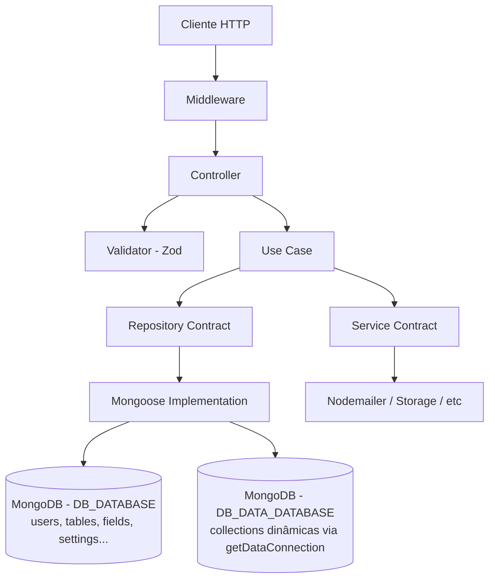

# LowCodeJS Backend

Plataforma low-code construida com Fastify + TypeScript + MongoDB.

## Tech Stack

| Tecnologia | Versao | Uso |
|------------|--------|-----|
| Fastify | 5.6.0 | HTTP framework |
| TypeScript | 5.9.2 | Linguagem |
| MongoDB + Mongoose | 8.18.1 | Banco de dados + ODM |
| Redis (ioredis) | 5.10.1 | Cache |
| Socket.IO | 4.8.3 | WebSocket (chat) |
| Zod | 4.1.5 | Validacao |
| AJV | - | Validacao Fastify schema |
| JWT (RS256) | - | Autenticacao |
| Flydrive | 2.1.0 | Storage (local/S3) |
| Sharp | 0.34.5 | Processamento de imagem |
| Nodemailer | 7.0.11 | Email |
| Vitest | 4.0.16 | Testes (unit + e2e) |
| fastify-decorators | 3.16.1 | DI + Controller decorators |

## Arquitetura



A aplicação usa **2 conexões MongoDB**: uma para os models de sistema (default
via `mongoose.connect()`) e outra isolada (`mongoose.createConnection()`,
exposta por `getDataConnection()`) para as collections dinâmicas das tabelas
low-code. Ver seção "Banco de Dados" e `config/database.config.ts`.

## Estrutura de Diretorios

```
backend/
├── bin/server.ts                  # Entry point - inicia Mongoose + HTTP + Socket.IO
├── start/
│   ├── kernel.ts                  # Fastify kernel - plugins, CORS, JWT, Swagger, error handler
│   └── env.ts                     # Validacao de env vars com Zod
├── config/
│   ├── database.config.ts         # 2 conexoes Mongoose (system + data via getDataConnection)
│   ├── storage.config.ts          # Flydrive (local/S3)
│   ├── redis.config.ts            # ioredis
│   └── email.config.ts            # Nodemailer transporter
├── application/
│   ├── core/                      # Logica central (entity types, Either, exception, builders, sandbox)
│   ├── middlewares/               # Auth JWT + Table access/permissions
│   ├── model/                     # Mongoose schemas (14 models, todos no DB system)
│   ├── repositories/              # Contract + Mongoose + InMemory (15 entidades)
│   ├── services/                  # Email (contract + nodemailer + in-memory), Storage (flydrive)
│   ├── utils/                     # JWT tokens, cookies
│   └── resources/                 # 20 recursos REST (cada um com operacoes isoladas)
├── database/
│   ├── seeders/                   # Permissions, user groups, settings (idempotente)
│   └── migrations/                # Migracoes one-time (dual-connection)
├── docker-entrypoint.sh           # Roda migrations + seeders antes do server
├── extensions/                    # Pacotes de extensões (plugins/modules/tools) — ver extensions/CLAUDE.md
├── templates/email/               # EJS templates (notification, sign-up)
└── test/                          # Setup, helpers (auth)
```

## Responsabilidades por Camada

### Controller (`*.controller.ts`)
- **SOMENTE** HTTP: parse request, chamar validator, delegar ao use-case, formatar response
- Recebe injecao de middleware via decorator `onRequest`
- NAO contem logica de negocio
- Retorna status codes adequados (201 create, 200 success, etc)

### Validator (`*.validator.ts`)
- Schemas Zod para validacao de input (body, params, query)
- Exporta tipos inferidos (`z.infer<typeof schema>`)
- Validators base reutilizaveis (ex: `user-base.validator.ts`)
- Schema files (`*.schema.ts`) sao para documentacao OpenAPI, nao runtime

### Use Case (`*.use-case.ts`)
- Logica de negocio pura
- Retorna `Either<HTTPException, T>` (Left = erro, Right = sucesso)
- Recebe repositorios/services via **constructor injection** (`@Service` resolve
  pelos tipos dos parametros). NAO usar `@Inject`. Importar os contratos pelo
  caminho direto do modulo, nunca por barrel `index.ts`
- NAO conhece HTTP (request/response)
- Trata excecoes internas e retorna Left com codigo/causa

### Repository (`*-contract.repository.ts` + `*.repository.ts`)
- Contract: classe abstrata definindo interface (export nomeado)
- Mongoose: implementacao concreta (`export default` em `<entidade>.repository.ts`)
- InMemory: para testes unitarios
- Metodos padrao: `create`, `findById`, `findByX`, `findMany`, `update`, `delete`, `count`
- Payloads tipados (CreatePayload, UpdatePayload, QueryPayload, FindOptions)

### Service (`*-contract.service.ts` + implementacao)
- Cross-cutting concerns: email, storage
- Mesmo pattern contract + implementation do repository
- Registrado no DI via `di-registry.ts`

### Middleware
- `authentication.middleware.ts` - Extrai JWT de cookie/header, popula `request.user`
- `permission.middleware.ts` - `PermissionMiddleware(capability)`: exige uma capacidade de area (`E_AREA_CAPABILITY`) resolvida pelo fecho de grupos. Substitui o RoleMiddleware nas areas; MASTER bypassa
- `table-access.middleware.ts` - Verifica acesso a tabela: bindings por acao (`table.permissions`) + perfil de membro (`table.members`) + dono

### Model (`*.model.ts`)
- Mongoose schemas com timestamps
- Soft delete: campos `trashed` (boolean) + `trashedAt` (Date)
- Virtual fields (ex: `url` em Storage)

## Padroes de Design

### Either/Result Pattern
```typescript
// Use-case retorna Either<Error, Success>
const result = await useCase.execute(input);
if (result.isLeft()) return response.status(result.value.code).send(result.value);
return response.status(200).send(result.value);
```

### Repository Contract Pattern
```typescript
// Contract (abstrata)
abstract class UserContractRepository {
  abstract create(payload: UserCreatePayload): Promise<IUser>;
  abstract findById(_id: string, options?: FindOptions): Promise<IUser | null>;
  abstract findByEmail(email: string, options?: FindOptions): Promise<IUser | null>;
}

// DI Registry (di-registry.ts)
injectablesHolder.injectService(UserContractRepository, UserMongooseRepository);
```

### Soft Delete
Todas as entidades usam `trashed: boolean` + `trashedAt: Date | null`. Dados nunca sao hard-deleted (exceto via operacoes especificas como `hard-delete` no menu).

### Dynamic Schema
Tabelas possuem `_schema` (Mixed) que e convertido em runtime para modelos Mongoose via `buildTable()`. Permite criar tabelas dinamicas no low-code.

### Script Sandbox
Codigo de usuario (beforeSave, afterSave, onLoad) roda em Node VM isolada com timeout de 5s. APIs disponiveis: `field`, `context`, `email`, `utils`, `console`.

## Enums Core (`entity.core.ts`)

| Enum | Valores |
|------|---------|
| `E_ROLE` | MASTER, ADMINISTRATOR, MANAGER, REGISTERED |
| `E_FIELD_TYPE` | TEXT_SHORT, TEXT_LONG, DROPDOWN, DATE, RELATIONSHIP, FILE, FIELD_GROUP, REACTION, EVALUATION, CATEGORY, USER + nativos |
| `E_FIELD_FORMAT` | ALPHA_NUMERIC, INTEGER, DECIMAL, URL, EMAIL, PASSWORD, PHONE, CNPJ, CPF, RICH_TEXT, PLAIN_TEXT + date formats |
| `E_TABLE_TYPE` | TABLE, FIELD_GROUP |
| `E_TABLE_STYLE` | LIST, GALLERY, DOCUMENT, CARD, MOSAIC, KANBAN, FORUM, CALENDAR, GANTT |
| `E_TABLE_PERMISSION` | CREATE/UPDATE/REMOVE/VIEW para TABLE, FIELD, ROW (12 total) |
| `E_AREA_CAPABILITY` | MANAGE_USERS, MANAGE_MENU, MANAGE_USER_GROUPS, MANAGE_SETTINGS, MANAGE_TOOLS, MANAGE_PLUGINS, MANAGE_CHAT (7 total) |
| `E_PERMISSION_TARGET` | PUBLIC, NOBODY, GROUP (binding `{ kind, group }`) |
| `E_TABLE_PROFILE` | OWNER, ADMIN, EDITOR, CONTRIBUTOR, VIEWER (perfis de membro) |
| `E_PROFILE_ACCESS` | ALLOW, DENY, OWN (celula da `TABLE_PROFILE_MATRIX`) |
| `E_JWT_TYPE` | ACCESS, REFRESH |
| `E_USER_STATUS` | ACTIVE, INACTIVE |

## Sistema de Permissoes (RBAC)

O modelo de permissoes foi reescrito. Nao ha mais 4 roles fixos governando tudo
— roles continuam existindo apenas para compat (JWT/derivacao). O controle real
gira em torno de **grupos custom + capacidades + bindings por acao**.

### Grupos custom com hierarquia

- Grupos sao configuraveis e podem englobar outros via `encompasses[]` (fecho
  transitivo / "Engloba"): um grupo herda as permissoes de tudo que engloba.
- Um usuario pertence a **varios grupos** (`user.groups[]`). O campo legado
  `user.group` foi **mantido** para compat e fallback.
- Resolver: `application/services/group-resolver/` —
  `resolveUserGroupIds(user)` (fecho dos ids) e `resolveCapabilities(user)`
  (uniao das permissoes do fecho).

### Capacidades de area

`E_AREA_CAPABILITY` (MANAGE_USERS, MANAGE_MENU, MANAGE_USER_GROUPS,
MANAGE_SETTINGS, MANAGE_TOOLS, MANAGE_PLUGINS, MANAGE_CHAT — 7 capacidades) sao
permissoes atribuiveis a qualquer grupo, enforcadas por
`PermissionMiddleware(capability)` — substitui o `RoleMiddleware` nas areas do
sistema. MASTER bypassa.

### Bindings por acao (`E_PERMISSION_TARGET`)

Alvo `{ kind, group }` onde `kind ∈ { PUBLIC, NOBODY, GROUP }` (PUBLIC inclui
visitante; GROUP libera se o grupo estiver no fecho do usuario). Reusado em:

- `table.permissions`: mapa das 10 acoes de tabela (viewTable/updateTable/
  createField/updateField/removeField/viewField/createRow/updateRow/removeRow/
  viewRow) → binding.
- `field.permissions: { list, form, detail }` → binding por contexto.
  Enforcado server-side pelo `FieldVisibilityService` (`services/field-visibility/`):
  remove os valores de campos ocultos das respostas de row (`paginated`=list,
  `show`=detail) e descarta escritas em campos ocultos (`create`/`update`/
  `bulk-update`=form). Campos nativos e usuarios privilegiados (MASTER/ADMIN/dono)
  nunca sao filtrados. Ausencia de binding para um contexto = campo visivel.
- `menu.visibility` → binding.

### Convidados da tabela (membros)

`table.members[]` (`{ user, profile }`) com perfis fixos `E_TABLE_PROFILE`
(owner/admin/editor/contributor/viewer) avaliados pela matriz
`TABLE_PROFILE_MATRIX`. `contributor` edita/remove **apenas as suas** rows (OWN).
`owner` tem acesso total e pode "trocar dono".

### Modelo novo unico (sem fallback legado)

Os campos antigos `visibility`/`collaboration`/`administrators` (tabela) e
`showInList`/`showInForm`/`showInDetail` (campo) foram **removidos** do schema,
dos tipos e dos enums. Nao ha mais fallback: o enforcement le **somente**
`table.permissions`/`table.members`/`table.owner` e `field.permissions`. Tabelas
novas ja nascem no modelo novo (preset `RESTRICTED` via
`buildDefaultTablePermissions`, dono como membro `OWNER`) — nunca com
`permissions: null`.

As migrations idempotentes rodam automaticamente no boot: backfill (09
table-permissions, 10 field-permissions, 11 menu-visibility) e em seguida 12
`drop-legacy-permission-fields`, que `$unset` permanente dos campos legados.
`field.showInFilter` e **mantido** (nao e permissao — controla apenas a sidebar
de filtros).

### JWT

Payload **inalterado** (`{ sub, email, role, type }`); `role` ainda e derivado
do grupo **principal** (`user.group`, singular) só para compat. **Não é usado
para autorizar**: o privilégio (acesso total MASTER/ADMINISTRATOR) é resolvido
pelo **fecho de grupos** via `GroupResolverContractService.isPrivileged(user)`
(`{group} ∪ groups` seguindo `encompasses`) — assim um usuário MASTER/ADMIN por
grupo **adicional** também é reconhecido. Substituiu as comparações espalhadas
`role === E_ROLE.MASTER/ADMINISTRATOR` (menu/list, pages/show, permission e
field-visibility services). Os grupos sao resolvidos server-side a cada request.

## Convencoes de Nomenclatura

| Tipo | Pattern | Exemplo |
|------|---------|---------|
| Controller | `{operacao}.controller.ts` | `create.controller.ts` |
| Use Case | `{operacao}.use-case.ts` | `create.use-case.ts` |
| Validator | `{operacao}.validator.ts` | `create.validator.ts` |
| Schema (docs) | `{operacao}.schema.ts` | `create.schema.ts` |
| Unit Test | `{operacao}.use-case.spec.ts` | `create.use-case.spec.ts` |
| E2E Test | `{operacao}.controller.spec.ts` | `create.controller.spec.ts` |
| Repository Contract | `{entidade}-contract.repository.ts` | `user-contract.repository.ts` |
| Repository Impl | `{entidade}.repository.ts` (`export default`) | `user.repository.ts` |
| Repository Test | `{entidade}-in-memory.repository.ts` | `user-in-memory.repository.ts` |
| Service Contract | `{nome}-contract.service.ts` | `email-contract.service.ts` |
| Service Impl | `{nome}.service.ts` (`export default`) | `email.service.ts` |
| Model | `{entidade}.model.ts` | `user.model.ts` |
| Validator Base | `{entidade}-base.validator.ts` | `user-base.validator.ts` |

## Comandos CLI

```bash
npm run dev          # Dev mode (watch + SWC)
npm run build        # tsc + tsup -> /build
npm run seed         # Seeders (permissions, groups, users)
npm run test         # Vitest (todos)
npm run test:unit    # Vitest unit (*.use-case.spec.ts, *.service.spec.ts)
npm run test:e2e     # Vitest e2e (*.controller.spec.ts) - MongoDB real, 1 worker
npm run test:coverage # Coverage (V8)
npm run lint         # ESLint --fix
npm start            # Producao (build/bin/server.js)
```

## Formato de Resposta

### Sucesso
```json
{ "data": [...], "meta": { "total": 100, "page": 1, "perPage": 10, "lastPage": 10, "firstPage": 1 } }
```

### Erro
```json
{ "message": "Not found", "code": 404, "cause": "TABLE_NOT_FOUND", "errors": { "campo": "mensagem" } }
```

## Dependencia Injection (DI)

`application/core/di-registry.ts` registra os bindings **dinamicamente** (igual
`controllers.ts`): varre o filesystem e pareia cada `<base>-contract.<kind>.ts`
com `<base>.<kind>.ts` por convencao — **nao ha mais lista manual**. Roots
varridos: `application/repositories` (repository), `application/services`
(service) e `extensions/` (ambos). `injectablesHolder.injectService(Contract,
Impl)` e chamado para cada par encontrado.

- Repositorios: User, UserGroup, Permission, Table, Field, Storage,
  ValidationToken, Menu, Reaction, Evaluation, Setting, Logger, Notification,
  Extension, Row
- Servicos: Email, EmailQueue (use-cases injetam este, nao Email diretamente),
  CsvImportQueue, StorageMigrationQueue, Password, Permission, RowPassword,
  ScriptExecution, Notification, KanbanCommentMention, RowMemberNotification,
  Storage, Llm, Table
- Builders de tabela dinamica (`services/table/`): SchemaBuilder, ModelBuilder,
  QueryBuilder, PopulateBuilder, RowContextBuilder

Convencao (regra unica): contract = export nomeado `<X>Contract(Repository|
Service)`; impl = `export default` do arquivo irmao `<base>.<kind>.ts`. Arquivos
`in-memory-*`, `*.worker`, drivers (`local-*`/`s3-*`) sao ignorados (o impl e
derivado do base do contract, nao adivinhado).

Para adicionar nova dependencia (zero edicao no di-registry):
1. Crie `<base>-contract.<kind>.ts` com a abstract class `<X>Contract<Kind>`
   (export nomeado)
2. Crie `<base>.<kind>.ts` com `@Service() export default class` da impl
3. Consuma via **constructor injection** (`@Service` + parametro tipado com o
   Contract). Importe o Contract pelo **caminho direto** do modulo, nunca por
   barrel `index.ts` — o SWC elide o tipo do parametro em re-export barrel e a
   injecao vira `undefined` silenciosamente. Nunca use `@Inject`.

Para trocar a implementacao (ex.: trocar de ORM), troque o conteudo do arquivo
`<base>.<kind>.ts` — o scanner continua registrando o mesmo contract.

## Fluxo de Inicializacao do Servidor

```
bin/server.ts:
1. MongooseConnect() - abre as 2 conexoes (system via mongoose.connect, data via createConnection)
2. kernel.ready() - inicializa Fastify com todos os plugins
3. kernel.listen({ port: Env.PORT, host: '0.0.0.0' })
4. initChatSocket(httpServer, jwtDecode) - Socket.IO para chat
```

Em container Docker, o `docker-entrypoint.sh` roda ANTES do servidor:
1. `npm run migrate:dual-connection` (idempotente — no-op se ja migrado)
2. `npm run seed` (idempotente — upsert)
3. Inicia o servidor

kernel.ts registra 8 plugins em ordem:

1. CORS (origens dinamicas + fixas de ALLOWED_ORIGINS)
2. Cookie (signed com COOKIE_SECRET)
3. JWT (RS256 com chaves base64, expiry 24h)
4. Multipart (limite 5MB)
5. Swagger/OpenAPI
6. Scalar API reference (/documentation)
7. WebSocket
8. fastify-decorators bootstrap (carrega controllers)

Global error handler: HTTPException -> ZodError -> FST_ERR_VALIDATION -> fallback 500

Endpoint: /openapi.json

## Variaveis de Ambiente

Validadas em `start/env.ts` com Zod. Carrega `.env` em dev/prod, `.env.test`
em test.

O `.env` cobre apenas **infraestrutura** (DB, JWT, cookies, CORS, Redis,
MCP, workers). **Configuracoes de dominio** (branding, locale, upload,
paginacao, logos, IA, SMTP, storage driver/S3) vivem no documento Setting
do MongoDB e sao editadas via UI `/settings` pelo usuario MASTER.

### Hosts: dev nativo vs Docker Compose

Os defaults em `.env.example` apontam `127.0.0.1`/`localhost` (cenario
dev nativo: backend rodando na maquina, somente mongo+redis em Docker).
Quando o stack inteiro sobe via `docker compose up -d`, o proprio compose
**sobrescreve** `DATABASE_URL`, `REDIS_URL` e `MCP_SERVER_URL` com hosts
internos da rede Docker (`mongo`, `redis`, `mcp`). Veja o bloco
`environment:` do service `api` em `docker-compose.yml`. O dev nao precisa
editar `.env` ao alternar entre os modos.

Testes e2e rodam **sempre no host** (nunca em container) — `.env.test`
sempre usa `127.0.0.1`.

### Banco de Dados

A aplicacao usa **duas conexoes MongoDB** apontando para databases distintos no
mesmo servidor (configuravel para servidores separados via `DATABASE_URL`):

- **System** (`DB_DATABASE`): collections nativas (User, UserGroup, Permission,
  Table, Field, Storage, ValidationToken, Menu, Reaction, Evaluation, Setting).
  Conexao default via `mongoose.connect()`.
- **Data** (`DB_DATA_DATABASE`): collections dinamicas criadas pelo usuario
  no low-code. Cada `table.slug` vira uma collection. Conexao isolada via
  `mongoose.createConnection()`, exposta por `getDataConnection()`.

| Variavel | Default | Descricao |
|----------|---------|-----------|
| DATABASE_URL | obrigatorio | MongoDB connection string |
| DB_DATABASE | lowcodejs | Nome do database **system** |
| DB_DATA_DATABASE | lowcodejs_data | Nome do database **data** (collections dinamicas) |

### Email (SMTP)

**Nao e env var.** Sao **campos do documento Setting** no MongoDB,
editados pela UI `/settings` (usuario MASTER):
`EMAIL_PROVIDER_HOST`, `EMAIL_PROVIDER_PORT`, `EMAIL_PROVIDER_USER`,
`EMAIL_PROVIDER_PASSWORD`, `EMAIL_PROVIDER_FROM` (todos nullable).

`NodemailerEmailService` le do Setting em cada envio (sem cache). Se
qualquer credencial essencial estiver ausente, retorna `{ success: false,
message: 'SMTP nao configurado' }` sem lancar erro.

### JWT & Cookies

| Variavel | Default | Descricao |
|----------|---------|-----------|
| JWT_PUBLIC_KEY | obrigatorio | Chave publica RS256 em base64 |
| JWT_PRIVATE_KEY | obrigatorio | Chave privada RS256 em base64 |
| COOKIE_SECRET | obrigatorio | Secret para cookies assinados |
| COOKIE_DOMAIN | opcional | Cross-subdomain |

### Servidor

| Variavel | Default | Descricao |
|----------|---------|-----------|
| NODE_ENV | development | Ambiente |
| PORT | 3000 | Porta HTTP |
| APP_SERVER_URL | obrigatorio | URL publica do backend |
| APP_CLIENT_URL | obrigatorio | URL publica do frontend |
| DEMO_MODE | false | Quando "true", `1778025600-demo-users.seed.ts` cria/atualiza usuarios publicos da instancia demo. Aceita literalmente "true" ou "false" |

### CORS

| Variavel | Default | Descricao |
|----------|---------|-----------|
| ALLOWED_ORIGINS | https://lowcodejs.org;*.lowcodejs.org | Origens permitidas |

### Storage

Configurado via Setup Wizard ou Settings na UI (MASTER). Vive no documento
Setting do MongoDB. Campos: `STORAGE_DRIVER` ('local'|'s3'),
`STORAGE_ENDPOINT`, `STORAGE_REGION`, `STORAGE_BUCKET`, `STORAGE_ACCESS_KEY`,
`STORAGE_SECRET_KEY`. No boot, `bin/server.ts` carrega do DB e sincroniza para
`process.env` via `syncStorageEnv()`.

#### Migração de arquivos entre drivers

Quando o MASTER troca `STORAGE_DRIVER` (local↔s3) na UI, os arquivos
existentes ficam órfãos no driver antigo. O recurso `storage-migration`
copia esses arquivos para o driver atual em background, mantendo zero downtime.

| Endpoint | Método | Descrição |
|----------|--------|-----------|
| `/storage/migration/status` | GET | Contagens por driver/status, job ativo, can_cleanup |
| `/storage/migration/start` | POST | Enfileira job de migração (body: `{concurrency?, retry_failed_only?}`) |
| `/storage/migration/cleanup` | POST | Apaga arquivos do driver antigo (body: `{confirm: true}`) |

Todos restritos ao role MASTER via `RoleMiddleware`. Progresso em tempo real
via WebSocket no namespace `/storage-migration` (mesmo Socket.IO server do
chat). Eventos: `progress`, `file_migrated`, `file_failed`, `completed`,
`error`.

**Arquitetura:** BullMQ (Redis) para a fila + worker in-process iniciado em
`bin/server.ts`. Storage docs ganham campos `location` e `migration_status`
(`storage.model.ts`). Kernel hook (`start/kernel.ts`) faz dual-read fallback:
serve do driver indicado em `doc.location`, com cross-driver fallback caso o
arquivo não esteja onde o cache acha que está.

**Resiliência:**
- BullMQ persiste jobs no Redis — restart do worker retoma de onde parou.
- Worker pula docs já com `location === target_driver` (idempotente).
- Sweeper de boot marca docs órfãos `in_progress` como `failed` quando não há
  job ativo (recovery após crash).
- Cada arquivo tem 3 tentativas com backoff linear; falhas vão para
  `migration_status='failed'` e podem ser retentadas via
  `retry_failed_only: true`.

**Backfill:** `database/migrations/migrate-backfill-storage-location.ts` popula
o campo `location` em docs Storage existentes (idempotente via marker
`MIGRATION_STORAGE_LOCATION_AT` no Setting). Roda automaticamente no
`docker-entrypoint.sh`.

| Variavel | Default | Descricao |
|----------|---------|-----------|
| STORAGE_MIGRATION_CONCURRENCY | 5 | Arquivos copiados em paralelo (1-20) |
| EMAIL_WORKER_CONCURRENCY | 5 | Jobs de email processados em paralelo pelo BullMQ worker (1-50) |

### Redis

| Variavel | Default | Descricao |
|----------|---------|-----------|
| REDIS_URL | redis://localhost:6379 | URL de conexao Redis |

### AI/Chat

| Variavel | Default | Descricao |
|----------|---------|-----------|
| MCP_SERVER_URL | opcional | URL do servidor MCP |

`OPENAI_API_KEY` e `AI_ASSISTANT_ENABLED` vivem no Setting do MongoDB (UI
`/settings`). O `chat.socket` le do model em cada conexao, sem depender de
`process.env`.

## Error Handling

- `HTTPException`: classe que estende Error, ~40 metodos factory estaticos (BadRequest, Unauthorized, NotFound, Forbidden, etc.)
- Propriedades: `code` (HTTP status), `cause` (error code string), `message`, `errors?` (field-level)
- **Todas as mensagens de erro devem ser em PT-BR**
- `BadRequest` e `Unauthorized` aceitam `errors?: Record<string, string>` como 3o argumento para erros por campo
- Controllers devem propagar errors: `...(error.errors && { errors: error.errors })`
- Response schemas (`*.schema.ts`) devem incluir `errors` em todos os blocos de erro para que o Fastify nao remova a propriedade na serializacao
- Global handler em kernel.ts captura:
  1. **HTTPException** -> retorna direto com code/cause/message/errors
  2. **ZodError** -> flatten para field errors, retorna 400 INVALID_PAYLOAD_FORMAT
  3. **FST_ERR_VALIDATION** -> flatten de erros AJV
  4. **Fallback** -> 500 SERVER_ERROR

## Infraestrutura de Testes

| | Unit | E2E |
|---|---|---|
| Config | vitest.config.ts | vitest.e2e.config.ts |
| Setup | test/setup.ts (reflect-metadata) | test/setup.e2e.ts (MongoDB por suite, DB unico test_{uuid}) |
| Banco | In-memory repositories | MongoDB real |
| Workers | Default | 1 (maxWorkers: 1) |
| Timeout | Default | 60s |
| Pattern | *.use-case.spec.ts | *.controller.spec.ts |
| Runner | threads | forks |

Helpers (`test/helpers/auth.helper.ts`):
- `createAuthenticatedUser(overrides?)` - cria user + grupo Master + 18 permissoes (12 de tabela + 6 capacidades de area, sem MANAGE_CHAT), faz sign-in, retorna cookies + user
- `cleanDatabase()` - deleta User e UserGroup

## Build & Deploy

- **Build**: `tsc -b && tsup` -> /build (ESM, ES2024, sem bundle de node_modules)
- **Dev**: @swc-node/register para transpilacao rapida
- 3 Dockerfiles:
  - `Dockerfile-local`: node:24-alpine, npm run dev
  - `Dockerfile-production`: node:24-alpine, copia /build, usuario non-root (1001), porta 3000
  - `Dockerfile-coolify`: multi-stage otimizado

## Socket.IO / Chat

- Arquivo: `application/resources/chat/chat.socket.ts`
- Auth: cookie accessToken (mesmo JWT do HTTP)
- Integra MCP (Model Context Protocol) + OpenAI
- Descobre tools do MCP server dinamicamente, converte para OpenAI tool definitions
- Eventos emitidos: `status`, `ready`, `thinking`, `tool_call`, `tool_result`, `tool_error`, `message`, `error`
- Processamento de arquivos: imagens -> base64 data URI, PDFs -> text extraction via pdf-parse
- CORS: APP_CLIENT_URL + APP_SERVER_URL + ALLOWED_ORIGINS

## Sandbox VM (Scripts de Usuario)

- Arquivos: `application/core/table/` (executor.ts, handler.ts, sandbox.ts, field-resolver.ts, types.ts)
- Timeout: 5s, VM Node isolada sem acesso a globals (require, fs, network bloqueados)
- Valida sintaxe antes de executar

### APIs Expostas

| API | Metodos | Descricao |
|-----|---------|-----------|
| field | get(slug), set(slug, value), getAll(), getLabel(slug, value?) | Leitura/escrita de campos do registro |
| context | action, moment, userId, isNew, appUrl, table, reentrant, previous | Contexto de execucao (read-only, frozen) |
| email | send(to[], subject, body), sendTemplate(to[], subject, message, data?) | Envio de email |
| users | resolve(ids), emails(ids) | Resolve ids de campos USER/CREATOR em { _id, name, email } |
| notify | send({ userIds, title, body?, action?, source? }) | Cria notificacoes in-app + socket |
| utils | today(), now(), formatDate(date, format?), sha256(text), uuid() | Utilitarios |
| console | log(), warn(), error() | Logs capturados e retornados |

### Context Values

- **action**: novo_registro, editar_registro, excluir_registro, carregamento_formulario
- **moment**: carregamento_formulario, antes_salvar, depois_salvar

### Retorno

`ExecutionResult { success, error?, logs[] }`

Tipos de erro: syntax, runtime, timeout, unknown

## Cookie/JWT

- Algoritmo: RS256 com chaves base64 (JWT_PUBLIC_KEY, JWT_PRIVATE_KEY)
- AccessToken: 24h, payload `{ sub, email, role, type: "ACCESS" }`
- RefreshToken: 7d, payload `{ sub, type: "REFRESH" }`
- Cookies: httpOnly, sameSite none(prod)/lax(dev), secure(prod), path /
- COOKIE_DOMAIN opcional para cross-subdomain
- Extracao: 1. Cookie value, 2. Authorization header (fallback)
- Validacao: verifica type === ACCESS (rejeita REFRESH em rotas normais)

## Configuracoes (config/)

| Arquivo | Tecnologia | Detalhes |
|---------|-----------|----------|
| database.config.ts | Mongoose | autoCreate: true, dbName de ENV, importa todos os models |
| storage.config.ts | Flydrive DriveManager | Local: _storage/ + URLs via APP_SERVER_URL/storage/. S3: AWS SDK |
| redis.config.ts | ioredis | Conexao via REDIS_URL, error logging |
| email.config.ts | Nodemailer | SMTP, auto-secure se porta 465, TLS obrigatorio |

## Seeders

Execucao: `database/seeders/main.ts` encontra `*.seed.(ts|js)`, valida padrao de filename, ordena por nome (timestamp) e executa sequencialmente. Em falha: log do arquivo que falhou, `process.exit(1)`, `mongoose.disconnect()`.

Comando: `npm run seed`

| Seeder | Dados |
|--------|-------|
| 1720448435-permissions.seed.ts | 19 permissoes: 12 de tabela (CREATE/UPDATE/REMOVE/VIEW para TABLE, FIELD, ROW) + 7 capacidades de area (E_AREA_CAPABILITY, inclui MANAGE_CHAT). Upsert por `slug` com `$set` |
| 1720448445-user-group.seed.ts | 4 grupos (MASTER, ADMINISTRATOR, MANAGER, REGISTERED). Metadados via `$set`; `permissions` via `$setOnInsert` (preserva customizacoes manuais) |
| 1720465893-settings.seed.ts | Setting singleton. Marca SETUP_COMPLETED=true se ja existe MASTER; caso contrario, `$setOnInsert: {}` |
| 1778025600-demo-users.seed.ts | Gated por `DEMO_MODE=true`. Cria/atualiza `admin@admin.com` (ADMINISTRATOR) e `registered@registered.com` (REGISTERED). `$set` em todos os campos, password re-hashado a cada `npm run seed`. No-op silencioso fora de demo |

Usuario MASTER **nao** tem seed — e criado via Setup Wizard na UI na primeira execucao.

## Extensões (Plugins / Módulos / Ferramentas)

Mecanismo build-time + ativação runtime para estender a plataforma sem mexer
no core. Documentação canônica em `backend/extensions/CLAUDE.md`.

- **Diretório**: `backend/extensions/<pkg>/{plugins,modules,tools}/<id>/manifest.json`
- **Loader**: `application/core/extensions/loader.ts` varre o FS no boot,
  valida manifests via Zod e faz upsert na collection `extensions`
- **Model + Repo**: `Extension` (system DB), com chave única `(pkg, type,
  extensionId)` e flags `enabled` / `available`
- **REST**: `/extensions` (list, toggle, configure-table-scope) — MASTER only
- **Guarda runtime**: `ExtensionActiveMiddleware({ pkg, type, extensionId })`
  retorna 404 quando a extensão está desativada/indisponível
- **Sem sandbox**: extensões rodam com privilégios totais — desenvolvedores
  internos assumem o risco

## Migrations

Execucao: `database/migrations/migrate-dual-connection.ts`. Migracao one-time
(idempotente via marcadores no Setting singleton) que copia as collections
dinamicas do DB system para o DB data. Roda automaticamente no
`docker-entrypoint.sh`; no segundo boot em diante e no-op com 1 query.

Comandos:
- `npm run migrate:dual-connection` — copia (skip se `MIGRATION_DUAL_CONNECTION_AT` ja setado)
- `npm run migrate:dual-connection -- --force` — re-executa ignorando marcador
- `npm run migrate:dual-connection -- --drop-source` — apaga collections do DB
  system apos copia (manual, executar apenas apos validar em producao + backup)

Marcadores persistidos no Setting:
- `MIGRATION_DUAL_CONNECTION_AT` — timestamp da copia bem-sucedida
- `MIGRATION_DUAL_CONNECTION_DROPPED_AT` — timestamp do drop bem-sucedido

### Migrations de relacionamento (cardinalidade)

No boot Docker, `docker-entry-point.sh` loopa `scripts/migrations/*.sh` em ordem
alfabetica; as de relacionamento sao 14→15→16 (lift-out-of-groups →
embedded-to-links → backfill-endpoint-flags), idempotentes via marker no Setting.
Em **dev local** (`npm run dev`, sem Docker) elas nao rodam — use os npm scripts:

- `npm run migrate:relationship` — roda as 3 em ordem (14→15→16)
- `npm run migrate:relationship-lift-out-of-groups` / `-embedded-to-links` /
  `-endpoint-flags` — avulsas (mesma ordem se rodadas a mao)
- Cada uma aceita `-- --force` p/ reexecutar ignorando o marker

Pos-migracao **todo** campo `RELATIONSHIP` fica top-level e materializado
(`relationship.relationshipId` + campo-espelho); o passo 16 falha alto (nao grava
marker) se sobrar campo sem `relationshipId`. Os links sao a unica fonte de
verdade — nao ha fallback embedded.

**Remodel manual (one-off, fora do boot):**
`npm run migrate:fieldgroup-to-relationship -- --table=<slug> --group=<id|slug> --i-have-backup`
converte um `FIELD_GROUP` usado como falso-relacionamento (subdoc embedded) numa
tabela independente + `RelationshipDefinition` + links. Destrutivo, exige backup,
nao idempotente-por-marker (depende de decisao humana por tabela).
