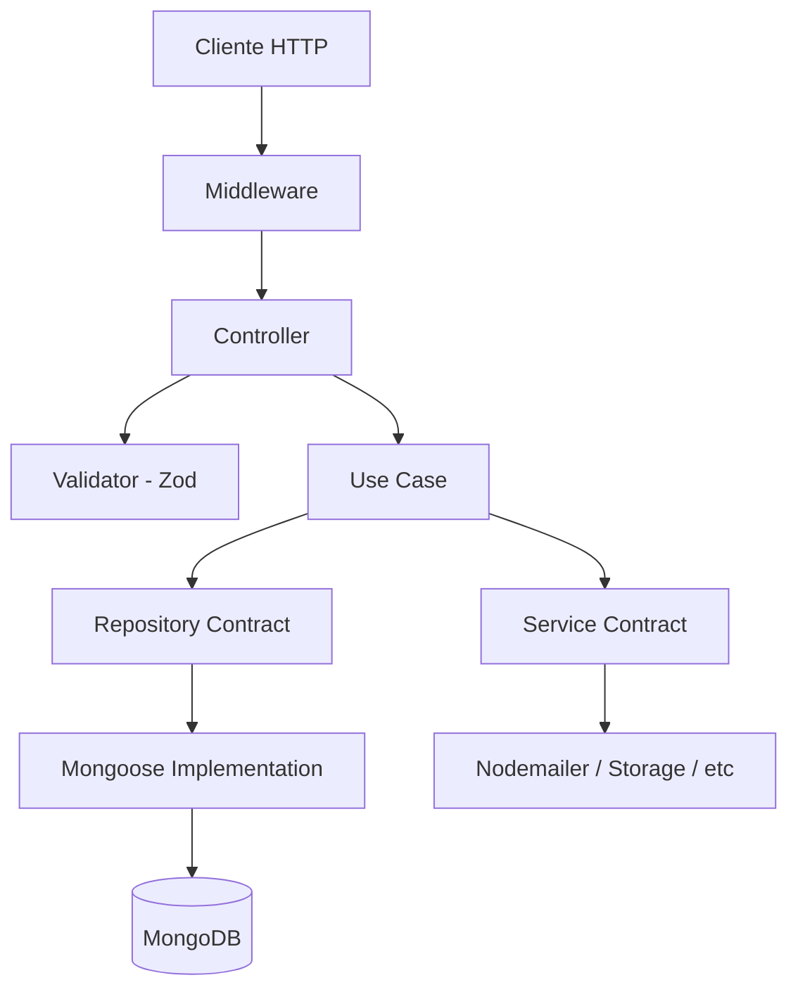

# LowCodeJS Backend

Plataforma low-code construida com Fastify + TypeScript + MongoDB.

## Tech Stack

| Tecnologia | Versao | Uso |
|------------|--------|-----|
| Fastify | 5.6.0 | HTTP framework |
| TypeScript | 5.9.2 | Linguagem |
| MongoDB + Mongoose | 8.18.1 | Banco de dados + ODM |
| Redis (ioredis) | 5.10.1 | Cache |
| Socket.IO | 4.8.3 | WebSocket (chat) |
| Zod | 4.1.5 | Validacao |
| AJV | - | Validacao Fastify schema |
| JWT (RS256) | - | Autenticacao |
| Flydrive | 2.1.0 | Storage (local/S3) |
| Sharp | 0.34.5 | Processamento de imagem |
| Nodemailer | 7.0.11 | Email |
| Vitest | 4.0.16 | Testes (unit + e2e) |
| fastify-decorators | 3.16.1 | DI + Controller decorators |

## Arquitetura



## Estrutura de Diretorios

```
backend/
├── bin/server.ts                  # Entry point - inicia Mongoose + HTTP + Socket.IO
├── start/
│   ├── kernel.ts                  # Fastify kernel - plugins, CORS, JWT, Swagger, error handler
│   └── env.ts                     # Validacao de env vars com Zod
├── config/
│   ├── database.config.ts         # Conexao MongoDB
│   ├── storage.config.ts          # Flydrive (local/S3)
│   ├── redis.config.ts            # ioredis
│   └── email.config.ts            # Nodemailer transporter
├── application/
│   ├── core/                      # Logica central (entity types, Either, exception, builders, sandbox)
│   ├── middlewares/               # Auth JWT + Table access/permissions
│   ├── model/                     # Mongoose schemas (11 models)
│   ├── repositories/              # Contract + Mongoose + InMemory (11 entidades)
│   ├── services/                  # Email (contract + nodemailer + in-memory), Storage (flydrive)
│   ├── utils/                     # JWT tokens, cookies
│   └── resources/                 # 16 recursos REST (cada um com operacoes isoladas)
├── database/seeders/              # Permissions, user groups, users
├── templates/email/               # EJS templates (notification, sign-up)
└── test/                          # Setup, helpers (auth)
```

## Responsabilidades por Camada

### Controller (`*.controller.ts`)
- **SOMENTE** HTTP: parse request, chamar validator, delegar ao use-case, formatar response
- Recebe injecao de middleware via decorator `onRequest`
- NAO contem logica de negocio
- Retorna status codes adequados (201 create, 200 success, etc)

### Validator (`*.validator.ts`)
- Schemas Zod para validacao de input (body, params, query)
- Exporta tipos inferidos (`z.infer<typeof schema>`)
- Validators base reutilizaveis (ex: `user-base.validator.ts`)
- Schema files (`*.schema.ts`) sao para documentacao OpenAPI, nao runtime

### Use Case (`*.use-case.ts`)
- Logica de negocio pura
- Retorna `Either<HTTPException, T>` (Left = erro, Right = sucesso)
- Recebe repositorios via constructor injection (`@Inject`)
- NAO conhece HTTP (request/response)
- Trata excecoes internas e retorna Left com codigo/causa

### Repository (`*-contract.repository.ts` + `*-mongoose.repository.ts`)
- Contract: classe abstrata definindo interface
- Mongoose: implementacao concreta
- InMemory: para testes unitarios
- Metodos padrao: `create`, `findBy`, `findMany`, `update`, `delete`, `count`
- Payloads tipados (CreatePayload, UpdatePayload, FindByPayload, QueryPayload)

### Service (`*-contract.service.ts` + implementacao)
- Cross-cutting concerns: email, storage
- Mesmo pattern contract + implementation do repository
- Registrado no DI via `di-registry.ts`

### Middleware
- `authentication.middleware.ts` - Extrai JWT de cookie/header, popula `request.user`
- `table-access.middleware.ts` - Verifica permissoes RBAC + visibilidade de tabela

### Model (`*.model.ts`)
- Mongoose schemas com timestamps
- Soft delete: campos `trashed` (boolean) + `trashedAt` (Date)
- Virtual fields (ex: `url` em Storage)

## Padroes de Design

### Either/Result Pattern
```typescript
// Use-case retorna Either<Error, Success>
const result = await useCase.execute(input);
if (result.isLeft()) return response.status(result.value.code).send(result.value);
return response.status(200).send(result.value);
```

### Repository Contract Pattern
```typescript
// Contract (abstrata)
abstract class UserContractRepository {
  abstract create(payload: UserCreatePayload): Promise<IUser>;
  abstract findBy(payload: UserFindByPayload): Promise<IUser | null>;
}

// DI Registry (di-registry.ts)
injectablesHolder.injectService(UserContractRepository, UserMongooseRepository);
```

### Soft Delete
Todas as entidades usam `trashed: boolean` + `trashedAt: Date | null`. Dados nunca sao hard-deleted (exceto via operacoes especificas como `hard-delete` no menu).

### Dynamic Schema
Tabelas possuem `_schema` (Mixed) que e convertido em runtime para modelos Mongoose via `buildTable()`. Permite criar tabelas dinamicas no low-code.

### Script Sandbox
Codigo de usuario (beforeSave, afterSave, onLoad) roda em Node VM isolada com timeout de 5s. APIs disponiveis: `field`, `context`, `email`, `utils`, `console`.

## Enums Core (`entity.core.ts`)

| Enum | Valores |
|------|---------|
| `E_ROLE` | MASTER, ADMINISTRATOR, MANAGER, REGISTERED |
| `E_FIELD_TYPE` | TEXT_SHORT, TEXT_LONG, DROPDOWN, DATE, RELATIONSHIP, FILE, FIELD_GROUP, REACTION, EVALUATION, CATEGORY, USER + nativos |
| `E_FIELD_FORMAT` | ALPHA_NUMERIC, INTEGER, DECIMAL, URL, EMAIL, PASSWORD, PHONE, CNPJ, CPF, RICH_TEXT, PLAIN_TEXT + date formats |
| `E_TABLE_TYPE` | TABLE, FIELD_GROUP |
| `E_TABLE_STYLE` | LIST, GALLERY, DOCUMENT, CARD, MOSAIC, KANBAN, FORUM, CALENDAR, GANTT |
| `E_TABLE_VISIBILITY` | PUBLIC, RESTRICTED, OPEN, FORM, PRIVATE |
| `E_TABLE_COLLABORATION` | OPEN, RESTRICTED |
| `E_TABLE_PERMISSION` | CREATE/UPDATE/REMOVE/VIEW para TABLE, FIELD, ROW (12 total) |
| `E_JWT_TYPE` | ACCESS, REFRESH |
| `E_USER_STATUS` | ACTIVE, INACTIVE |

## Sistema de Permissoes (RBAC)

| Role | Permissoes |
|------|-----------|
| MASTER | Todas (bypassa checks) |
| ADMINISTRATOR | Todas (acesso a todas as tabelas) |
| MANAGER | CRUD + VIEW (respeita ownership) |
| REGISTERED | VIEW + CREATE_ROW apenas |

Visibilidade de tabela (para nao-owners):
- **PUBLIC**: GET view liberado para visitantes
- **FORM**: POST create liberado para visitantes
- **OPEN**: VIEW + CREATE_ROW
- **RESTRICTED**: VIEW only
- **PRIVATE**: bloqueado

## Convencoes de Nomenclatura

| Tipo | Pattern | Exemplo |
|------|---------|---------|
| Controller | `{operacao}.controller.ts` | `create.controller.ts` |
| Use Case | `{operacao}.use-case.ts` | `create.use-case.ts` |
| Validator | `{operacao}.validator.ts` | `create.validator.ts` |
| Schema (docs) | `{operacao}.schema.ts` | `create.schema.ts` |
| Unit Test | `{operacao}.use-case.spec.ts` | `create.use-case.spec.ts` |
| E2E Test | `{operacao}.controller.spec.ts` | `create.controller.spec.ts` |
| Repository Contract | `{entidade}-contract.repository.ts` | `user-contract.repository.ts` |
| Repository Impl | `{entidade}-mongoose.repository.ts` | `user-mongoose.repository.ts` |
| Repository Test | `{entidade}-in-memory.repository.ts` | `user-in-memory.repository.ts` |
| Service Contract | `{nome}-contract.service.ts` | `email-contract.service.ts` |
| Service Impl | `{tech}-{nome}.service.ts` | `nodemailer-email.service.ts` |
| Model | `{entidade}.model.ts` | `user.model.ts` |
| Validator Base | `{entidade}-base.validator.ts` | `user-base.validator.ts` |

## Comandos CLI

```bash
npm run dev          # Dev mode (watch + SWC)
npm run build        # tsc + tsup -> /build
npm run seed         # Seeders (permissions, groups, users)
npm run test         # Vitest (todos)
npm run test:unit    # Vitest unit (*.use-case.spec.ts, *.service.spec.ts)
npm run test:e2e     # Vitest e2e (*.controller.spec.ts) - MongoDB real, 1 worker
npm run test:coverage # Coverage (V8)
npm run lint         # ESLint --fix
npm start            # Producao (build/bin/server.js)
```

## Formato de Resposta

### Sucesso
```json
{ "data": [...], "meta": { "total": 100, "page": 1, "perPage": 10, "lastPage": 10, "firstPage": 1 } }
```

### Erro
```json
{ "message": "Not found", "code": 404, "cause": "TABLE_NOT_FOUND", "errors": { "campo": "mensagem" } }
```

## Dependencia Injection (DI)

Registrado em `application/core/di-registry.ts` usando `fastify-decorators`:
- 11 repositorios: User, UserGroup, Permission, Table, Field, Storage, ValidationToken, Menu, Reaction, Evaluation, Setting
- 1 servico: Email (contract -> nodemailer)

Para adicionar nova dependencia:
1. Crie o contract (abstract class)
2. Crie a implementacao
3. Registre em `di-registry.ts` com `injectablesHolder.injectService(Contract, Implementation)`
