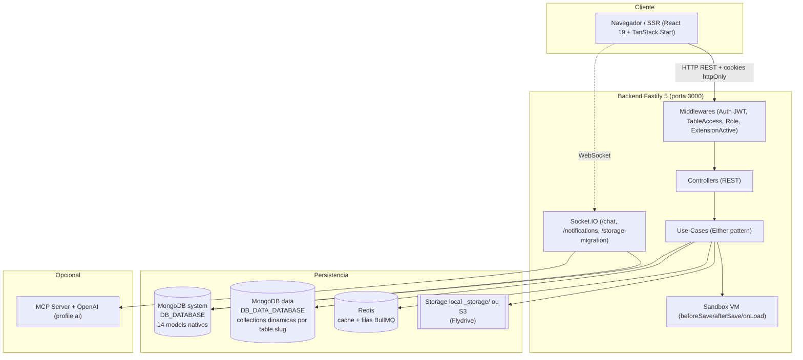
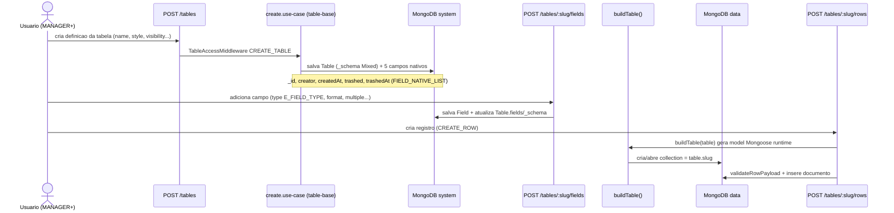
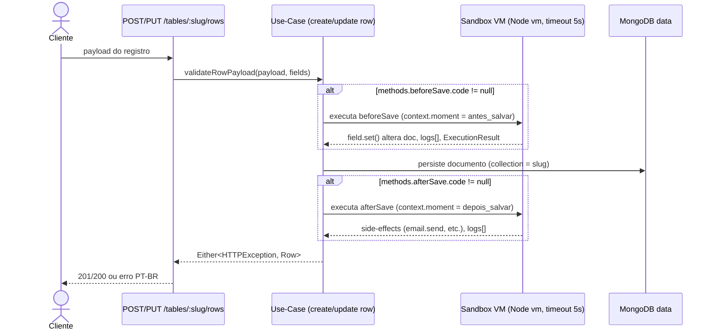

# 01 — Visão Geral

> **Fonte:** código-fonte do monorepo LowCodeJS, branch `develop`.
> **Escopo:** este documento descreve o **propósito**, o **público-alvo**, as
> **funcionalidades** e os **fluxos principais** da plataforma, com evidências de
> código apontando para os arquivos canônicos. Os números (14 models de sistema,
> 137 rotas HTTP, 9 estilos de tabela, 16 tipos de campo etc.) são os números
> canônicos do inventário e devem permanecer consistentes nos demais documentos
> (`02`…`12` e o DBML).
> Detalhes de arquitetura por camada vivem em `CLAUDE.md` (raiz),
> `backend/CLAUDE.md` e `frontend/CLAUDE.md`.

---

## 1.1 Objetivo do sistema

O **LowCodeJS** é uma **plataforma low-code** para construção de aplicações
orientadas a dados — **tabelas dinâmicas, formulários, dashboards e
automações** — sem que o usuário precise escrever (ou implantar) código de
infraestrutura. O texto-âncora do produto está no próprio `CLAUDE.md` da raiz:
*"Plataforma low-code para criacao de aplicacoes com tabelas dinamicas,
formularios, dashboards e automacoes."*

O diferencial técnico é que o **schema das tabelas é definido em runtime**: o
usuário descreve campos pela interface e o backend converte essa definição
(`Table._schema`, do tipo `Mixed`) num model Mongoose vivo via
`buildTable()` (`backend/application/core/util.core.ts`). Cada `table.slug` vira
uma **collection física** numa conexão MongoDB dedicada a dados
(`getDataConnection()`, `backend/config/database.config.ts`). Não há um model
fixo de `Row` — registros são documentos dinâmicos (`IRow = Merge<Base,
Record<string, unknown>>`, `backend/application/core/entity.core.ts:453`).



> Diagrama também em `docs/_assets/01-arquitetura-alto-nivel.mmd`.

| Aspecto | Descrição | Evidência |
| ------- | --------- | --------- |
| Stack backend | Fastify 5.6 + TypeScript + Mongoose 8.18 + Zod 4.1 + Either pattern + DI via `fastify-decorators` | `backend/CLAUDE.md` (Tech Stack) |
| Stack frontend | React 19 + TanStack (Router/Query/Form/Table/Start SSR) + Radix UI + Tailwind 4 | `frontend/CLAUDE.md` (Tech Stack) |
| Persistência | **2 conexões MongoDB** (system + data) + Redis (cache/filas) | `backend/config/database.config.ts` |
| Tabelas dinâmicas | `_schema` Mixed → model Mongoose em runtime | `buildTable()` em `backend/application/core/util.core.ts` |
| Idioma | PT-BR (mensagens de erro, UI e domínio) | `backend/CLAUDE.md` (Error Handling) |

---

## 1.2 Problema que resolve

Aplicações internas (catálogos, CRMs leves, fóruns, kanbans, formulários
públicos, bases de conhecimento) tradicionalmente exigem um ciclo
codificar→migrar banco→deploy a cada nova entidade ou campo. O LowCodeJS
remove esse ciclo: **mudanças de modelo de dados acontecem em runtime, pela
UI**, sem migração de schema nem novo deploy.

| Dor tradicional | Como o LowCodeJS resolve | Evidência |
| --------------- | ------------------------ | --------- |
| Cada nova entidade exige migração de banco + deploy | Tabela e campos criados pela UI; collection nasce no primeiro registro via `buildTable()` | `backend/application/core/util.core.ts`; recursos `table-base`, `table-fields` |
| Regras de negócio espalhadas em código de aplicação | Scripts `onLoad`/`beforeSave`/`afterSave` por tabela, executados em **sandbox** isolada | `backend/application/core/table/` |
| Controle de acesso reescrito por projeto | RBAC com 4 papéis + 12 permissões atômicas + visibilidade por tabela, prontos | `E_ROLE`, `E_TABLE_PERMISSION` em `entity.core.ts`; `table-access.middleware.ts` |
| Diferentes formas de visualizar os mesmos dados | **9 estilos** de tabela (lista, kanban, calendário, gantt, fórum…) sobre a mesma definição | `E_TABLE_STYLE` em `entity.core.ts:103-113` |
| Integrações de e-mail, storage, IA exigem código | Configuradas pela UI `/settings` (singleton `Setting`); storage local↔S3, SMTP, OpenAI | `entity.core.ts:547-589` (`ISetting`) |
| Estender a plataforma sem tocar no core | Sistema de **extensões** (plugin/module/tool) descobertas por loader no boot | `backend/extensions/`; `E_EXTENSION_TYPE` |

O resultado é uma plataforma **multiusuário, multipapel e configurável por
interface**, onde o "código baixo" do usuário se concentra em automações
pontuais e na modelagem de dados, não em infraestrutura.

---

## 1.3 Público-alvo (papéis `E_ROLE`)

O sistema é **multipapel**, com RBAC hierárquico definido em
`E_ROLE` (`backend/application/core/entity.core.ts:82-87`). A hierarquia é
**MASTER > ADMINISTRATOR > MANAGER > REGISTERED**, e o **MASTER bypassa as
checagens** de permissão e visibilidade (ver `table-access.middleware.ts`).
Cada papel corresponde a um perfil de usuário do produto.

| Papel (`E_ROLE`) | Perfil / público | Capacidades (resumo) | Evidência |
| ---------------- | ---------------- | -------------------- | --------- |
| `MASTER` | Operador/dono da instância (super-admin) | Acesso total; **bypassa RBAC e visibilidade**; única role que configura `Setting` (`/settings`), setup wizard, migração de storage, hard-delete e gestão de extensões | `entity.core.ts:83`; `backend/CLAUDE.md` (RBAC); rotas `RoleMiddleware [MASTER]` |
| `ADMINISTRATOR` | Administrador funcional | Acesso a todas as tabelas, menus, usuários; exportações CSV; trash/restore em lote; toggle de extensões | `entity.core.ts:84`; `frontend/CLAUDE.md` (RBAC) |
| `MANAGER` | Gestor de área / criador de tabelas | CRUD respeitando **ownership** das tabelas; cria tabelas, campos e registros | `entity.core.ts:85`; `backend/CLAUDE.md` (RBAC) |
| `REGISTERED` | Usuário final autenticado | Apenas `VIEW` + `CREATE_ROW` (consome tabelas e submete registros) | `entity.core.ts:86`; `backend/CLAUDE.md` (RBAC) |
| *(visitante)* | Não autenticado | Acesso condicionado à **visibilidade da tabela** (`PUBLIC`/`FORM`/`OPEN`) — não é um `E_ROLE` | `E_TABLE_VISIBILITY` em `entity.core.ts:115-121`; rotas `optional:true` |

> **Observação:** os 4 papéis são **seedados** como grupos
> (`UserGroup`) — MASTER, ADMINISTRATOR, MANAGER, REGISTERED — pelo seeder
> `1720448445-user-group.seed.ts`. As 12 permissões atômicas
> (`E_TABLE_PERMISSION`, `entity.core.ts:691-709`) são seedadas por
> `1720448435-permissions.seed.ts`. O usuário **MASTER não tem seed** — é criado
> pelo Setup Wizard na primeira execução (`POST /setup/step/admin`).
> O detalhamento de RBAC e visibilidade está no documento de segurança/permissões
> (ver §1.6).

---

## 1.4 Principais funcionalidades

### 1.4.1 Tabelas dinâmicas e tipos de campo

A entidade central é a `Table` (`entity.core.ts:329-353`): nome, slug,
`_schema` (Mixed), lista de `fields`, `type`, `style`, `visibility`,
`collaboration`, `owner`/`administrators`, ordenações de campos por contexto
(`fieldOrderList`/`Form`/`Filter`/`Detail`), `methods` (scripts), `groups`
(field-groups) e `layoutFields` (mapeamento semântico para as visualizações).

Há **2 tipos de tabela** (`E_TABLE_TYPE`, `entity.core.ts:98-101`): `TABLE`
(tabela comum) e `FIELD_GROUP` (subtabela aninhada usada pelo tipo de campo
`FIELD_GROUP`).

Cada campo é uma `Field` (`entity.core.ts:397-424`) cujo comportamento é
governado por seu **tipo** (`E_FIELD_TYPE`) e, opcionalmente, por seu
**formato** (`E_FIELD_FORMAT`).

**Tipos de campo — `E_FIELD_TYPE` (16 valores)** — `entity.core.ts:30-49`:

| Categoria | Tipo | Descrição |
| --------- | ---- | --------- |
| Configurável | `TEXT_SHORT` | Texto curto (aceita `format` alfanumérico/numérico/máscaras) |
| Configurável | `TEXT_LONG` | Texto longo (`RICH_TEXT`/`PLAIN_TEXT`) |
| Configurável | `DROPDOWN` | Lista de opções (`dropdown[]` com `id`/`label`/`color`) |
| Configurável | `DATE` | Data/datetime (formato via `E_FIELD_FORMAT`) |
| Configurável | `RELATIONSHIP` | Relação com outra tabela (`relationship` com `labelParts`/`labelSeparator`) |
| Configurável | `FILE` | Arquivo (vincula a `Storage`) |
| Configurável | `FIELD_GROUP` | Subtabela aninhada (registros filhos) |
| Configurável | `REACTION` | Reações (LIKE/UNLIKE) por registro |
| Configurável | `EVALUATION` | Avaliação numérica (rating) por registro |
| Configurável | `CATEGORY` | Categorias hierárquicas recursivas (`category[]` com `children`) |
| Configurável | `USER` | Referência a usuário |
| **Nativo** | `CREATOR` | Criador do registro (auto, locked) |
| **Nativo** | `IDENTIFIER` | `_id` do registro (auto, locked) |
| **Nativo** | `CREATED_AT` | Data de criação (auto, locked) |
| **Nativo** | `TRASHED` | Flag de lixeira (auto, locked) |
| **Nativo** | `TRASHED_AT` | Data de envio à lixeira (auto, locked) |

Os **5 campos nativos** são injetados automaticamente em cada tabela via
`FIELD_NATIVE_LIST` / `FIELD_GROUP_NATIVE_LIST` (`entity.core.ts:711-935`):
`_id` (IDENTIFIER), `creator` (CREATOR), `createdAt` (CREATED_AT), `trashed`
(TRASHED), `trashedAt` (TRASHED_AT) — todos `native:true`, `locked:true`.

**Formatos — `E_FIELD_FORMAT` (22 valores)** — `entity.core.ts:51-80`. Os
valores incluem máscaras de texto/número e **strings de formato de data** (cujo
valor é a própria máscara, ex.: `dd/MM/yyyy`):

| Grupo | Formatos |
| ----- | -------- |
| `TEXT_SHORT` | `ALPHA_NUMERIC`, `INTEGER`, `DECIMAL`, `URL`, `EMAIL`, `PASSWORD`, `PHONE`, `CNPJ`, `CPF` |
| `TEXT_LONG` | `RICH_TEXT`, `PLAIN_TEXT` |
| `DATE` (valores = máscara) | `dd/MM/yyyy`, `MM/dd/yyyy`, `yyyy/MM/dd`, `dd/MM/yyyy HH:mm:ss`, `MM/dd/yyyy HH:mm:ss`, `yyyy/MM/dd HH:mm:ss`, `dd-MM-yyyy`, `MM-dd-yyyy`, `yyyy-MM-dd`, `dd-MM-yyyy HH:mm:ss`, `MM-dd-yyyy HH:mm:ss`, `yyyy-MM-dd HH:mm:ss` |

### 1.4.2 Os 9 estilos de tabela (`E_TABLE_STYLE`)

Uma mesma definição de tabela pode ser renderizada em **9 estilos de
visualização** — `entity.core.ts:103-113`. O mapeamento de qual campo alimenta
qual papel visual (título, capa, datas, cor, categoria, participantes…) vem de
`Table.layoutFields` (`ILayoutFields`, `entity.core.ts:317-327`).

| Estilo (`E_TABLE_STYLE`) | Visualização | `layoutFields` relevantes |
| ------------------------ | ------------ | ------------------------- |
| `LIST` | Lista/grade tabular (default) | — |
| `GALLERY` | Galeria de cards visuais | `cover`, `title` |
| `DOCUMENT` | Documento (leitura long-form) | `title`, `description` |
| `CARD` | Cartões | `title`, `description`, `cover` |
| `MOSAIC` | Mosaico | `cover` |
| `KANBAN` | Quadro kanban por coluna | `category` (coluna), `title` |
| `FORUM` | Fórum com tópicos/canais | `title`, `description` |
| `CALENDAR` | Calendário | `startDate`, `endDate`, `color` |
| `GANTT` | Gráfico de Gantt | `startDate`, `endDate`, `participants` |

> `style` default = `LIST` (model `Table`). Componentes frontend
> correspondentes em `frontend/src/components/common/` (`calendar/`, `gantt/`,
> `forum/`, `document/`, `dynamic-table/`…), ver `frontend/CLAUDE.md`.

### 1.4.3 Demais funcionalidades

| Funcionalidade | Descrição | Evidência |
| -------------- | --------- | --------- |
| **Formulários** | Cada tabela expõe um formulário (campos com `showInForm`, larguras `widthInForm`, ordem `fieldOrderForm`); visibilidade `FORM` permite submissão **pública** por visitante | `IField` em `entity.core.ts:397-424`; `E_TABLE_VISIBILITY.FORM`; `POST /tables/:slug/rows` (`optional:true`) |
| **RBAC** | 4 papéis (`E_ROLE`) × 12 permissões atômicas (`E_TABLE_PERMISSION`) + visibilidade (`E_TABLE_VISIBILITY`, 5) + colaboração (`E_TABLE_COLLABORATION`, 2); MASTER bypassa | `entity.core.ts:82-87, 115-126, 691-709`; `table-access.middleware.ts` |
| **Sandbox de scripts** | Scripts `onLoad`/`beforeSave`/`afterSave` por tabela rodam em **Node `vm`** isolada, **timeout 5s**, **sem** `require`/`fs`/network/`process`; APIs `field`, `context`, `email`, `utils`, `console` | `backend/application/core/table/` (`sandbox.ts:33-286`, `executor.ts`, `types.ts`); `Table.methods` (`ITableMethod`, `entity.core.ts:311-315`) |
| **Extensões** | Plugins/Módulos/Ferramentas (`E_EXTENSION_TYPE`) descobertos por loader no boot e armazenados na collection `extensions`; chave única `(pkg, type, extensionId)`; guarda runtime `ExtensionActiveMiddleware` (404 se desativada) | `entity.core.ts:633-689`; `backend/extensions/`; `IExtension` |
| **Notificações** | Feed por usuário (`Notification`), 4 tipos (`E_NOTIFICATION_TYPE`: FORUM_MENTION, KANBAN_COMMENT_MENTION, ROW_MEMBER_ASSIGNED, GENERIC); entregues em tempo real via WebSocket `/notifications` (`E_NOTIFICATION_EVENT`) | `entity.core.ts:145-156, 261-274`; recurso `notifications` |
| **IA / Chat** | Assistente IA via **WebSocket `/chat`** integrando **MCP + OpenAI**; eventos `E_CHAT_EVENT` (9: status, ready, thinking, tool_call, tool_result, tool_error, message, error, history); ativado por `AI_ASSISTANT_ENABLED` + `OPENAI_API_KEY` no `Setting` | `entity.core.ts:133-143`; `backend/application/resources/chat/chat.socket.ts`; `ISetting` (`entity.core.ts:569-574`) |
| **Storage local/S3** | Flydrive com driver `local` (`_storage/`) ou `s3` (`E_STORAGE_LOCATION`); troca de driver pela UI dispara **migração** em background (BullMQ + WebSocket `/storage-migration`, dual-read fallback) | `entity.core.ts:195-223`; `backend/config/storage.config.ts`; recurso `storage-migration` |
| **i18n / locale** | `Setting.LOCALE` (default `pt-br`); branding (`SYSTEM_NAME`, `SYSTEM_DESCRIPTION`, logos) e locale carregados via server function no SSR | `ISetting.LOCALE` (`entity.core.ts:550`); `frontend/CLAUDE.md` (SEO/`__root.tsx`) |
| **Importação/Exportação** | Export CSV (tabelas, registros, usuários, grupos, menu); import CSV de registros **assíncrono** (WebSocket) + template; `schema-import` de tabela; extensões `export-table`/`import-table` (PLUGIN) | rotas `/tables/:slug/rows/exports/csv`, `/imports/csv`, `/tables/schema-import`; `backend/extensions/core` |
| **Auditoria** | `Logger` (collection `logs`, **único model sem soft-delete**) registra ações (`E_LOGGER_ACTION_TYPE`: VIEW/CREATE/UPDATE/DELETE/AI_CALL/AI_RESPONSE) sobre 16 tipos de objeto (`E_LOGGER_OBJECT_TYPE`) | `entity.core.ts:591-631`; recurso `logs` |

---

## 1.5 Fluxos principais

Pseudo-fluxos dos cenários mais relevantes. Os recursos REST não possuem prefixo
global — o path final = `route` do `@Controller` + `url` do método
(`backend/start/kernel.ts`, bootstrap `fastify-decorators`).

### 1.5.1 Criação de tabela → campos → registros (rows)

```
FLUXO criar_tabela_campos_rows:
  ator        = usuario MANAGER+ (ou owner)
  precondicao = autenticado (cookie accessToken)

  1. POST /tables                       # TableAccessMiddleware: CREATE_TABLE
     -> grava Table (_schema Mixed) no DB system
     -> injeta 5 campos nativos (FIELD_NATIVE_LIST): _id, creator, createdAt, trashed, trashedAt
     -> defaults: type=TABLE, style=LIST, visibility=RESTRICTED, collaboration=RESTRICTED

  2. POST /tables/:slug/fields          # TableAccessMiddleware: CREATE_FIELD   (repetir por campo)
     -> grava Field (type E_FIELD_TYPE, format, multiple, show*, width*)
     -> atualiza Table.fields[] e Table._schema

  3. POST /tables/:slug/rows            # TableAccessMiddleware: CREATE_ROW (auth opcional p/ FORM/OPEN)
     -> buildTable(table): gera model Mongoose runtime -> collection = table.slug (DB data)
     -> validateRowPayload(payload, fields)
     -> [se methods.beforeSave] executa script (sandbox)
     -> insere documento; [se methods.afterSave] executa script
     -> 201 Created  |  Either Left -> erro PT-BR { message, code, cause }
```



> Diagrama também em `docs/_assets/01-fluxo-criacao-tabela.mmd`.

### 1.5.2 Submissão de formulário público

```
FLUXO submissao_formulario_publico:
  ator        = visitante (NAO autenticado) ou usuario
  precondicao = Table.visibility IN { FORM, OPEN }

  1. GET /tables/:slug                  # auth opcional; TableAccessMiddleware VIEW_TABLE respeita visibilidade
     -> retorna definicao + campos com showInForm=true (na ordem fieldOrderForm)

  2. POST /tables/:slug/rows            # auth opcional (optional:true); CREATE_ROW liberado p/ FORM/OPEN
     -> validateRowPayload(payload, fields)
     -> [se methods.beforeSave] executa script
     -> grava registro na collection da tabela (DB data)
     -> 201 Created
  nota: MASTER bypassa checagens; PUBLIC libera apenas VIEW (nao submissao)
```

### 1.5.3 Automação `beforeSave` / `afterSave`

```
FLUXO automacao_save:
  gatilho     = create/update de row em tabela com methods.{beforeSave|afterSave}.code != null

  1. ANTES de persistir (moment = antes_salvar):
     -> monta sandbox (buildSandbox): doc, fields, context, logs
     -> context = { action, moment, userId, isNew, appUrl, table }   # read-only (Object.freeze)
     -> executa beforeSave em Node vm (timeout 5s; sem require/fs/network/process)
     -> APIs: field.get/set/getAll/getLabel, email.send/sendTemplate, utils.today/now/formatDate/sha256/uuid, console
     -> field.set(...) altera o documento ANTES da gravacao

  2. persiste o documento na collection (DB data)

  3. DEPOIS de persistir (moment = depois_salvar):
     -> executa afterSave em sandbox (mesmas APIs) p/ side-effects (ex.: email.send)

  retorno script = ExecutionResult { success, error?(syntax|runtime|timeout|unknown), logs[] }
```



> Diagrama também em `docs/_assets/01-fluxo-automacao-save.mmd`.
> Evidências: `sandbox.ts:33-286` (APIs e builtins), `types.ts:20-43`
> (`UserAction`/`ExecutionMoment`/`ExecutionContext`), `Table.methods`
> (`ITableMethod`, `entity.core.ts:311-315`).

### 1.5.4 Importação / Exportação (CSV)

```
FLUXO importar_exportar_csv:
  precondicao = RoleMiddleware [MASTER, ADMINISTRATOR] (+ TableAccess conforme rota)

  EXPORTAR:
  1. GET /tables/:slug/rows/exports/csv          # VIEW_ROW -> baixa CSV dos registros
     (variantes: /tables/exports/csv, /users/exports/csv, /user-group/exports/csv, /menu/exports/csv)

  IMPORTAR:
  1. GET /tables/:slug/rows/imports/csv/template # baixa template CSV
  2. POST /tables/:slug/rows/imports/csv         # CREATE_ROW; processamento ASSINCRONO
     -> enfileira + progresso via WebSocket (sem bloquear a resposta)

  IMPORTAR DEFINICAO DE TABELA:
  -  POST /tables/schema-import                  # CREATE_TABLE; recria tabela a partir de schema
  -  extensoes export-table / import-table (PLUGIN, pkg core) cobrem export/import de tabela inteira
```

### 1.5.5 Chat com IA

```
FLUXO chat_ia:
  precondicao = Setting.AI_ASSISTANT_ENABLED = true E Setting.OPENAI_API_KEY definido
                (opcionalmente MCP_SERVER_URL para tools)

  1. (opcional) POST /chat/upload                # anexa arquivo (imagem -> data URI; PDF -> texto)
  2. conecta WebSocket namespace /chat           # auth via cookie accessToken (mesmo JWT do HTTP)
     -> servidor emite E_CHAT_EVENT: status -> ready
  3. cliente envia mensagem
     -> backend descobre tools do MCP server -> converte p/ tool definitions OpenAI
     -> emite: thinking -> [tool_call -> tool_result | tool_error]* -> message
     -> erros: evento "error";  historico inicial: evento "history"
  nota: acoes de IA sao auditadas (Logger action AI_CALL / AI_RESPONSE)
```

---

## 1.6 Mapa de documentos

A documentação técnica do LowCodeJS está organizada nos volumes abaixo
(estrutura espelhada na doc do ooinfo). Os arquivos `02`…`12` e o `dbdiagram.dbml`
complementam esta visão geral.

| Doc | Título | Escopo | Âncoras de código |
| --- | ------ | ------ | ----------------- |
| [`01-overview.md`](01-overview.md) | Visão Geral | Objetivo, problema, público-alvo, funcionalidades, fluxos (este documento) | `CLAUDE.md`, `entity.core.ts` |
| [`02-architecture.md`](02-architecture.md) | Arquitetura | Monorepo, camadas (Controller→Validator→UseCase→Repository), DI, 2 conexões MongoDB, kernel/plugins, frontend SSR | `backend/CLAUDE.md`, `bin/server.ts`, `start/kernel.ts` |
| [`03-database.md`](03-database.md) | Banco de Dados | 14 models de sistema + Row dinâmico, campos, índices, relacionamentos, soft-delete, enums | `backend/application/model/*.model.ts`, `entity.core.ts` |
| [`dbdiagram.dbml`](dbdiagram.dbml) | Esquema DBML | Modelo ER dos 14 models + refs lógicas (importável em dbdiagram.io) | `entity.core.ts`, `model/*.model.ts` |
| [`04-api.md`](04-api.md) | API REST | ~137 rotas HTTP por recurso, auth/permissão por endpoint, WebSocket, OpenAPI `/documentation` | `resources/**/*.controller.ts`, `start/kernel.ts` |
| [`05-domain-rules.md`](05-domain-rules.md) | Regras de Negócio | RBAC, visibilidade/colaboração, 9 estilos de tabela, schema dinâmico, sandbox, extensões, notificações | `core/`, `middlewares/`, `resources/` |
| [`06-security.md`](06-security.md) | Segurança | JWT RS256 + cookies, RBAC/middlewares, bcrypt, isolamento da VM, achados | `start/kernel.ts`, `middlewares/`, `utils/` |
| [`07-scalability.md`](07-scalability.md) | Escalabilidade & Performance | 2 conexões Mongo, cache Redis, filas BullMQ, populate dinâmico, export CSV, paginação | `config/`, `services/`, `builders/` |
| [`08-infrastructure.md`](08-infrastructure.md) | Infraestrutura | Docker Compose (dev/oficial), Dockerfiles, storage local/S3, Redis, SMTP, MCP, WebSocket | `docker-compose*.yml`, `config/` |
| [`09-deployment.md`](09-deployment.md) | Deploy & Setup | `setup.sh`, variáveis de ambiente, build, CI/CD (Actions/Coolify), seeders, migrations | `start/env.ts`, `.github/workflows/` |
| [`10-observability.md`](10-observability.md) | Observabilidade | Model + hook de Logger, `/health`, recurso de logs, eventos WebSocket | `logger.model.ts`, `logger.hook.ts`, `resources/logs` |
| [`11-dependencies.md`](11-dependencies.md) | Dependências | Pacotes backend/frontend, versões, uso e criticidade | `backend/package.json`, `frontend/package.json` |
| [`12-technical-debt.md`](12-technical-debt.md) | Dívida Técnica | TODO/FIXME, inconsistências e refatorações priorizadas | (vários) |

---

### Diagramas (assets)

Os blocos `mermaid` deste documento têm cópias `.mmd` (sem cerca markdown) em
`docs/_assets/`:

- `01-arquitetura-alto-nivel.mmd` — arquitetura de alto nível (§1.1)
- `01-fluxo-criacao-tabela.mmd` — fluxo tabela→campos→rows (§1.5.1)
- `01-fluxo-automacao-save.mmd` — automação beforeSave/afterSave (§1.5.3)
