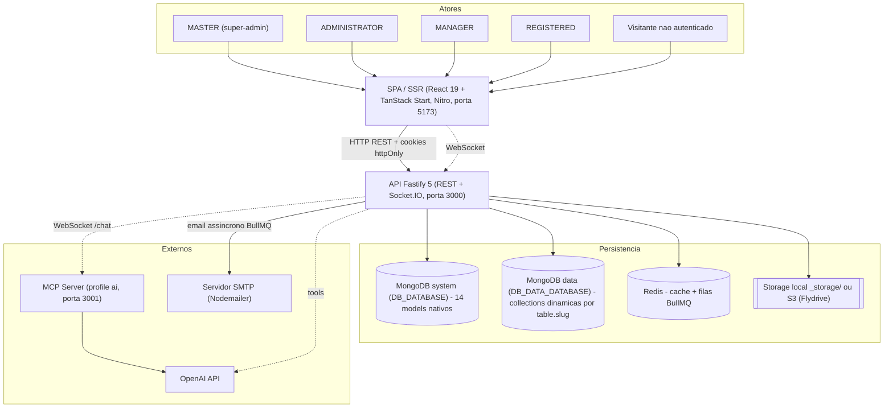
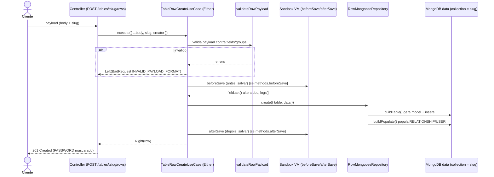
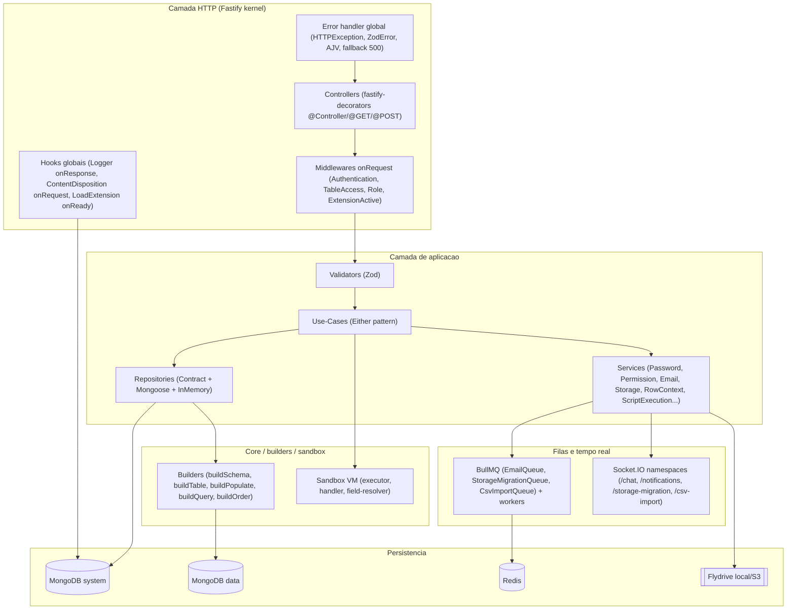
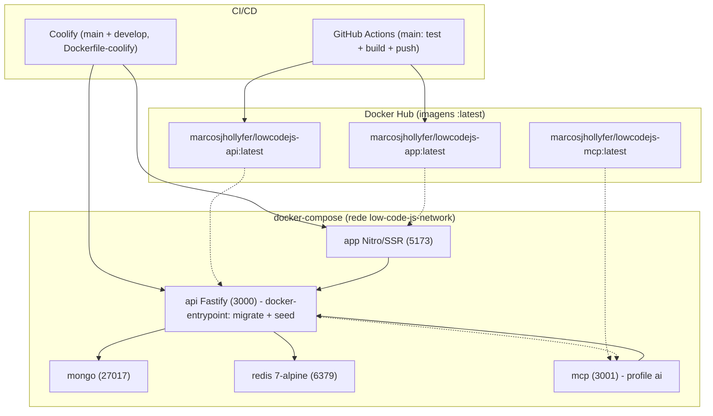

# 02 — Arquitetura Geral

> **Fonte:** código-fonte do monorepo LowCodeJS, branch `develop`.
> **Escopo:** este documento descreve a **arquitetura geral** do backend e do
> frontend — estilo arquitetural, padrões de design, camadas, sequência de
> inicialização, fluxo de requisição e fluxo de dados das tabelas dinâmicas.
> Cada afirmação está ancorada em `caminho/arquivo.ts:linha` ou `arquivo.ts`.
> Arquivos lidos: `backend/CLAUDE.md`, `frontend/CLAUDE.md`,
> `backend/start/kernel.ts`, `backend/bin/server.ts`,
> `backend/application/core/di-registry.ts`, `backend/config/database.config.ts`,
> `docker-compose.yml`, `backend/application/core/builders/`,
> `backend/application/core/table/sandbox.ts`,
> `backend/application/resources/table-rows/create/*`,
> `backend/application/repositories/row/row-mongoose.repository.ts`.
> Números canônicos (consistentes com `docs/01-overview.md`): **14 models de
> sistema**, **9 estilos de tabela**, **4 roles**, **12 permissões**, **16 tipos
> de campo**, **~137 endpoints HTTP**.

---

## 2.1 Arquitetura

O LowCodeJS é um **monorepo** com duas aplicações principais — backend e
frontend — e um servidor MCP opcional. Cada aplicação é, internamente, um
**monólito modular**.

| Componente | Estilo | Evidência |
| ---------- | ------ | --------- |
| **Backend** | Monólito modular Fastify 5 com **DI explícita** via `fastify-decorators`; controllers carregados por bootstrap; camadas isoladas (controller / use-case / repository / service) | `backend/start/kernel.ts:248-250`; `backend/application/core/di-registry.ts:67-197`; `backend/CLAUDE.md` |
| **Persistência** | **2 conexões MongoDB**: *system* (models nativos) via `mongoose.connect()` e *data* (collections dinâmicas) via `mongoose.createConnection()` exposta por `getDataConnection()` | `backend/config/database.config.ts:30-50` |
| **Frontend** | SSR com **TanStack Start** (meta-framework sobre Nitro), file-based routing, React 19 | `frontend/CLAUDE.md` (Tech Stack); `frontend/vite.config.ts` |
| **MCP** | Servidor opcional (assistente IA) ativado por **Docker Compose profile `ai`**; consumido via WebSocket `/chat` + OpenAI | `docker-compose.yml:94-114`; `backend/application/resources/chat/chat.socket.ts` |

### Backend — monólito modular Fastify + DI

O backend é um único processo Fastify cujo **kernel** (`start/kernel.ts`)
registra plugins, hooks e o error handler, e então faz o `bootstrap` de
**todos** os controllers descobertos dinamicamente
(`start/kernel.ts:248-250`, via `loadControllers()`). A injeção de dependências
é **explícita e centralizada**: `registerDependencies()` mapeia cada *contract*
abstrato para sua *implementação* concreta com
`injectablesHolder.injectService(Contract, Implementation)`
(`core/di-registry.ts:67-197`). Trocar de ORM ou de provedor de e-mail é uma
mudança localizada nesse arquivo — o código de negócio depende somente dos
contratos.

> Da própria documentação inline do registry: *"Quando trocar de ORM, altere
> apenas os imports e registros aqui."* (`core/di-registry.ts:64-66`).

### Duas conexões MongoDB (system + data)

`MongooseConnect()` abre **duas** conexões para a mesma `DATABASE_URL`, em
**databases distintos** (`config/database.config.ts:30-50`):

| Conexão | Como é aberta | Database | Conteúdo |
| ------- | ------------- | -------- | -------- |
| **system** | `mongoose.connect(Env.DATABASE_URL, { autoCreate: true, dbName: Env.DB_DATABASE })` (`database.config.ts:32-35`) | `DB_DATABASE` (default `lowcodejs`) | Os **14 models nativos** (User, UserGroup, Permission, Table, Field, Storage, ValidationToken, Menu, Reaction, Evaluation, Setting, Notification, Extension, Logger) |
| **data** | `mongoose.createConnection(Env.DATABASE_URL, { autoCreate: true, dbName: Env.DB_DATA_DATABASE })`, aguardada com `asPromise()` e exposta por `getDataConnection()` (`database.config.ts:37-41,17-24`) | `DB_DATA_DATABASE` (default `lowcodejs_data`) | **Collections dinâmicas** das tabelas low-code — uma collection por `table.slug`, criada em runtime por `buildTable()` |

Os imports dos models de sistema no topo de `database.config.ts:5-13`
**registram** os schemas Mongoose na conexão default no momento do `connect()`.
A conexão *data* é guardada em módulo (`dataConnection`) e qualquer acesso antes
da inicialização lança erro explícito (`database.config.ts:18-23`).

### Frontend — SSR TanStack Start

O frontend é uma aplicação **React 19 com SSR** via **TanStack Start** (preset
`node-server` do Nitro). O `router.tsx` cria o router com o `routeTree`
auto-gerado e o `queryClient` como context; o `__root.tsx` carrega `Setting`
do backend por *server function* para meta tags/branding; os layouts pathless
`_authentication` (guard público) e `_private` (guard autenticado) controlam o
acesso. Ver §2.6. (`frontend/CLAUDE.md`, seções "Arquitetura" e "Fluxo de
Inicializacao".)

### MCP opcional

O serviço `mcp` só sobe sob o **profile `ai`** do Compose
(`docker-compose.yml:94-95`), exposto na porta `3001→3000`
(`docker-compose.yml:99-100`) e apontando para a API
(`LOWCODE_API_URL=http://api:3000`, `docker-compose.yml:101-104`). O backend o
consome no socket `/chat`, descobrindo *tools* dinamicamente e convertendo-as
para *tool definitions* OpenAI (`backend/CLAUDE.md`, "Socket.IO / Chat";
`MCP_SERVER_URL` é **opcional** em `start/env.ts`).



> Diagrama de contexto (C4 nível 1) também em `docs/_assets/02-contexto.mmd`.

---

## 2.2 Padrões de design

| Padrão | O que é | Onde / como aplicado | Evidência |
| ------ | ------- | -------------------- | --------- |
| **Either / Result** | Use-cases retornam `Either<HTTPException, T>` (`Left` = erro, `Right` = sucesso) e **nunca lançam** — o controller inspeciona `isLeft()`/`isRight()` | `TableRowCreateUseCase.execute()` retorna `Either<HTTPException, IRow>`; usa `left(...)`/`right(...)` | `resources/table-rows/create/create.use-case.ts:16,39-53,164,167-172`; `core/either.core.ts` |
| **Repository (Contract + Mongoose + InMemory)** | Cada entidade tem 1 *contract* abstrato + impl. Mongoose (produção) + impl. in-memory (testes unitários) | Contract injetado no use-case; impl. registrada no DI; in-memory usada nos `*.use-case.spec.ts` | `core/di-registry.ts:68-133`; `repositories/CLAUDE.md`; `repositories/row/row-mongoose.repository.ts:58-64` |
| **Service (Contract + Implementation)** | Mesmo padrão dos repositories para *cross-cutting concerns* (e-mail, storage, password, permission, script execution, contextos) | `EmailContractService→NodemailerEmailService`, `PasswordContractService→BcryptPasswordService`, `ScriptExecutionContractService→NodeVmScriptExecutionService`, etc. | `core/di-registry.ts:135-196` |
| **Middleware (onRequest)** | Guards de auth/RBAC plugados por rota via `options.onRequest: [...]` no decorator do controller | `AuthenticationMiddleware({optional})`, `TableAccessMiddleware({requiredPermission})`, `RoleMiddleware`, `ExtensionActiveMiddleware` | `resources/table-rows/create/create.controller.ts:24-32`; `middlewares/*.middleware.ts` |
| **Dynamic Schema (builders)** | `IField[]` → schema Mongoose (`buildSchema`); `ITable` → model dinâmico na conexão *data* (`buildTable`); populate dinâmico (`buildPopulate`) | Builders modularizados em `core/builders/`; usados pelo `RowMongooseRepository` | `core/builders/{schema,model,populate,query}-builder.ts`; `core/builders/index.ts`; `repositories/row/row-mongoose.repository.ts:60-70` |
| **Sandbox VM** | Scripts de usuário (`beforeSave`/`afterSave`/`onLoad`) rodam em Node `vm` isolada, timeout 5s, sem `require`/`fs`/network/`process` | APIs `field`, `context`, `email`, `utils`, `console`; `buildSandbox()` monta o ambiente | `core/table/sandbox.ts:33-45`; `core/table/{executor,handler,types}.ts`; `core/table/CLAUDE.md` |
| **Filas BullMQ** | Trabalho assíncrono fora do request: e-mail, migração de storage, import CSV — fila no Redis + worker in-process | `BullMQEmailQueueService`, `BullMQStorageMigrationQueueService`, `BullMQCsvImportQueueService`; workers iniciados no boot | `core/di-registry.ts:137-140,168-171,193-196`; `bin/server.ts:110-143` |
| **Cache Redis** | Cliente ioredis a partir de `REDIS_URL`; usado como cache e como backend das filas BullMQ | `config/redis.config.ts`; `Setting` usa pattern key-value no Redis | `backend/CLAUDE.md` (Redis); `repositories/CLAUDE.md` (setting) |

> **Nota (EmailQueue vs Email):** os use-cases injetam o
> `EmailQueueContractService` (BullMQ), **não** o `EmailContractService`
> diretamente — o envio síncrono via Nodemailer só é consumido pelo `EmailWorker`
> e pela sandbox (`backend/CLAUDE.md`, "Dependencia Injection"; `core/table/sandbox.ts:36-37`).

---

## 2.3 Camadas

A requisição atravessa um pipeline determinístico. A lógica de negócio vive
**exclusivamente** no use-case; o controller só faz HTTP; o repository só faz
acesso a dados; os services tratam *cross-cutting concerns*.

```
HTTP → Controller → Validator (Zod) → Use-Case (Either) → Repository → Mongoose → MongoDB
                                            │
                                            └── Services (cross-cutting): Password, Permission,
                                                Email/EmailQueue, Storage, ScriptExecution,
                                                RowContext, Notification, RowMemberNotification...
```

| Camada | Responsabilidade | Não faz | Evidência |
| ------ | ---------------- | ------- | --------- |
| **Controller** (`*.controller.ts`) | Parse de `params`/`body`, monta payload, delega ao use-case, traduz `Either` em status HTTP (201/200 ou `error.code`) | Lógica de negócio | `resources/table-rows/create/create.controller.ts:36-57` |
| **Validator** (`*.validator.ts`) | Schemas **Zod** para `params`/`body`/`query`; exporta tipos inferidos | Acesso a dados | `create.controller.ts:37` (`TableRowCreateParamsValidator.parse(...)`); `backend/CLAUDE.md` (Validator) |
| **Use-Case** (`*.use-case.ts`) | Regra de negócio pura; recebe repos/services via constructor `@Service()`; retorna `Either<HTTPException, T>` | Conhecer HTTP (request/response) | `create.use-case.ts:23-32,34-174` |
| **Repository** (`*-contract` + `*-mongoose` + `*-in-memory`) | Acesso a dados; payloads tipados (`Create/Update/Query/FindOptions`); soft-delete | Regra de negócio | `repositories/CLAUDE.md`; `repositories/row/row-mongoose.repository.ts` |
| **Mongoose / MongoDB** | Persistência; para rows, o model é **gerado em runtime** por `buildTable()` na conexão *data* | — | `repositories/row/row-mongoose.repository.ts:60-64` |
| **Services (cross-cutting)** | E-mail (fila), storage, password (bcrypt), permission, execução de script (VM), contexto de row, notificações | Roteamento HTTP | `core/di-registry.ts:135-196`; `create.use-case.ts:28-31` |

> Os esquemas `*.schema.ts` são apenas **documentação OpenAPI** (serialização e
> Swagger), não validação de runtime — esta é feita pelos validators Zod e pelo
> AJV do Fastify (`backend/CLAUDE.md`, "Validator").

---

## 2.4 Inicialização e fluxo de requisição

### 2.4.1 Entry point — `bin/server.ts`

O processo só sobe **depois** que as duas conexões Mongo estão abertas:

```
MongooseConnect()  →  loadStorageConfig()  →  kernel.ready()  →  kernel.listen({ port, host:'0.0.0.0' })
        │                                                              │
        └─ syncSettingsFromDatabase()                                 └─ Socket.IO (chat/migration/notifications/csv) + workers BullMQ
```

| Passo | Ação | Evidência |
| ----- | ---- | --------- |
| 1 | `MongooseConnect()` abre system + data; loga ambos os databases | `bin/server.ts:150-152`; `config/database.config.ts:30-50` |
| 2 | `syncSettingsFromDatabase()` copia ~14 chaves do `Setting` para `process.env` (branding, locale, upload, SMTP, logos, IA) | `bin/server.ts:29-44,57-68,153` |
| 3 | `loadStorageConfig()` lê `Setting` e sincroniza driver de storage via `syncStorageEnv()` | `bin/server.ts:46-55,84` |
| 4 | `kernel.ready()` resolve plugins/hooks; `kernel.listen({ port: Env.PORT, host: '0.0.0.0' })` | `bin/server.ts:85-88` |
| 5 | Inicializa Socket.IO: `initChatSocket`, `initStorageMigrationSocket`, `initNotificationsSocket`, `initCsvImportSocket` (todos com `jwtDecode` do mesmo JWT RS256 do HTTP) | `bin/server.ts:90-101,123-126` |
| 6 | `sweepStaleMigrations()`: marca docs `in_progress` órfãos como `failed` (recovery pós-crash) | `bin/server.ts:70-80,103` |
| 7 | Inicia workers BullMQ: storage-migration, email, csv-import | `bin/server.ts:110-143` |

> Em container, `docker-entrypoint.sh` roda **antes** do server:
> `migrate:dual-connection` (idempotente) + `seed` (idempotente) (`backend/CLAUDE.md`,
> "Fluxo de Inicializacao do Servidor").

### 2.4.2 Kernel — `start/kernel.ts` (ordem dos plugins)

O kernel é instanciado com `logger:false` e AJV em modo `allErrors:true` +
plugin `ajv-errors` (`kernel.ts:66-74`). A ordem de registro é relevante (CORS e
cookies antes do JWT; bootstrap dos controllers por último):

| # | Plugin / registro | Configuração | Evidência |
| - | ----------------- | ------------ | --------- |
| 1 | `@fastify/cors` | Origens fixas (`APP_CLIENT_URL`, `APP_SERVER_URL`) + padrões de `ALLOWED_ORIGINS` (wildcard `*.dominio`); `credentials:true`; expõe `Set-Cookie` | `kernel.ts:76-115,24-35` |
| 2 | `@fastify/cookie` | Cookies assinados com `COOKIE_SECRET` | `kernel.ts:117-119` |
| 3 | `@fastify/jwt` | **RS256**, chaves base64 (`JWT_PRIVATE_KEY`/`JWT_PUBLIC_KEY`), `expiresIn` 24h, cookie `accessToken` | `kernel.ts:121-134` |
| 4 | `@fastify/multipart` | Limite de upload **5MB** | `kernel.ts:136-140` |
| 5 | Hooks globais | `onResponse` → `LoggerUserActionHook`; `onRequest` → `StorageContentDispositionHook` | `kernel.ts:142-143` |
| 6 | **Error handler global** | `setErrorHandler` (ver §2.4.3) | `kernel.ts:145-209` |
| 7 | `@fastify/swagger` | OpenAPI 3 (`title` LowCodeJs API), server = `APP_SERVER_URL`, `cookieAuth` (apiKey em cookie `accessToken`) | `kernel.ts:211-234` |
| 8 | `@scalar/fastify-api-reference` | UI de referência da API em **`/documentation`** | `kernel.ts:236-242` |
| 9 | `@fastify/websocket` | Habilita WebSocket no Fastify | `kernel.ts:244` |
| — | `registerDependencies()` | Registra todos os contracts→impls no DI **antes** do bootstrap | `kernel.ts:246`; `core/di-registry.ts` |
| 10 | `bootstrap` (fastify-decorators) | Carrega **todos** os controllers via `loadControllers()` | `kernel.ts:248-250` |
| — | `onReady` → `LoadExtensionHook` | Varre o FS de extensões e faz upsert na collection (não-fatal) | `kernel.ts:252-255` |
| — | `GET /openapi.json` | Expõe o documento OpenAPI cru | `kernel.ts:257-259` |

> **Prefixo de rotas:** **não há prefixo global** (`/api`). O path final de cada
> endpoint é `route` do `@Controller` + `url` do método. Ex.: `@Controller({route:'tables'})`
> + `@POST({url:'/:slug/rows'})` ⇒ `POST /tables/:slug/rows`
> (`create.controller.ts:11-23`). Total: **~137 endpoints HTTP**.

### 2.4.3 Error handler global

O handler em `kernel.ts:145-209` normaliza todas as falhas para o formato PT-BR
`{ message, code, cause, errors? }`, na seguinte ordem de precedência:

| Ordem | Erro capturado | Resposta | Evidência |
| ----- | -------------- | -------- | --------- |
| 1 | `HTTPException` | `error.code` + `{message, code, cause, errors?}` | `kernel.ts:146-153` |
| 2 | `ZodError` | `400 INVALID_PAYLOAD_FORMAT` com `errors` (flatten por campo) | `kernel.ts:155-175` |
| 3 | `FST_ERR_VALIDATION` (AJV) | `error.statusCode` `INVALID_PAYLOAD_FORMAT` com `errors` derivados de `instancePath`/`missingProperty` | `kernel.ts:177-200` |
| 4 | Fallback | `500 SERVER_ERROR` + `console.error(error)` | `kernel.ts:202-208` |

---

## 2.5 Fluxo de dados — criar um row em tabela dinâmica

Cenário canônico: `POST /tables/:slug/rows`. Exercita controller → validator →
use-case (Either) → builders (`buildTable`/`buildPopulate`) → sandbox →
repository → conexão *data*.

| Etapa | O que acontece | Evidência |
| ----- | -------------- | --------- |
| 1. Middlewares | `AuthenticationMiddleware({optional:true})` + `TableAccessMiddleware({requiredPermission:'CREATE_ROW'})` | `create.controller.ts:24-32` |
| 2. Controller | `TableRowCreateParamsValidator.parse(params)`; monta payload (`body` + `params` + `creator = request.user.sub`); chama `useCase.execute()` | `create.controller.ts:36-43` |
| 3. Lookup | `tableRepository.findBySlug(slug)`; se ausente → `Left(NotFound 'TABLE_NOT_FOUND')` | `create.use-case.ts:36-42` |
| 4. **validateRowPayload** | Valida `payload` contra `table.fields`/`table.groups`; se inválido → `Left(BadRequest 'INVALID_PAYLOAD_FORMAT', errors)` | `create.use-case.ts:44-54` |
| 5. Senhas | `rowPasswordService.hash(payload, fields)` faz bcrypt nos campos `PASSWORD` | `create.use-case.ts:56` |
| 6. **beforeSave** (hook) | Se `table.methods.beforeSave.code` existe: resolve campos `USER`, monta `scriptDoc`, executa na **sandbox** (`context.executionMoment='antes_salvar'`); `field.set(...)` reflete no `createData` antes de gravar | `create.use-case.ts:63-148` |
| 7. **buildTable** | `rowRepository.create({table, data})` → `buildTable(table, getDataConnection())` gera o model dinâmico; insere na collection = `table.slug` (DB *data*) | `repositories/row/row-mongoose.repository.ts:60-64`; `create.use-case.ts:150-153` |
| 8. **buildPopulate** | Popula campos `RELATIONSHIP`/`USER` via `buildPopulate(fields, groups, getDataConnection())` | `repositories/row/row-mongoose.repository.ts:66-70` |
| 9. Notificação | `rowMemberNotificationService.notifyNewMembers(...)` para membros recém-atribuídos | `create.use-case.ts:155-160` |
| 10. afterSave / máscara | (afterSave roda após persistir, `moment='depois_salvar'`); `rowPasswordService.mask(row, fields)` mascara `PASSWORD` no retorno; `Right(row)` → `201` | `create.use-case.ts:162-164`; `create.controller.ts:56`; `backend/CLAUDE.md` (Create Row) |



> Componentes internos do backend também em `docs/_assets/02-componentes.mmd`.

---

## 2.6 Frontend

| Aspecto | Descrição | Evidência |
| ------- | --------- | --------- |
| **Stack** | React 19.2 + TanStack Start 1.132 (SSR/Nitro) + Router/Query/Table/Form + Radix UI + Tailwind CSS 4; Zustand para estado de cliente; Axios | `frontend/CLAUDE.md` (Tech Stack) |
| **SSR** | TanStack Start sobre **Nitro** (preset `node-server`); `npm start` serve `.output/server/index.mjs`; porta 5173 em dev | `frontend/CLAUDE.md` (Build & Deploy, Vite Config) |
| **Roteamento** | File-based via TanStack Router; `routeTree.gen.ts` auto-gerado; `index.tsx` = config (loader/beforeLoad), `index.lazy.tsx` = UI lazy | `frontend/CLAUDE.md` (Roteamento) |
| **Bootstrap** | `router.tsx` cria router (routeTree + queryClient como context); `__root.tsx` carrega `Setting` por server function (meta OG/Twitter/JSON-LD) | `frontend/CLAUDE.md` (Fluxo de Inicializacao) |
| **Data fetching** | TanStack Query (retry false, staleTime 1h, refetchOnWindowFocus); integrado ao Router via context (usável em `beforeLoad`/`loader`) | `frontend/CLAUDE.md` (TanStack Query) |
| **Estado global** | Zustand `useAuthStore` (user/isAuthenticated/hasHydrated) persistido em `localStorage` (`low-code-js-auth`), SSR-safe | `frontend/CLAUDE.md` (Zustand) |
| **API client** | Axios com `withCredentials`; interceptors injetam cookies no SSR e tratam `401` (limpa store + redireciona, exceto rotas públicas) | `frontend/CLAUDE.md` (Cliente API) |

**Layouts pathless (guards):**

| Layout | Papel | `beforeLoad` | Evidência |
| ------ | ----- | ------------ | --------- |
| `_authentication/` | Rotas públicas (sign-in, sign-up) | Se logado, redireciona para `ROLE_DEFAULT_ROUTE` | `frontend/CLAUDE.md` (Fluxo §3) |
| `_private/` | Rotas protegidas (9 áreas: dashboard, tables, users, groups, menus, pages, profile, settings, tools/extensions) | Carrega perfil, salva no Zustand; se falhar e não for tabela pública, redireciona para `/` | `frontend/CLAUDE.md` (Fluxo §4) |
| `setup` | Setup Wizard inicial (criação do MASTER) | — | `frontend/CLAUDE.md`; `backend/CLAUDE.md` (Seeders — MASTER sem seed) |

O frontend é o consumidor de **9 estilos** de tabela (`E_TABLE_STYLE`), com
componentes dedicados em `components/common/` (`calendar/`, `gantt/`, `forum/`,
`document/`, `dynamic-table/`…) e formulários montados por
`integrations/tanstack-form/` (`frontend/CLAUDE.md`, "Formularios" e
"Componentes de Negocio").

---

## 2.7 Diagramas

### 2.7.1 Contexto (C4 nível 1)

Ver bloco mermaid em §2.1 e o asset `docs/_assets/02-contexto.mmd`.

### 2.7.2 Componentes internos do backend



> Também em `docs/_assets/02-componentes.mmd`.

### 2.7.3 Deployment



> Também em `docs/_assets/02-deployment.mmd`. Serviços e portas conforme
> `docker-compose.yml:1-124`; profile `ai` em `docker-compose.yml:94-95`;
> CI/CD e imagens `:latest` conforme `CLAUDE.md` (raiz, "Deploy (CI/CD)").

---

## 2.8 Pontos de atenção

| # | Tema | Observação | Evidência |
| - | ---- | ---------- | --------- |
| 1 | **Acoplamento das 2 conexões** | A conexão *data* é estado de módulo (`dataConnection`); `getDataConnection()` lança se acessada antes de `MongooseConnect()`. Builders dependem dela em runtime | `config/database.config.ts:17-24,37-41` |
| 2 | **Sem prefixo `/api`** | Rotas são `route` + `url` sem prefixo global — a documentação de rotas precisa montar o path manualmente | `kernel.ts:248-250`; `create.controller.ts:11-23` |
| 3 | **Schema serialization** | `*.schema.ts` não validam runtime; servem ao Swagger/serialização. Blocos de erro **precisam** declarar `errors` ou o Fastify remove a propriedade | `backend/CLAUDE.md` (Error Handling, Resources) |
| 4 | **EmailQueue ≠ Email** | Use-cases devem injetar `EmailQueueContractService` (BullMQ), não o `EmailContractService`; envio direto só no worker e na sandbox | `core/di-registry.ts:137-140`; `core/table/sandbox.ts:36-37` |
| 5 | **beforeSave 2× no create** | Conforme memória do projeto, `beforeSave` pode rodar 2× no create e `afterSave` não dispara em update — semântica a confirmar caso a caso | memória `sandbox-save-hook-semantics`; `create.use-case.ts:63-148` |
| 6 | **Settings em 2 lugares** | Infra vive em `.env` (Zod); domínio (branding, SMTP, storage, IA) vive no `Setting` (MongoDB) e é sincronizado para `process.env` no boot — duas fontes de verdade | `bin/server.ts:29-68`; `backend/CLAUDE.md` (Variaveis de Ambiente) |
| 7 | **Workers in-process** | Os workers BullMQ (email, storage-migration, csv-import) rodam **no mesmo processo** da API — não há separação de processo dedicado | `bin/server.ts:110-143` |
| 8 | **Resiliência de migração** | `sweepStaleMigrations()` no boot recupera jobs órfãos `in_progress` → `failed`; depende de Redis para retomar | `bin/server.ts:70-80,103` |
| 9 | **MCP opcional** | `MCP_SERVER_URL` é opcional; com `profile ai` ausente, o chat com tools fica indisponível. **Não determinável pelo código** o comportamento exato de fallback do socket sem MCP a partir dos arquivos lidos | `docker-compose.yml:94-95`; `start/env.ts` |
| 10 | **Divergências de contagem em CLAUDE.md** | `backend/CLAUDE.md` cita "11 models/11 repositórios" e `resources/CLAUDE.md` cita "15 recursos", mas os números **canônicos** são **14 models** e **~137 endpoints** (ver `docs/01-overview.md`); o `di-registry.ts` registra **15** repositories Mongoose | `core/di-registry.ts:68-133` (15 `ContractRepository`); `docs/01-overview.md` |
