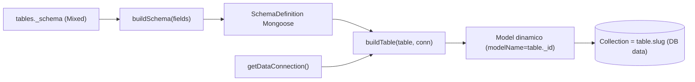
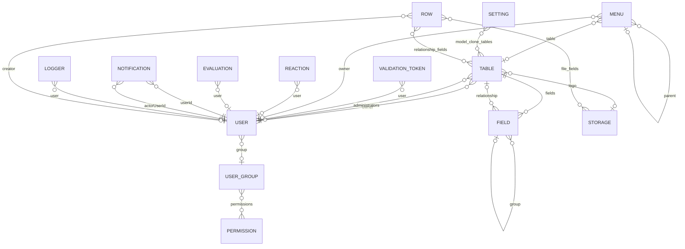

# 03 — Banco de Dados

> **Fonte:** código-fonte do backend LowCodeJS, branch **`develop`**. As
> afirmações citam o arquivo/linha de origem no formato `caminho.ts:linha`.
> Documento construído a partir de `docs/dbdiagram.dbml`,
> `backend/application/model/*.model.ts` (14 schemas Mongoose),
> `backend/application/core/entity.core.ts` (enums e tipos) e
> `backend/application/core/builders/{schema-builder,model-builder,populate-builder}.ts`
> (construção de tabelas dinâmicas). Itens não decidíveis pelo código são
> marcados **Não determinável pelo código**.
>
> **Escopo:** persistência (duas conexões MongoDB), visão de domínio dos models,
> dicionário de entidades campo-a-campo (tipos, obrigatoriedade, índices,
> constraints), tabelas dinâmicas (rows), relacionamentos, soft-delete,
> timestamps e enums.
>
> **Números canônicos** (consistentes com `01-overview.md`, `05-domain-rules.md`,
> `06-security.md` e o DBML): **14 models de sistema**, **9 estilos de tabela**,
> **4 roles**, **12 permissões**, **16 tipos de campo**, ~**137 endpoints**.

---

## 3.1 Persistência

O backend usa **MongoDB** via **Mongoose 8.18**. Há **duas conexões** distintas,
abertas em `backend/config/database.config.ts:30-50` por `MongooseConnect()`:

| # | Conexão | Database (env) | Default | Abertura | Conteúdo |
| --- | --- | --- | --- | --- | --- |
| 1 | **System** | `DB_DATABASE` | `lowcodejs` | `mongoose.connect()` (`database.config.ts:32-35`) | Os **14 models nativos** (User, Table, Field, …) — schemas fixos |
| 2 | **Data** | `DB_DATA_DATABASE` | `lowcodejs_data` | `mongoose.createConnection()` (`database.config.ts:37-41`) | **Collections dinâmicas** das tabelas low-code, **sem model fixo** |

Ambas as conexões apontam para a mesma string `DATABASE_URL`, mudando apenas o
`dbName`; podem residir em servidores distintos se `DATABASE_URL` for trocado.
A conexão **data** é guardada em módulo (`let dataConnection`,
`database.config.ts:15`) e exposta por **`getDataConnection()`**
(`database.config.ts:17-24`), que lança erro se chamada antes de
`MongooseConnect()`. O arquivo importa explicitamente nove models no topo
(`database.config.ts:5-13`) para registrar seus schemas na conexão default.

### Collections dinâmicas por `table.slug`

Cada documento da collection `tables` (model `Table`) carrega um campo
**`_schema`** do tipo **`Mixed`** (`table.model.ts:68`) que descreve a forma do
registro. Esse `_schema` é convertido em runtime num **modelo Mongoose** pela
função **`buildTable(table, conn)`** (`builders/model-builder.ts:35-160`):

1. Percorre `table._schema` (`model-builder.ts:48`). Entradas cujo primeiro
   elemento tem `type === 'Embedded'` viram **subschemas** (`_id:true`,
   `timestamps:true` — `model-builder.ts:68-72`); as demais entram diretamente
   na `SchemaDefinition`.
2. Remove `_id` e `createdAt` da definição (`model-builder.ts:79-80`) — são
   geridos pelo Mongoose (ObjectId automático + `timestamps:true`).
3. Registra hooks `pre('save')` (beforeSave) e `post('save')` (afterSave)
   quando há código configurado (`model-builder.ts:91-148`).
4. Cria o modelo usando **`table._id.toString()` como `modelName`** e
   **`table.slug` como nome da collection** (`model-builder.ts:150-155`), na
   conexão `data` recebida em `conn`; faz `deleteModel` se já existir
   (`model-builder.ts:152-154`) e `createCollection()` (`model-builder.ts:157`).

O `_schema` em si é produzido por **`buildSchema(fields, groups?)`**
(`builders/schema-builder.ts:208-225`), que mapeia cada `IField` para uma
definição Mongoose conforme o tipo. O mapeamento de tipo de campo →
tipo de coluna é o **`FieldTypeMapper`** (`schema-builder.ts:13-35`), baseado no
enum `E_SCHEMA_TYPE` (`entity.core.ts:277-283` — `String`, `Number`, `Date`,
`Boolean`, `ObjectId`). Os campos nativos `IDENTIFIER` e `CREATED_AT` são
**pulados** em `buildSchema` (`schema-builder.ts:215-220`), pois `_id` e
`createdAt` já vêm do Mongoose.

> **Migração one-time:** as collections dinâmicas já existiam no DB **system** em
> versões anteriores; `database/migrations/migrate-dual-connection.ts` copia-as
> para o DB **data** (idempotente via marcador `MIGRATION_DUAL_CONNECTION_AT` no
> Setting). Ver `backend/CLAUDE.md` › *Migrations*.

---

## 3.2 Visão de domínio

São **14 models de sistema** (todos em `backend/application/model/*.model.ts`,
conexão system) + a **collection dinâmica** representativa (sem model fixo,
conexão data). Agrupando por domínio funcional:

| Domínio | Models | Collections | Papel |
| --- | --- | --- | --- |
| **Identidade & Acesso** | `User`, `UserGroup`, `Permission`, `ValidationToken` | `users`, `user-groups`, `permissions`, `validation-tokens` | Usuários, RBAC (4 roles, 12 permissões) e tokens de validação/reset |
| **Modelagem low-code** | `Table`, `Field` | `tables`, `fields` | Definição de tabelas dinâmicas (`_schema`, estilo, visibilidade) e de campos |
| **Dados de negócio (dinâmicos)** | — (sem model fixo) | `<table.slug>` (1 por tabela) | Registros (rows) criados pelos usuários — conexão **data** |
| **Interações em registros** | `Reaction`, `Evaluation` | `reactions`, `evaluations` | Curtidas/avaliações referenciadas por campos `REACTION`/`EVALUATION` |
| **Navegação & conteúdo** | `Menu` | `menus` | Itens de menu hierárquicos (tabela, página, form, externo, módulo de extensão) |
| **Arquivos** | `Storage` | `storage` | Metadados de arquivos (local ou S3) |
| **Notificações** | `Notification` | `notifications` | Notificações por usuário (menções, atribuições, genéricas) |
| **Extensibilidade** | `Extension` | `extensions` | Plugins/módulos/ferramentas registrados |
| **Configuração** | `Setting` | `settings` | Singleton de configuração global (branding, storage, IA, SMTP, setup) |
| **Auditoria** | `Logger` | `logs` | Log de auditoria append-only (único sem soft-delete) |

**Totais:** **14 models** de sistema · **15 enums** exportados em `entity.core.ts`
(`E_TOKEN_STATUS`, `E_FIELD_TYPE`, `E_FIELD_FORMAT`, `E_ROLE`,
`E_MENU_ITEM_TYPE`, `E_TABLE_TYPE`, `E_TABLE_STYLE`, `E_TABLE_VISIBILITY`,
`E_TABLE_COLLABORATION`, `E_JWT_TYPE`, `E_USER_STATUS`, `E_SCHEMA_TYPE`,
`E_REACTION_TYPE`, `E_NOTIFICATION_TYPE`, `E_STORAGE_LOCATION`,
`E_STORAGE_MIGRATION_STATUS`, `E_REACTION_TYPE`, `E_EXTENSION_TYPE`,
`E_LOGGER_ACTION_TYPE`, `E_LOGGER_OBJECT_TYPE`, `E_TABLE_PERMISSION`,
`E_CHAT_EVENT`, `E_NOTIFICATION_EVENT`) — destes, os que aparecem **persistidos**
em schemas estão listados em §3.7. Há ainda **2 enums inline** declarados como
literais dentro do schema de `Setting` (`STORAGE_DRIVER` e `SETUP_CURRENT_STEP`).

---

## 3.3 Entidades

**Convenções de coluna:** 🔑 PK · 🔗 FK (ref lógica — não há FK física no
MongoDB) · ★ unique · ⊕ index. Salvo indicação, todo model tem `_id`
(ObjectId, auto), `createdAt`/`updatedAt` (auto via `timestamps:true`) e o par de
soft-delete `trashed`/`trashedAt`. Campos comuns descritos na cabeça do tipo
`Base` (`entity.core.ts:178-184`).

### 3.3.1 User — collection `users`

Schema: `user.model.ts:11-34`.

| Campo | Tipo | Obrig. | Notas |
| --- | --- | :---: | --- |
| `_id` 🔑 | ObjectId | auto | `auto:true` (`user.model.ts:13`) |
| `name` | String | ✅ | `required:true` |
| `email` | String | ✅ | `required:true`; **sem `unique` no schema** — unicidade garantida em use-case |
| `password` | String | ✅ | hash bcrypt (`06-security.md`) |
| `status` | String (enum `E_USER_STATUS`) | — | default `INACTIVE` (`user.model.ts:18-22`); ativado via validation-token |
| `group` 🔗 | ObjectId → `UserGroup` | — | `ref:'UserGroup'`, sem `required` (`user.model.ts:23`) |
| `notificationsEnabled` | Boolean | — | default `true` (`user.model.ts:25`) |
| `trashed` | Boolean | — | default `false` |
| `trashedAt` | Date | — | default `null` |
| `createdAt`/`updatedAt` | Date | auto | `timestamps:true`, `id:false` |

**Índices/constraints:** nenhum índice declarado no schema. **`email` NÃO é
unique** no schema (modelado no DBML, `dbdiagram.dbml:222`).

### 3.3.2 UserGroup — collection `user-groups`

Schema: `user-group.model.ts:7-22`.

| Campo | Tipo | Obrig. | Notas |
| --- | --- | :---: | --- |
| `_id` 🔑 | ObjectId | auto | |
| `name` | String | ✅ | `required:true` |
| `slug` | String | ✅ | `required:true` |
| `description` | String | — | sem default (`undefined`) |
| `permissions` 🔗 | ObjectId[] → `Permission` | — | array de refs (`user-group.model.ts:13`) |
| `trashed` / `trashedAt` | Boolean / Date | — | soft-delete |

**Constraints:** sem índices. Role RBAC com lista de permissões. 4 grupos
seedados (MASTER, ADMINISTRATOR, MANAGER, REGISTERED) — ver `05-domain-rules.md`.

### 3.3.3 Permission — collection `permissions`

Schema: `permission.model.ts:7-21`.

| Campo | Tipo | Obrig. | Notas |
| --- | --- | :---: | --- |
| `_id` 🔑 | ObjectId | auto | |
| `name` | String | ✅ | `required:true` |
| `slug` | String | ✅ | `required:true`; chave lógica do upsert do seed |
| `description` | String | — | default `null` |
| `trashed` / `trashedAt` | Boolean / Date | — | soft-delete |

**Constraints:** sem índice unique no schema; o seed faz upsert por `slug`. 12
permissões seedadas (CREATE/UPDATE/REMOVE/VIEW × TABLE/FIELD/ROW).

### 3.3.4 Table — collection `tables`

Schema: `table.model.ts:65-168`. É o coração do low-code. Inclui subdocumentos
embutidos (`methods`, `groups`, `order`, `layoutFields`).

| Campo | Tipo | Obrig. | Notas |
| --- | --- | :---: | --- |
| `_id` 🔑 | ObjectId | auto | usado como `modelName` da collection dinâmica (`model-builder.ts:150`) |
| `_schema` | Mixed | — | definição do schema dinâmico (`ITableSchema`); consumido por `buildTable()` (`table.model.ts:68`) |
| `name` | String | ✅ | `required:true` |
| `description` | String | — | default `null` |
| `logo` 🔗 | ObjectId → `Storage` | — | default `null` (`table.model.ts:71-75`) |
| `slug` | String | ✅ | `required:true`; vira o **nome da collection dinâmica** |
| `fields` 🔗 | ObjectId[] → `Field` | — | array de refs (`table.model.ts:77-82`) |
| `type` | String (enum `E_TABLE_TYPE`) | — | default `TABLE` (`table.model.ts:83-87`) |
| `style` | String (enum `E_TABLE_STYLE`) | — | default `LIST` (`table.model.ts:88-92`) — **9 estilos** |
| `visibility` | String (enum `E_TABLE_VISIBILITY`) | — | default `RESTRICTED` (`table.model.ts:93-97`) |
| `collaboration` | String (enum `E_TABLE_COLLABORATION`) | — | default `RESTRICTED` (`table.model.ts:98-102`) |
| `administrators` 🔗 | ObjectId[] → `User` | — | array de refs (`table.model.ts:103-108`) |
| `owner` 🔗 | ObjectId → `User` | ✅ | `required:true` (`table.model.ts:109-113`) |
| `fieldOrderList` | String[] | — | default `[]` |
| `fieldOrderForm` | String[] | — | default `[]` |
| `fieldOrderFilter` | String[] | — | default `[]` |
| `fieldOrderDetail` | String[] | — | default `[]` |
| `methods` | Subdoc `Methods` (`_id:false`) | — | `onLoad`/`beforeSave`/`afterSave` → `{ code: String\|null }` (`table.model.ts:39-63`) |
| `groups` | Subdoc[] `GroupConfiguration` (`_id:true`, `timestamps`) | — | `{ slug, name, fields:[ref Field], _schema:Mixed }` (`table.model.ts:29-37`) |
| `order` | Subdoc inline | — | `{ field:String\|null, direction:enum['asc','desc']\|null }` (`table.model.ts:142-145`) |
| `layoutFields` | Subdoc `LayoutFields` (`_id:false`) | — | 9 chaves `title/description/cover/category/startDate/endDate/color/participants/reminder` → `String\|null` (`table.model.ts:12-25`) |
| `trashed` / `trashedAt` | Boolean / Date | — | soft-delete |

**Constraints:** sem índices declarados. `_schema` é `Mixed` (sem validação de
estrutura no Mongoose). Subschemas `Methods`/`LayoutFields` usam `_id:false`;
`GroupConfiguration` usa `_id:true` + `timestamps`.

### 3.3.5 Field — collection `fields`

Schema: `field.model.ts:124-246`. Define um campo de tabela; carrega subdocumentos
`relationship`, `group`, `dropdown[]`, `category[]` (recursivo).

| Campo | Tipo | Obrig. | Notas |
| --- | --- | :---: | --- |
| `_id` 🔑 | ObjectId | auto | |
| `name` | String | ✅ | `required:true` |
| `slug` | String | — | sem `required`, sem default (`field.model.ts:128`) |
| `type` | String (enum `E_FIELD_TYPE`) | ✅ | default `TEXT_SHORT` (`field.model.ts:129-134`) — **16 tipos** |
| `required` | Boolean | — | default `false` |
| `multiple` | Boolean | ✅ | default `false`, `required:true` (`field.model.ts:140-144`) |
| `format` | String (enum `E_FIELD_FORMAT`) | — | default `null` (`field.model.ts:145-149`) — 22 formatos |
| `showInFilter` | Boolean | — | default `false` |
| `showInForm` | Boolean | — | default `false` |
| `showInDetail` | Boolean | — | default `false` |
| `showInList` | Boolean | — | default `false` |
| `widthInForm` | Number | — | default `50` |
| `widthInList` | Number | — | default `10` |
| `widthInDetail` | Number | — | default `50` |
| `locked` | Boolean | — | default `false`; `true` em campos nativos |
| `native` | Boolean | — | default `false`; `true` nos 5 campos nativos |
| `defaultValue` | Mixed | — | default `null` (tipo TS: `string\|string[]\|null`) |
| `tip` | String | — | default `null` |
| `relationship` | Subdoc `Relationship` (`_id:false`) | — | `{ table:{_id,slug}, field:{_id,slug}, order, customLabel, labelParts[], labelSeparator }`; default `null` (`field.model.ts:19-50`) |
| `dropdown` | Subdoc[] `Dropdown` (`_id:false`) | — | `{ id, label, color }`; default **função → `null`** (`field.model.ts:198-203`) |
| `allowCustomDropdownOptions` | Boolean | — | default `false` |
| `allowCreateRelationshipRecords` | Boolean | — | default `false` |
| `category` | Subdoc[] `Category` (`_id:false`, **recursivo**) | — | `{ id, label, children[] }`; default função → `null`; validator `validateCategory` (`field.model.ts:62-102`, `212-222`) |
| `group` 🔗 | Subdoc `Group` (`_id:false`) | — | `{ _id:ObjectId (ref lógica → Field), slug }`; default `null` (`field.model.ts:52-60`) |
| `trashed` / `trashedAt` | Boolean / Date | — | soft-delete |

**Constraints / particularidades:**
- `toJSON.transform` força `dropdown` e `category` para `null` quando `undefined`
  (`field.model.ts:233-244`).
- `Category.children` valida estrutura recursiva `{id, label, children}` via
  `validateCategory` (`field.model.ts:62-78`).
- `relationship.table._id` e `relationship.field._id` são `required:true` dentro
  do subdoc, mas são **refs lógicas** (sem `ref` Mongoose / sem populate
  automático) — `field.model.ts:21-28`.

### 3.3.6 Storage — collection `storage`

Schema: `storage.model.ts:15-49`.

| Campo | Tipo | Obrig. | Notas |
| --- | --- | :---: | --- |
| `_id` 🔑 | ObjectId | auto | |
| `filename` | String | ✅ | `required:true` |
| `mimetype` | String | ✅ | `required:true` |
| `size` | Number | ✅ | `required:true` |
| `originalName` | String | ✅ | `required:true` |
| `location` | String (enum `E_STORAGE_LOCATION`) | ✅ | `required:true`; **default dinâmico** = `getStorageDriver()` (`storage.model.ts:23-28`) |
| `migration_status` | String (enum `E_STORAGE_MIGRATION_STATUS`) | ✅ | default `idle` (`storage.model.ts:29-34`) |
| `url` | String (**virtual**) | — | não persistido: `APP_SERVER_URL + '/storage/' + filename` (`storage.model.ts:47-49`) |
| `trashed` / `trashedAt` | Boolean / Date | — | soft-delete |

**Constraints:** `toJSON`/`toObject` com `virtuals:true` (`storage.model.ts:42-43`)
para expor `url`. Sem índices.

### 3.3.7 ValidationToken — collection `validation-tokens`

Schema: `validation-token.model.ts:11-34`.

| Campo | Tipo | Obrig. | Notas |
| --- | --- | :---: | --- |
| `_id` 🔑 | ObjectId | auto | |
| `user` 🔗 | ObjectId → `User` | ✅ | `ref:'User'`, `required:true` (`validation-token.model.ts:14-18`) |
| `code` | String | ✅ | `required:true` |
| `status` | String (enum `E_TOKEN_STATUS`) | ✅ | default `REQUESTED`, `required:true` (`validation-token.model.ts:20-25`) |
| `trashed` / `trashedAt` | Boolean / Date | — | soft-delete |

**Constraints:** sem índices. Token de validação de conta/reset de senha.

### 3.3.8 Menu — collection `menus`

Schema: `menu.model.ts:11-82`. Item de menu hierárquico (auto-referência).

| Campo | Tipo | Obrig. | Notas |
| --- | --- | :---: | --- |
| `_id` 🔑 | ObjectId | auto | |
| `name` | String | ✅ | `required:true` |
| `slug` | String | ✅ | `required:true` |
| `type` | String (enum `E_MENU_ITEM_TYPE`) | ✅ | default `SEPARATOR`, `required:true` (`menu.model.ts:17-22`) |
| `table` 🔗 | ObjectId → `Table` | — | default `null` (tipos `TABLE`/`FORM`) (`menu.model.ts:24-29`) |
| `parent` 🔗 | ObjectId → `Menu` (**auto-ref**) | — | default `null` (`menu.model.ts:31-36`) |
| `html` | String | — | default `null` (tipo `PAGE`) |
| `url` | String | — | default `null` (tipo `EXTERNAL`) |
| `icon` | String | — | default `null` |
| `extension` | Subdoc inline | — | `{ pkg, extensionId }` (apenas `EXTENSION_MODULE`); default `null` (`menu.model.ts:57-64`) |
| `owner` 🔗 | ObjectId → `User` | — | default `null` |
| `order` | Number | — | default `0` |
| `isInitial` | Boolean | — | default `false` |
| `trashed` / `trashedAt` | Boolean / Date | — | soft-delete |

**Índices** (`menu.model.ts:85-86`):

| Índice | Campos | Tipo |
| --- | --- | --- |
| ⊕ `{ parent: 1, order: 1 }` | `parent`, `order` | composto |
| ⊕ `{ isInitial: 1 }` | `isInitial` | simples |

Há um índice unique de `slug` **comentado** (`menu.model.ts:87`) — **não ativo**.

### 3.3.9 Reaction — collection `reactions`

Schema: `reaction.model.ts:11-30`.

| Campo | Tipo | Obrig. | Notas |
| --- | --- | :---: | --- |
| `_id` 🔑 | ObjectId | auto | |
| `user` 🔗 | ObjectId → `User` | — | `ref:'User'`, sem `required` (`reaction.model.ts:15`) |
| `type` | String (enum `E_REACTION_TYPE`) | ✅ | default `LIKE`, `required:true` (`reaction.model.ts:16-21`) |
| `trashed` / `trashedAt` | Boolean / Date | — | soft-delete |

**Constraints:** sem índices. Referenciado por campos `REACTION` das tabelas.

### 3.3.10 Evaluation — collection `evaluations`

Schema: `evaluation.model.ts:7-21`.

| Campo | Tipo | Obrig. | Notas |
| --- | --- | :---: | --- |
| `_id` 🔑 | ObjectId | auto | |
| `user` 🔗 | ObjectId → `User` | — | `ref:'User'`, sem `required` (`evaluation.model.ts:11`) |
| `value` | Number | — | default `0` (`evaluation.model.ts:12`) |
| `trashed` / `trashedAt` | Boolean / Date | — | soft-delete |

**Constraints:** sem índices. Referenciado por campos `EVALUATION` das tabelas.

### 3.3.11 Setting — collection `settings`

Schema: `setting.model.ts:7-61`. **Singleton** de configuração global (editado via
UI `/settings` por MASTER). Não declara `_id` explícito (ObjectId automático).

| Campo | Tipo | Default | Notas |
| --- | --- | --- | --- |
| `SYSTEM_NAME` | String | `'LowCodeJs'` | branding |
| `SYSTEM_DESCRIPTION` | String | `'Plataforma Oficial'` | |
| `LOCALE` | String | `'pt-br'` | |
| `STORAGE_DRIVER` | String (enum inline `['local','s3']`) | `'local'` | `setting.model.ts:12` |
| `STORAGE_ENDPOINT` | String | — | sem default |
| `STORAGE_REGION` | String | `'us-east-1'` | |
| `STORAGE_BUCKET` | String | — | sem default |
| `STORAGE_ACCESS_KEY` | String | — | sem default |
| `STORAGE_SECRET_KEY` | String | — | sem default |
| `FILE_UPLOAD_MAX_SIZE` | Number | `10485760` | 10 MiB |
| `FILE_UPLOAD_ACCEPTED` | String | `'jpg;jpeg;png;pdf'` | |
| `FILE_UPLOAD_MAX_FILES_PER_UPLOAD` | Number | `10` | |
| `PAGINATION_PER_PAGE` | Number | `20` | |
| `MODEL_CLONE_TABLES` 🔗 | ObjectId[] → `Table` | — | array de refs (`setting.model.ts:22-24`) |
| `LOGO_SMALL_URL` | String | `null` | |
| `LOGO_LARGE_URL` | String | `null` | |
| `EMAIL_PROVIDER_HOST` | String | `null` | SMTP |
| `EMAIL_PROVIDER_PORT` | Number | `null` | |
| `EMAIL_PROVIDER_USER` | String | `null` | |
| `EMAIL_PROVIDER_PASSWORD` | String | `null` | |
| `EMAIL_PROVIDER_FROM` | String | `null` | |
| `OPENAI_API_KEY` | String | `null` | IA |
| `AI_ASSISTANT_ENABLED` | Boolean | `false` | |
| `CHAT_HISTORY_ENABLED` | Boolean | `false` | |
| `MCP_SERVER_URL` | String | `null` | |
| `MCP_SERVER_TOKEN` | String | `null` | |
| `OPENAI_MODEL` | String | `'gpt-4.1-nano'` | |
| `SETUP_COMPLETED` | Boolean | `false` | |
| `SETUP_CURRENT_STEP` | String (enum inline) | `'admin'` | valores `admin/name/storage/logos/upload/paging/email/null` (`setting.model.ts:39-52`) |
| `MIGRATION_DUAL_CONNECTION_AT` | Date | `null` | marcador idempotência migração |
| `MIGRATION_DUAL_CONNECTION_DROPPED_AT` | Date | `null` | |
| `MIGRATION_STORAGE_LOCATION_AT` | Date | `null` | |
| `STORAGE_MIGRATION_LAST_RUN_AT` | Date | `null` | |
| `trashed` / `trashedAt` | Boolean / Date | `false` / `null` | soft-delete |

**Constraints:** sem índices. Singularidade do singleton é gerida pelo seed
(`1720465893-settings.seed.ts`), **não** por índice unique.

### 3.3.12 Notification — collection `notifications`

Schema: `notification.model.ts:11-70`.

| Campo | Tipo | Obrig. | Notas |
| --- | --- | :---: | --- |
| `_id` 🔑 | ObjectId | auto | |
| `userId` 🔗 | ObjectId → `User` | ✅ | `ref:'User'`, `required:true` (destinatário) (`notification.model.ts:15-19`) |
| `type` | String (enum `E_NOTIFICATION_TYPE`) | ✅ | default `GENERIC`, `required:true` (`notification.model.ts:20-25`) |
| `title` | String | ✅ | `required:true` |
| `body` | String | — | default `null` |
| `action` | Subdoc (`_id:false`) | — | `{ type:enum['route','url'], href, label }`; default `null` (`notification.model.ts:29-39`) |
| `source` | Subdoc (`_id:false`) | — | `{ pkg, tableSlug, rowId, anchorId }`; default `null` (`notification.model.ts:41-52`) |
| `actorUserId` 🔗 | ObjectId → `User` | — | autor da ação; default `null` (`notification.model.ts:54-58`) |
| `read` | Boolean | — | default `false` |
| `readAt` | Date | — | default `null` |
| `trashed` / `trashedAt` | Boolean / Date | — | soft-delete |

**Índices** (`notification.model.ts:72-73`):

| Índice | Campos | Tipo |
| --- | --- | --- |
| ⊕ `{ userId: 1, read: 1, createdAt: -1 }` | `userId`, `read`, `createdAt` | composto (inbox não-lidas) |
| ⊕ `{ userId: 1, trashed: 1, createdAt: -1 }` | `userId`, `trashed`, `createdAt` | composto (listagem por usuário) |

### 3.3.13 Extension — collection `extensions`

Schema: `extension.model.ts:11-66`.

| Campo | Tipo | Obrig. | Notas |
| --- | --- | :---: | --- |
| `_id` 🔑 | ObjectId | auto | |
| `pkg` ★ | String | ✅ | parte da chave única (`extension.model.ts:15`) |
| `type` ★ | String (enum `E_EXTENSION_TYPE`) | ✅ | parte da chave única (`extension.model.ts:16-20`) |
| `extensionId` ★ | String | ✅ | parte da chave única (`extension.model.ts:21`) |
| `name` | String | ✅ | `required:true` |
| `description` | String | — | default `null` |
| `version` | String | ✅ | `required:true` |
| `author` | String | — | default `null` |
| `icon` | String | — | default `null` |
| `image` | String | — | default `null` |
| `slots` | String[] | — | default `[]` (placement de PLUGIN) |
| `route` | String | — | default `null` (MODULE) |
| `configRoute` | String | — | default `null` |
| `submenu` | String | — | default `null` (TOOL) |
| `enabled` | Boolean | — | default `false` |
| `available` | Boolean | — | default `true` |
| `tableScope` | Subdoc inline | — | `{ mode:enum['all','specific'] (default 'all'), tableIds:String[] (default []) }` (`extension.model.ts:38-45`) |
| `manifestSnapshot` | Mixed | — | default `{}` |
| `requires` | Mixed | — | default `{}` |
| `permissions` | Subdoc inline | — | `{ view:String[] (default []) }` (`extension.model.ts:55-57`) |
| `trashed` / `trashedAt` | Boolean / Date | — | soft-delete |

**Índices** (`extension.model.ts:68-70`):

| Índice | Campos | Tipo |
| --- | --- | --- |
| ★⊕ `{ pkg: 1, type: 1, extensionId: 1 }` | `pkg`, `type`, `extensionId` | **unique** — única constraint de unicidade real do banco |
| ⊕ `{ enabled: 1, type: 1 }` | `enabled`, `type` | composto |
| ⊕ `{ slots: 1, enabled: 1 }` | `slots`, `enabled` | composto |

### 3.3.14 Logger — collection `logs`

Schema: `logger.model.ts:12-45`. **Único model sem soft-delete** (sem
`trashed`/`trashedAt`) e sem `id:false`.

| Campo | Tipo | Obrig. | Notas |
| --- | --- | :---: | --- |
| `_id` 🔑 | ObjectId | auto | |
| `url` | String | ✅ | `required:true` |
| `user` 🔗 | ObjectId → `User` | — | `required:false`, default `null` (visitantes) (`logger.model.ts:16-21`) |
| `action` | String (enum `E_LOGGER_ACTION_TYPE`) | ✅ | `required:true` (`logger.model.ts:22-26`) |
| `object` | String (enum `E_LOGGER_OBJECT_TYPE`) | ⚠️ | `required:true` **porém** `default:null` — contradição no schema (`logger.model.ts:27-32`) |
| `object_id` | String | — | default `null` |
| `content` | Mixed | — | default `null` |
| `createdAt`/`updatedAt` | Date | auto | `timestamps:true` (sem `id:false`) |

**Constraints:** sem índices. Append-only — ver §3.6.

---

## 3.4 Tabelas dinâmicas (rows)

Cada tabela low-code (model `Table`) gera **uma collection na conexão data** cujo
nome é o **`table.slug`** (`model-builder.ts:155`). Não existe um model
TypeScript fixo: o registro é o tipo `IRow = Merge<Base, Record<string, unknown>>`
(`entity.core.ts:453`). A forma efetiva é montada em runtime por `buildTable()`.

### Campos nativos injetados

Toda tabela recebe automaticamente **5 campos nativos**
(`FIELD_NATIVE_LIST`, `entity.core.ts:711-822`), todos com `native:true` e
`locked:true`:

| Slug | `E_FIELD_TYPE` | Tipo de coluna (`FieldTypeMapper`) | Origem |
| --- | --- | --- | --- |
| `_id` | `IDENTIFIER` | ObjectId | gerado pelo Mongoose (pulado em `buildSchema`, `schema-builder.ts:216`) |
| `creator` 🔗 | `CREATOR` | ObjectId (`ref:'User'`) | preenchido com `request.user.sub` ou `null` (`create.use-case.ts:60`) |
| `createdAt` | `CREATED_AT` | Date | gerado por `timestamps:true` (pulado em `buildSchema`) |
| `trashed` | `TRASHED` | Boolean (default `false`) | soft-delete (`schema-builder.ts:168-174`) |
| `trashedAt` | `TRASHED_AT` | Date (default `null`) | soft-delete (`schema-builder.ts:176-182`) |

> Subtabelas de grupo (`FIELD_GROUP`) recebem a mesma lista nativa via
> `FIELD_GROUP_NATIVE_LIST` (`entity.core.ts:824-935`).

### Mapeamento de tipos de campo → coluna

`FieldTypeMapper` (`schema-builder.ts:13-35`) e `mapperSchema`
(`schema-builder.ts:37-206`) definem como cada `E_FIELD_TYPE` é persistido:

| `E_FIELD_TYPE` | Tipo de coluna | Forma | `ref` |
| --- | --- | --- | --- |
| `TEXT_SHORT` / `TEXT_LONG` | String | escalar | — |
| `DROPDOWN` | String | **array** | — |
| `DATE` | Date | escalar | — |
| `CATEGORY` | String | array | — |
| `FILE` | ObjectId | array | `Storage` |
| `RELATIONSHIP` | ObjectId | array | `relationship.table._id` (id da tabela alvo) |
| `USER` | ObjectId | array | `User` |
| `REACTION` | ObjectId | array | `Reaction` |
| `EVALUATION` | ObjectId | array | `Evaluation` |
| `FIELD_GROUP` | Embedded | subdoc[] | subschema do grupo (`_id:true`, `timestamps`) |
| `CREATOR` | ObjectId | escalar | `User` |
| `IDENTIFIER` | ObjectId | (pulado) | — |
| `CREATED_AT` | Date | (pulado) | — |
| `TRASHED` | Boolean | escalar (default `false`) | — |
| `TRASHED_AT` | Date | escalar (default `null`) | — |

`FIELD_GROUP` vira um **subschema embedded** com `_id` próprio e `timestamps`
(`model-builder.ts:68-73`), populado a partir de `group.fields`/`group._schema`
(`model-builder.ts:52-60`). Populate de campos relacionais (`RELATIONSHIP`,
`FILE`, `USER`, `CREATOR`, `REACTION`, `EVALUATION`) é montado dinamicamente por
`buildPopulate()` (`populate-builder.ts:37-208`), com profundidade máxima de
relacionamentos aninhados de **5** (`MAX_RELATIONSHIP_DEPTH`,
`populate-builder.ts:35`).

### Métodos `onLoad` / `beforeSave` / `afterSave`

Cada tabela guarda código de automação no subdoc `methods`
(`table.model.ts:39-63`), executado em **sandbox VM isolada** (timeout 5s — ver
`05-domain-rules.md` e `backend/CLAUDE.md` › *Sandbox VM*).

| Método | Gatilho | Onde é registrado/executado | Bloqueante? |
| --- | --- | --- | --- |
| `beforeSave` | antes de persistir (`antes_salvar`) | hook `pre('save')` em `buildTable` (`model-builder.ts:91-117`) **e** no use-case de create/update via `ScriptExecutionContractService` (`create.use-case.ts:63-126`) | **Sim** — falha lança erro e aborta o save (`model-builder.ts:111-113`) |
| `afterSave` | após persistir (`depois_salvar`) | hook `post('save')` em `buildTable` (`model-builder.ts:119-148`) | **Não** — falha apenas loga (`model-builder.ts:139-144`) |
| `onLoad` | carregamento de formulário (`carregamento_formulario`) | armazenado em `methods.onLoad.code`; o momento `carregamento_formulario` existe nos tipos do sandbox (`table/types.ts:24-27`) | **Não determinável pelo código** — não há site de execução de `onLoad` fora dos testes/schemas no backend; o disparo é **Não determinável pelo código** (provavelmente acionado pelo frontend) |

---

## 3.5 Relacionamentos

Como MongoDB não tem chave estrangeira física, todas as relações abaixo são
**refs lógicas** (ObjectId) — algumas com `ref` Mongoose (populate automático),
outras apenas como ObjectId em subdoc.

### Cardinalidades

| Relação | Tipo | Origem → Alvo | Evidência |
| --- | --- | --- | --- |
| User → UserGroup | N:1 | `users.group` | `user.model.ts:23` |
| UserGroup → Permission | N:N | `user-groups.permissions[]` | `user-group.model.ts:13` |
| Table → User (owner) | N:1 | `tables.owner` | `table.model.ts:109-113` |
| Table → User (administrators) | N:N | `tables.administrators[]` | `table.model.ts:103-108` |
| Table → Field | 1:N (array de refs) | `tables.fields[]` | `table.model.ts:77-82` |
| Table → Storage (logo) | N:1 | `tables.logo` | `table.model.ts:71-75` |
| Field → Table (relationship) | N:1 (ref lógica, subdoc) | `fields.relationship.table._id` | `field.model.ts:21-24` |
| Field → Field (group) | N:1 (auto-rel, ref lógica) | `fields.group._id` | `field.model.ts:52-60` |
| ValidationToken → User | N:1 | `validation-tokens.user` | `validation-token.model.ts:14-18` |
| Menu → Table | N:1 | `menus.table` | `menu.model.ts:24-29` |
| **Menu → Menu (parent)** | N:1 (**auto-rel**) | `menus.parent` | `menu.model.ts:31-36` |
| Menu → User (owner) | N:1 | `menus.owner` | `menu.model.ts:66-70` |
| Reaction → User | N:1 | `reactions.user` | `reaction.model.ts:15` |
| Evaluation → User | N:1 | `evaluations.user` | `evaluation.model.ts:11` |
| Setting → Table | N:N | `settings.MODEL_CLONE_TABLES[]` | `setting.model.ts:22-24` |
| Notification → User (userId) | N:1 | `notifications.userId` | `notification.model.ts:15-19` |
| Notification → User (actorUserId) | N:1 | `notifications.actorUserId` | `notification.model.ts:54-58` |
| Logger → User | N:1 (nullable) | `logs.user` | `logger.model.ts:16-21` |
| Row (dinâmica) → User (creator) | N:1 (ref lógica) | `<slug>.creator` | `schema-builder.ts:153-159` |
| Row → Storage/User/Reaction/Evaluation/Table | N:1 ou N:N | campos `FILE`/`USER`/`REACTION`/`EVALUATION`/`RELATIONSHIP` | `schema-builder.ts:65-143` |

**Destaques:**
- **Auto-relacionamento:** `Menu.parent → Menu` (hierarquia de menu) e
  `Field.group → Field` (campo agrupador).
- **N:N por array de refs:** `UserGroup.permissions`, `Table.administrators`,
  `Setting.MODEL_CLONE_TABLES`.
- **Refs lógicas sem populate Mongoose:** `Field.relationship.*` e `Field.group`
  guardam ObjectId em subdoc, sem `ref` (DBML `dbdiagram.dbml:26-27`).

> O mesmo diagrama (sem cerca markdown) está em
> `docs/_assets/03-er.mmd`.

---

## 3.6 Soft-delete & timestamps

**Timestamps:** todos os 14 models declaram `timestamps:true`, gerando
`createdAt` e `updatedAt` automaticamente (ex.: `user.model.ts:31`,
`logger.model.ts:44`). 13 dos 14 também usam `id:false` (desabilita o getter
virtual `id`); **Logger é a exceção** (não passa `id:false` — `logger.model.ts:44`).

**Soft-delete:** **13 dos 14 models** carregam o par
`trashed: Boolean (default false)` + `trashedAt: Date (default null)`, vindo do
tipo `Base` (`entity.core.ts:182-183`). Em vez de remoção física, registros são
"enviados para a lixeira" marcando `trashed=true`. As rows dinâmicas também
recebem `trashed`/`trashedAt` nativos (§3.4).

**Exceção — Logger é append-only:** a collection `logs` **não tem**
`trashed`/`trashedAt` (`logger.model.ts:12-45`). É um log de auditoria que só
recebe inserções (`E_LOGGER_ACTION_TYPE`: VIEW/CREATE/UPDATE/DELETE/AI_CALL/
AI_RESPONSE), não sofrendo soft-delete nem updates lógicos. Ver `10-observability.md`.

| Característica | Aplicação | Exceção |
| --- | --- | --- |
| `timestamps:true` (createdAt/updatedAt) | 14/14 models | — |
| `id:false` | 13/14 models | Logger |
| soft-delete (`trashed`/`trashedAt`) | 13/14 models + rows dinâmicas | Logger (append-only) |

---

## 3.7 Enums

Enums persistidos nos schemas (`entity.core.ts`, salvo os inline). Valores
exatamente como aparecem no código.

| Enum | Local | Valores | Onde é usado |
| --- | --- | --- | --- |
| `E_ROLE` | `entity.core.ts:82-87` | `MASTER`, `ADMINISTRATOR`, `MANAGER`, `REGISTERED` | RBAC (JWT/role); não persistido em schema diretamente |
| `E_USER_STATUS` | `entity.core.ts:244-247` | `ACTIVE`, `INACTIVE` | `User.status` (default `INACTIVE`) |
| `E_TOKEN_STATUS` | `entity.core.ts:24-28` | `REQUESTED`, `EXPIRED`, `VALIDATED` | `ValidationToken.status` (default `REQUESTED`) |
| `E_FIELD_TYPE` | `entity.core.ts:30-49` | `TEXT_SHORT`, `TEXT_LONG`, `DROPDOWN`, `DATE`, `RELATIONSHIP`, `FILE`, `FIELD_GROUP`, `REACTION`, `EVALUATION`, `CATEGORY`, `USER`, + nativos `CREATOR`, `IDENTIFIER`, `CREATED_AT`, `TRASHED`, `TRASHED_AT` | `Field.type` (16 tipos, default `TEXT_SHORT`) |
| `E_FIELD_FORMAT` | `entity.core.ts:51-80` | `ALPHA_NUMERIC`, `INTEGER`, `DECIMAL`, `URL`, `EMAIL`, `PASSWORD`, `PHONE`, `CNPJ`, `CPF`, `RICH_TEXT`, `PLAIN_TEXT` + 12 formatos de data (`dd/MM/yyyy`, …) | `Field.format` (default `null`) — 22 valores |
| `E_TABLE_TYPE` | `entity.core.ts:98-101` | `TABLE`, `FIELD_GROUP` | `Table.type` (default `TABLE`) |
| `E_TABLE_STYLE` | `entity.core.ts:103-113` | `LIST`, `GALLERY`, `DOCUMENT`, `CARD`, `MOSAIC`, `KANBAN`, `FORUM`, `CALENDAR`, `GANTT` | `Table.style` (default `LIST`) — **9 estilos** |
| `E_TABLE_VISIBILITY` | `entity.core.ts:115-121` | `PUBLIC`, `RESTRICTED`, `OPEN`, `FORM`, `PRIVATE` | `Table.visibility` (default `RESTRICTED`) |
| `E_TABLE_COLLABORATION` | `entity.core.ts:123-126` | `OPEN`, `RESTRICTED` | `Table.collaboration` (default `RESTRICTED`) |
| `E_TABLE_PERMISSION` | `entity.core.ts:691-709` | CREATE/UPDATE/REMOVE/VIEW × TABLE/FIELD/ROW | **12 permissões** (não persistido como enum; vira slug em `Permission`) |
| `E_MENU_ITEM_TYPE` | `entity.core.ts:89-96` | `TABLE`, `PAGE`, `FORM`, `EXTERNAL`, `SEPARATOR`, `EXTENSION_MODULE` | `Menu.type` (default `SEPARATOR`) |
| `E_REACTION_TYPE` | `entity.core.ts:502-505` | `LIKE`, `UNLIKE` | `Reaction.type` (default `LIKE`) |
| `E_NOTIFICATION_TYPE` | `entity.core.ts:145-150` | `FORUM_MENTION`, `KANBAN_COMMENT_MENTION`, `ROW_MEMBER_ASSIGNED`, `GENERIC` | `Notification.type` (default `GENERIC`) |
| `E_STORAGE_LOCATION` | `entity.core.ts:195-198` | `local`, `s3` | `Storage.location` (default dinâmico) |
| `E_STORAGE_MIGRATION_STATUS` | `entity.core.ts:200-205` | `idle`, `pending`, `in_progress`, `failed` | `Storage.migration_status` (default `idle`) |
| `E_EXTENSION_TYPE` | `entity.core.ts:633-637` | `PLUGIN`, `MODULE`, `TOOL` | `Extension.type` (required) |
| `E_LOGGER_ACTION_TYPE` | `entity.core.ts:591-598` | `VIEW`, `CREATE`, `UPDATE`, `DELETE`, `AI_CALL`, `AI_RESPONSE` | `Logger.action` (required) |
| `E_LOGGER_OBJECT_TYPE` | `entity.core.ts:600-617` | `TABLE`, `FIELD`, `ROW`, `MENU`, `USER`, `EXTENSION`, `GROUP_FIELD`, `GROUP_ROW`, `PAGE`, `PERMISSION`, `PROFILE`, `SETTING`, `SETUP`, `STORAGE`, `USER_GROUP`, `AI_TOOL` | `Logger.object` (16 valores) |
| `E_SCHEMA_TYPE` | `entity.core.ts:277-283` | `Number`, `String`, `Date`, `Boolean`, `ObjectId` | Mapeia tipo de campo → coluna Mongoose (`FieldTypeMapper`) |

**Enums inline** (literais no schema, não exportados em `entity.core.ts`):

| Enum inline | Local | Valores |
| --- | --- | --- |
| `STORAGE_DRIVER` | `setting.model.ts:12` | `local`, `s3` |
| `SETUP_CURRENT_STEP` | `setting.model.ts:39-52` | `admin`, `name`, `storage`, `logos`, `upload`, `paging`, `email`, `null` |
| `order.direction` (Table) | `table.model.ts:144` | `asc`, `desc` |
| `relationship.order` (Field) | `field.model.ts:29-33` | `asc`, `desc` |
| `action.type` (Notification) | `notification.model.ts:32` | `route`, `url` |
| `tableScope.mode` (Extension) | `extension.model.ts:40-43` | `all`, `specific` |
