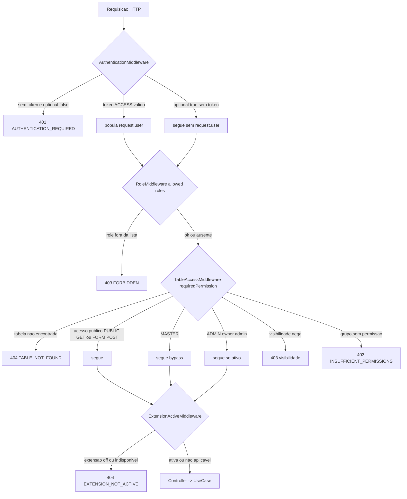

# 04 — API REST

> **Fonte:** código-fonte do backend LowCodeJS (branch `develop`).
> **Escopo:** mapeamento **exaustivo** da superfície HTTP do backend Fastify 5 —
> convenções de resposta/erro/paginação, autenticação por cookie JWT, **todos**
> os endpoints REST agrupados por recurso (Método · Rota · Auth · Permissão ·
> Descrição), os middlewares de borda e os namespaces WebSocket. Cada afirmação
> está ancorada em `caminho/arquivo.ts:linha` ou `arquivo.ts`, lida diretamente
> dos `*.controller.ts` (decorators `@GET`/`@POST`/`@PUT`/`@PATCH`/`@DELETE`).
> Arquivos-base: `start/kernel.ts`, `application/core/controllers.ts`,
> `application/resources/**/*.controller.ts`, `backend/extensions/**/*.controller.ts`,
> `application/middlewares/*`, `application/utils/{jwt,cookies}.util.ts`,
> `application/resources/**/*.socket.ts`, `bin/server.ts`.
>
> **Números canônicos** (consistentes com `01-overview.md`): 14 models, 9 estilos
> de tabela, 4 roles, **12 permissões**, 16 tipos de campo. A superfície HTTP
> **core** soma **136 handlers** (40 GET · 27 POST · 15 PUT · 34 PATCH · 20 DELETE)
> nos `resources/**/*.controller.ts` — o número canônico **~137 endpoints**; somando
> as **7 rotas registradas por extensões** (`backend/extensions/`), são **143**
> handlers HTTP ativos no boot.

---

## 4.1 Convenções

### 4.1.1 Ausência de prefixo global

Não há prefixo global (`/api`, `/v1`) no kernel. Os controllers são carregados
por `loadControllers()` (`application/core/controllers.ts:38-58`), que varre
`application/resources/` e depois `extensions/`, e registrados via
`bootstrap` do `fastify-decorators` (`start/kernel.ts:248-250`). O path final de
cada rota é:

```
path = route do @Controller  +  url do método (@GET/@POST/…)
```

Cada `@Controller` pode declarar `route` (ex.: `@Controller({ route: 'tables' })`,
`table-base/create/create.controller.ts:11-13`) ou omiti-lo
(`@Controller()`, `users/create/create.controller.ts:13`), caso em que o `url` do
método já carrega o caminho completo (ex.: `url: '/users'`,
`users/create/create.controller.ts:22`). Por isso `users/` e `user-groups/`
misturam controllers com `route: '/users'` e controllers sem `route` (que embutem
`/users` no `url`) — ambos resolvem para o mesmo prefixo.

> **Inconsistência de estilo (não-funcional):** alguns `route` levam barra inicial
> (`route: '/menu'`) e outros não (`route: 'tables'`, `route: 'authentication'`);
> o Fastify normaliza ambos. Ver `4.3`.

### 4.1.2 Formato de resposta — sucesso

Respostas de coleção paginada seguem `{ data, meta }`
(`Paginated<Entity>` em `entity.core.ts`); respostas de item retornam a entidade
diretamente. O envelope canônico de paginação:

```json
{
  "data": [ /* ...entidades... */ ],
  "meta": { "total": 100, "page": 1, "perPage": 50, "lastPage": 2, "firstPage": 1 }
}
```

| Operação | Status | Corpo |
| --- | --- | --- |
| Create | `201` | entidade criada |
| Read (item) | `200` | entidade / objeto |
| Read (lista paginada) | `200` | `{ data, meta }` |
| Update | `200` | entidade atualizada |
| Delete / Trash / Restore | `200` | entidade, contagem ou `null` |
| Export CSV | `200` | stream `text/csv` (`Content-Disposition: attachment`) |
| Magic-link / welcome | `302` | redirect (`response.redirect(...)`) |

### 4.1.3 Formato de resposta — erro

Todo erro é normalizado pelo error handler global
(`start/kernel.ts:145-209`) no envelope `{ message, code, cause, errors? }`,
**sempre com mensagens em PT-BR**:

```json
{ "message": "Tabela não encontrada", "code": 404, "cause": "TABLE_NOT_FOUND",
  "errors": { "campo": "mensagem" } }
```

| Campo | Descrição | Evidência |
| --- | --- | --- |
| `message` | mensagem legível em PT-BR | `exception.core.ts` (HTTPException) |
| `code` | HTTP status numérico | `start/kernel.ts:147` |
| `cause` | código de erro string (ex.: `AUTHENTICATION_REQUIRED`, `TABLE_NOT_FOUND`) | `exception.core.ts` |
| `errors?` | mapa `campo → mensagem` (erros de validação por campo) | `start/kernel.ts:151,161-167` |

O handler distingue 4 caminhos (`start/kernel.ts`):

1. **`HTTPException`** — retorna direto `code/cause/message/errors` (`:146-153`).
2. **`ZodError`** — flatten para `errors` por campo; `400 INVALID_PAYLOAD_FORMAT` (`:155-175`).
3. **`FST_ERR_VALIDATION`** (AJV) — flatten dos erros de schema; status do AJV (`:177-200`).
4. **Fallback** — `500 SERVER_ERROR` "Erro interno do servidor" (`:202-208`).

O AJV roda com `allErrors: true` + plugin `ajv-errors` (`start/kernel.ts:66-74`),
retornando **todos** os erros de validação, não apenas o primeiro.

### 4.1.4 Paginação

O contrato de query de paginação é definido pelos validators Zod
(`*.paginated/*.validator.ts`). Exemplo canônico — usuários
(`users/paginated/paginated.validator.ts:11-47`):

| Parâmetro (query) | Tipo | Default | Limite | Evidência |
| --- | --- | --- | --- | --- |
| `page` | number (coerce) | `1` | min 1 | `:12-15` |
| `perPage` | number (coerce) | `50` | min 1, **max 100** | `:16-20` |
| `search` | string (trim) | — | opcional | `:21` |
| `trashed` | `'true'`/`'false'` → boolean | ativos | opcional | `:24-32` |
| `order-<campo>` | `asc`/`desc` | — | opcional | `:42-46` |

O use-case calcula `meta` = `{ total, perPage, page, lastPage, firstPage }`;
`firstPage` é `0` quando não há registros, `1` caso contrário
(`users/paginated/CLAUDE.md`). O `perPage` global default vem de
`Setting.PAGINATION_PER_PAGE` (configurável pela UI `/settings`); a busca usa
`buildQuery(search, fields)` e a ordenação `buildOrder(sort)`
(`core/util.core.ts`).

### 4.1.5 OpenAPI / Swagger + Scalar

A documentação interativa é gerada pelo `@fastify/swagger` (OpenAPI 3) e
servida pelo `@scalar/fastify-api-reference` (`start/kernel.ts:211-242`):

| Recurso | Rota | Evidência |
| --- | --- | --- |
| UI Scalar (referência da API) | `GET /documentation` | `start/kernel.ts:236-242` (`routePrefix: '/documentation'`) |
| Spec OpenAPI (JSON) | `GET /openapi.json` | `start/kernel.ts:257-259` |
| Welcome (redireciona p/ docs) | `GET /` (raiz) → 302 `/documentation` | `welcome.controller.ts:6-45` |

O spec declara `securitySchemes.cookieAuth` (apiKey em cookie `accessToken`)
(`start/kernel.ts:224-232`). Cada operação descreve `schema` (description,
tags, summary, response) via arquivos `*.schema.ts` por operação.

---

## 4.2 Autenticação & cookies

### 4.2.1 Tokens JWT

JWT **RS256** com chaves base64 (`JWT_PUBLIC_KEY`/`JWT_PRIVATE_KEY`), registrado
em `start/kernel.ts:123-134`. Dois tokens (`utils/jwt.util.ts`,
`utils/CLAUDE.md`):

| Token | Expiração | Payload | Tipo |
| --- | --- | --- | --- |
| `accessToken` | **24h** | `{ sub, email, role, type: ACCESS }` | `E_JWT_TYPE.ACCESS` |
| `refreshToken` | **7d** | `{ sub, type: REFRESH }` | `E_JWT_TYPE.REFRESH` |

### 4.2.2 Cookies httpOnly

`setCookieTokens` / `clearCookieTokens` (`utils/cookies.util.ts:7-44`) gravam/limpam
ambos os cookies com:

| Atributo | Valor | Evidência |
| --- | --- | --- |
| `httpOnly` | `true` | `cookies.util.ts:13,31` |
| `secure` | `true` em produção | `:10,28` |
| `sameSite` | `none` (prod) / `lax` (dev) | `:11-12,29-30` |
| `path` | `/` | `:9,27` |
| `domain` | opcional `COOKIE_DOMAIN` (cross-subdomain) | `:14,32` |
| `maxAge` access | 24h | `:38` |
| `maxAge` refresh | 7d | `:42` |

O cookie é assinado com `COOKIE_SECRET` (`@fastify/cookie`,
`start/kernel.ts:117-119`).

### 4.2.3 Extração e validação (`AuthenticationMiddleware`)

`authentication.middleware.ts:25-71`: extrai o `accessToken` do header `Cookie`
(último valor, `extractLastCookieValue` `:10-23`) ou de `request.cookies`; decodifica
com `request.server.jwt.decode`; exige `type === ACCESS` (rejeita REFRESH em rotas
normais, `:45-54`). Em falha, lança `401 AUTHENTICATION_REQUIRED` — **exceto** quando
`optional: true`, caso em que segue sem `request.user`.

### 4.2.4 Endpoints de autenticação (`/authentication`)

Todos sob `@Controller({ route: 'authentication' })`
(`authentication/*/​*.controller.ts`):

| Método | Rota | Auth | Descrição | Evidência |
| --- | --- | --- | --- | --- |
| `POST` | `/authentication/sign-in` | Não | Login email+senha; seta cookies JWT | `sign-in/sign-in.controller.ts:23-24` |
| `POST` | `/authentication/sign-up` | Não | Registro de novo usuário | `sign-up/sign-up.controller.ts:18-19` |
| `POST` | `/authentication/sign-out` | **Sim** (`optional:false`) | Logout; limpa cookies | `sign-out/sign-out.controller.ts:13-18` |
| `GET` | `/authentication/magic-link` | Não | Autentica via código na query; seta cookies; **302** p/ `APP_CLIENT_URL/dashboard` | `magic-link/magic-link.controller.ts:23-52` |
| `POST` | `/authentication/refresh-token` | Opcional (`optional:true`) | Renova par de tokens JWT | `refresh-token/refresh-token.controller.ts:23-28` |
| `POST` | `/authentication/recovery/request-code` | Não | Solicita código de recuperação (e-mail) | `request-code/request-code.controller.ts:19-20` |
| `POST` | `/authentication/recovery/validate-code` | Não | Valida código de recuperação | `validate-code/validate-code.controller.ts:25-26` |
| `PUT` | `/authentication/recovery/update-password` | **Sim** (`optional:false`) | Redefine a senha | `reset-password/reset-password.controller.ts:21-26` |

> **Notas:** `magic-link` valida token com janela de **10 min** e ativa usuário
> inativo automaticamente (`magic-link/CLAUDE.md`). `refresh-token` usa
> `optional:true` porque aceita request sem accessToken válido (ele lê o
> `refreshToken` do cookie no use-case). `sign-out` e `reset-password` exigem
> sessão ativa.

---

## 4.3 Tabela de TODOS os endpoints (por recurso)

Convenções da tabela:
- **Auth** = `AuthenticationMiddleware`: `Sim` (`optional:false`) · `Opcional`
  (`optional:true`, permite visitante) · `Não` (sem middleware de auth).
- **Permissão** = guarda adicional: `TableAccessMiddleware({ requiredPermission })`
  (uma das 12 `E_TABLE_PERMISSION`) · `RoleMiddleware([roles])` · `ExtensionActiveMiddleware`
  · `—` (nenhuma além do auth).
- Path final = `route` do `@Controller` + `url` do método (ver §4.1.1).

### 4.3.1 `authentication` — `/authentication` (8)

Detalhado em §4.2.4.

### 4.3.2 `users` — `/users` (12)

| Método | Rota | Auth | Permissão | Descrição |
| --- | --- | --- | --- | --- |
| `POST` | `/users` | Sim | — | Criar usuário (hash bcrypt, status ACTIVE) |
| `GET` | `/users/paginated` | Sim | — | Listar usuários paginados (escopo por role) |
| `GET` | `/users/exports/csv` | Sim | `RoleMiddleware [MASTER, ADMINISTRATOR]` | Exportar usuários em CSV |
| `GET` | `/users/:_id` | Sim | — | Buscar usuário por ID |
| `PATCH` | `/users/:_id` | Sim | — | Atualizar usuário |
| `PATCH` | `/users/:_id/trash` | Sim | `RoleMiddleware [MASTER, ADMINISTRATOR]` | Enviar usuário à lixeira |
| `PATCH` | `/users/:_id/restore` | Sim | `RoleMiddleware [MASTER, ADMINISTRATOR]` | Restaurar usuário da lixeira |
| `DELETE` | `/users/:_id` | Sim | `RoleMiddleware [MASTER]` | Excluir usuário (hard) |
| `PATCH` | `/users/bulk-trash` | Sim | `RoleMiddleware [MASTER, ADMINISTRATOR]` | Lixeira em lote |
| `PATCH` | `/users/bulk-restore` | Sim | `RoleMiddleware [MASTER, ADMINISTRATOR]` | Restaurar em lote |
| `DELETE` | `/users/bulk-delete` | Sim | `RoleMiddleware [MASTER]` | Excluir em lote (hard) |
| `DELETE` | `/users/empty-trash` | Sim | `RoleMiddleware [MASTER]` | Esvaziar lixeira |

Evidência: `users/{create,paginated,export-csv,show,update,send-to-trash,remove-from-trash,delete,bulk-trash,bulk-restore,bulk-delete,empty-trash}/*.controller.ts`.

### 4.3.3 `user-groups` — `/user-group` (13)

| Método | Rota | Auth | Permissão | Descrição |
| --- | --- | --- | --- | --- |
| `POST` | `/user-group` | Sim | — | Criar grupo de usuários |
| `GET` | `/user-group` | Sim | — | Listar grupos (sem paginação) |
| `GET` | `/user-group/paginated` | Sim | — | Listar grupos paginados |
| `GET` | `/user-group/exports/csv` | Sim | `RoleMiddleware [MASTER, ADMINISTRATOR]` | Exportar grupos em CSV |
| `GET` | `/user-group/:_id` | Sim | — | Buscar grupo por ID |
| `PATCH` | `/user-group/:_id` | Sim | — | Atualizar grupo |
| `PATCH` | `/user-group/:_id/trash` | Sim | `RoleMiddleware [MASTER]` | Enviar grupo à lixeira |
| `PATCH` | `/user-group/:_id/restore` | Sim | `RoleMiddleware [MASTER]` | Restaurar grupo |
| `DELETE` | `/user-group/:_id` | Sim | `RoleMiddleware [MASTER]` | Excluir grupo (hard) |
| `PATCH` | `/user-group/bulk-trash` | Sim | `RoleMiddleware [MASTER]` | Lixeira em lote |
| `PATCH` | `/user-group/bulk-restore` | Sim | `RoleMiddleware [MASTER]` | Restaurar em lote |
| `DELETE` | `/user-group/bulk-delete` | Sim | `RoleMiddleware [MASTER]` | Excluir em lote (hard) |
| `DELETE` | `/user-group/empty-trash` | Sim | `RoleMiddleware [MASTER]` | Esvaziar lixeira |

Evidência: `user-groups/{create,list,paginated,export-csv,show,update,send-to-trash,remove-from-trash,delete,bulk-trash,bulk-restore,bulk-delete,empty-trash}/*.controller.ts`.

### 4.3.4 `table-base` — `/tables` (12)

| Método | Rota | Auth | Permissão | Descrição |
| --- | --- | --- | --- | --- |
| `POST` | `/tables` | Sim | `TableAccess CREATE_TABLE` | Criar tabela (injeta 5 campos nativos) |
| `POST` | `/tables/schema-import` | Sim | `TableAccess CREATE_TABLE` | Importar tabela a partir de schema |
| `GET` | `/tables/paginated` | Sim | — *(sem TableAccess; sem slug)* | Listar tabelas paginadas |
| `GET` | `/tables/exports/csv` | Sim | `RoleMiddleware [MASTER, ADMINISTRATOR]` | Exportar tabelas em CSV |
| `GET` | `/tables/:slug` | **Opcional** | `TableAccess VIEW_TABLE` | Buscar tabela por slug (respeita visibilidade) |
| `PUT` | `/tables/:slug` | Sim | `TableAccess UPDATE_TABLE` | Atualizar tabela |
| `DELETE` | `/tables/:slug` | Sim | `TableAccess REMOVE_TABLE` | Excluir tabela (drop collection) |
| `PATCH` | `/tables/:slug/trash` | Sim | `TableAccess UPDATE_TABLE` | Enviar tabela à lixeira |
| `PATCH` | `/tables/:slug/restore` | Sim | `TableAccess UPDATE_TABLE` | Restaurar tabela |
| `PATCH` | `/tables/bulk-trash` | Sim | `TableAccess REMOVE_TABLE` | Lixeira em lote |
| `PATCH` | `/tables/bulk-restore` | Sim | `TableAccess UPDATE_TABLE` | Restaurar em lote |
| `DELETE` | `/tables/empty-trash` | Sim | `TableAccess REMOVE_TABLE` | Esvaziar lixeira de tabelas |

Evidência: `table-base/{create,schema-import,paginated,export-csv,show,update,delete,send-to-trash,remove-from-trash,bulk-trash,bulk-restore,empty-trash}/*.controller.ts`. O `show` usa `optional:true` (`table-base/show/show.controller.ts:26-30`).

### 4.3.5 `table-fields` — `/tables/:slug/fields` (9)

| Método | Rota | Auth | Permissão | Descrição |
| --- | --- | --- | --- | --- |
| `POST` | `/tables/:slug/fields` | Sim | `TableAccess CREATE_FIELD` | Criar campo |
| `POST` | `/tables/:slug/fields/suggest-slug` | Sim | `TableAccess CREATE_FIELD` | Sugerir slug único de campo |
| `GET` | `/tables/:slug/fields/:_id` | Sim | `TableAccess VIEW_FIELD` | Buscar campo |
| `PUT` | `/tables/:slug/fields/:_id` | Sim | `TableAccess UPDATE_FIELD` | Atualizar campo |
| `DELETE` | `/tables/:slug/fields/:_id` | Sim | `TableAccess REMOVE_FIELD` | Excluir campo |
| `PATCH` | `/tables/:slug/fields/:_id/trash` | Sim | `TableAccess UPDATE_FIELD` | Enviar campo à lixeira |
| `PATCH` | `/tables/:slug/fields/:_id/restore` | Sim | `TableAccess UPDATE_FIELD` | Restaurar campo |
| `POST` | `/tables/:slug/fields/:_id/category` | Sim | `TableAccess UPDATE_FIELD` | Adicionar categoria a campo CATEGORY |
| `DELETE` | `/tables/:slug/fields/:_id/category/:categoryId` | Sim | `TableAccess UPDATE_FIELD` | Remover categoria de campo |

Evidência: `table-fields/{create,suggest-slug,show,update,delete,send-to-trash,remove-from-trash,add-category,delete-category}/*.controller.ts`.

### 4.3.6 `table-group-fields` — `/tables/:slug/groups/:groupSlug/fields` (6)

| Método | Rota | Auth | Permissão | Descrição |
| --- | --- | --- | --- | --- |
| `POST` | `/tables/:slug/groups/:groupSlug/fields` | Sim | `TableAccess CREATE_FIELD` | Criar campo no field-group |
| `GET` | `/tables/:slug/groups/:groupSlug/fields` | Sim | `TableAccess VIEW_FIELD` | Listar campos do group |
| `GET` | `/tables/:slug/groups/:groupSlug/fields/:fieldId` | Sim | `TableAccess VIEW_FIELD` | Buscar campo do group |
| `PUT` | `/tables/:slug/groups/:groupSlug/fields/:fieldId` | Sim | `TableAccess UPDATE_FIELD` | Atualizar campo do group |
| `POST` | `/tables/:slug/groups/:groupSlug/fields/:fieldId/send-to-trash` | Sim | `TableAccess UPDATE_FIELD` | Enviar campo do group à lixeira |
| `PATCH` | `/tables/:slug/groups/:groupSlug/fields/:fieldId/restore` | Sim | `TableAccess UPDATE_FIELD` | Restaurar campo do group |

Evidência: `table-group-fields/{create,list,show,update,send-to-trash,remove-from-trash}/*.controller.ts`.

### 4.3.7 `table-rows` — `/tables/:slug/rows` (21)

| Método | Rota | Auth | Permissão | Descrição |
| --- | --- | --- | --- | --- |
| `POST` | `/tables/:slug/rows` | **Opcional** | `TableAccess CREATE_ROW` | Criar registro (form público p/ visibilidade FORM/OPEN) |
| `PATCH` | `/tables/:slug/rows/auto-save` | Sim | `TableAccess CREATE_ROW` | Auto-save de rascunho de registro |
| `GET` | `/tables/:slug/rows/paginated` | **Opcional** | `TableAccess VIEW_ROW` | Listar registros paginados |
| `GET` | `/tables/:slug/rows/exports/csv` | Sim | `RoleMiddleware [MASTER, ADMINISTRATOR]` + `TableAccess VIEW_ROW` | Exportar registros em CSV (colunas dinâmicas) |
| `GET` | `/tables/:slug/rows/imports/csv/template` | Sim | `RoleMiddleware [MASTER, ADMINISTRATOR]` | Baixar template CSV de importação |
| `POST` | `/tables/:slug/rows/imports/csv` | Sim | `RoleMiddleware [MASTER, ADMINISTRATOR]` + `TableAccess CREATE_ROW` | Importar registros via CSV (assíncrono, WebSocket) |
| `GET` | `/tables/:slug/rows/:_id` | **Opcional** | `TableAccess VIEW_ROW` | Buscar registro |
| `PUT` | `/tables/:slug/rows/:_id` | Sim | `TableAccess UPDATE_ROW` | Atualizar registro |
| `DELETE` | `/tables/:slug/rows/:_id` | Sim | `TableAccess REMOVE_ROW` | Excluir registro (hard) |
| `PATCH` | `/tables/:slug/rows/:_id/trash` | Sim | `TableAccess UPDATE_ROW` | Enviar registro à lixeira |
| `PATCH` | `/tables/:slug/rows/:_id/restore` | Sim | `TableAccess UPDATE_ROW` | Restaurar registro |
| `PATCH` | `/tables/:slug/rows/bulk-trash` | Sim | `TableAccess UPDATE_ROW` | Lixeira em lote |
| `PATCH` | `/tables/:slug/rows/bulk-restore` | Sim | `TableAccess UPDATE_ROW` | Restaurar em lote |
| `DELETE` | `/tables/:slug/rows/bulk-delete` | Sim | `TableAccess REMOVE_ROW` | Excluir em lote (hard) |
| `DELETE` | `/tables/:slug/rows/empty-trash` | Sim | `TableAccess REMOVE_ROW` | Esvaziar lixeira de registros |
| `POST` | `/tables/:slug/rows/:_id/reaction` | Sim | `TableAccess UPDATE_ROW` | Reagir ao registro (LIKE/UNLIKE) |
| `POST` | `/tables/:slug/rows/:_id/evaluation` | Sim | `TableAccess UPDATE_ROW` | Avaliar registro (rating) |
| `POST` | `/tables/:slug/rows/:_id/forum/messages` | Sim | `TableAccess VIEW_ROW` | Criar mensagem no fórum do registro |
| `PUT` | `/tables/:slug/rows/:_id/forum/messages/:messageId` | Sim | `TableAccess VIEW_ROW` | Editar mensagem do fórum |
| `DELETE` | `/tables/:slug/rows/:_id/forum/messages/:messageId` | Sim | `TableAccess VIEW_ROW` | Excluir mensagem do fórum |
| `PUT` | `/tables/:slug/rows/:_id/forum/messages/:messageId/mention-read` | Sim | `TableAccess VIEW_ROW` | Marcar menção como lida |

> O controller `forum-message.controller.ts` registra **4** rotas (POST/PUT/DELETE/PUT mention-read)
> em um único arquivo (`forum-message/forum-message.controller.ts:38,75,112,147`). O
> `import-csv` registra 2 (`import-csv.controller.ts:30` e `import-csv.template.controller.ts:22`).
> Soma: **21** handlers em `table-rows/` (17 arquivos de 1 rota + 4 do `forum-message`).

Evidência: `table-rows/{create,auto-save,paginated,export-csv,import-csv,show,update,delete,send-to-trash,remove-from-trash,bulk-trash,bulk-restore,bulk-delete,empty-trash,reaction,evaluation,forum-message}/*.controller.ts`. `create`, `paginated` e `show` usam `optional:true`.

### 4.3.8 `table-group-rows` — `/tables/:slug/rows/:rowId/groups/:groupSlug` (8)

| Método | Rota | Auth | Permissão | Descrição |
| --- | --- | --- | --- | --- |
| `POST` | `/tables/:slug/rows/:rowId/groups/:groupSlug` | Sim | `TableAccess CREATE_ROW` | Criar item no group-row |
| `GET` | `/tables/:slug/rows/:rowId/groups/:groupSlug` | Sim | `TableAccess VIEW_ROW` | Listar itens do group |
| `GET` | `/tables/:slug/rows/:rowId/groups/:groupSlug/paginated` | Sim | `TableAccess VIEW_ROW` | Listar itens paginados |
| `GET` | `/tables/:slug/rows/:rowId/groups/:groupSlug/exports/csv` | Sim | `RoleMiddleware [MASTER, ADMINISTRATOR]` + `TableAccess VIEW_ROW` | Exportar itens do group em CSV |
| `GET` | `/tables/:slug/rows/:rowId/groups/:groupSlug/:itemId` | Sim | `TableAccess VIEW_ROW` | Buscar item do group |
| `PATCH` | `/tables/:slug/rows/:rowId/groups/:groupSlug/:itemId` | Sim | `TableAccess UPDATE_ROW` | Atualizar item do group |
| `PATCH` | `/tables/:slug/rows/:rowId/groups/:groupSlug/auto-save` | Sim | `TableAccess UPDATE_ROW` | Auto-save de item do group |
| `DELETE` | `/tables/:slug/rows/:rowId/groups/:groupSlug/:itemId` | Sim | `TableAccess REMOVE_ROW` | Excluir item do group |

Evidência: `table-group-rows/{create,list,paginated,export-csv,show,update,auto-save,delete}/*.controller.ts`.

### 4.3.9 `menu` — `/menu` (14)

| Método | Rota | Auth | Permissão | Descrição |
| --- | --- | --- | --- | --- |
| `POST` | `/menu` | Sim | — | Criar item de menu |
| `GET` | `/menu` | Sim | — | Listar itens de menu |
| `GET` | `/menu/paginated` | Sim | — | Listar menus paginados |
| `GET` | `/menu/exports/csv` | Sim | `RoleMiddleware [MASTER, ADMINISTRATOR]` | Exportar menus em CSV |
| `GET` | `/menu/:_id` | Sim | — | Buscar item de menu |
| `PATCH` | `/menu/:_id` | Sim | — | Atualizar item de menu |
| `PATCH` | `/menu/reorder` | Sim | — | Reordenar itens de menu |
| `PATCH` | `/menu/:_id/trash` | Sim | — | Enviar menu à lixeira |
| `PATCH` | `/menu/:_id/restore` | Sim | — | Restaurar menu |
| `DELETE` | `/menu/:_id` | Sim | — | Excluir menu (hard) |
| `PATCH` | `/menu/bulk-trash` | Sim | `RoleMiddleware [MASTER, ADMINISTRATOR]` | Lixeira em lote |
| `PATCH` | `/menu/bulk-restore` | Sim | `RoleMiddleware [MASTER, ADMINISTRATOR]` | Restaurar em lote |
| `DELETE` | `/menu/bulk-delete` | Sim | `RoleMiddleware [MASTER]` | Excluir em lote (hard) |
| `DELETE` | `/menu/empty-trash` | Sim | `RoleMiddleware [MASTER]` | Esvaziar lixeira |

> `create`, `update` e `reorder` usam `@Controller()` sem `route`, embutindo
> `/menu` no `url` (`menu/create/create.controller.ts:19`, `update:22`, `reorder:19`).
> Demais usam `@Controller({ route: '/menu' })`.

### 4.3.10 `pages` — `/pages` (1)

| Método | Rota | Auth | Permissão | Descrição |
| --- | --- | --- | --- | --- |
| `GET` | `/pages/:slug` | Sim | — | Renderiza página (Menu type=PAGE) por slug |

Evidência: `pages/show/show.controller.ts:21-26`.

### 4.3.11 `permissions` — `/permissions` (1)

| Método | Rota | Auth | Permissão | Descrição |
| --- | --- | --- | --- | --- |
| `GET` | `/permissions` | Sim | — | Listar as 12 permissões (`E_TABLE_PERMISSION`) |

Evidência: `permissions/list/list.controller.ts:20-25`.

### 4.3.12 `profile` — `/profile` (2)

| Método | Rota | Auth | Permissão | Descrição |
| --- | --- | --- | --- | --- |
| `GET` | `/profile` | Sim | — | Dados do usuário autenticado |
| `PUT` | `/profile` | Sim | — | Atualizar perfil próprio |

Evidência: `profile/{show,update}/*.controller.ts`.

### 4.3.13 `setting` — `/setting` (3)

| Método | Rota | Auth | Permissão | Descrição |
| --- | --- | --- | --- | --- |
| `GET` | `/setting` | Sim | — | Ler Setting singleton (completo) |
| `GET` | `/setting/public` | **Não** | — | Subset público p/ SSR (8 campos seguros) |
| `PUT` | `/setting` | Sim | — | Atualizar Setting singleton |

> `/setting/public` é **público** (sem `AuthenticationMiddleware`) — expõe apenas
> `SYSTEM_NAME`, `SYSTEM_DESCRIPTION`, logos, `AI_ASSISTANT_ENABLED`,
> `CHAT_HISTORY_ENABLED`, `SETUP_COMPLETED`, `SETUP_CURRENT_STEP`
> (`setting/public/public.controller.ts:18-22`; `setting/public/CLAUDE.md`). **Não**
> expõe `STORAGE_*`, `EMAIL_PROVIDER_*`, `OPENAI_API_KEY`.

### 4.3.14 `setup` — `/setup` (Setup Wizard) (8)

| Método | Rota | Auth | Permissão | Descrição |
| --- | --- | --- | --- | --- |
| `GET` | `/setup/status` | Não | — | Estado do wizard (etapa atual / concluído) |
| `POST` | `/setup/step/admin` | Não | — | Cria o usuário MASTER inicial |
| `PUT` | `/setup/step/name` | Sim | `RoleMiddleware [MASTER]` | Define nome/descrição do sistema |
| `PUT` | `/setup/step/logos` | Sim | `RoleMiddleware [MASTER]` | Define logos |
| `PUT` | `/setup/step/upload` | Sim | `RoleMiddleware [MASTER]` | Define limites de upload |
| `PUT` | `/setup/step/paging` | Sim | `RoleMiddleware [MASTER]` | Define paginação padrão |
| `PUT` | `/setup/step/storage` | Sim | `RoleMiddleware [MASTER]` | Define driver de storage (local/S3) |
| `PUT` | `/setup/step/email` | Sim | `RoleMiddleware [MASTER]` | Define SMTP |

> `/setup/status` e `/setup/step/admin` são **públicos** (primeira execução, sem
> MASTER ainda). As demais etapas exigem MASTER (`setup/{name,logos,upload,paging,storage,email}/submit.controller.ts`).

### 4.3.15 `storage` — `/storage` (2)

| Método | Rota | Auth | Permissão | Descrição |
| --- | --- | --- | --- | --- |
| `POST` | `/storage` | Sim | — | Upload de arquivo (imagens → WebP via Sharp) |
| `DELETE` | `/storage/:_id` | Sim | — | Remover arquivo |

Evidência: `storage/{upload,delete}/*.controller.ts`. O servidor de arquivos
estáticos (`/storage/<file>`) é tratado fora dos controllers (hook
`StorageContentDispositionHook`, `start/kernel.ts:143`; dual-read fallback do kernel).

### 4.3.16 `storage-migration` — `/storage/migration` (3)

| Método | Rota | Auth | Permissão | Descrição |
| --- | --- | --- | --- | --- |
| `GET` | `/storage/migration/status` | Sim | `RoleMiddleware [MASTER]` | Contagens por driver/status, job ativo, `can_cleanup` |
| `POST` | `/storage/migration/start` | Sim | `RoleMiddleware [MASTER]` | Enfileira job de migração (BullMQ) |
| `POST` | `/storage/migration/cleanup` | Sim | `RoleMiddleware [MASTER]` | Apaga arquivos do driver antigo (`{confirm:true}`) |

Evidência: `storage-migration/{status,start,cleanup}/*.controller.ts`. Progresso
em tempo real via WebSocket `/storage-migration` (§4.5).

### 4.3.17 `notifications` — `/notifications` (5)

| Método | Rota | Auth | Permissão | Descrição |
| --- | --- | --- | --- | --- |
| `GET` | `/notifications/paginated` | Sim | — | Feed paginado de notificações do usuário |
| `GET` | `/notifications/unread-count` | Sim | — | Contagem de não lidas |
| `PATCH` | `/notifications/:_id/read` | Sim | — | Marcar uma como lida |
| `PATCH` | `/notifications/read-all` | Sim | — | Marcar todas como lidas |
| `DELETE` | `/notifications/:_id` | Sim | — | Excluir notificação |

Evidência: `notifications/{paginated,unread-count,mark-as-read,mark-all-as-read,delete}/*.controller.ts`. Entrega em tempo real via WebSocket `/notifications` (§4.5).

### 4.3.18 `logs` — `/logs` (1)

| Método | Rota | Auth | Permissão | Descrição |
| --- | --- | --- | --- | --- |
| `GET` | `/logs/paginated` | Sim | — | Auditoria paginada (`Logger`, append-only) |

Evidência: `logs/paginated/paginated.controller.ts:21-26`.

### 4.3.19 `extensions` — `/extensions` (4)

| Método | Rota | Auth | Permissão | Descrição |
| --- | --- | --- | --- | --- |
| `GET` | `/extensions` | Sim | `RoleMiddleware [MASTER, ADMINISTRATOR]` | Listar extensões (plugins/módulos/tools) |
| `GET` | `/extensions/active` | Sim | — | Listar extensões ativas (p/ a UI) |
| `PATCH` | `/extensions/:_id/toggle` | Sim | `RoleMiddleware [MASTER, ADMINISTRATOR]` | Habilitar/desabilitar extensão |
| `PATCH` | `/extensions/:_id/table-scope` | Sim | `RoleMiddleware [MASTER, ADMINISTRATOR]` | Configurar escopo de tabelas da extensão |

Evidência: `extensions/{list,active,toggle,configure-table-scope}/*.controller.ts`.

### 4.3.20 `chat` — `/chat` (1, HTTP)

| Método | Rota | Auth | Permissão | Descrição |
| --- | --- | --- | --- | --- |
| `POST` | `/chat/upload` | Sim | — | Upload de anexo (imagem → data URI; PDF → texto via pdf-parse) |

Evidência: `chat/chat.upload.controller.ts:25-28`. O assistente IA em si é
**WebSocket** (`/chat`, §4.5).

### 4.3.21 Avulsos (sem recurso) (2)

| Método | Rota | Auth | Permissão | Descrição |
| --- | --- | --- | --- | --- |
| `GET` | `/health-check` | Não | — | Health check `{ status: 'ok', timestamp }` |
| `GET` | `/` | Não | — | Welcome — **302** redirect p/ `/documentation` |

Evidência: `health-check.controller.ts:6-7`; `welcome.controller.ts:6-7`. Além
destes, o kernel expõe `GET /openapi.json` (`start/kernel.ts:257`) e `GET /documentation`
(Scalar, `:236`) — ver §4.1.5.

### 4.3.22 Extensões (rotas registradas por `backend/extensions/`) (7)

Estas rotas vivem em controllers de **extensões** carregados após os core
(`controllers.ts:47-51`) e são blindadas por `ExtensionActiveMiddleware` (404 se
desativada). Respondem nos mesmos paths legados de `/tools/...`.

| Método | Rota | Auth | Permissão | Extensão (`pkg/type/id`) |
| --- | --- | --- | --- | --- |
| `POST` | `/tools/clone-table` | Sim | `ExtensionActive` | `core` · TOOL · `clone-table` |
| `POST` | `/tools/export-table` | Sim | `ExtensionActive` | `core` · TOOL · `tables-import-export` |
| `POST` | `/tools/import-table` | Sim | `ExtensionActive` | `core` · TOOL · `tables-import-export` |
| `GET` | `/tools/doc-transcription/config` | Sim | `RoleMiddleware [MASTER, ADMINISTRATOR]` + `ExtensionActive` | `core` · TOOL · `doc-transcription` |
| `PATCH` | `/tools/doc-transcription/config` | Sim | `RoleMiddleware [MASTER, ADMINISTRATOR]` + `ExtensionActive` | `core` · TOOL · `doc-transcription` |
| `POST` | `/tools/doc-transcription/transcribe` | Sim | `RoleMiddleware [MASTER, ADMINISTRATOR]` + `ExtensionActive` | `core` · TOOL · `doc-transcription` |
| `GET` | `/e/apps/dashboard/stats` | Sim | `RoleMiddleware [MASTER, ADMINISTRATOR]` + `ExtensionActive` | `apps` · MODULE · `dashboard` |

Evidência: `extensions/core/tools/{clone-table,tables-import-export,doc-transcription}/*.controller.ts`; `extensions/apps/modules/dashboard/dashboard-stats.controller.ts`.

### 4.3.23 Totais

| Recurso | Handlers |
| --- | ---: |
| authentication | 8 |
| users | 12 |
| user-groups | 13 |
| table-base | 12 |
| table-fields | 9 |
| table-group-fields | 6 |
| table-rows | 21 |
| table-group-rows | 8 |
| menu | 14 |
| pages | 1 |
| permissions | 1 |
| profile | 2 |
| setting | 3 |
| setup | 8 |
| storage | 2 |
| storage-migration | 3 |
| notifications | 5 |
| logs | 1 |
| extensions | 4 |
| chat (HTTP) | 1 |
| avulsos (health-check, welcome) | 2 |
| **Subtotal core** | **136** |
| extensões (`/tools`, `/e/apps`) | 7 |
| **Total HTTP** | **143** |

> Os ~137 endpoints canônicos referem-se à superfície **core**; 136 é o valor
> exato medido (40 GET · 27 POST · 15 PUT · 34 PATCH · 20 DELETE) — pequena
> variação por desdobramento de rotas multi-handler num mesmo arquivo
> (`forum-message`, `import-csv`).

---

## 4.4 Middlewares

Quatro middlewares Fastify aplicados via `onRequest` nos controllers
(`application/middlewares/`). A ordem importa: `Authentication` →
`Role`/`TableAccess`/`ExtensionActive`.



> Diagrama também em `docs/_assets/04-middlewares-pipeline.mmd`.

### 4.4.1 `AuthenticationMiddleware({ optional })`

`authentication.middleware.ts:25-71`. Extrai `accessToken` (cookie → fallback
`request.cookies`), decodifica, exige `type === ACCESS`, popula `request.user`
(`sub`, `email`, `role`, `type`). Com `optional:true`, segue sem `request.user`
(usado em rotas de visitante: `GET /tables/:slug`, `POST/GET /tables/:slug/rows`,
`GET /authentication/magic-link`). Sem token e `optional:false` → `401
AUTHENTICATION_REQUIRED`.

### 4.4.2 `TableAccessMiddleware({ requiredPermission })` — RBAC + visibilidade

`table-access.middleware.ts:31-103` delega ao `PermissionService`
(`services/permission/permission.service.ts`). Fluxo:

1. Valida `slug` (params) e, exceto para `CREATE_TABLE`, busca a tabela
   (`404 TABLE_NOT_FOUND` se ausente); popula `request.table` (`:43-70`).
2. Carrega o `User` autenticado (com `group.permissions`) (`:72-80`).
3. **`isPublicAccess`** (`permission.service.ts:78-101`): libera visitante quando
   `PUBLIC` + `GET` + permissão de VIEW, ou `FORM` + `POST` + `CREATE_ROW`.
4. **`checkTableAccess`** (`:103-165`): ordem de decisão —
   - `MASTER` → acesso total (bypass) (`:114-116`);
   - `ADMINISTRATOR` → total se ativo (`:119-122`);
   - `CREATE_TABLE` → só checa permissão de grupo (`:125-128`);
   - owner/administrator da tabela → total se ativo (`:138-148`);
   - ações **owner-only** (`UPDATE/REMOVE` de FIELD/TABLE/ROW) negadas a
     não-owner (`403 OWNER_OR_ADMIN_REQUIRED`, `:151-156`);
   - aplica `checkVisibilityRules` + permissão de grupo (`:158-164`).

Regras de visibilidade (`checkVisibilityRules`, `:167-197`):

| Visibilidade | Restrição para não-owner |
| --- | --- |
| `PRIVATE` | Bloqueia tudo (`403 TABLE_PRIVATE`) |
| `RESTRICTED` | Bloqueia `CREATE_ROW` (`403 RESTRICTED_CREATE`); VIEW liberado |
| `FORM` | Bloqueia VIEW (`403 FORM_VIEW_RESTRICTED`); só owner/admin visualiza |
| `OPEN` / `PUBLIC` | Sem restrição adicional |

### 4.4.3 `RoleMiddleware([roles])` — guarda por papel

`role.middleware.ts:8-26`. Exige `request.user` (`401` se ausente) e
`request.user.role ∈ allowedRoles` (`403 FORBIDDEN` caso contrário). Usos típicos:
`[MASTER]` (setup/steps, hard-deletes, storage-migration, empty/bulk-delete),
`[MASTER, ADMINISTRATOR]` (exports CSV, extensões, dashboard, doc-transcription,
import CSV).

### 4.4.4 `ExtensionActiveMiddleware({ pkg, type, extensionId })`

`extension-active.middleware.ts:23-42`. Consulta o `ExtensionRepository.findByKey`
e exige `extension.enabled && extension.available`; caso contrário,
`404 EXTENSION_NOT_ACTIVE`. Blinda as rotas de extensões mesmo se a flag for
desligada em runtime (ver §4.3.22).

---

## 4.5 WebSocket (Socket.IO)

O servidor WebSocket compartilha o mesmo HTTP server e o **mesmo JWT RS256** do
HTTP. É inicializado em `bin/server.ts:90-125`: `initChatSocket(httpServer,
jwtDecode)` cria o `io`, e os demais namespaces são registrados sobre ele
(`io.of('/namespace')`). A autenticação ocorre no **handshake** lendo o cookie
`accessToken` e validando `type === ACCESS`.

São **4 namespaces** (a CLAUDE.md e o overview citam 3 — `/chat`, `/notifications`,
`/storage-migration`; o quarto, `/csv-import`, foi adicionado para a importação
assíncrona de registros):

| Namespace | Auth (handshake) | Restrição de papel | Eventos (server → client) | Evidência |
| --- | --- | --- | --- | --- |
| `/chat` | cookie `accessToken` | — | `status`, `ready`, `thinking`, `tool_call`, `tool_result`, `tool_error`, `message`, `error`, `history` (`E_CHAT_EVENT`) | `chat/chat.socket.ts:225-524`; `entity.core.ts:133-143` |
| `/notifications` | cookie `accessToken` | — (room `user:<sub>`) | `notification:created`, `notification:read`, `notification:read_all` (`E_NOTIFICATION_EVENT`) | `notifications/notifications.socket.ts:18,41-77`; `entity.core.ts:152-156` |
| `/storage-migration` | cookie `accessToken` | **MASTER apenas** | `progress`, `file_migrated`, `file_failed`, `completed`, `error` | `storage-migration/storage-migration.socket.ts:25-128` |
| `/csv-import` | cookie `accessToken` | **MASTER, ADMINISTRATOR** | `progress`, `completed`, `error` (room `job:<jobId>`; replay terminal por 10 min) | `table-rows/import-csv/import-csv.socket.ts:30-144` |

### 4.5.1 `/chat` — assistente IA (MCP + OpenAI)

`chat/chat.socket.ts`. Cliente conecta com o cookie `accessToken`; em falha emite
`error` (`:225-235`). Pré-condições: `Setting.AI_ASSISTANT_ENABLED = true` e
`OPENAI_API_KEY` definido (lidos do `Setting` a cada conexão, sem `process.env`).
Fluxo: emite `status` → `history` (inicial) → `ready`; ao receber `message` do
cliente, descobre tools do MCP server (opcional, `MCP_SERVER_URL`), converte para
tool definitions OpenAI e emite `thinking` → `tool_call`/`tool_result`/`tool_error`*
→ `message`. Anexos chegam via `POST /chat/upload` (§4.3.20). Ações de IA são
auditadas no `Logger` (`AI_CALL` / `AI_RESPONSE`).

### 4.5.2 `/notifications` — feed em tempo real

`notifications/notifications.socket.ts:41-77`. Cada socket autenticado entra na
room `user:<sub>` (`:66-68`); o `NotificationService` emite `notification:created`
ao destinatário, além de `notification:read` / `notification:read_all` quando o
usuário marca leitura via HTTP (§4.3.17).

### 4.5.3 `/storage-migration` — progresso de migração de storage

`storage-migration/storage-migration.socket.ts:92-114`. Handshake admite **somente
MASTER** (`:107-110`). O worker BullMQ (`startStorageMigrationWorker`,
`bin/server.ts:110-114`) emite `progress`/`file_migrated`/`file_failed`/`completed`/`error`
conforme processa os arquivos (driver local ↔ S3). Inicia via `POST
/storage/migration/start` (§4.3.16).

### 4.5.4 `/csv-import` — progresso de importação de registros

`table-rows/import-csv/import-csv.socket.ts:81-144`. Admite **MASTER e
ADMINISTRATOR** (`:103-109`); o cliente emite `join <jobId>` após conectar
(`:116-128`) para entrar na room `job:<jobId>`. O evento terminal
(`completed`/`error`) é armazenado em memória por **10 minutos** e re-emitido a
quem se conecta tarde (`:57-64,116-141`). Disparado por `POST
/tables/:slug/rows/imports/csv` (§4.3.7).

---

### Diagramas (assets)

O bloco `mermaid` desta página tem cópia `.mmd` (sem cerca markdown) em
`docs/_assets/`:

- `04-middlewares-pipeline.mmd` — pipeline de middlewares (§4.4)
