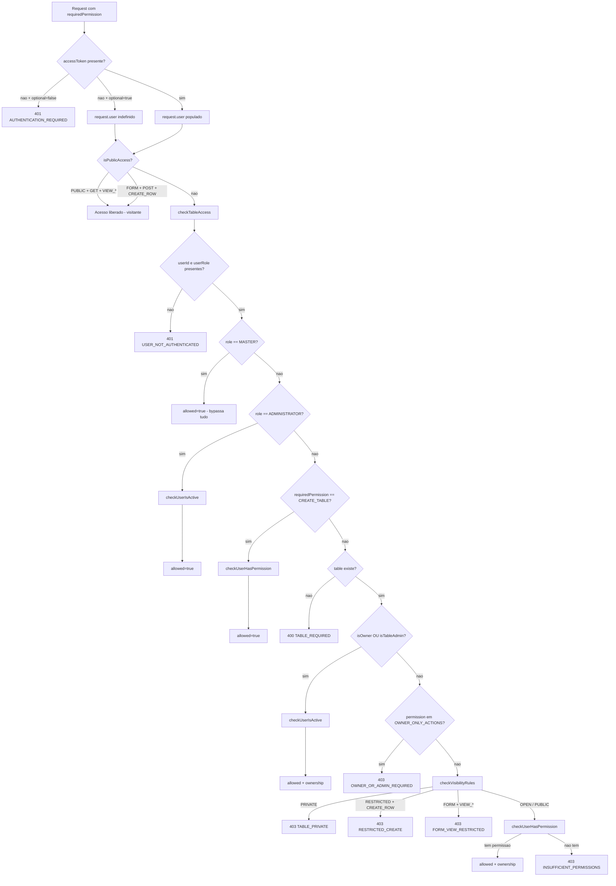
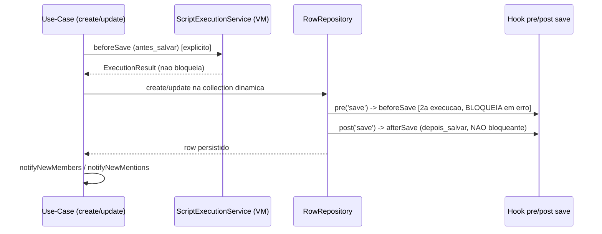

# 05 — Regras de Negócio

> **Fonte:** código-fonte do backend LowCodeJS (`backend/application/`), branch
> **`develop`**. Cada afirmação cita o arquivo/linha de origem no formato
> `caminho.ts:linha`. Onde uma regra documentada externamente não se confirma no
> código, o texto sinaliza explicitamente. Itens não decidíveis pelo código são
> marcados **Não determinável pelo código**.
>
> **Escopo:** RBAC e matriz de permissões, visibilidade × colaboração de tabela,
> estilos de tabela e comportamentos derivados, schema dinâmico e validação de
> registros, sandbox de scripts, soft-delete/lixeira, notificações, extensões e
> setup wizard.

---

## 1. RBAC — Controle de Acesso Baseado em Papéis

### 1.1 Os 4 papéis (E_ROLE)

Definidos em `backend/application/core/entity.core.ts:82-87`. Hierarquia
conceitual: **MASTER > ADMINISTRATOR > MANAGER > REGISTERED**.

| Papel | Slug | Descrição (seed) | Evidência |
| --- | --- | --- | --- |
| Master | `MASTER` | Acesso total ao sistema — gerencia tudo, incluindo configurações | `1720448445-user-group.seed.ts:16-21` |
| Administrator | `ADMINISTRATOR` | Gerenciamento total de tabelas (todas as tabelas, campos e registros) | `…seed.ts:22-27` |
| Manager | `MANAGER` | Cria suas próprias tabelas; gerencia onde é owner/admin; vê e cria registros em tabelas acessíveis | `…seed.ts:28-33` |
| Registered | `REGISTERED` | Vê tabelas e cria registros (respeitando visibilidade); gerencia apenas onde é administrador da tabela | `…seed.ts:34-39` |

O papel viaja no JWT (`role` no `accessToken`) e é populado em `request.user.role`
pelo `AuthenticationMiddleware` (`authentication.middleware.ts:56-61`).

### 1.2 As 12 permissões atômicas (E_TABLE_PERMISSION)

Definidas em `entity.core.ts` (enum `E_TABLE_PERMISSION`) e semeadas em
`1720448435-permissions.seed.ts:15-77`. São o produto cartesiano de
**4 verbos × 3 objetos**:

| Verbo \ Objeto | TABLE | FIELD | ROW |
| --- | --- | --- | --- |
| **CREATE** | `CREATE_TABLE` | `CREATE_FIELD` | `CREATE_ROW` |
| **UPDATE** | `UPDATE_TABLE` | `UPDATE_FIELD` | `UPDATE_ROW` |
| **REMOVE** | `REMOVE_TABLE` | `REMOVE_FIELD` | `REMOVE_ROW` |
| **VIEW** | `VIEW_TABLE` | `VIEW_FIELD` | `VIEW_ROW` |

As permissões são documentos (`permissions`) referenciados por
`UserGroup.permissions` (`user-group.model.ts`). Um usuário "tem" a permissão se
o slug está em `user.group.permissions[*].slug`
(`permission.service.ts:57-59`).

### 1.3 Matriz papel × permissão (semeada)

Atribuição inicial em `1720448445-user-group.seed.ts:42-85`. MASTER e
ADMINISTRATOR recebem **todas** as permissões existentes
(`permissions.map((p) => p._id)`, linhas 73-74). MANAGER e REGISTERED recebem
listas fixas (linhas 42-62).

| Permissão | MASTER | ADMINISTRATOR | MANAGER | REGISTERED |
| --- | :---: | :---: | :---: | :---: |
| CREATE_TABLE | ✅ | ✅ | ✅ | ❌ |
| UPDATE_TABLE | ✅ | ✅ | ✅ | ❌ |
| REMOVE_TABLE | ✅ | ✅ | ✅ | ❌ |
| VIEW_TABLE | ✅ | ✅ | ✅ | ✅ |
| CREATE_FIELD | ✅ | ✅ | ✅ | ❌ |
| UPDATE_FIELD | ✅ | ✅ | ✅ | ❌ |
| REMOVE_FIELD | ✅ | ✅ | ✅ | ❌ |
| VIEW_FIELD | ✅ | ✅ | ✅ | ✅ |
| CREATE_ROW | ✅ | ✅ | ✅ | ✅ |
| UPDATE_ROW | ✅ | ✅ | ✅ | ❌ |
| REMOVE_ROW | ✅ | ✅ | ✅ | ❌ |
| VIEW_ROW | ✅ | ✅ | ✅ | ✅ |

> **Importante — customização persiste:** o seeder usa `$set` apenas em
> metadados e `$setOnInsert` em `permissions` (`…seed.ts:90-95`). Após a 1ª
> criação do grupo, **alterações manuais no array de permissões NÃO são
> sobrescritas** por novos `npm run seed`. A matriz acima é o estado inicial,
> não um invariante de runtime.

### 1.4 Onde a permissão é exigida (camada de middleware)

Há dois mecanismos de gate, aplicados via `onRequest` nos controllers:

- **`RoleMiddleware([roles])`** (`role.middleware.ts`): gate puro por papel.
  Lança `401 AUTHENTICATION_REQUIRED` sem `request.user` (linha 12-17) e
  `403 FORBIDDEN` se o papel não está na lista (linha 19-24). Usado em rotas
  administrativas (ex.: `/users/:_id` DELETE → `[MASTER]`; exports CSV →
  `[MASTER, ADMINISTRATOR]`).
- **`TableAccessMiddleware({ requiredPermission })`**
  (`table-access.middleware.ts`): RBAC completo + visibilidade. Resolve a tabela
  por `:slug`, popula `request.table`, e delega ao `PermissionService`. Se
  permitido por ownership, grava `request.ownership` (linhas 99-101).

### 1.5 Lógica de decisão (`PermissionService.checkTableAccess`)

Toda a regra está em `permission.service.ts:103-197`. Ordem de avaliação:

| # | Condição | Resultado | Linha |
| --- | --- | --- | --- |
| 0 | `isPublicAccess(input)` true (avaliado antes, no middleware) | acesso liberado sem auth | `permission.service.ts:78-101` / `table-access.middleware.ts:92-94` |
| 1 | sem `userId`/`userRole` | `401 USER_NOT_AUTHENTICATED` | `:106-111` |
| 2 | `role == MASTER` | **`allowed: true` — bypassa todos os checks** | `:114-116` |
| 3 | `role == ADMINISTRATOR` | `allowed: true` (só verifica usuário ativo) | `:119-122` |
| 4 | `requiredPermission == CREATE_TABLE` | verifica só permissão no grupo | `:125-128` |
| 5 | tabela ausente (e não é CREATE_TABLE) | `400 TABLE_REQUIRED` | `:130-135` |
| 6 | `isOwner` OU `isTableAdmin` | `allowed: true` + `ownership` (verifica ativo) | `:138-148` |
| 7 | ação em `OWNER_ONLY_ACTIONS` e não é owner/admin | `403 OWNER_OR_ADMIN_REQUIRED` | `:151-156` |
| 8 | aplica `checkVisibilityRules(visibility, permission)` | pode lançar 403 | `:158-159` |
| 9 | verifica permissão no grupo do usuário | `403 INSUFFICIENT_PERMISSIONS` se faltar | `:162` |

**MASTER bypassa tudo** (passo 2): nenhum check de tabela, visibilidade,
ownership ou de usuário ativo é feito para MASTER. O `RoleMiddleware([MASTER])`
de rotas administrativas é o único gate efetivo nesses casos.

#### Ações restritas a owner/admin (`OWNER_ONLY_ACTIONS`)

`permission.service.ts:21-29` — para não-owner/não-admin (papéis MANAGER/
REGISTERED sem ownership), estas ações são bloqueadas com 403 **antes** de
qualquer regra de visibilidade:

`CREATE_FIELD`, `UPDATE_FIELD`, `REMOVE_FIELD`, `UPDATE_TABLE`, `REMOVE_TABLE`,
`UPDATE_ROW`, `REMOVE_ROW`.

> Consequência: um MANAGER que **não** é owner/admin de uma tabela alheia não
> consegue editar/remover registros nela, mesmo possuindo `UPDATE_ROW` no grupo —
> o gate de ownership precede o gate de permissão de grupo.

### 1.6 Ownership

`permission.service.ts:138-142` define ownership a partir da própria tabela:

- **`isOwner`** = `userId === table.owner.toString()` (`Table.owner`, required —
  `table.model.ts`).
- **`isTableAdmin`** = `userId` consta em `table.administrators[]`.

Owner ou admin de tabela → acesso total à tabela (após `checkUserIsActive`),
independentemente do papel global (`:145-148`).

### 1.7 Verificações transversais de usuário

- **`checkUserIsActive`** (`:69-76`): exige `user.status == ACTIVE`
  (`E_USER_STATUS`); senão `403 USER_NOT_ACTIVE`. Aplicado a ADMINISTRATOR e a
  owner/admin de tabela. **MASTER não passa por este check.**
- **`checkUserHasPermission`** (`:33-67`): exige usuário existente, ativo, com
  `group.permissions` array e contendo o slug. Causas distintas:
  `USER_NOT_FOUND`, `USER_NOT_ACTIVE`, `PERMISSIONS_NOT_FOUND`,
  `INSUFFICIENT_PERMISSIONS`.

> Diagrama também em `docs/_assets/05-rbac-decision-flow.mmd`.

---

## 2. Visibilidade de Tabela × Colaboração

### 2.1 Visibilidade (E_TABLE_VISIBILITY)

Cinco valores (`entity.core.ts:115-121`). Default da tabela: **`RESTRICTED`**
(`table.model.ts`). A visibilidade é consultada em dois pontos:

1. **`isPublicAccess`** (`permission.service.ts:78-101`) — libera **visitante
   sem autenticação**.
2. **`checkVisibilityRules`** (`:167-197`) — restringe **usuário autenticado
   não-owner/não-admin** (papéis MANAGER/REGISTERED sem ownership).

#### Acesso público (visitante, sem token)

`isPublicAccess` retorna `true` apenas em dois casos (`:82-98`):

| Visibilidade | Método HTTP | Permissão | Libera |
| --- | --- | --- | --- |
| `PUBLIC` | `GET` | `VIEW_TABLE` / `VIEW_FIELD` / `VIEW_ROW` | leitura por visitante |
| `FORM` | `POST` | `CREATE_ROW` | submissão de formulário por visitante |

Em qualquer outro caso retorna `false` e cai no fluxo autenticado.

#### Restrições para autenticado não-owner (`checkVisibilityRules`)

| Visibilidade | Restrição aplicada | Causa do 403 | Linha |
| --- | --- | --- | --- |
| `PRIVATE` | bloqueia **toda** ação (não-owner/admin) | `TABLE_PRIVATE` | `:172-173` |
| `RESTRICTED` | bloqueia `CREATE_ROW` | `RESTRICTED_CREATE` | `:175-182` |
| `FORM` | bloqueia `VIEW_*` (não-owner não enxerga a tabela/registros) | `FORM_VIEW_RESTRICTED` | `:184-191` |
| `OPEN` | sem restrição adicional (segue para check de permissão de grupo) | — | `:193-195` |
| `PUBLIC` | sem restrição adicional | — | `:193-195` |

> Após `checkVisibilityRules`, ainda é exigida a permissão correspondente no
> grupo do usuário (`:162`). Ex.: REGISTERED em tabela `OPEN` pode `CREATE_ROW`
> (tem a permissão) mas não `UPDATE_ROW` (não tem a permissão e a ação é
> owner-only).

#### Matriz consolidada — o que cada visibilidade libera

| Ator | PUBLIC | RESTRICTED | OPEN | FORM | PRIVATE |
| --- | --- | --- | --- | --- | --- |
| **Visitante (sem auth)** | VIEW (GET) | — | — | CREATE_ROW (POST) | — |
| **REGISTERED autenticado** | VIEW; CREATE_ROW¹ | VIEW (sem CREATE_ROW) | VIEW; CREATE_ROW | sem VIEW; CREATE_ROW¹ | bloqueado |
| **MANAGER (não-owner)** | VIEW; CREATE_ROW¹ | VIEW (sem CREATE_ROW) | VIEW; CREATE_ROW | sem VIEW; CREATE_ROW¹ | bloqueado |
| **Owner / admin da tabela** | total | total | total | total | total |
| **ADMINISTRATOR / MASTER** | total | total | total | total | total |

¹ depende da permissão `CREATE_ROW` existir no grupo; UPDATE/REMOVE de
registro/campo/tabela são owner-only (§1.5) e ficam bloqueados a não-owners
independentemente da visibilidade.

### 2.2 Colaboração (E_TABLE_COLLABORATION)

Dois valores — `OPEN` e `RESTRICTED` (`entity.core.ts:123-126`), default
`RESTRICTED` no model.

> **Achado relevante (backend):** o campo `collaboration` é **persistido e
> editável** (`table.model.ts:98`, validators de create/update) mas **NÃO é
> consultado pela lógica de controle de acesso do backend**. Buscas em
> `backend/application/services/permission/` e `backend/application/middlewares/`
> retornam **zero** referências a `collaboration` (grep confirmado). A decisão
> de acesso depende exclusivamente de `visibility`, papel e ownership
> (§1.5/§2.1).
>
> A descrição do schema OpenAPI de criação de row
> (`table-rows/create/create.schema.ts:7`) afirma que "autenticação é requerida
> apenas se `collaboration == restricted`" e que "`open` permite acesso
> público" — **essa narrativa não corresponde ao gate efetivo**, que é dado pela
> `visibility` (`FORM`/`PUBLIC`/`OPEN`) no `PermissionService`. Tratar a
> documentação de schema como descritiva/legada, não normativa. O efeito de
> runtime de `collaboration` (provavelmente consumido pelo frontend) é **Não
> determinável pelo código backend**.

---

## 3. Estilos de Tabela e Comportamentos Derivados

### 3.1 Os 9 estilos (E_TABLE_STYLE)

`entity.core.ts:103-113`. Default: **`LIST`** (`table.model.ts`).

| Estilo | Comportamento de backend específico | Evidência |
| --- | --- | --- |
| `LIST` | visualização tabular padrão; sem lógica de backend dedicada | — |
| `GALLERY` | grade visual; usa `layoutFields` (cover/title); sem regra de backend | `entity.core.ts:317-327` |
| `DOCUMENT` | layout de documento; sem lógica de backend dedicada | — |
| `CARD` | cartões; usa `layoutFields`; sem lógica de backend dedicada | — |
| `MOSAIC` | mosaico; sem lógica de backend dedicada | — |
| `KANBAN` | comentários com **menções** (notificação in-app + e-mail) e **atribuição de membros** (campo USER) | `kanban-comment-mention.service.ts`; `row-member-notification.service.ts:17-20,73` |
| `FORUM` | mensagens em canais com privacidade, **menções**, **respostas** e leitura de menção; endpoints dedicados | `forum-message.use-case.ts:75-81` |
| `CALENDAR` | **atribuição de membros** a eventos (campo USER) gera notificação | `row-member-notification.service.ts:17-20,103-113` |
| `GANTT` | cronograma; sem lógica de backend dedicada (usa `layoutFields.startDate/endDate`) | `entity.core.ts:317-327` |

A maioria dos estilos é puramente de **apresentação** (frontend); só KANBAN,
FORUM e CALENDAR têm regras de negócio no backend, descritas abaixo.

### 3.2 KANBAN — comentários, menções e membros

**Menções em comentários** (`kanban-comment-mention.service.ts`):

- Disparado no **update de row** (`update.use-case.ts:168-183`), só quando há
  novas menções.
- Convenção de slugs no grupo de comentários: `mencoes`, `mencoes-notificadas`,
  `comentario`, `titulo` (`kanban-comment-mention.service.ts:19-23`). O grupo é
  localizado por conter os campos `mencoes` e `mencoes-notificadas`
  (`:105-110`).
- Para cada item de comentário, calcula `pending` = menções ainda não
  notificadas e que não sejam o próprio autor (`:154-159`); resolve apenas
  usuários **ACTIVE** (`:161-164`).
- **Dispara dois canais**: e-mail (template `notification`, via
  `EmailContractService`, `:202-236`) e **notificação in-app**
  (`E_NOTIFICATION_TYPE.KANBAN_COMMENT_MENTION`, `:260-275`).
- Marca como notificado persistindo `mencoes-notificadas` (JSON) para evitar
  re-notificação (`:194-199`); o use-case re-grava a row com `mentionResult.data`
  (`update.use-case.ts:176-183`).

**Atribuição de membros** (KANBAN): ver §3.4.

### 3.3 FORUM — canais, mensagens, menções e respostas

Endpoints dedicados (4) em `forum-message.controller.ts`, todos exigindo
`VIEW_ROW`:
`POST/PUT/DELETE /tables/:slug/rows/:_id/forum/messages[/:messageId]` e
`PUT …/:messageId/mention-read`.

Regras (`forum-message.use-case.ts`):

| Regra | Detalhe | Linha |
| --- | --- | --- |
| Estilo obrigatório | `table.style != FORUM` → `400 FORUM_TABLE_REQUIRED` | `:75-81, 227, 421, 513` |
| Campo de mensagens | grupo resolvido por slug `mensagens` ou 1º `FIELD_GROUP`; senão `400 FORUM_MESSAGES_FIELD_NOT_FOUND` | `:613-619` |
| Acesso ao canal | autor da row (creator) sempre acessa; canal **privado** (`privacidade == 'privado'` ou existe campo `membros`) só libera creator ou membros | `:701-726` |
| Conteúdo mínimo | mensagem precisa de texto (não-vazio após remover HTML) **ou** anexo; senão `400 FORUM_MESSAGE_EMPTY` | `:120-126, 989-996` |
| Autoria | editar/excluir apenas pelo autor → `403 FORUM_MESSAGE_AUTHOR_REQUIRED` | `:283-289, 477-483` |
| Menções (e-mail) | resolve e-mails dos mencionados (exclui o autor) e enfileira via `EmailQueueContractService` | `:842-881` |
| Menções (in-app) | `E_NOTIFICATION_TYPE.FORUM_MENTION`; **update só notifica novos mencionados** (não re-notifica) | `:354-363, 939-987` |
| Resposta | `replyTo` aponta para `messageId`; notifica o autor original (se ≠ ator) com `FORUM_MENTION` e `source.anchorId` | `:160-178, 896-937` |
| Marcar menção lida | adiciona userId em `mencoes-visualizadas`; exige que o usuário tenha sido mencionado | `:503-611` |

Campos do grupo de mensagens (template padrão, `:629-641`): `mensagem-id`,
`texto`, `autor`, `data`, `anexos`, `mencoes`, `mencoes-emails`,
`mencoes-notificadas`, `mencoes-visualizadas`, `resposta`, `reacoes`.

### 3.4 CALENDAR / KANBAN — atribuição de membros (`RowMemberNotificationService`)

`row-member-notification.service.ts`:

- Só atua se `table.style` ∈ {`KANBAN`, `CALENDAR`} (`:17-20, 63`).
- Considera todos os campos `type == USER` **não-nativos** (`:65-71`).
- Compara `previousRow` × `nextRow` por campo e coleta IDs **novos**, excluindo o
  ator (`:82-99`).
- Notifica os novos membros com `E_NOTIFICATION_TYPE.ROW_MEMBER_ASSIGNED`
  (`:115-130`). Título/ação variam por estilo: "atribuído ao card" / "Abrir card"
  (KANBAN) vs "adicionado ao evento" / "Abrir evento" (CALENDAR), `:103-123`.
- Disparado tanto no **create** (`create.use-case.ts:155-160`,
  `previousRow: null`) quanto no **update** (`update.use-case.ts:161-166`).

---

## 4. Schema Dinâmico e Validação de Registros

### 4.1 Tipos de campo (E_FIELD_TYPE)

`entity.core.ts:24-49`. 11 tipos configuráveis + 5 nativos.

| Tipo | Categoria | Observação |
| --- | --- | --- |
| `TEXT_SHORT` | texto curto | aceita `format` (validado) |
| `TEXT_LONG` | texto longo | `RICH_TEXT`/`PLAIN_TEXT` |
| `DROPDOWN` | seleção | opções em `field.dropdown[]` |
| `DATE` | data | validado como ISO 8601 |
| `RELATIONSHIP` | referência | array de ObjectIds |
| `FILE` | arquivo | array de ObjectIds (Storage) |
| `FIELD_GROUP` | sub-registros | array de objetos; valida campos do grupo |
| `REACTION` | reação | gerenciado pelo sistema (skip validação) |
| `EVALUATION` | avaliação | gerenciado pelo sistema (skip validação) |
| `CATEGORY` | categoria | array de strings; árvore recursiva em `field.category[]` |
| `USER` | usuário | array de ObjectIds |
| `CREATOR` *(nativo)* | autor | `FIELD_NATIVE_LIST` |
| `IDENTIFIER` *(nativo)* | `_id` | nativo, locked |
| `CREATED_AT` *(nativo)* | timestamp | format `dd/MM/yyyy HH:mm:ss` |
| `TRASHED` *(nativo)* | soft-delete | nativo, locked |
| `TRASHED_AT` *(nativo)* | soft-delete | nativo, locked |

### 4.2 Formatos (E_FIELD_FORMAT)

`entity.core.ts:51-80`. 11 formatos textuais + 12 formatos de data (os **valores**
são as próprias strings de formato, ex.: `'dd/MM/yyyy'`).

Apenas estes formatos têm **validação por regex** em
`row-payload-validator.core.ts:13-43`:

| Formato | Regex / regra | Mensagem |
| --- | --- | --- |
| `EMAIL` | `^[^\s@]+@[^\s@]+\.[^\s@]+$` | "Formato de e-mail inválido" |
| `URL` | `^https?:\/\/.+` | "Formato de URL inválido" |
| `INTEGER` | `^-?\d+$` | "Deve ser um número inteiro" |
| `DECIMAL` | `^-?\d+(\.\d+)?$` | "Deve ser um número decimal" |
| `PHONE` | `^\(\d{2}\)\s?\d{4,5}-\d{4}$` | "(XX) XXXXX-XXXX ou (XX) XXXX-XXXX" |
| `CNPJ` | `^\d{2}\.\d{3}\.\d{3}\/\d{4}-\d{2}$` | "XX.XXX.XXX/XXXX-XX" |
| `CPF` | `^\d{3}\.\d{3}\.\d{3}-\d{2}$` | "XXX.XXX.XXX-XX" |

> `ALPHA_NUMERIC`, `PASSWORD`, `RICH_TEXT`, `PLAIN_TEXT` e os formatos de **data**
> **não** têm regex no validador — não há `FORMAT_VALIDATORS` para eles
> (`:13-43`); a validação de data ocorre pelo **tipo** `DATE` (ISO 8601),
> não pelo formato.

### 4.3 `validateRowPayload` — algoritmo

`row-payload-validator.core.ts:185-217`. Retorna um mapa `slug → mensagem` (ou
`null` se sem erros), que vira `errors` em `400 INVALID_PAYLOAD_FORMAT`.

Para cada campo:

1. **Pula** campos `REACTION`/`EVALUATION` (gerenciados pelo sistema) e campos
   `native` (`:195-202`).
2. Se `options.skipMissing` e o slug **não** está no payload, pula (update
   parcial) — `:204-206`.
3. Valida o valor com `validateFieldValue` (`:68-179`).

**`validateFieldValue`** (`:68-179`):

| Etapa | Regra |
| --- | --- |
| Required | valor `null`/`undefined`/`''` → se `field.required`, "Este campo é obrigatório"; senão `null` (válido) — `:77-82` |
| `TEXT_SHORT` | deve ser string; aplica regex de formato — `:85-91` |
| `TEXT_LONG` | deve ser string — `:93-96` |
| `DATE` | `new Date(value)` válido (ISO 8601) — `:98-103` |
| `DROPDOWN` | array de strings — `:105-112` |
| `FILE`/`RELATIONSHIP`/`USER` | array de **ObjectIds válidos** (`/^[a-fA-F0-9]{24}$/`) — `:114-126` |
| `CATEGORY` | array de strings — `:128-138` |
| `FIELD_GROUP` | array de objetos; valida recursivamente cada campo do `groupConfig` (pula nativos/trashed); mensagem prefixada `Item i: nome - erro` — `:140-169` |
| `REACTION`/`EVALUATION` | skip — `:171-174` |
| default | sem validação (`null`) — `:176-177` |

> Diferença create × update: **create** valida o payload completo
> (`create.use-case.ts:44`); **update** usa `skipMissing: true`
> (`update.use-case.ts:45-47`), permitindo update parcial.

### 4.4 Campos nativos (FIELD_NATIVE_LIST / FIELD_GROUP_NATIVE_LIST)

Cada tabela e cada FIELD_GROUP recebem **5 campos nativos** idênticos
(`entity.core.ts:711-822` e `824-935`): `_id` (IDENTIFIER), `creator`
(CREATOR), `createdAt` (CREATED_AT), `trashed` (TRASHED), `trashedAt`
(TRASHED_AT). Todos `native: true, locked: true`. Características:

- `creator` e `createdAt`: `showInList`/`showInFilter`/`showInDetail` = true;
  `creator` é referência ao autor.
- `createdAt` usa format `dd/MM/yyyy HH:mm:ss`.
- `trashed`/`trashedAt`: ocultos em todas as visões (suportam a lixeira, §6).
- Campos nativos são **ignorados** por `validateRowPayload` (`:202`) e por
  scripts/sandbox de membros (filtrados por `native !== true`).

### 4.5 FIELD_GROUP (sub-tabelas embutidas)

- Um campo `FIELD_GROUP` referencia um grupo via `field.group.slug`; a
  configuração do grupo vive em `Table.groups[]` (`IGroupConfiguration` —
  `entity.core.ts:303-309`): `slug`, `name`, `fields[]`, `_schema`.
- O valor de um campo FIELD_GROUP é um **array de objetos**; cada objeto é
  validado contra os `fields` do grupo (`:140-169`).
- Grupos têm endpoints REST próprios:
  `/tables/:slug/groups/:groupSlug/fields` (campos do grupo) e
  `/tables/:slug/rows/:rowId/groups/:groupSlug` (itens do grupo).
- No build do schema dinâmico, grupos viram **subdocumentos** com `_id: true` e
  `timestamps: true` (`model-builder.ts:68-73`) — cada item do grupo ganha `_id`
  e timestamps próprios.

### 4.6 Construção do modelo dinâmico (runtime)

`buildTable()` (`model-builder.ts`) converte `ITable._schema` em um
`mongoose.Schema` e registra o modelo na **conexão de dados** (`getDataConnection`),
nomeado pelo `table._id` e mapeado para a collection `table.slug`
(`:150-157`). Idempotente: deleta e recria o modelo se já registrado
(`:152-154`). Os hooks `pre('save')`/`post('save')` de scripts são anexados aqui
(§5.3).

---

## 5. Sandbox de Scripts (onLoad / beforeSave / afterSave)

### 5.1 Definição e momentos

`Table.methods` (`ITableMethod` — `entity.core.ts:311-315`) guarda três scripts
opcionais (cada um `{ code: string | null }`):

| Método | Momento (`executionMoment`) | Ação típica (`userAction`) |
| --- | --- | --- |
| `onLoad` | `carregamento_formulario` | `carregamento_formulario` |
| `beforeSave` | `antes_salvar` | `novo_registro` / `editar_registro` |
| `afterSave` | `depois_salvar` | `novo_registro` / `editar_registro` |

Tipos de `UserAction`/`ExecutionMoment` em `core/table/types.ts:20-29`.

### 5.2 Onde cada script realmente executa (importante)

| Script | Local de execução | Bloqueante? | Evidência |
| --- | --- | --- | --- |
| `beforeSave` (use-case) | explicitamente no **create** e **update** antes de persistir | **não** bloqueia (apenas `console.error`) | `create.use-case.ts:63-148`; `update.use-case.ts:62-136` |
| `beforeSave` (hook Mongoose) | `pre('save')` do modelo dinâmico | **sim** — lança erro e **aborta o save** | `model-builder.ts:91-117` |
| `afterSave` | `post('save')` do modelo dinâmico | **não** bloqueante | `model-builder.ts:119-148` |
| `onLoad` | **nenhuma invocação de runtime no backend** | — | grep: `afterSave`/`onLoad` só aparecem em hooks/schema/types |

> **Consequências (confirmadas no código):**
> 1. **`beforeSave` roda 2× num create/update via use-case**: uma vez
>    explicitamente no use-case (`scriptExecutionService.execute`, não-bloqueante)
>    e outra vez no `pre('save')` do Mongoose (bloqueante). Há um efeito colateral
>    de duplicação de execução (alinha com a nota de memória do projeto).
> 2. **`afterSave` NÃO dispara pela camada de use-case** — só pelo `post('save')`
>    do Mongoose, e mesmo assim apenas se o save passar pelo `.save()` do
>    documento. Falhas em `afterSave` são logadas, não propagadas.
> 3. **`onLoad` não tem ponto de execução no backend** examinado — provavelmente
>    é executado no **frontend** ao carregar o formulário. **Não determinável
>    pelo código backend.**

### 5.3 Isolamento da VM

`core/table/executor.ts` + `core/table/sandbox.ts`:

- Executa via `vm.createContext()` + `vm.Script` (`executor.ts:86-97`).
- **Timeout: 5 s** (`DEFAULT_TIMEOUT = 5000`, `executor.ts:5`); promises correm
  contra `Promise.race` com timeout (`:99-102`).
- `breakOnSigint: true` (`:96`).
- Código do usuário deve estar em **IIFE** (`(async () => { … })()`); não há
  wrapper automático (`:82-84`).
- Validação de sintaxe sem executar via `validateSyntax` (`:130-148`).
- **Bloqueado**: `require`, `fs`, rede, `process`, `global` — o contexto só
  recebe os builtins listados abaixo (nada do Node é exposto).

### 5.4 APIs expostas ao script

`sandbox.ts:51-285`:

| API | Métodos | Detalhe |
| --- | --- | --- |
| `field` | `get(slug)`, `set(slug, value)`, `getAll()`, `getLabel(slug, value?)` | resolve slug com normalização hífen/underscore (`:40-48`); `getLabel` mapeia id→label de DROPDOWN (`:71-79`) |
| `context` | `action`, `moment`, `userId`, `isNew`, `appUrl`, `table` | **read-only** via `Object.freeze` (`:83-96`); `appUrl = Env.APP_CLIENT_URL` |
| `email` | `send(to[], subject, body)`, `sendTemplate(to[], subject, message, data?)` | valida lista e campos; usa `NodemailerEmailService` (`:99-175`) |
| `utils` | `today()`, `now()`, `formatDate(date, format?)`, `sha256(text)`, `uuid()` | crypto nativo (`:178-218`) |
| `console` | `log`, `warn`, `error` | **interceptado** — empilha em `logs[]` retornados no `ExecutionResult` (`:221-245`) |

**Builtins permitidos** (`:258-283`): `JSON, Date, Math, parseInt, parseFloat,
isNaN, isFinite, Number, String, Boolean, Array, Object, RegExp, Map, Set,
Promise, Error, TypeError, RangeError, SyntaxError, encode/decodeURIComponent,
encode/decodeURI`.

### 5.5 Resultado e tipos de erro

`ExecutionResult { success, error?, logs[] }` (`types.ts:14-18`). `error.type` ∈
`syntax | runtime | timeout | unknown` (`:5`), com `line`/`column` quando
extraíveis do stack (`executor.ts:10-23, 28-53`).

> Diagrama também em `docs/_assets/05-script-sandbox-lifecycle.mmd`.

---

## 6. Soft-delete / Lixeira

### 6.1 Padrão geral

**Todos** os 14 models de sistema usam soft-delete via `trashed: boolean`
(default `false`) + `trashedAt: Date | null` (default `null`), **exceto
`Logger`** (único sem soft-delete). Rows dinâmicos também carregam os campos
nativos `trashed`/`trashedAt` (§4.4).

### 6.2 Operações de lixeira (rows)

`table-rows` expõe o ciclo completo (todos com `TableAccessMiddleware`):

| Operação | Método/Rota | Permissão |
| --- | --- | --- |
| Enviar p/ lixeira | `PATCH /tables/:slug/rows/:_id/trash` | `UPDATE_ROW` |
| Restaurar | `PATCH /tables/:slug/rows/:_id/restore` | `UPDATE_ROW` |
| Lixeira em lote | `PATCH …/rows/bulk-trash` | `UPDATE_ROW` |
| Restaurar em lote | `PATCH …/rows/bulk-restore` | `UPDATE_ROW` |
| Hard-delete | `DELETE /tables/:slug/rows/:_id` | `REMOVE_ROW` |
| Hard-delete lote | `DELETE …/rows/bulk-delete` | `REMOVE_ROW` |
| Esvaziar lixeira | `DELETE …/rows/empty-trash` | `REMOVE_ROW` |

> Padrão de permissão: **enviar/restaurar da lixeira usa `UPDATE_*`** (é uma
> mutação reversível), enquanto **hard-delete usa `REMOVE_*`**. O mesmo padrão
> vale para tabelas e campos (ver inventário de API). Como `UPDATE_ROW` é
> owner-only para não-owners (§1.5), enviar registros alheios para a lixeira
> exige ownership/admin/role elevado.

---

## 7. Notificações

### 7.1 Tipos (E_NOTIFICATION_TYPE) e eventos

`entity.core.ts:145-156`.

| Tipo | Origem | Serviço |
| --- | --- | --- |
| `FORUM_MENTION` | menção/resposta em mensagem de fórum | `forum-message.use-case.ts:920-987` |
| `KANBAN_COMMENT_MENTION` | menção em comentário de card | `kanban-comment-mention.service.ts:260-275` |
| `ROW_MEMBER_ASSIGNED` | atribuição de membro (KANBAN/CALENDAR) | `row-member-notification.service.ts:115-130` |
| `GENERIC` | genérico (default do model) | `notification.model.ts` |

Eventos WebSocket (`E_NOTIFICATION_EVENT`, `:152-156`):
`notification:created`, `notification:read`, `notification:read_all`. O serviço
emite `CREATED` para a sala `user:${userId}` no namespace `/notifications`
(`notification.service.ts:47-54`).

### 7.2 Serviço de criação (`NotificationService.notify`)

`notification.service.ts:20-61`:

- **Dedup + auto-exclusão**: destinatários são `Set` único, descartando ids
  vazios e o **próprio ator** (`actorUserId`) — `:21-30`. Ninguém se
  auto-notifica.
- Persiste via `createMany` (`:35-45`) e emite WebSocket por destinatário
  (`:47-54`).
- Resiliente: em erro, loga e retorna `[]` (`:57-60`).

### 7.3 Estrutura de uma notificação

`Notification` (`notification.model.ts`): `userId` (ref User), `type`, `title`,
`body`, `action` (`{ type: 'route'|'url', href, label }`), `source`
(`{ pkg, tableSlug, rowId, anchorId }`), `actorUserId`, `read`, `readAt`.
Índices compostos por `userId` para o feed (`{userId, read, createdAt}` e
`{userId, trashed, createdAt}`).

### 7.4 Endpoints do feed

`/notifications/*` (auth obrigatória, sem role): `paginated`, `unread-count`,
`:_id/read`, `read-all`, `DELETE /:_id`.

### 7.5 Pré-requisitos de menção

- **Usuários ACTIVE**: menção Kanban só notifica usuários ativos
  (`kanban-comment-mention.service.ts:161-164`).
- **Idempotência de menção**: Kanban grava `mencoes-notificadas`; FORUM grava
  `mencoes-notificadas` por mensagem e só notifica **novos** mencionados em
  updates (`forum-message.use-case.ts:328-363`).
- **Toggle por usuário**: `User.notificationsEnabled` (default `true`) existe no
  model; seu uso efetivo como gate é **Não determinável** a partir dos serviços
  lidos (não referenciado em `notification.service.ts`).

---

## 8. Extensões (Plugins / Modules / Tools)

### 8.1 Tipos e registro

`E_EXTENSION_TYPE` = `PLUGIN`, `MODULE`, `TOOL` (`entity.core.ts`). O `Extension`
(system DB) tem chave única composta `(pkg, type, extensionId)` e flags
`enabled` (default `false`) e `available` (default `true`). O registry é
populado **exclusivamente** pelo loader no boot (varre `backend/extensions/`,
valida manifests, faz upsert) — **não há `create`/`delete` via REST**.

### 8.2 Ativação e gate de runtime

- **`ExtensionActiveMiddleware({ pkg, type, extensionId })`**
  (`extension-active.middleware.ts:23-42`): lança **`404 EXTENSION_NOT_ACTIVE`**
  se a extensão não existe, `!enabled` ou `!available`. Blinda rotas registradas
  por extensões mesmo com a flag desligada em runtime.
- **`toggle`** (`extensions/toggle/toggle.use-case.ts:32-39`): rejeita habilitar
  uma extensão `available: false` (manifesto sumiu do disco) com
  `400 EXTENSION_UNAVAILABLE`.

### 8.3 Visibilidade por papel (`/extensions/active`)

`active.use-case.ts:21-41`: lista apenas `enabled && available`, sem
`manifestSnapshot`. Filtro por `permissions.view`:

- `view` vazio → visível para **todos** os usuários autenticados (`:30-34`);
- `view` não-vazio → o `role` do usuário precisa estar na lista.

### 8.4 Escopo por tabela (`tableScope`) — apenas PLUGIN

`configure-table-scope.use-case.ts`:

- Só se aplica a `type == PLUGIN`; outros tipos → `400 TABLE_SCOPE_NOT_APPLICABLE`
  (`:36-43`).
- `tableScope = { mode: 'all' | 'specific', tableIds: string[] }`
  (`entity.core.ts` / `extension.model.ts:38-45`). Default `{ mode: 'all',
  tableIds: [] }`.
- Validação: quando `mode == 'specific'`, exige ao menos uma tabela em `tableIds`
  (`configure-table-scope.validator.ts:16-26`).
- O **loader preserva** `enabled` e `tableScope` ao atualizar metadados de
  manifesto (`extension-mongoose.repository.ts:74`).

### 8.5 Administração (REST `/extensions`)

`list` e `toggle`/`table-scope` restritos a `[MASTER, ADMINISTRATOR]`;
`active` para qualquer autenticado. Tools/plugins do core migrados
(`clone-table` TOOL; `export-table`/`import-table` PLUGIN) respondem nos paths
legados `/tools/*` blindados por `ExtensionActiveMiddleware`.

---

## 9. Setup Wizard

### 9.1 Passos (SETUP_STEPS)

`setup/setup.steps.ts:1-21` — sequência fixa de 7 passos:

`admin → name → storage → logos → upload → paging → email → (fim)`

(`nextStep` mapeia a transição; `email` → `null` = última etapa).

### 9.2 Status e gate por papel

- **`GET /setup/status`** (público): retorna `{ completed, currentStep, hasAdmin,
  steps }` (`setup/status/status.use-case.ts:29-50`). `hasAdmin` = existe usuário
  com `group.slug == MASTER` (`:33-34`). Sem `Setting`, devolve
  `currentStep: 'admin'` (`:36-43`).
- **`POST /setup/step/admin`** (público): cria o **usuário MASTER inicial** e
  seta cookies JWT. É o único passo público de escrita — o MASTER **não tem
  seed**, nasce aqui.
- Demais passos (`name`, `storage`, `logos`, `upload`, `paging`, `email`):
  exigem auth + `RoleMiddleware([MASTER])`.

### 9.3 Persistência

O progresso vive no `Setting` singleton: `SETUP_COMPLETED` (boolean) e
`SETUP_CURRENT_STEP` (enum inline `admin|name|storage|logos|upload|paging|
email|null`). O seeder de settings marca `SETUP_COMPLETED=true` se já existir um
MASTER (`1720465893-settings.seed.ts`), tornando o wizard idempotente em
instâncias já configuradas.

---

## 10. Referências de Arquivo (índice rápido)

| Domínio | Arquivo principal |
| --- | --- |
| Enums (fonte da verdade) | `backend/application/core/entity.core.ts` |
| RBAC + visibilidade | `backend/application/services/permission/permission.service.ts` |
| Middlewares de acesso | `backend/application/middlewares/{table-access,authentication,role,extension-active}.middleware.ts` |
| Matriz de permissões (seed) | `backend/database/seeders/1720448435-permissions.seed.ts`, `1720448445-user-group.seed.ts` |
| Validação de row | `backend/application/core/row-payload-validator.core.ts` |
| Campos nativos | `entity.core.ts:711-935` (`FIELD_NATIVE_LIST`, `FIELD_GROUP_NATIVE_LIST`) |
| Sandbox de scripts | `backend/application/core/table/{executor,sandbox,handler,types,field-resolver}.ts` |
| Hooks beforeSave/afterSave | `backend/application/core/builders/model-builder.ts:91-148` |
| KANBAN menções | `backend/application/services/kanban-comment-mention/kanban-comment-mention.service.ts` |
| Membros (KANBAN/CALENDAR) | `backend/application/services/row-member-notification/row-member-notification.service.ts` |
| FORUM | `backend/application/resources/table-rows/forum-message/forum-message.use-case.ts` |
| Notificações | `backend/application/services/notification/notification.service.ts` |
| Extensões | `backend/application/resources/extensions/*`, `middlewares/extension-active.middleware.ts` |
| Setup wizard | `backend/application/resources/setup/*` |
