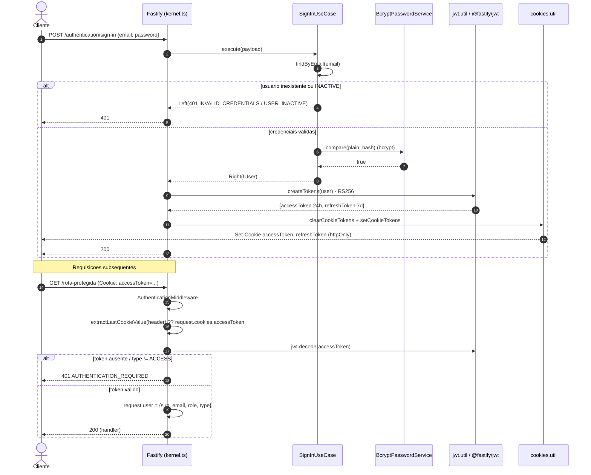
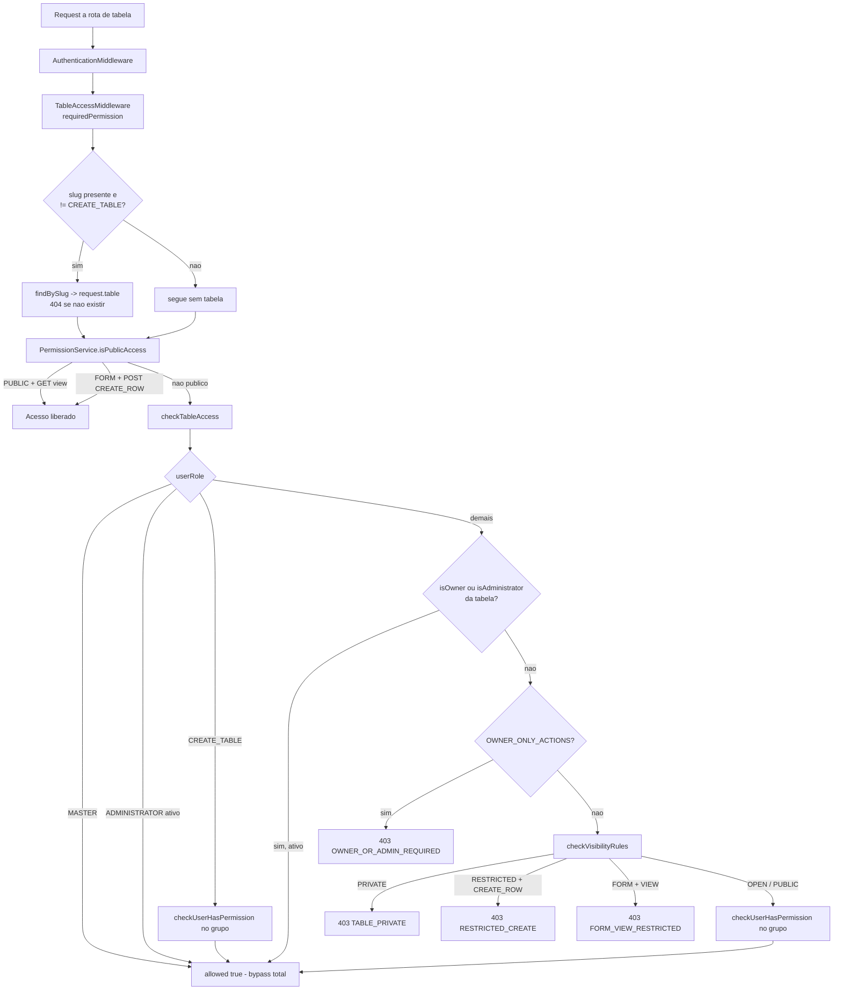

# 06 — Segurança

> **Fonte:** código-fonte do backend LowCodeJS (branch `develop`).
> **Escopo:** autenticação (JWT RS256 + cookies), autorização (RBAC + visibilidade
> de tabela), tratamento de senhas (bcrypt), isolamento da sandbox de scripts (Node
> `vm`), CORS/Helmet/cookies, tokens de validação (magic-link / códigos de recuperação)
> e upload de arquivos. Cada afirmação está ancorada em `caminho/arquivo.ts:linha`.
> Arquivos lidos: `start/kernel.ts`, `start/env.ts`, `application/middlewares/*`,
> `application/utils/{jwt,cookies}.util.ts`, `application/core/table/{sandbox,executor}.ts`,
> `application/core/row-password-helper.core.ts`, `application/services/{permission,password,row-password,storage}/*`,
> recursos de `authentication/`, `storage/` e `setting/`, e seeders.

---

## 1. Visão geral

A superfície de segurança do backend se organiza em camadas atravessadas por toda
requisição HTTP:

| Camada | Mecanismo | Evidência |
| --- | --- | --- |
| Transporte / origem | CORS allowlist (origens fixas + padrão glob) | `start/kernel.ts:76-115` |
| Sessão | JWT RS256 em cookies httpOnly assinados | `start/kernel.ts:117-134`, `utils/cookies.util.ts` |
| Autenticação | `AuthenticationMiddleware` (cookie → header, valida `type=ACCESS`) | `middlewares/authentication.middleware.ts` |
| Autorização (global) | `RoleMiddleware([E_ROLE...])` | `middlewares/role.middleware.ts` |
| Autorização (tabela) | `TableAccessMiddleware` + `PermissionService` (RBAC + visibilidade) | `middlewares/table-access.middleware.ts`, `services/permission/permission.service.ts` |
| Guarda de extensão | `ExtensionActiveMiddleware` (404 se desabilitada) | `middlewares/extension-active.middleware.ts` |
| Senhas (usuários) | bcrypt `compare`/`hash`, salt 10 | `services/password/bcrypt-password.service.ts` |
| Senhas (campos de row) | bcrypt cost 12 + máscara `••••••••` | `core/row-password-helper.core.ts` |
| Isolamento de scripts | Node `vm` isolada, timeout 5s, sem `require`/`fs`/`process`/`network` | `core/table/{executor,sandbox}.ts` |
| Upload | `@fastify/multipart` (limite 5MB), processamento Sharp | `start/kernel.ts:136-140`, `services/storage/process-file.ts` |

> O **handler de erros global** padroniza falhas em `{ message, code, cause, errors? }`
> (PT-BR), evitando vazar stack traces para o cliente — apenas `console.error` no
> servidor no caso 500 (`start/kernel.ts:145-209`).

---

## 2. Autenticação (JWT RS256 + cookies)

### 2.1 Registro do plugin JWT

O `@fastify/jwt` é registrado com **RS256** e chaves decodificadas de **base64**
a partir das env vars `JWT_PRIVATE_KEY` / `JWT_PUBLIC_KEY`:

```ts
// start/kernel.ts:123-134
kernel.register(jwt, {
  secret: {
    private: Buffer.from(Env.JWT_PRIVATE_KEY, 'base64'),
    public: Buffer.from(Env.JWT_PUBLIC_KEY, 'base64'),
  },
  sign: { expiresIn: expiresIn, algorithm: 'RS256' },   // expiresIn = 60*60*24 (1 dia)
  verify: { algorithms: ['RS256'] },
  cookie: { signed: false, cookieName: 'accessToken' },
});
```

| Aspecto | Valor | Evidência |
| --- | --- | --- |
| Algoritmo de assinatura | `RS256` (assimétrico) | `start/kernel.ts:128-129` |
| Origem das chaves | env `JWT_PUBLIC_KEY` / `JWT_PRIVATE_KEY` em **base64** (obrigatórias, sem default) | `start/env.ts:12-13`, `start/kernel.ts:125-126` |
| `expiresIn` default do plugin (sign) | `60*60*24` = 1 dia | `start/kernel.ts:121,128` |
| `verify.algorithms` | restrito a `['RS256']` (mitiga *algorithm confusion*) | `start/kernel.ts:129` |
| Leitura de cookie | `cookieName: 'accessToken'`, `signed: false` | `start/kernel.ts:130-133` |

> **Nota sobre `signed: false` no plugin JWT.** O cookie `accessToken` **não** é lido
> como cookie assinado pelo `@fastify/jwt`. O `@fastify/cookie` está registrado com
> `secret: Env.COOKIE_SECRET` (`start/kernel.ts:117-119`), mas os tokens são gravados
> sem flag `signed` em `setCookieTokens` (ver §2.4) — ou seja, a integridade dos
> tokens é garantida pela **assinatura RS256 do próprio JWT**, não pela assinatura de
> cookie. Isso é coerente: adulterar o JWT invalida a verificação RS256.

### 2.2 Geração de tokens (`createTokens`)

Dois tokens são emitidos no sign-in / magic-link / refresh (`utils/jwt.util.ts:15-43`):

| Token | TTL | Payload | Evidência |
| --- | --- | --- | --- |
| **accessToken** | `24h` | `{ sub, email, role, type: ACCESS }` | `utils/jwt.util.ts:19-29` |
| **refreshToken** | `7d` | `{ sub, type: REFRESH }` | `utils/jwt.util.ts:31-40` |

O `role` vem de `user.group.slug.toUpperCase()` no momento da emissão
(`utils/jwt.util.ts:22`) — portanto **o role fica congelado no token**: mudanças de
grupo do usuário só refletem após novo login/refresh (ver Achados, §10).

### 2.3 Extração e validação (`AuthenticationMiddleware`)

```ts
// middlewares/authentication.middleware.ts:30-61
const accessToken =
  extractLastCookieValue(request.headers.cookie, 'accessToken') ??
  request.cookies.accessToken;
// ...
const accessTokenDecoded = await request.server.jwt.decode(String(accessToken));
if (!accessTokenDecoded || accessTokenDecoded.type !== E_JWT_TYPE.ACCESS) { ... }
request.user = { sub, email, role, type: ACCESS };
```

| Passo | Comportamento | Evidência |
| --- | --- | --- |
| 1. Extração | `extractLastCookieValue` percorre o header `Cookie` e pega a **última** ocorrência de `accessToken`; fallback para `request.cookies.accessToken` | `authentication.middleware.ts:10-23,30-32` |
| 2. Ausência | Sem token → `optional:true` retorna (visitante); senão `401 AUTHENTICATION_REQUIRED` | `authentication.middleware.ts:34-40` |
| 3. Decode | `request.server.jwt.decode(...)` | `authentication.middleware.ts:42-43` |
| 4. Tipo | Rejeita se `type !== ACCESS` (impede usar refreshToken em rotas normais) | `authentication.middleware.ts:45-54` |
| 5. Popula | `request.user = { sub, email, role, type }` | `authentication.middleware.ts:56-61` |
| 6. Erro | Qualquer exceção → `optional:true` segue, senão `401` | `authentication.middleware.ts:62-69` |

> **Ponto de atenção (verificação vs. decode).** O middleware usa **`jwt.decode`**, e
> não `jwt.verify`. `decode` retorna o payload **sem revalidar a assinatura RS256 nem
> a expiração** nesse ponto. A verificação criptográfica/expiração efetiva ocorre no
> momento de `setCookieTokens`/emissão e na config `verify` do plugin para fluxos que
> chamam `verify`, mas a leitura por requisição depende de `decode`. Ver Achados (§10,
> F-2) — marcado como **ponto a confirmar com o time** quanto à intenção.

A função de extração trata corretamente headers com cookies duplicados (pega a
última ocorrência), o que evita ambiguidade quando há `accessToken` repetido
(`authentication.middleware.ts:10-23`).

### 2.4 Cookies (httpOnly / sameSite / secure)

`setCookieTokens` e `clearCookieTokens` compartilham as mesmas opções
(`utils/cookies.util.ts:7-44`):

| Opção | Valor | Evidência |
| --- | --- | --- |
| `httpOnly` | `true` (sempre) — JS do browser não acessa o token | `cookies.util.ts:13,31` |
| `secure` | `Env.NODE_ENV === 'production'` (HTTPS-only em prod) | `cookies.util.ts:10,28` |
| `sameSite` | `'none'` em produção, `'lax'` em dev | `cookies.util.ts:11-12,29-30` |
| `path` | `'/'` | `cookies.util.ts:9,27` |
| `domain` | `Env.COOKIE_DOMAIN` quando definido (cross-subdomain) | `cookies.util.ts:14,32` |
| `maxAge` (accessToken) | `60*60*24*1000` (rotulado `24h`) | `cookies.util.ts:38` |
| `maxAge` (refreshToken) | `60*60*7*24*1000` (rotulado `7d`) | `cookies.util.ts:42` |

> **`sameSite: 'none'` exige `secure: true`.** Em produção ambos coexistem
> (HTTPS), habilitando o cenário cross-site SSR/cliente. Em dev, `lax` + `secure:false`
> funciona em `localhost`.
>
> **Inconsistência numérica em `maxAge`.** Os comentários dizem `24h`/`7d`, mas os
> valores estão multiplicados por `1000` a mais do que o esperado para *segundos*
> (`@fastify/cookie` espera `maxAge` em **segundos**). `60*60*24*1000` = 86.400.000 s
> ≈ **1000 dias**, não 24h; idem para o refresh. Ver Achados (§10, F-3) — o `expiresIn`
> do JWT (`24h`/`7d`) continua sendo o limite efetivo de validade do token, mas o
> cookie persiste muito além disso no navegador.

### 2.5 Fluxo de autenticação (diagrama)



> Arquivo `.mmd`: [`docs/_assets/06-fluxo-autenticacao.mmd`](./_assets/06-fluxo-autenticacao.mmd)

### 2.6 Refresh token

`POST /authentication/refresh-token` usa `AuthenticationMiddleware({ optional: true })`
(não exige access token válido); a autenticação real vem do **refreshToken** (cookie),
decodificado e validado como `type === REFRESH` no controller. O use-case apenas
recarrega o usuário por `sub` (`refresh-token/refresh-token.use-case.ts:18-27`) e emite
novo par de tokens. **Não há rotação/revogação de refresh tokens** (stateless): um
refreshToken vazado é válido por 7d até expirar (ver Achados, §10).

---

## 3. Autorização (RBAC + visibilidade)

### 3.1 Modelo de papéis

Quatro papéis em `E_ROLE` com precedência **MASTER > ADMINISTRATOR > MANAGER > REGISTERED**.
O `PermissionService` aplica os atalhos por papel (`services/permission/permission.service.ts`):

| Papel | Comportamento no `checkTableAccess` | Evidência |
| --- | --- | --- |
| `MASTER` | `return { allowed: true }` — **bypass total**, sem checar sequer se está ativo | `permission.service.ts:114-116` |
| `ADMINISTRATOR` | acesso total **se ativo** (`checkUserIsActive`) | `permission.service.ts:118-122` |
| `MANAGER` / `REGISTERED` | submetidos a ownership + visibilidade + permissão do grupo | `permission.service.ts:124-164` |

> MASTER **não** passa por `checkUserIsActive` (`permission.service.ts:114-116`), ao
> contrário de ADMINISTRATOR — um MASTER inativo ainda teria acesso total via RBAC de
> tabela. Ver Achados (§10).

### 3.2 `RoleMiddleware` (gate por papel)

Restringe rotas a um conjunto de papéis (`middlewares/role.middleware.ts:8-26`):

```ts
if (!request.user) throw HTTPException.Unauthorized(...);          // 401
if (!allowed.has(request.user.role)) throw HTTPException.Forbidden(...); // 403
```

Lê o `role` **do token** (`request.user.role`) — não reconsulta o banco. Exemplos de
uso (do inventário de API): `DELETE /users/:_id` → `[MASTER]`; `GET /users/exports/csv`
→ `[MASTER, ADMINISTRATOR]`; `/extensions` e `/storage/migration/*` → restritos.

### 3.3 `TableAccessMiddleware` + `PermissionService`

Fluxo do middleware (`middlewares/table-access.middleware.ts:31-102`):

1. Valida `slug` (Zod) → `400 INVALID_PARAMETERS` se inválido.
2. Para tudo exceto `CREATE_TABLE`, busca a tabela por slug → `404 TABLE_NOT_FOUND`
   se ausente; popula `request.table`.
3. Carrega o usuário por `request.user.sub` (reconsulta o banco — `table-access.middleware.ts:75-80`).
4. `isPublicAccess(...)` → libera visitante sem auth nos casos públicos (§3.4).
5. `checkTableAccess(...)` → RBAC + ownership + visibilidade; grava `request.ownership`.

A verificação de permissão **efetiva do grupo** percorre `user.group.permissions`
buscando o slug correspondente (`permission.service.ts:33-67`), e exige
`user.status === ACTIVE` (`permission.service.ts:43-48`).

### 3.4 Acesso público (visitante sem auth)

`isPublicAccess` libera **somente** dois casos (`permission.service.ts:78-101`):

| Caso | Condição | Evidência |
| --- | --- | --- |
| Visualização pública | `visibility === PUBLIC` **E** método `GET` **E** permissão ∈ {VIEW_TABLE, VIEW_FIELD, VIEW_ROW} | `permission.service.ts:83-89` |
| Submissão de formulário | `visibility === FORM` **E** método `POST` **E** permissão `CREATE_ROW` | `permission.service.ts:92-98` |

Esses dois casos correspondem às rotas com `AuthenticationMiddleware({ optional: true })`
(ex.: `GET /tables/:slug`, `GET/POST /tables/:slug/rows`).

### 3.5 Regras de visibilidade (não-owner/não-admin)

`checkVisibilityRules` (`permission.service.ts:167-197`):

| Visibilidade | Restrição aplicada | Cause | Evidência |
| --- | --- | --- | --- |
| `PRIVATE` | bloqueia tudo (exceto owner/admin) | `TABLE_PRIVATE` (403) | `permission.service.ts:172-173` |
| `RESTRICTED` | bloqueia `CREATE_ROW` (VIEW permitido) | `RESTRICTED_CREATE` (403) | `permission.service.ts:175-182` |
| `FORM` | bloqueia permissões de VIEW (só owner/admin vê) | `FORM_VIEW_RESTRICTED` (403) | `permission.service.ts:184-191` |
| `OPEN` / `PUBLIC` | sem restrição adicional | — | `permission.service.ts:193-195` |

Ações exclusivas de owner/admin (`OWNER_ONLY_ACTIONS`) — UPDATE/REMOVE de TABLE/FIELD/ROW
e CREATE/UPDATE/REMOVE de FIELD — lançam `403 OWNER_OR_ADMIN_REQUIRED` para terceiros
**antes** mesmo de avaliar a visibilidade (`permission.service.ts:21-29,151-156`).

### 3.6 Diagrama de decisão



> Arquivo `.mmd`: [`docs/_assets/06-autorizacao-rbac.mmd`](./_assets/06-autorizacao-rbac.mmd)

### 3.7 `ExtensionActiveMiddleware` (blindagem de rotas de extensão)

Garante que a extensão `(pkg, type, extensionId)` esteja **habilitada e disponível**;
caso contrário retorna `404 EXTENSION_NOT_ACTIVE` (`middlewares/extension-active.middleware.ts:23-41`):

```ts
if (!extension || !extension.enabled || !extension.available) {
  throw HTTPException.NotFound('Extensão não encontrada ou inativa', 'EXTENSION_NOT_ACTIVE');
}
```

Protege os paths legados (`/tools/clone-table`, `/tools/export-table`, `/tools/import-table`)
mesmo quando a flag é desligada em runtime. **Não é um controle de autenticação/RBAC** —
é uma trava de disponibilidade da feature.

---

## 4. Senhas

### 4.1 Senhas de usuário (login)

`BcryptPasswordService` (`services/password/bcrypt-password.service.ts`):

| Método | Implementação | Evidência |
| --- | --- | --- |
| `hash(password)` | `bcrypt.hash(password, 10)` | `bcrypt-password.service.ts:6,10-12` |
| `compare(plain, hashed)` | `bcrypt.compare(plain, hashed)` | `bcrypt-password.service.ts:14-16` |

- **Salt rounds = 10** (`SALT_ROUNDS`, `bcrypt-password.service.ts:6`).
- O `sign-up` faz hash via `passwordService.hash` antes de persistir
  (`sign-up/sign-up.use-case.ts:53-60`).
- O `sign-in` nunca compara em texto plano: usa `passwordService.compare`
  (`sign-in/sign-in.use-case.ts:47-50`) e retorna mensagem genérica
  `E-mail ou senha inválidos` tanto para e-mail inexistente quanto para senha
  incorreta (`sign-in.use-case.ts:30-62`) — mitiga *user enumeration* na resposta,
  **embora** `request-code` revele existência de e-mail (§6, e Achados §10).

**Política de senha (sign-up):** validador Zod exige min. 6 caracteres e o
`PASSWORD_REGEX` exige minúscula, maiúscula, dígito e caractere especial
(`core/builders/schema-builder.ts:10-11`):

```
/^(?=.*[a-z])(?=.*[A-Z])(?=.*\d)(?=.*[!@#$%^&*(),.?":{}|<>])/
```

### 4.2 Senhas em campos de tabela (`E_FIELD_FORMAT.PASSWORD`)

Campos `TEXT_SHORT` com `format=PASSWORD` recebem tratamento dedicado
(`core/row-password-helper.core.ts`), exposto via `BcryptRowPasswordService`:

| Helper | O que faz | Evidência |
| --- | --- | --- |
| `hashPasswordFields` | `bcrypt.hash(val, 12)` apenas se o valor **não** é máscara `••••••••` e **não** já é hash (`$2a$`/`$2b$`) | `row-password-helper.core.ts:5-26` |
| `stripMaskedPasswordFields` | remove do payload valores vazios/`undefined`/`null`/máscara (não sobrescreve hash existente) | `row-password-helper.core.ts:28-43` |
| `maskPasswordFields` | substitui o valor por `••••••••` na resposta (nunca devolve o hash) | `row-password-helper.core.ts:45-59` |

Pontos relevantes:

- **Cost 12** para senhas de row (`row-password-helper.core.ts:23`) — superior ao
  cost 10 das senhas de usuário (§4.1). Divergência intencional/aceitável, mas
  registrada para consistência.
- A guarda anti-rehash (`startsWith('$2a$')`/`$2b$`) evita hashear um hash já gravado
  num re-save (`row-password-helper.core.ts:20-21`).
- A máscara `••••••••` impede vazar o hash no GET de rows — o cliente nunca recebe o
  hash bcrypt do campo.

---

## 5. Isolamento da sandbox de scripts (`vm`)

Scripts de usuário (`onLoad`, `beforeSave`, `afterSave`) rodam numa **VM Node isolada**
(`core/table/executor.ts`), com o conjunto de globais montado por `buildSandbox`
(`core/table/sandbox.ts`).

### 5.1 Mecânica de execução

```ts
// core/table/executor.ts:86-101
const context = vm.createContext(sandbox);
const script = new vm.Script(code, { filename: 'user-script.js' });
const result = script.runInContext(context, { timeout, breakOnSigint: true });
if (result instanceof Promise) {
  await Promise.race([result, createTimeoutPromise(timeout)]);
}
```

| Controle | Valor | Evidência |
| --- | --- | --- |
| Timeout síncrono | `DEFAULT_TIMEOUT = 5000` ms passado a `runInContext({ timeout })` | `executor.ts:5,72,96` |
| Timeout assíncrono | `Promise.race` contra `createTimeoutPromise(5000)` para código `async` | `executor.ts:99-102,58-64` |
| Interrupção | `breakOnSigint: true` | `executor.ts:97` |
| Validação prévia | `validateSyntax` compila com `new vm.Script(code)` sem executar | `executor.ts:130-148` |
| Classificação de erro | `timeout` / `syntax` / `runtime` / `unknown` | `executor.ts:28-53` |

### 5.2 O que **não** está disponível ao script

O contexto da VM é montado **apenas** com as globais explicitamente listadas em
`buildSandbox` (`core/table/sandbox.ts:248-285`). Não são injetados `require`,
`process`, `fs`, `module`, `global`, `Buffer`, `fetch`/`http`, `setTimeout` etc. — logo
o código de usuário **não tem acesso** a filesystem, rede, variáveis de ambiente ou
módulos nativos. (O `vm` do Node não é uma fronteira de segurança forte por si só — ver
caveat em §5.5.)

### 5.3 APIs expostas ao script

| API | Métodos | Observação de segurança | Evidência |
| --- | --- | --- | --- |
| `field` | `get/set/getAll/getLabel` | leitura/escrita do doc em memória | `sandbox.ts:51-80` |
| `context` | `action, moment, userId, isNew, appUrl, table` | **read-only** via `Object.freeze` (objeto e subobjeto `table`) | `sandbox.ts:83-96` |
| `email` | `send / sendTemplate` | dispara e-mail real via `NodemailerEmailService` — **vetor de exfiltração/spam** (ver §5.5) | `sandbox.ts:37,99-175` |
| `utils` | `today, now, formatDate, sha256, uuid` | `crypto.createHash('sha256')` / `crypto.randomUUID` | `sandbox.ts:178-218` |
| `console` | `log/warn/error` | interceptado para `logs[]`, não escreve no stdout real | `sandbox.ts:221-245` |

Builtins liberados: `JSON, Date, Math, Number, String, Boolean, Array, Object, RegExp,
Map, Set, Promise, Error, TypeError, RangeError, SyntaxError, parse*, isNaN/isFinite,
encode/decodeURI(Component)` (`sandbox.ts:258-283`).

### 5.4 `appUrl` e contexto

`context.appUrl` expõe `Env.APP_CLIENT_URL` ao script (`sandbox.ts:88`) — informação
de baixo risco (URL pública do frontend). `context.table` é congelado para impedir
mutação (`sandbox.ts:89-95`).

### 5.5 Caveat — extensões rodam com privilégios totais

O isolamento acima vale **apenas para scripts de tabela** (sandbox `vm`). **Extensões**
(plugins/modules/tools em `backend/extensions/`) **não** passam por sandbox: são código
Node carregado e executado in-process com **todos os privilégios** do servidor (acesso a
`require`, `fs`, rede, env, conexões MongoDB etc.). Isso é assumido explicitamente como
trade-off de design (ver `backend/CLAUDE.md`, seção "Extensões" → *"Sem sandbox:
extensões rodam com privilégios totais — desenvolvedores internos assumem o risco"*).

Além disso, mesmo dentro da sandbox de scripts, a API `email.send` permite **enviar
e-mails arbitrários** para qualquer destinatário a partir do SMTP configurado
(`sandbox.ts:99-131`) — quem consegue editar `beforeSave/afterSave` de uma tabela
(owner/admin/MASTER) pode usar isso para exfiltrar dados de row ou enviar spam. Ver
Achados (§10).

---

## 6. Tokens de validação (magic-link / códigos de recuperação)

Códigos de uso único persistidos em `ValidationToken` (`status` ∈ REQUESTED/EXPIRED/VALIDATED).

| Fluxo | Geração / TTL | Reuso | Evidência |
| --- | --- | --- | --- |
| `request-code` (recuperação) | código numérico de **6 dígitos** `Math.floor(100000 + Math.random()*900000)`; status `REQUESTED`; e-mail enfileirado (BullMQ) | — | `request-code/request-code.use-case.ts:33-46` |
| `validate-code` | expira se `status===EXPIRED` **ou** `now - createdAt > 10 min`; ao expirar grava `EXPIRED`; ao validar grava `VALIDATED` | uso único (status muda) | `validate-code/validate-code.use-case.ts:36-62` |
| `magic-link` | mesmas regras de TTL de 10 min; `VALIDATED` → `409 ALREADY_USED`; `EXPIRED` → `410`; ativa usuário INACTIVE automaticamente | uso único | `magic-link/magic-link.use-case.ts:41-89` |

| Parâmetro | Valor | Evidência |
| --- | --- | --- |
| Comprimento do código | 6 dígitos decimais (100000–999999) | `request-code.use-case.ts:33` |
| Aleatoriedade | `Math.random()` (**PRNG não-criptográfico**) | `request-code.use-case.ts:33` |
| TTL | `TIME_EXPIRATION_IN_MINUTES = 10` | `validate-code.use-case.ts:41`, `magic-link.use-case.ts:54` |
| Uso único | status passa a `VALIDATED` após sucesso | `validate-code.use-case.ts:59-62`, `magic-link.use-case.ts:72-75` |

> **Pontos de atenção.** (a) Código de 6 dígitos gerado com `Math.random()` é previsível
> e tem espaço de 9×10⁵ — sem rate-limit/lockout visível no use-case, fica sujeito a
> brute force. (b) `request-code` responde `404 EMAIL_NOT_FOUND` quando o e-mail não
> existe (`request-code.use-case.ts:28-31`), permitindo **enumeração de e-mails**
> cadastrados. (c) `magic-link` **ativa** automaticamente um usuário INACTIVE
> (`magic-link.use-case.ts:84-89`). Ver Achados (§10).

---

## 7. CORS, cookies e cabeçalhos

### 7.1 CORS

`@fastify/cors` com allowlist dinâmica (`start/kernel.ts:76-115`):

| Aspecto | Comportamento | Evidência |
| --- | --- | --- |
| Sem `Origin` | **permitido** (`callback(null, true)`) — Postman, mobile, server-to-server | `start/kernel.ts:78-79` |
| Origens fixas | `Env.APP_CLIENT_URL`, `Env.APP_SERVER_URL` (sempre OK) | `start/kernel.ts:81-85` |
| Origens configuráveis | `Env.ALLOWED_ORIGINS` com suporte a wildcard `*.dominio` via `matchOrigin` | `start/kernel.ts:24-35,87-94` |
| `credentials` | `true` (necessário para cookies cross-site) | `start/kernel.ts:98` |
| Métodos | `GET, POST, PUT, DELETE, PATCH, OPTIONS` | `start/kernel.ts:97` |
| Headers expostos | `Set-Cookie` | `start/kernel.ts:111` |
| Default de `ALLOWED_ORIGINS` | `https://lowcodejs.org;*.lowcodejs.org` | `start/env.ts:30-38` |

`matchOrigin` para wildcard valida hostname com `URL(origin)` e `endsWith(suffix)`,
recusando origens malformadas no `catch` (`start/kernel.ts:24-35`).

> **Atenção:** permitir requisições **sem `Origin`** (`start/kernel.ts:78-79`) é comum,
> mas amplia a superfície para clientes que omitem o header. Combinado com
> `credentials:true`, a allowlist de `Origin` continua sendo a barreira para browsers.

### 7.2 Helmet

**Não determinável pelo código / ausente.** Não há registro de `@fastify/helmet` em
`start/kernel.ts` (plugins registrados: `cors`, `cookie`, `jwt`, `multipart`, `swagger`,
`scalar`, `websocket`, `bootstrap`). Logo **não há cabeçalhos de segurança HTTP**
(CSP, HSTS, X-Frame-Options, X-Content-Type-Options) emitidos pelo backend. Ver Achados
(§10). (HSTS/headers podem estar a cargo do proxy reverso/Coolify — **não confirmável pelo
código do backend**.)

### 7.3 Cookie plugin

`@fastify/cookie` registrado com `secret: Env.COOKIE_SECRET` (`start/kernel.ts:117-119`),
habilitando cookies assinados. Como os tokens são gravados sem `signed:true` (§2.4) e
lidos via `signed:false` no JWT, o `COOKIE_SECRET` na prática protege quaisquer **outros**
cookies assinados, não o `accessToken` (cuja integridade é a assinatura RS256).

---

## 8. Upload de arquivos

### 8.1 Limite de multipart (kernel)

```ts
// start/kernel.ts:136-140
kernel.register(multipart, { limits: { fileSize: 5 * 1024 * 1024 } }); // 5mb
```

| Controle | Valor | Evidência |
| --- | --- | --- |
| `fileSize` | **5 MB** por arquivo (hard limit do `@fastify/multipart`) | `start/kernel.ts:138` |
| Auth no upload | `POST /storage` exige `AuthenticationMiddleware({ optional: false })` (sem RBAC adicional) | `resources/storage/upload/upload.controller.ts:22-32` |
| Múltiplos arquivos | `request.files()` → `for await` iterando partes | `upload.use-case.ts:31-34` |

> **Divergência de configuração.** O `Setting` armazena `FILE_UPLOAD_MAX_SIZE`
> (default 10.485.760 = 10 MB) e `FILE_UPLOAD_MAX_FILES_PER_UPLOAD` (default 10), mas o
> **limite efetivo de tamanho é o do multipart no kernel (5 MB fixo)**, que **não** lê o
> Setting. Não há, no caminho de upload lido, validação de `FILE_UPLOAD_ACCEPTED`
> (extensões/tipos permitidos) nem de quantidade máxima de arquivos por requisição. Ver
> Achados (§10).

### 8.2 Processamento de arquivo (`processFile`)

`services/storage/process-file.ts`:

| Aspecto | Comportamento | Evidência |
| --- | --- | --- |
| Imagens | `image/jpeg|png|gif|bmp|tiff` → reescritas via Sharp para **WebP** (resize 1200×1200 `fit:inside`, quality 80) | `process-file.ts:4-10,32-38` |
| Não-imagens | mantidas como estão, `mimetype` e extensão originais preservados | `process-file.ts:39-43` |
| Nome do arquivo | `staticName` ou aleatório de 8 dígitos (`Math.random()`) | `process-file.ts:24,44-45` |

A reescrita de imagens via Sharp neutraliza payloads embutidos em metadados de imagem
(re-encode). **Arquivos não-imagem (ex.: PDF) são gravados sem inspeção de conteúdo** e
sem allowlist de tipo no código lido — o `mimetype` reportado pelo cliente é confiado
(`process-file.ts:42`). O hook `StorageContentDispositionHook`
(`start/kernel.ts:143`) ajuda a forçar `Content-Disposition` na entrega, mitigando
execução inline de conteúdo servido (detalhe não aprofundado aqui).

---

## 9. WebSockets

Os três namespaces Socket.IO (`/chat`, `/notifications`, `/storage-migration`)
autenticam pelo **mesmo cookie `accessToken`**: o handshake lê o header `Cookie`,
extrai `accessToken` e valida `decoded.type === ACCESS` — espelhando o
`AuthenticationMiddleware` (`resources/chat/chat.socket.ts:223-242`). Conexões sem
cookie válido são recusadas. O mesmo caveat de `decode` vs `verify` (§2.3) se aplica.

---

## 10. Achados / pontos de atenção (priorizados)

> Classificação por severidade percebida **a partir do código lido**. Itens marcados
> com ⚠️ têm **incerteza** quanto à intenção/configuração externa e devem ser confirmados
> com o time. Severidade é heurística, não um CVSS formal.

### 🔴 Alta

| # | Achado | Evidência | Observação |
| --- | --- | --- | --- |
| F-1 | **`GET /setting` retorna segredos a qualquer usuário autenticado.** O endpoint só usa `AuthenticationMiddleware({ optional:false })` — **sem `RoleMiddleware`** — e o use-case devolve o documento Setting **completo e sem máscara**, incluindo `STORAGE_SECRET_KEY`, `STORAGE_ACCESS_KEY`, `EMAIL_PROVIDER_PASSWORD`, `OPENAI_API_KEY`, `MCP_SERVER_TOKEN`. Logo um usuário `REGISTERED` consegue ler credenciais de S3/SMTP/OpenAI. | `setting/show/show.controller.ts:20-30`, `setting/show/show.use-case.ts:135-149` | Restringir a `[MASTER]` (e/ou mascarar segredos como em `••••••••`). |
| F-2 | **`PUT /setting` sem restrição de papel.** Atualização das configurações globais (driver de storage, S3, SMTP, chave OpenAI) exige apenas autenticação, **sem `RoleMiddleware`**. Qualquer usuário autenticado pode reconfigurar storage/SMTP/IA. | `setting/update/update.controller.ts` (apenas `AuthenticationMiddleware`) | A UI é "MASTER-only", mas o backend não impõe o gate. Adicionar `RoleMiddleware([MASTER])`. |

### 🟠 Média

| # | Achado | Evidência | Observação |
| --- | --- | --- | --- |
| F-3 | **`maxAge` de cookie inconsistente com o TTL do JWT.** `60*60*24*1000` (≈1000 dias) e `60*60*7*24*1000` em vez de segundos → o cookie persiste no browser muito além das `24h`/`7d` do token. O JWT ainda expira no prazo, mas a divergência indica bug de unidade. | `utils/cookies.util.ts:38,42` | Esperado em segundos: `60*60*24` e `60*60*24*7`. ⚠️ confirmar intenção. |
| F-4 | **Ausência de Helmet / cabeçalhos de segurança HTTP.** Nenhum `@fastify/helmet` registrado; sem CSP/HSTS/X-Frame-Options/X-Content-Type-Options vindos do backend. | `start/kernel.ts` (lista de plugins, sem helmet) | ⚠️ Pode estar no proxy reverso/Coolify — **não confirmável pelo código**. |
| F-5 | **Upload sem validação de tipo/quantidade e com limite divergente.** O limite efetivo é 5 MB fixo do multipart (kernel), ignorando `FILE_UPLOAD_MAX_SIZE`/`FILE_UPLOAD_ACCEPTED`/`FILE_UPLOAD_MAX_FILES_PER_UPLOAD` do Setting. Arquivos não-imagem são gravados confiando no `mimetype` do cliente, sem allowlist. | `start/kernel.ts:138`, `services/storage/process-file.ts:39-43`, use-case `upload.use-case.ts:31-36` | Aplicar `FILE_UPLOAD_ACCEPTED` e o limite do Setting no caminho de upload. |
| F-6 | **Código de recuperação previsível + enumeração de e-mail + sem rate-limit.** Código de 6 dígitos via `Math.random()` (não-CSPRNG); `request-code` responde `404 EMAIL_NOT_FOUND` revelando contas; nenhum lockout/rate-limit no use-case. | `request-code.use-case.ts:28-31,33`, `validate-code.use-case.ts:41` | Usar `crypto.randomInt`, resposta genérica e rate-limit/tentativas. |
| F-7 | **`AuthenticationMiddleware` usa `jwt.decode` (não `verify`).** A leitura por requisição não revalida assinatura/expiração explicitamente nesse ponto. | `authentication.middleware.ts:42-43` | ⚠️ Confirmar se o decode aplica verificação via config do plugin; se não, trocar por `jwt.verify` para checar assinatura+exp por request. |

### 🟡 Baixa / informativo

| # | Achado | Evidência | Observação |
| --- | --- | --- | --- |
| F-8 | **Extensões sem sandbox (privilégios totais).** Plugins/modules/tools rodam in-process com acesso a `require`/`fs`/rede/env. Trade-off documentado. | `backend/CLAUDE.md` (seção Extensões) | Risco assumido para devs internos; manter revisão de código de extensões. |
| F-9 | **API `email.send` da sandbox permite envio arbitrário.** Quem edita `beforeSave/afterSave` (owner/admin/MASTER) pode exfiltrar dados de row ou spammar via SMTP do servidor. | `core/table/sandbox.ts:99-131` | Considerar limitar destinatários/quotas para scripts. |
| F-10 | **`role` congelado no token.** Mudança de grupo só vale após novo login/refresh; `RoleMiddleware` lê `request.user.role` (do token), sem reconsulta. | `utils/jwt.util.ts:22`, `role.middleware.ts:19` | Aceitável para sessões curtas; documentar. |
| F-11 | **MASTER bypassa `checkUserIsActive`.** Um MASTER inativo mantém acesso total em `checkTableAccess` (ADMINISTRATOR não). | `permission.service.ts:114-116` | Avaliar checar `status` também para MASTER. |
| F-12 | **Refresh token stateless sem revogação/rotação.** RefreshToken vazado é válido por 7d; sign-out só limpa cookies, não invalida o token no servidor. | `utils/jwt.util.ts:31-40`, `cookies.util.ts:7-20` | Considerar denylist/rotação se o modelo de ameaça exigir. |
| F-13 | **Credenciais de demo hardcoded.** `admin@admin.com`/`Admin@2026` e `registered@registered.com`/`Registered@2026`. Gated por `DEMO_MODE=true` (no-op fora de demo), mas presentes no repositório. | `database/seeders/1778025600-demo-users.seed.ts:35-48` | OK enquanto `DEMO_MODE=false`; garantir que nunca seja `true` em produção real. |
| F-14 | **Divergência de custo bcrypt.** Senhas de usuário usam cost 10; senhas de campo de row usam cost 12. | `bcrypt-password.service.ts:6`, `row-password-helper.core.ts:23` | Inconsistência menor; padronizar se desejado. |

---

## 11. Resumo de configuração de segurança

| Configuração | Origem | Default / Valor | Evidência |
| --- | --- | --- | --- |
| `JWT_PUBLIC_KEY` / `JWT_PRIVATE_KEY` | env (base64, obrigatórias) | — | `start/env.ts:12-13` |
| `COOKIE_SECRET` | env (obrigatória) | — | `start/env.ts:14` |
| `COOKIE_DOMAIN` | env (opcional) | undefined | `start/env.ts:15` |
| `ALLOWED_ORIGINS` | env (`;`-separado) | `https://lowcodejs.org;*.lowcodejs.org` | `start/env.ts:30-38` |
| `NODE_ENV` | env | `development` | `start/env.ts:17-19` |
| Access token TTL | código | `24h` | `utils/jwt.util.ts:28` |
| Refresh token TTL | código | `7d` | `utils/jwt.util.ts:38` |
| bcrypt cost (usuário) | código | `10` | `bcrypt-password.service.ts:6` |
| bcrypt cost (row password) | código | `12` | `row-password-helper.core.ts:23` |
| Timeout da sandbox | código | `5000 ms` | `core/table/executor.ts:5` |
| Limite de upload | código (kernel) | `5 MB` | `start/kernel.ts:138` |
| TTL de código de validação | código | `10 min` | `validate-code.use-case.ts:41` |

---

*Documento gerado a partir da branch `develop`. Diagramas-fonte em `docs/_assets/06-*.mmd`.*
