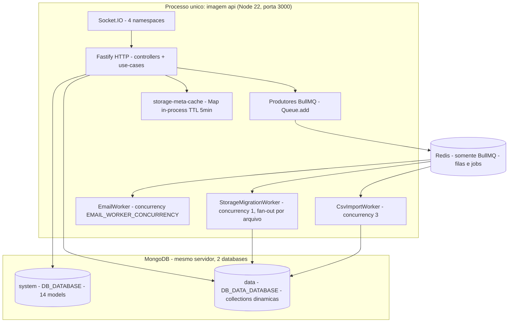
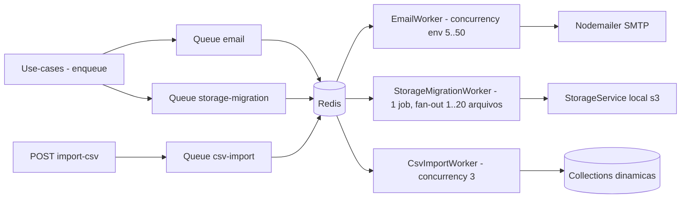
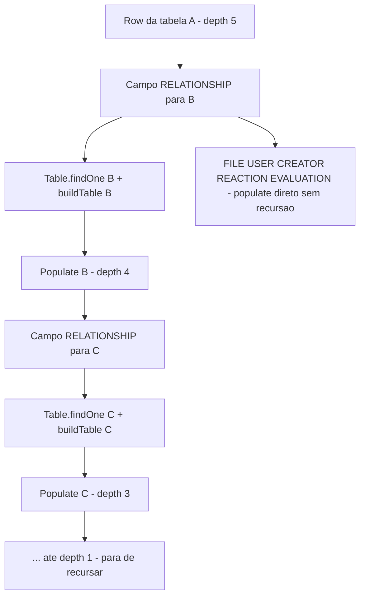

# 07 — Escalabilidade & Performance

> **Fonte:** código-fonte do LowCodeJS, branch `develop` (backend Fastify 5 +
> MongoDB/Mongoose 8 + Redis/BullMQ + Socket.IO).
> **Escopo:** este documento mapeia as **propriedades de escala e performance** do
> backend a partir do que está implementado: as duas conexões MongoDB e as
> collections dinâmicas, o uso de Redis (cache vs. fila), as filas BullMQ
> (`email`, `storage-migration`, `csv-import`) com seus workers e concorrência,
> o populate dinâmico e sua profundidade máxima, a exportação CSV com cap de
> linhas, a paginação e os WebSockets. Evidências citadas no formato
> `caminho/arquivo.ts:linha`. Tudo que **não pôde** ser determinado pelo código
> (sobretudo números de throughput, latência e benchmarks) está marcado como
> **Não determinável pelo código**.
> Números canônicos do inventário (14 models, 9 estilos de tabela, 4 roles, 12
> permissões, 16 tipos de campo, ~137 endpoints) seguem `docs/01-overview.md`,
> `docs/05-domain-rules.md` e `docs/06-security.md`.

---

## 7.1 Panorama

A escalabilidade do LowCodeJS gira em torno de **um único processo Node** (a
imagem `api`) que acumula quatro papéis simultaneamente: servidor HTTP Fastify,
servidor WebSocket Socket.IO, **produtor** de jobs BullMQ e **consumidor**
(worker) desses mesmos jobs. Os workers rodam **in-process**, no mesmo evento de
boot do servidor HTTP (`backend/bin/server.ts:110-143`). Não há um processo
worker separado nem sharding de WebSocket — o escalonamento horizontal hoje é
**parcial** e tem ressalvas (ver §7.8 e §7.9).

| Eixo | Mecanismo | Estado |
| --- | --- | --- |
| Persistência | 2 conexões MongoDB (system + data) | `config/database.config.ts` |
| Collections dinâmicas | `buildTable()` recria model por request | `core/builders/model-builder.ts:35` |
| Cache | Redis (somente BullMQ) + 1 cache in-process (meta de storage) | `config/redis.config.ts`, `services/storage/storage-meta-cache.ts` |
| Trabalho assíncrono | 3 filas BullMQ (email, storage-migration, csv-import) | `services/*/worker.ts` |
| Populate de relacionamentos | recursivo com teto `MAX_RELATIONSHIP_DEPTH = 5` | `core/builders/populate-builder.ts:35` |
| Export CSV | streaming em batches com cap `EXPORT_CSV_LIMIT = 500_000` | `core/csv/csv-stream.ts:4` |
| Paginação | `perPage` por request; default de domínio `PAGINATION_PER_PAGE = 20` | `model/setting.model.ts:21` |
| Tempo real | Socket.IO single-node, 4 namespaces | `resources/chat/chat.socket.ts:214` |



> O `.mmd` correspondente está em `docs/_assets/07-arquitetura-escala.mmd`.

---

## 7.2 Duas conexões MongoDB e collections dinâmicas

### 7.2.1 As duas conexões

`MongooseConnect()` abre **duas** conexões para a **mesma** `DATABASE_URL`, em
databases distintos (`config/database.config.ts:30-50`):

| Conexão | API Mongoose | Database (env) | Conteúdo |
| --- | --- | --- | --- |
| **system** | `mongoose.connect()` (conexão default global) | `DB_DATABASE` (default `lowcodejs`) | os 14 models nativos (User, Table, Field, Storage, Setting, …) |
| **data** | `mongoose.createConnection()` exposta por `getDataConnection()` | `DB_DATA_DATABASE` (default `lowcodejs_data`) | uma collection física por `table.slug` (rows dinâmicos) |

Ambas usam `autoCreate: true` (`config/database.config.ts:33,38`). A conexão
**data** é guardada num singleton de módulo (`let dataConnection`,
`config/database.config.ts:15`) e lança erro se acessada antes de
`MongooseConnect()` (`config/database.config.ts:18-23`).

Implicações de escala:

- **Isolamento de carga lógico, não físico:** como ambos os databases vivem na
  mesma instância MongoDB (mesma `DATABASE_URL`), separar `system` de `data`
  **não** distribui carga entre servidores por padrão — é uma fronteira lógica.
  O código permite apontar para servidores distintos (basta `DATABASE_URL`
  diferente), mas isso exigiria duas connection strings, o que **não** está
  parametrizado hoje (uma única `DATABASE_URL` alimenta as duas conexões).
- **Pool de conexões:** o tamanho do pool (`maxPoolSize`) **não** é configurado
  em `MongooseConnect()` — usa o default do driver. **Não determinável pelo
  código** qual o teto de conexões concorrentes ideal sob carga.

### 7.2.2 `buildTable()` recria o model a cada uso

Cada operação em rows (paginated, show, create, update, export, import…) chama
`buildTable(table, conn)` para materializar o model Mongoose da collection
dinâmica (`core/builders/model-builder.ts:35`). O ponto crítico para performance:

```ts
// core/builders/model-builder.ts:150-157
const modelName = table._id?.toString();
if (conn.models[modelName]) {
  conn.deleteModel(modelName);   // <- destrói e recria o model a cada chamada
}
const model = conn.model<Entity>(modelName, schema, table.slug);
await model.createCollection();
```

Consequências:

| Aspecto | Comportamento | Impacto |
| --- | --- | --- |
| **Reconstrução de schema** | A cada request, `buildSchema()` percorre `table._schema`, monta sub-schemas de FIELD_GROUP e re-registra hooks `pre('save')`/`post('save')` (`model-builder.ts:48-148`) | Custo de CPU por request proporcional ao nº de campos; **sem cache de model** |
| **`deleteModel` + `model`** | O model anterior é descartado e recriado — necessário porque o schema da tabela pode ter mudado entre requests | Garante consistência, mas anula o cache interno de models do Mongoose |
| **`createCollection()`** | Chamado em toda construção (idempotente: no-op se a collection já existe) | Round-trip extra ao Mongo por operação |
| **Hooks de sandbox** | `beforeSave`/`afterSave` são re-anexados ao schema recriado; cada `save` que dispara script paga o custo da VM isolada (timeout 5s — ver `docs/05-domain-rules.md`) | Save com automação é mais caro que save puro |

**Gargalo potencial:** em tabelas com muitos campos/grupos e tráfego alto, a
reconstrução do model por request é trabalho repetido. Não há memoização por
`(table._id, updatedAt)`. **Não determinável pelo código** o overhead absoluto
em ms — não há benchmark no repositório. Recomendação em §7.10.

---

## 7.3 Redis: cache vs. fila

Há uma distinção importante e frequentemente confundida: **Redis no LowCodeJS é
usado exclusivamente como backend das filas BullMQ — não como cache de
aplicação.**

`config/redis.config.ts` expõe dois artefatos:

| Export | Uso real | Onde |
| --- | --- | --- |
| `redis` (cliente ioredis) | Apenas o handler de erro de conexão é registrado; **nenhum** `get/set/del` da aplicação usa este cliente | `config/redis.config.ts:5-23` |
| `createBullMQConnection(extra?)` | Cria conexões dedicadas para cada Queue/Worker, com `maxRetriesPerRequest: null` e `enableReadyCheck: false` (exigência do BullMQ) | `config/redis.config.ts:11-21` |

Uma busca por `redis.get`/`redis.set`/`@socket.io/redis` no backend **não
retorna ocorrências** — confirma que não há cache de domínio em Redis, nem
adapter Redis para Socket.IO. O documento Setting (paginação, branding, SMTP,
storage, IA) vive no **MongoDB**, lido por `Setting.findOne()` (a nota antiga de
"key-value no Redis" no CLAUDE de repositories está desatualizada).

### 7.3.1 Único cache de aplicação: `storage-meta-cache`

O único cache de leitura propriamente dito é **in-process**, um `Map` simples com
TTL fixo de **5 minutos** (`services/storage/storage-meta-cache.ts:14-15`):

```ts
const TTL_MS = 5 * 60 * 1000;   // 5 min
const cache = new Map<string, CacheEntry>();
```

| Propriedade | Valor | Evidência |
| --- | --- | --- |
| Escopo | metadados de arquivo (`originalName`, `mimetype`, `location`) | `storage-meta-cache.ts:3-7` |
| TTL | 5 min, expiração lazy na leitura | `storage-meta-cache.ts:14,22-25` |
| Invalidação ativa | `invalidateStorageMeta(filename)` (chamado pelo worker de migração após mover/falhar um arquivo) | `storage-migration/worker.ts:152,178` |
| Consumidor | hook de content-disposition / serve de arquivos | `hooks/content-disposition.hook.ts:34-50` |

**Limitação de escala:** por ser um `Map` por processo, **não é compartilhado
entre réplicas** — N instâncias da `api` mantêm N caches independentes, com até
5 min de inconsistência cada. Aceitável para metadados de arquivo (raramente
mudam), mas relevante de notar para deploy multi-réplica.

Demais cabeçalhos de cache HTTP (ETag, `Cache-Control: immutable` para arquivos
de hash, `no-cache, must-revalidate` para arquivos estáticos com `staticName`)
são definidos no mesmo hook (`hooks/content-disposition.hook.ts:69-70,83-95`) e
reduzem o tráfego de re-download no navegador — mas isso é cache de **cliente**,
não de servidor.

---

## 7.4 Filas BullMQ — visão consolidada

Há **três** filas BullMQ no backend (todas em `services/*/`), cada uma com um
worker in-process iniciado no boot (`bin/server.ts:110-143`):

| Fila | Constante de nome | Worker | Concorrência | `attempts` | Retenção (Redis) |
| --- | --- | --- | --- | --- | --- |
| `email` | `EMAIL_QUEUE_NAME` | `EmailWorker` | `EMAIL_WORKER_CONCURRENCY` (default 5, range 1–50) | 3, backoff exponencial 1s | `removeOnComplete: 100` / `removeOnFail: 500` |
| `storage-migration` | `STORAGE_MIGRATION_QUEUE_NAME` | `StorageMigrationWorker` | **1** no nível BullMQ; fan-out interno por `STORAGE_MIGRATION_CONCURRENCY` (default 5, range 1–20) | 1 (retry gerenciado por arquivo no worker) | `removeOnComplete: 50` / `removeOnFail: 50` |
| `csv-import` | `CSV_IMPORT_QUEUE_NAME` | `CsvImportWorker` | **3** (hardcoded) | 1 (sem reprocessamento automático) | **Não determinável pelo código** (não inspecionado neste doc) |

Evidências: `services/email-queue/bullmq-email-queue.service.ts:17-25`,
`services/email-queue/worker.ts:65`,
`services/storage-migration/bullmq-storage-migration-queue.service.ts:19-26`,
`services/storage-migration/worker.ts:334`,
`services/csv-import/worker.ts:304`.

Característica comum a todas: **persistência no Redis** garante que um restart do
processo **retoma** os jobs pendentes (BullMQ relê do Redis), o que é a principal
propriedade de resiliência das filas.



> O `.mmd` correspondente está em `docs/_assets/07-filas-bullmq.mmd`.

---

## 7.5 Fila de email (`email`)

Os use-cases **não** chamam o serviço de email diretamente — eles **enfileiram**
um job (`EmailQueueContractService.enqueue`) e retornam imediatamente, desacoplando
o envio SMTP da latência da request (`services/email/CLAUDE.md`,
`resources/table-rows/forum-message`).

| Item | Valor | Evidência |
| --- | --- | --- |
| Concorrência | `Env.EMAIL_WORKER_CONCURRENCY` (default 5, validado `min(1).max(50)`) | `worker.ts:65`, `start/env.ts:51` |
| Retentativas | `attempts: 3`, `backoff: exponential, delay: 1000` (≈ 1s/5s/25s, ver doc da lib) | `bullmq-email-queue.service.ts:20-21` |
| Falha forçada → retry | se `sendEmail` retorna `success: false`, o worker **lança** erro para acionar retry | `worker.ts:44-48` |
| Retenção | últimos 100 completos, últimos 500 falhos no Redis | `bullmq-email-queue.service.ts:22-23` |

**Escala:** aumentar `EMAIL_WORKER_CONCURRENCY` aumenta o paralelismo de envio,
mas o teto real é o **servidor SMTP** (rate limits do provedor), não o worker.
Como o `NodemailerEmailService` relê o Setting a cada envio (sem cache — ver
`backend/CLAUDE.md` → Email), há um `findOne` no Mongo por job; sob alto volume
isso é um pequeno overhead por job. **Não determinável pelo código** o throughput
de emails/s.

---

## 7.6 Fila de migração de storage (`storage-migration`)

Move arquivos entre drivers (`local ↔ s3`) sem downtime, acionada quando o MASTER
troca `STORAGE_DRIVER` em `/settings` (`services/storage-migration/CLAUDE.md`).
O modelo de concorrência é **em dois níveis**:

| Nível | Onde | Valor |
| --- | --- | --- |
| **Job** (BullMQ) | `worker.ts:334` | `concurrency: 1` — só **um** job de migração roda por vez |
| **Arquivo** (intra-job) | `processInBatches(file_ids, concurrency, …)` | `STORAGE_MIGRATION_CONCURRENCY` (default 5, range 1–20), vindo do payload do job (`worker.ts:233`, `start.use-case.ts:92`) |

O `start.use-case.ts` coleta os `file_ids` paginando o storage em páginas de
`PAGE_SIZE = 500` (`start.use-case.ts:25,60-77`), guardando **só os ids**
(memória limitada — comentário em `start.use-case.ts:58-59`). Cada arquivo passa
por uma máquina de estados com até `RETRY_LIMIT = 3` tentativas e backoff linear,
verificação de tamanho pós-cópia (`SIZE_MISMATCH`) e emissão de progresso via
WebSocket (`worker.ts:45,92-190`).

Propriedades de resiliência (todas no código):

- **Idempotência:** arquivos já com `location === target_driver` são pulados
  (`worker.ts:107-110`).
- **Recovery pós-crash:** o sweeper de boot
  (`markInProgressAsFailed`, `bin/server.ts:70-80,103`) marca como `failed`
  qualquer doc preso em `in_progress` sem job ativo.
- **Retry seletivo:** `retry_failed_only: true` reenfileira apenas os `failed`
  (`start.use-case.ts:62-66`).
- **Progresso/ETA:** `emitProgress` calcula ETA por extrapolação linear
  (`worker.ts:192-214`).

**Gargalo potencial:** a migração lê o arquivo inteiro do source para um `Buffer`
em memória antes de gravar no target (`streamToBuffer`, `worker.ts:55-61,127-133`)
— **não** é cópia por streaming direto. Com `STORAGE_MIGRATION_CONCURRENCY`
arquivos grandes em paralelo, o pico de memória é
`concurrency × tamanho_do_maior_arquivo`. É a razão do range estar capado em 1–20.

---

## 7.7 Fila de importação CSV (`csv-import`)

Worker dedicado para import de rows via CSV (`services/csv-import/worker.ts`).
Pontos de escala/performance:

| Item | Valor | Evidência |
| --- | --- | --- |
| Concorrência | `concurrency: 3` (hardcoded, **não** é env) | `worker.ts:304` |
| Cap de linhas | `IMPORT_CSV_LIMIT = 10_000` por arquivo | `worker.ts:44,198-207` |
| `attempts` | 1 (erros de CSV não devem ser reprocessados) | `worker.ts:9` |
| Parse | CSV inteiro carregado em memória (`parseCsv` acumula `results[]`) | `worker.ts:58-75,196` |
| Criação | uma `rowRepository.create` **por linha**, sequencial | `worker.ts:228-260` |
| Progresso | emitido a cada `PROGRESS_INTERVAL = 100` linhas + última | `worker.ts:46,247-253` |

**Gargalos potenciais:** (1) o conteúdo CSV inteiro é mantido em memória; (2) as
inserções são **uma a uma** (sem `insertMany`), e cada `create` que dispare
`beforeSave`/`afterSave` paga o custo da VM; (3) o cap de 10k linhas existe
justamente para limitar esses dois custos. Não há bulk insert nem paralelismo
intra-arquivo. **Não determinável pelo código** o tempo por linha.

---

## 7.8 Populate dinâmico e profundidade máxima

O populate de relacionamentos é montado em runtime por `buildPopulate()`
(`core/builders/populate-builder.ts`). Tipos que geram populate:
`RELATIONSHIP`, `FILE`, `REACTION`, `EVALUATION`, `USER`, `CREATOR`
(`populate-builder.ts:14-27`).

O ponto crítico de escala é a **recursão em relacionamentos-de-relacionamentos**,
limitada por:

```ts
// core/builders/populate-builder.ts:35
const MAX_RELATIONSHIP_DEPTH = 5;
```

| Aspecto | Comportamento | Evidência |
| --- | --- | --- |
| Profundidade default | 5 níveis (`depth` default = `MAX_RELATIONSHIP_DEPTH`) | `populate-builder.ts:41` |
| Decremento | cada nível de RELATIONSHIP recursa com `depth - 1`, só enquanto `depth > 1` | `populate-builder.ts:115-125` |
| Proteção | evita recursão infinita em esquemas cíclicos (ex.: `localizacao.pai → localizacao`) — citado no comentário do código | `populate-builder.ts:29-34` |
| Custo por nível | cada RELATIONSHIP faz `Table.findOne(...).populate(['fields','groups.fields'])` **e** `buildTable(...)` para a tabela alvo | `populate-builder.ts:92-112` |

**Gargalo potencial (N+1 de metadados):** para montar o populate, cada campo
RELATIONSHIP dispara consultas ao **system DB** (`Table.findOne`) e uma
reconstrução de model (`buildTable`) da tabela relacionada — recursivamente até 5
níveis. Em tabelas com muitos relacionamentos aninhados, o custo de **montar** o
populate (antes mesmo de executar o `find` dos rows) cresce rapidamente. O teto
de 5 é a salvaguarda contra explosão/loop, mas mesmo abaixo dele o trabalho é
significativo. Não há cache desses metadados de tabela entre requests. **Não
determinável pelo código** o impacto absoluto.



---

## 7.9 Export CSV: streaming e cap de linhas

A exportação CSV é desenhada para **não** carregar a coleção inteira em memória
(`core/csv/csv-stream.ts`). O fluxo:

1. **Fail-fast por contagem:** o use-case faz `count()` antes de qualquer leitura;
   se `total > EXPORT_CSV_LIMIT` retorna **422** `EXPORT_LIMIT_EXCEEDED`
   (`export-csv.use-case.ts:66-75`).
2. **Cap canônico:** `EXPORT_CSV_LIMIT = 500_000` linhas
   (`core/csv/csv-stream.ts:4`).
3. **Streaming em batches:** `iterateInBatches` lê páginas de `batchSize = 1000`
   via `findMany(skip, limit)` e gera (`yield`) cada linha; o `buildCsvStream`
   transforma o gerador num `Readable` com BOM UTF-8 (`csv-stream.ts:32-79`).
4. **Defesa em profundidade:** mesmo que a contagem inicial subestime, o gerador
   relança `ExportLimitExceededError` ao ultrapassar o limite durante o stream
   (`csv-stream.ts:48`).

| Parâmetro | Valor | Evidência |
| --- | --- | --- |
| Cap de linhas | 500.000 | `csv-stream.ts:4` |
| Tamanho do batch | 1.000 linhas/página | `csv-stream.ts:38` |
| Erro ao exceder | 422 `EXPORT_LIMIT_EXCEEDED` | `export-csv.use-case.ts:68-75`, `csv-stream.ts:6-13` |
| Permissão | MASTER/ADMINISTRATOR + VIEW_ROW (ver `resources/table-rows/CLAUDE.md`) | — |

**Característica positiva de escala:** memória limitada a ~1 batch por vez +
buffers do parser; a contagem antecipada evita iniciar exports inviáveis. O custo
dominante é o número de round-trips ao Mongo (`ceil(total/1000)` consultas
`findMany`). O mesmo padrão de export existe em `users`, `user-groups`, `menu`,
`table-base` e `table-group-rows` (todos reusam `core/csv/`).

---

## 7.10 Paginação

| Item | Valor | Evidência |
| --- | --- | --- |
| Default de domínio | `PAGINATION_PER_PAGE = 20` (campo do Setting, MongoDB) | `model/setting.model.ts:21` |
| Default do validator de rows | `perPage` default **50** (independente do Setting) | `resources/table-rows/paginated/paginated.validator.ts:8` |
| Modo "buscar tudo" | `perPage <= 0` (ex.: `-1`) ⇒ `limit(0)` no Mongoose = **sem limite** | `paginated.use-case.ts:34-37` |
| Quem usa "buscar tudo" | visualizações Kanban/Document/Forum/Calendar/Gantt (precisam de todos os rows para agrupar) | comentário em `paginated.use-case.ts:30-33` |

Observação importante: há **dois** defaults distintos. `PAGINATION_PER_PAGE`
(20) é a preferência de domínio configurável pelo MASTER, propagada para
`process.env` no boot (`bin/server.ts:35`). O endpoint de rows paginados, porém,
usa `perPage` default **50** no próprio validator
(`paginated.validator.ts:8`) — ou seja, **o default efetivo da listagem de rows
não é `PAGINATION_PER_PAGE`** a menos que o cliente passe o valor.

**Gargalo potencial — "fetch all":** o modo `perPage <= 0` (`limit(0)`) carrega
**todos** os rows da tabela de uma vez, mais o `populate` dinâmico de até 5
níveis (§7.8) e o `count` total. Para tabelas grandes exibidas como
Kanban/Calendar/Gantt, esse caminho **não** tem teto de linhas — é o oposto do
export CSV (que é capado em 500k). É o principal risco de pico de memória/latência
em listagens. **Não determinável pelo código** a partir de quantos rows o impacto
se torna crítico.

---

## 7.11 WebSockets e escala horizontal

O LowCodeJS instancia **um único** servidor Socket.IO sobre o mesmo HTTP server
do Fastify (`resources/chat/chat.socket.ts:214`), reaproveitado por **quatro**
namespaces (`bin/server.ts:94-125`):

| Namespace | Função | Evidência |
| --- | --- | --- |
| `/chat` | assistente IA (MCP + OpenAI) | `chat.socket.ts:210` |
| `/storage-migration` | progresso da migração de arquivos | `bin/server.ts:97` |
| `/notifications` | notificações em tempo real | `bin/server.ts:100` |
| `/csv-import` | progresso da importação CSV | `bin/server.ts:123` |

Limitação de escala documentada pelo código (pela **ausência** de adapter): não
há `@socket.io/redis-adapter` nem qualquer `adapter(...)` registrado (busca sem
resultados). Isso significa:

- **Estado de rooms/emissões é in-memory por processo.** Os workers emitem
  eventos (`namespace.emit`, `worker.ts:162,213,254`) **no próprio processo** —
  o que funciona porque worker e Socket.IO vivem no mesmo Node.
- **Escalonamento horizontal quebra o tempo real:** com N réplicas atrás de um
  load balancer, um evento emitido na réplica A **não** chega a clientes
  conectados à réplica B, pois não há pub/sub entre instâncias. Hoje o WebSocket
  é efetivamente **single-node**.

Para deploy multi-réplica com WebSocket consistente seria necessário um adapter
Redis (ou sticky sessions + adapter) — **não** presente no código.

---

## 7.12 Gargalos potenciais (consolidado)

| # | Gargalo | Onde | Severidade | Observação |
| --- | --- | --- | --- | --- |
| 1 | `buildTable()` recria o model Mongoose por request (sem cache) | `model-builder.ts:150-157` | Média | Custo de CPU repetido; cresce com nº de campos/grupos |
| 2 | Populate recursivo faz `Table.findOne` + `buildTable` por relacionamento, até 5 níveis | `populate-builder.ts:92-125` | Média–Alta | N+1 de metadados; sem cache de tabela |
| 3 | Listagem "fetch all" (`perPage <= 0`, `limit(0)`) sem teto de linhas | `paginated.use-case.ts:34-37` | Alta | Kanban/Calendar/Gantt em tabelas grandes |
| 4 | WebSocket single-node (sem Redis adapter) | `chat.socket.ts:214` | Alta (multi-réplica) | Quebra emissões entre réplicas |
| 5 | `storage-meta-cache` é por processo, não compartilhado | `storage-meta-cache.ts:15` | Baixa | Até 5 min de inconsistência por réplica |
| 6 | Migração lê arquivo inteiro em `Buffer` (não streaming) | `worker.ts:127-133` | Média | Pico de memória = concurrency × maior arquivo |
| 7 | CSV import: parse em memória + insert linha-a-linha | `worker.ts:196,228-260` | Média | Cap de 10k mitiga; sem `insertMany` |
| 8 | Workers in-process competem com HTTP por CPU/event-loop | `bin/server.ts:110-143` | Média | Sem isolamento de worker |
| 9 | `maxPoolSize` do Mongo não configurado | `database.config.ts:32-40` | Baixa–Média | Usa default do driver |
| 10 | SMTP `findOne` por job (sem cache de Setting) | ver `backend/CLAUDE.md` → Email | Baixa | Overhead por email |

---

## 7.13 Recomendações

As recomendações abaixo derivam diretamente dos gargalos acima; **nenhuma** está
implementada no código atual e os ganhos são qualitativos (sem benchmark).

| Recomendação | Endereça | Tipo |
| --- | --- | --- |
| Memoizar o model de `buildTable()` por `(table._id, updatedAt)`, recriando só quando o schema muda | #1, #2 | Performance |
| Cachear metadados de tabela usados em `buildPopulate` (evitar `Table.findOne` repetido na recursão) | #2 | Performance |
| Introduzir teto/paginação obrigatória nas views "fetch all", ou virtualização no frontend para tabelas grandes | #3 | Escala |
| Adicionar `@socket.io/redis-adapter` (reusando o Redis já presente) para tempo real consistente entre réplicas | #4 | Escala horizontal |
| Migrar `storage-meta-cache` para Redis (compartilhado entre réplicas) ou reduzir TTL conforme necessidade | #5 | Consistência |
| Cópia por streaming direto (source→target) na migração, em vez de `streamToBuffer` | #6 | Memória |
| Usar `insertMany` em lote no import CSV (respeitando hooks quando aplicável) | #7 | Performance |
| Extrair workers BullMQ para processo(s) dedicado(s), separando-os do event-loop HTTP | #8 | Isolamento |
| Parametrizar `maxPoolSize` (e avaliar `DATABASE_URL` distinta por conexão para separar `system`/`data` em servidores) | #9 | Escala |
| Cachear o documento Setting por curto TTL no `NodemailerEmailService` | #10 | Performance |

> **Throughput, latência, capacidade de réplicas e limites de memória sob carga:**
> **Não determinável pelo código** — o repositório não contém benchmarks, testes
> de carga, métricas de runtime nem configuração de APM/profiling (ver
> `docs/10-observability.md`, que classifica a observabilidade operacional como
> lacuna conhecida).

---

## 7.14 Referências de código

| Tema | Arquivo(s) canônico(s) |
| --- | --- |
| 2 conexões Mongo | `backend/config/database.config.ts` |
| `buildTable` (model dinâmico) | `backend/application/core/builders/model-builder.ts` |
| Redis (config) | `backend/config/redis.config.ts` |
| Cache de meta de storage | `backend/application/services/storage/storage-meta-cache.ts` |
| Fila/worker email | `backend/application/services/email-queue/{bullmq-email-queue.service.ts,worker.ts}` |
| Fila/worker storage-migration | `backend/application/services/storage-migration/{bullmq-storage-migration-queue.service.ts,worker.ts}` |
| Fila/worker csv-import | `backend/application/services/csv-import/worker.ts` |
| Concorrência (env) | `backend/start/env.ts` (`STORAGE_MIGRATION_CONCURRENCY`, `EMAIL_WORKER_CONCURRENCY`) |
| Populate + profundidade | `backend/application/core/builders/populate-builder.ts` |
| Export CSV (cap 500k) | `backend/application/core/csv/csv-stream.ts`, `backend/application/resources/table-rows/export-csv/export-csv.use-case.ts` |
| Paginação | `backend/application/resources/table-rows/paginated/{paginated.use-case.ts,paginated.validator.ts}`, `backend/application/model/setting.model.ts` |
| WebSockets | `backend/application/resources/chat/chat.socket.ts`, `backend/bin/server.ts` |
| Boot dos workers | `backend/bin/server.ts` |
