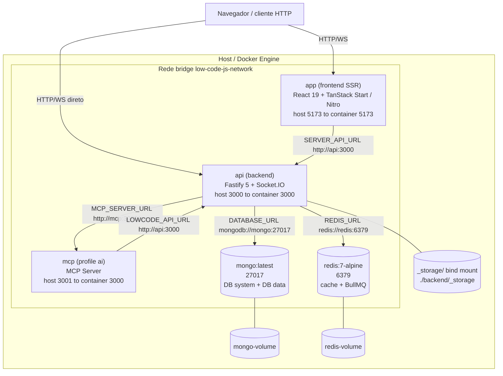
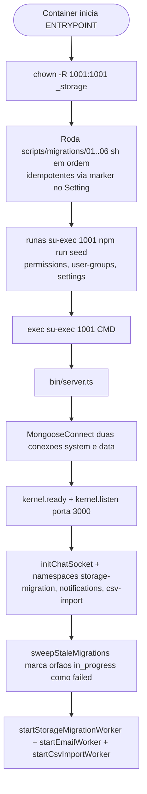

# 08 — Infraestrutura

> **Fonte:** código-fonte do monorepo LowCodeJS, branch `develop`.
> **Escopo:** este documento descreve a **infraestrutura de execução** da
> plataforma — serviços de container (Docker Compose), imagens (Dockerfiles),
> entrypoints com migrations/seeders, storage (Flydrive local/S3 + migração de
> driver), Redis, e-mail SMTP, MCP/IA e WebSockets. Cada afirmação aponta para o
> arquivo/linha de evidência. Os números canônicos do inventário (14 models de
> sistema, 9 estilos de tabela, 4 roles, 12 permissões, 16 tipos de campo,
> ~137 endpoints) são definidos em `docs/01-overview.md` e nos demais documentos;
> aqui são apenas referenciados quando o tema cruza.
> Detalhes de configuração de variáveis de ambiente vivem em `backend/CLAUDE.md`
> e `backend/start/CLAUDE.md`; este documento foca no plano de **deploy/runtime**.

---

## 8.1 Visão geral dos serviços

A plataforma é composta por **quatro serviços core** (sempre sobem) e **um
serviço opcional** (`mcp`, ativado pelo profile `ai`). A topologia abaixo é
extraída de `docker-compose.yml`.

| Serviço | Imagem / Build (dev)                              | Porta host → container | Restart          | Healthcheck                                       | Profile | Evidência |
| ------- | ------------------------------------------------- | ---------------------- | ---------------- | ------------------------------------------------- | ------- | --------- |
| `mongo` | `mongo:latest`                                    | `27017:27017`          | `unless-stopped` | `mongosh --eval "db.runCommand('ping')"`          | core    | `docker-compose.yml:4-22` |
| `redis` | `redis:7-alpine`                                  | `6379:6379`            | `unless-stopped` | `redis-cli ping`                                  | core    | `docker-compose.yml:77-92` |
| `api`   | build `./backend` (`Dockerfile-local`)            | `${APP_SERVER_PORT}:3000` | `unless-stopped` | `curl -f http://localhost:3000/health-check`      | core    | `docker-compose.yml:24-53` |
| `app`   | build `./frontend` (`Dockerfile-local`)           | `${APP_CLIENT_PORT}:5173` | `unless-stopped` | — (não definido no dev)                           | core    | `docker-compose.yml:55-75` |
| `mcp`   | `marcosjhollyfer/lowcodejs-mcp:latest`            | `${MCP_PORT:-3001}:3000`  | `unless-stopped` | `wget -qO- http://localhost:3000/health-check`    | `ai`    | `docker-compose.yml:94-114` |

Observações importantes lidas do compose:

- **Mapeamento de porta do `mcp`**: o host expõe `3001` (default via
  `${MCP_PORT:-3001}`), mas o container escuta em `3000` (`PORT=3000`)
  — `docker-compose.yml:99-104`. O `api` alcança o MCP por
  `MCP_SERVER_URL: http://mcp:3000/mcp` (`docker-compose.yml:36`).
- **Dependências de boot (`depends_on` + `condition`)**: `api` espera `mongo` e
  `redis` ficarem `service_healthy`; `app` e `mcp` esperam `api`
  `service_healthy` (`docker-compose.yml:39-43`, `:70-72`, `:107-109`).
- **Override de hosts internos**: em compose, o bloco `environment:` do `api`
  **sobrescreve** `DATABASE_URL`, `REDIS_URL` e `MCP_SERVER_URL` com os nomes de
  rede Docker (`mongo`, `redis`, `mcp`), independentemente do `.env`
  (`docker-compose.yml:33-36`). O dev não precisa editar `.env` ao alternar
  entre rodar nativo e em container.
- **Rede e volumes**: todos os serviços ficam na bridge `low-code-js-network`
  (`docker-compose.yml:122-124`); dados persistem em `mongo-volume` e
  `redis-volume` (`docker-compose.yml:116-120`).

> O `.mmd` equivalente (sem cerca) está em `docs/_assets/08-infra.mmd`.

---

## 8.2 Os três arquivos Compose: dev, oficial e override

A plataforma mantém **três arquivos Compose** com papéis distintos. O Docker
funde `docker-compose.yml` + `docker-compose.override.yml` automaticamente em
desenvolvimento; o `docker-compose.oficial.yml` é selecionado explicitamente
(`-f`).

| Arquivo                       | Project name         | Origem das imagens                    | Públio-alvo                          | Evidência |
| ----------------------------- | -------------------- | ------------------------------------- | ------------------------------------ | --------- |
| `docker-compose.yml`          | `low-code-js`        | **Build local** (`Dockerfile-local`)  | Desenvolvimento (hot-reload)         | `docker-compose.yml:1` |
| `docker-compose.override.yml` | (herda)              | (herda)                               | Ajuste local do dev (porta Redis)    | `docker-compose.override.yml:1-4` |
| `docker-compose.oficial.yml`  | `lowcodejs`          | **Imagens `:latest` do Docker Hub**   | Self-host mínimo sem build           | `docker-compose.oficial.yml:1` |

### Diferenças relevantes

**`docker-compose.yml` (dev)** — `docker-compose.yml`:
- Builda `api` e `app` localmente a partir dos `Dockerfile-local`
  (`:25-27`, `:56-58`).
- Faz **bind-mount do código-fonte** para hot-reload: `./backend:/app` +
  `/app/node_modules` (volume anônimo) + `./backend/_storage:/app/_storage`
  (`:44-47`); idem para o frontend (`:73-75`).
- Inclui `redis` como serviço core e o `mcp` sob profile `ai` (`:77-114`).

**`docker-compose.override.yml`** — `docker-compose.override.yml:1-4`:
- Único conteúdo: **remapeia a porta do Redis** para `6380:6379` usando a tag
  `!override` (substitui a lista de portas em vez de mesclá-la). Útil quando há
  outro Redis ocupando `6379` na máquina do dev.

**`docker-compose.oficial.yml` (self-host)** — `docker-compose.oficial.yml`:
- Usa imagens publicadas: `marcosjhollyfer/lowcodejs-api:latest` e
  `marcosjhollyfer/lowcodejs-app:latest` (`:25`, `:49`).
- **Não sobe Redis nem MCP** — apenas `mongo`, `api`, `app` (`:3-71`).
- O `app` roda em modo produção (Nitro): `NITRO_HOST=0.0.0.0`,
  `NITRO_PORT=3000`, mapeado `${APP_CLIENT_PORT:-5173}:3000` (`:54-58`).
- Defaults embutidos via `${VAR:-fallback}` (ex.: `DB_USERNAME:-lowcodejs`,
  `APP_SERVER_URL:-http://localhost:3000`) — `:10`, `:30`, `:54`.
- Persistência adicional em `lowcodejs-app-public` (artefatos públicos do
  frontend) — `:59-60`, `:79-80`.

> **Não determinável pelo código:** o `docker-compose.oficial.yml` referencia
> imagens `:latest`, mas a **tag/digest exata publicada** no Docker Hub não é
> determinável a partir do repositório — depende do último push do CI
> (`.github/workflows/`).

---

## 8.3 Dockerfiles — backend

O backend possui **três Dockerfiles** (`backend/Dockerfile-{local,production,coolify}`),
todos sobre `node:24-alpine`.

| Dockerfile            | Estratégia        | Build interno?       | Usuário runtime      | CMD                    | Entrypoint                         | Evidência |
| --------------------- | ----------------- | -------------------- | -------------------- | ---------------------- | ---------------------------------- | --------- |
| `Dockerfile-local`    | single-stage      | não (`npm run dev`)  | root (su-exec p/1001)| `npm run dev`          | `/docker-entry-point.sh`           | `backend/Dockerfile-local:1-19` |
| `Dockerfile-production`| single-stage     | não (copia `build/` pronto do artifact CI) | `nodejs:1001` | `node bin/server.js` | `/app/docker-entry-point.sh`  | `backend/Dockerfile-production:1-29` |
| `Dockerfile-coolify`  | **multi-stage**   | sim (`npm run build` no builder) | `appuser:nodejs (1001)` | `node bin/server.js` | `/app/docker-entry-point.sh` | `backend/Dockerfile-coolify:1-40` |

Pontos lidos do código:

- **Pacotes do SO**: `Dockerfile-local` instala `openssl curl su-exec`
  (`:5`); `production` instala `curl su-exec` (`:6`); `coolify` instala `curl`
  no builder e `curl su-exec` no estágio final (`:5`, `:19`). `su-exec` é o que
  permite o entrypoint **dropar privilégios para o uid 1001**.
- **Logos default no storage**: `production` e `coolify` copiam
  `_storage/logo-large.webp` e `logo-small.webp` para o `_storage/` da imagem
  (`Dockerfile-production:17`, `Dockerfile-coolify:27`), garantindo branding
  inicial mesmo antes de qualquer upload.
- **Multi-stage do `coolify`**: estágio `builder` roda
  `NODE_ENV=development npm install --ignore-scripts` → `npm run build` →
  `npm prune --omit=dev`, e o estágio final copia apenas `build/`,
  `node_modules` e `package.json` (`Dockerfile-coolify:1-23`). É a imagem mais
  enxuta para produção (Coolify observa `main` e `develop`).
- **`production` consome artefato de CI**: copia `build/` e `node_modules/`
  prontos (não builda) — `Dockerfile-production:9-11`. É a imagem publicada como
  `marcosjhollyfer/lowcodejs-api:latest` no Docker Hub.

---

## 8.4 Dockerfiles — frontend

O frontend também possui **três Dockerfiles** (`frontend/Dockerfile-{local,production,coolify}`),
sobre `node:24-alpine`. O runtime de produção é o **Nitro** (`node .output/server/index.mjs`).

| Dockerfile            | Estratégia      | Porta exposta | Usuário runtime      | CMD                                   | Evidência |
| --------------------- | --------------- | ------------- | -------------------- | ------------------------------------- | --------- |
| `Dockerfile-local`    | single-stage    | `5173`        | root                 | `npm run dev -- --host`               | `frontend/Dockerfile-local:1-15` |
| `Dockerfile-production`| single-stage   | `3000`        | `nitro:nodejs (1001)`| `node .output/server/index.mjs`       | `frontend/Dockerfile-production:1-27` |
| `Dockerfile-coolify`  | **multi-stage** | `3000`        | `nitro:nodejs (1001)`| `node .output/server/index.mjs`       | `frontend/Dockerfile-coolify:1-51` |

Pontos lidos do código:

- **Build args (apenas `coolify` builda)**: `VITE_API_BASE_URL`,
  `APP_SERVER_URL`, `APP_CLIENT_URL`, `LOGO_SMALL_URL`, `LOGO_LARGE_URL`
  viram `ENV` no estágio builder e são consumidos por `npm run build`
  (`frontend/Dockerfile-coolify:15-27`). O builder também usa `HUSKY=0` e
  `CI=true` (`:7-8`).
- **`production` consome `.output/` pronto**: copia o artifact e o
  `docker-entrypoint.sh` (`frontend/Dockerfile-production:9-13`).
- **Entrypoint comentado em produção**: tanto `production` (`:26`) quanto
  `coolify` (`:50`) declaram o `ENTRYPOINT ["/docker-entrypoint.sh"]`
  **comentado** — o `docker-entrypoint.sh` do frontend não é o entrypoint ativo
  nessas imagens. Veja §8.5.

---

## 8.5 Entrypoints — migrations + seeders antes do server

### Backend — `backend/docker-entry-point.sh`

O entrypoint do backend é o ativo nas três imagens (referenciado em
`ENTRYPOINT` nos três Dockerfiles do backend). Sequência (`backend/docker-entry-point.sh:1-33`):

1. **`chown -R 1001:1001 _storage`** (best-effort) para garantir escrita do
   storage local pelo usuário não-root (`:6`).
2. **Migrations** — itera `scripts/migrations/*.sh` em ordem alfabética e
   executa cada um com `sh` (`:16-20`).
3. **Seeders** — roda `npm run seed` (ou `node .../main.js` se compilado)
   **dropando privilégios** via `runas`/`su-exec 1001:1001` (`:22-27`).
4. **`exec` do CMD** — `su-exec 1001 "$@"` substitui o processo pelo servidor
   (`npm run dev` ou `node bin/server.js`) — `:29-33`.

`set -e` no topo (`:2`) garante que qualquer falha de migration/seeder aborta o
boot antes de subir o servidor.

#### Migrations one-time (`scripts/migrations/*.sh`)

Cada `.sh` resolve o diretório `database/migrations` e invoca o TS/JS
correspondente com `@swc-node/register`. Todas são **idempotentes** via
marcadores no Setting singleton do MongoDB.

| Script                                       | O que faz                                                                 | Marcador / Idempotência | Evidência |
| -------------------------------------------- | ------------------------------------------------------------------------- | ----------------------- | --------- |
| `01-dual-connection.sh`                      | Copia collections dinâmicas do DB **system** para o DB **data**           | `MIGRATION_DUAL_CONNECTION_AT` | `scripts/migrations/01-dual-connection.sh:1-28` |
| `02-group-native-fields.sh`                  | Agrupa campos nativos das tabelas                                         | marker no Setting       | `scripts/migrations/02-group-native-fields.sh` |
| `03-backfill-storage-location.sh`            | Popularia `location`/`migration_status` em docs Storage — **atualmente desativado** (corpo comentado) | `MIGRATION_STORAGE_LOCATION_AT` | `scripts/migrations/03-backfill-storage-location.sh:23-28` |
| `04-backfill-relationship-create-records.sh` | Backfill de registros de relacionamento                                  | marker no Setting       | `scripts/migrations/04-backfill-relationship-create-records.sh` |
| `05-extension-slots.sh`                      | Renomeia `slot` → `slots` (array) em docs de extensão                    | marker no Setting       | `scripts/migrations/05-extension-slots.sh:1-28` |
| `06-relationship-table-id.sh`                | Ajuste de `table_id` em relacionamentos                                  | marker no Setting       | `scripts/migrations/06-relationship-table-id.sh` |

> **Atenção:** o `03-backfill-storage-location.sh` tem o bloco de execução
> **comentado** (`:24-28`) — imprime a mensagem de verificação mas **não** roda
> o backfill no entrypoint atual. O backfill de `storage.location` é, na
> prática, exercido pelo *sweeper de boot* e pelo dual-read em runtime (§8.6).

### Frontend — `frontend/docker-entrypoint.sh`

Existe um entrypoint do frontend, mas **não é o entrypoint ativo** nas imagens
de produção (declarações `ENTRYPOINT` comentadas em §8.4). Quando usado, ele
faz **substituição de URL em runtime** nos artefatos do build
(`frontend/docker-entrypoint.sh:1-12`):

- Se `VITE_API_BASE_URL` está setado e difere de `http://localhost:3000`,
  roda `find /app/.output ... -exec sed -i "s|http://localhost:3000|$VITE_API_BASE_URL|g"`
  sobre os `.js`/`.mjs` do build (`:5-9`).
- Depois `exec "$@"` (CMD do Nitro) — `:12`.

Isso permite reusar a mesma imagem com diferentes URLs de API sem rebuild.

---

## 8.6 Storage (Flydrive: local `_storage/` vs S3)

O storage suporta **dois drivers** — filesystem local e S3-compatível —
selecionados pelo campo `STORAGE_DRIVER` do Setting singleton do MongoDB
(`local` | `s3`). A configuração é editada via UI `/settings` (usuário MASTER) e
**sincronizada para `process.env`** no boot.

### Configuração e seleção de driver

- `getStorageDriver()` lê `process.env.STORAGE_DRIVER`, default `'local'`
  (`backend/config/storage.config.ts:36-38`).
- `getLocalStoragePath()` resolve `join(process.cwd(), '_storage')`
  (`:40-42`); `getStorageUrl(key)` monta a URL pública como
  `APP_SERVER_URL + '/storage/' + key` (`:44-46`).
- `getS3Client()` cria um `S3Client` com `forcePathStyle: true`,
  credenciais e `endpoint` vindos de `process.env.STORAGE_*`, com **cache por
  fingerprint** das credenciais (recria o client quando elas mudam) —
  `backend/config/storage.config.ts:9-34`. O `forcePathStyle: true` é o que
  habilita S3-compatíveis genéricos (MinIO, R2, etc.).
- A sincronização Setting → env é feita por `syncStorageEnv(setting)`
  (`backend/config/setting-env-sync.ts:3-10`), chamada no boot
  (`backend/bin/server.ts:46-55`, `loadStorageConfig()`).

| Campo do Setting    | env equivalente       | Default            |
| ------------------- | --------------------- | ------------------ |
| `STORAGE_DRIVER`    | `STORAGE_DRIVER`      | `local`            |
| `STORAGE_ENDPOINT`  | `STORAGE_ENDPOINT`    | `''`               |
| `STORAGE_REGION`    | `STORAGE_REGION`      | `us-east-1`        |
| `STORAGE_BUCKET`    | `STORAGE_BUCKET`      | `''`               |
| `STORAGE_ACCESS_KEY`| `STORAGE_ACCESS_KEY`  | `''`               |
| `STORAGE_SECRET_KEY`| `STORAGE_SECRET_KEY`  | `''`               |

> Evidência dos defaults: `backend/config/setting-env-sync.ts:4-9`.

### Implementação dos drivers

O `StorageService` é uma **fachada** que delega para a implementação ativa: o
getter `impl` escolhe `s3` quando `getStorageDriver() === 's3'`, senão `local`
(`backend/application/services/storage/storage.service.ts:20-22`). Há também
`forDriver(driver)` que retorna explicitamente a implementação de um driver
específico — usado pela migração para ler de um driver e escrever no outro
(`:24-26`).

| Driver | Implementação                     | Mecanismo                                                |
| ------ | --------------------------------- | -------------------------------------------------------- |
| local  | `local-storage.service.ts`        | `fs` nativo sobre `_storage/`                            |
| s3     | `s3-storage.service.ts`           | AWS SDK v3 (`@aws-sdk/client-s3`) — `Put/Get/Head/Delete/CreateBucket` |

Comportamentos relevantes (de `backend/application/services/storage/`):
- Imagens são processadas para **WebP** (Sharp) no upload (`process-file.ts`,
  documentado em `storage/CLAUDE.md`).
- `S3StorageService.ensureBucket()` faz `HeadBucket` e, se ausente, `CreateBucket`
  (`s3-storage.service.ts:29-44`) — provisiona o bucket no primeiro uso.

### Migração de driver (local ↔ s3) sem downtime

Quando o MASTER troca `STORAGE_DRIVER` na UI, os arquivos existentes ficam no
driver antigo. O recurso `storage-migration` copia esses arquivos em background:

- **Fila**: BullMQ sobre Redis + worker in-process iniciado em
  `backend/bin/server.ts:110-115` (`startStorageMigrationWorker`).
- **Recovery de boot (sweeper)**: `sweepStaleMigrations()` marca docs órfãos em
  `in_progress` como `failed` quando não há job ativo
  (`backend/bin/server.ts:70-80`, `:103`). Isso cobre o caso de crash no meio de
  uma migração.
- **Dual-read**: docs Storage ganham `location` e `migration_status`; o kernel
  serve o arquivo a partir do driver indicado em `doc.location`, com fallback
  cross-driver (documentado em `backend/CLAUDE.md`, seção Storage). O
  `forDriver()` da fachada é o que viabiliza ler de um driver enquanto o sistema
  já opera no outro.
- **Progresso em tempo real**: WebSocket no namespace `/storage-migration`
  (mesmo servidor Socket.IO do chat) — `initStorageMigrationSocket(io, jwtDecode)`
  em `backend/bin/server.ts:97-98`.

| Endpoint                        | Método | Descrição                                            |
| ------------------------------- | ------ | ---------------------------------------------------- |
| `/storage/migration/status`     | GET    | Contagens por driver/status, job ativo, `can_cleanup`|
| `/storage/migration/start`      | POST   | Enfileira job (`{concurrency?, retry_failed_only?}`) |
| `/storage/migration/cleanup`    | POST   | Apaga arquivos do driver antigo (`{confirm: true}`)  |

Todos restritos ao role **MASTER** (`RoleMiddleware`). Concorrência configurável
por `STORAGE_MIGRATION_CONCURRENCY` (default 5, intervalo 1–20). Detalhes de
resiliência (3 tentativas com backoff, idempotência por `location === target`)
em `backend/CLAUDE.md`.

---

## 8.7 Redis

Redis cumpre dois papéis: **cache** e **backend das filas BullMQ** (e-mail,
storage-migration, csv-import).

- Cliente principal `ioredis` criado a partir de `Env.REDIS_URL`, com log de
  erros de conexão (`backend/config/redis.config.ts:5-9`).
- `createBullMQConnection(extra)` cria conexões dedicadas para BullMQ com
  `maxRetriesPerRequest: null` e `enableReadyCheck: false` — requisitos do
  BullMQ (`backend/config/redis.config.ts:11-21`).
- No Compose, o `api` recebe `REDIS_URL: redis://redis:6379`
  (`docker-compose.yml:35`); fora do Compose o default é
  `redis://localhost:6379` (`REDIS_URL` em `start/env.ts`).

| Aspecto         | Valor / Comportamento                          | Evidência |
| --------------- | ---------------------------------------------- | --------- |
| Imagem          | `redis:7-alpine`                               | `docker-compose.yml:78` |
| Porta           | `6379` (dev override → `6380`)                 | `docker-compose.yml:82`, `docker-compose.override.yml:3-4` |
| Persistência    | volume `redis-volume:/data`                    | `docker-compose.yml:83-84` |
| Healthcheck     | `redis-cli ping`                               | `docker-compose.yml:88` |
| BullMQ          | conexões com `maxRetriesPerRequest: null`      | `redis.config.ts:12-14` |

> No `docker-compose.oficial.yml` **não há serviço Redis** — quem faz self-host
> com esse arquivo precisa prover Redis externamente se quiser usar as filas
> (`docker-compose.oficial.yml:1-71`).

---

## 8.8 E-mail (SMTP via Setting)

O e-mail **não** é configurado por variáveis de ambiente. As credenciais SMTP
são **campos do documento Setting** (MongoDB), editados na UI `/settings`
(usuário MASTER).

- `buildNodemailerConfig(setting)` monta o transporter a partir de
  `EMAIL_PROVIDER_HOST/PORT/USER/PASSWORD`. Se **qualquer um** estiver ausente,
  retorna `null` (sem lançar erro) — `backend/config/email.config.ts:16-42`.
- `secure` é derivado: `port === 465 → true`; `requireTLS: true` sempre
  (`email.config.ts:38-39`).
- `resolveEmailFrom(setting)` resolve o remetente: `EMAIL_PROVIDER_FROM` →
  fallback `EMAIL_PROVIDER_USER` (necessário p/ AWS SES, onde o usuário SMTP não
  é um e-mail válido) — `email.config.ts:49-55`.

| Campo do Setting          | Uso                                         |
| ------------------------- | ------------------------------------------- |
| `EMAIL_PROVIDER_HOST`     | host SMTP (essencial)                       |
| `EMAIL_PROVIDER_PORT`     | porta SMTP; `465` ativa `secure`            |
| `EMAIL_PROVIDER_USER`     | usuário SMTP (essencial)                    |
| `EMAIL_PROVIDER_PASSWORD` | senha SMTP (essencial)                      |
| `EMAIL_PROVIDER_FROM`     | remetente preferencial; fallback p/ USER    |

### Pipeline de envio (desacoplado por fila)

Use-cases **não** chamam o serviço de e-mail diretamente — eles enfileiram jobs
na `EmailQueueContractService` (BullMQ). O **`EmailWorker`** é o único consumidor
do `NodemailerEmailService` e é iniciado no boot
(`backend/bin/server.ts:117-121`, `startEmailWorker`). Concorrência configurável
por `EMAIL_WORKER_CONCURRENCY` (default 5, intervalo 1–50). O `NodemailerEmailService`
relê o Setting a cada envio (sem cache); se o SMTP não estiver configurado,
retorna `{ success: false }` em vez de falhar a request.

---

## 8.9 MCP / IA (Assistente)

O assistente de IA é um serviço **opcional** (`mcp`, profile `ai`) que conecta o
chat ao Model Context Protocol + OpenAI.

- **Container**: `marcosjhollyfer/lowcodejs-mcp:latest`, host `3001` →
  container `3000`, escuta em `PORT=3000`, alcança o backend por
  `LOWCODE_API_URL=http://api:3000` e `CORS_ORIGIN=*`
  (`docker-compose.yml:94-114`).
- **Backend → MCP**: o `api` aponta `MCP_SERVER_URL: http://mcp:3000/mcp`
  (`docker-compose.yml:36`). Fora do Compose, `MCP_SERVER_URL` é **opcional**
  (`start/env.ts`).
- **Chave OpenAI e habilitação**: `OPENAI_API_KEY` e `AI_ASSISTANT_ENABLED`
  vivem no Setting do MongoDB (editados via `/settings`). O `chat.socket` relê do
  model em cada conexão — não depende de `process.env`
  (`backend/CLAUDE.md`, seção AI/Chat; `bin/server.ts:42-43` lista as chaves
  sincronizadas).

Quando o profile `ai` **não** é ativado (`docker compose up -d` sem
`--profile ai`), o serviço `mcp` não sobe e o chat fica indisponível — comportam
graceful porque o socket lê o estado de habilitação do Setting.

---

## 8.10 WebSockets (Socket.IO)

Todo o tempo-real roda sobre **um único servidor Socket.IO** anexado ao mesmo
servidor HTTP do Fastify, autenticado pelo **mesmo JWT RS256** dos endpoints
(via cookie `accessToken`). A inicialização acontece em `backend/bin/server.ts`
após `kernel.listen()`:

| Namespace             | Inicialização                                   | Propósito                                        | Evidência |
| --------------------- | ----------------------------------------------- | ------------------------------------------------ | --------- |
| `/chat` (default)     | `initChatSocket(httpServer, jwtDecode)`         | Chat com IA (MCP + OpenAI), file→base64, PDF→texto | `bin/server.ts:94-95` |
| `/storage-migration`  | `initStorageMigrationSocket(io, jwtDecode)`     | Progresso da migração de storage em tempo real   | `bin/server.ts:97-98` |
| `/notifications`      | `initNotificationsSocket(io, jwtDecode)`        | Notificações (FORUM_MENTION, KANBAN_COMMENT, etc.)| `bin/server.ts:100-101` |
| `/csv-import` (import)| `initCsvImportSocket(io, jwtDecode)`            | Progresso de importação CSV de linhas            | `bin/server.ts:123-124` |

O `jwtDecode` é derivado de `kernel.jwt.decode<IJWTPayload>(token)`
(`bin/server.ts:91-92`), reusando exatamente a verificação RS256 do HTTP. O
plugin `@fastify/websocket` é registrado no kernel
(`backend/start/kernel.ts:244`).

> Observação de inventário: além do `/chat` documentado em `backend/CLAUDE.md`,
> o código atual da branch `develop` registra **quatro** namespaces (incluindo
> `/csv-import`), todos no mesmo servidor Socket.IO.

---

## 8.11 Boot do servidor (resumo da sequência runtime)

Encadeando entrypoint (§8.5) + `bin/server.ts`:

1. **Entrypoint**: migrations idempotentes → seeders → `exec` do CMD como uid
   1001 (`backend/docker-entry-point.sh:16-33`).
2. **`MongooseConnect()`** abre **duas conexões**: system
   (`mongoose.connect`, DB `DB_DATABASE`) e data
   (`mongoose.createConnection`, DB `DB_DATA_DATABASE`, exposta por
   `getDataConnection()`) — `backend/config/database.config.ts:30-50`.
3. **`syncSettingsFromDatabase()`** copia campos de domínio do Setting para
   `process.env` (`bin/server.ts:57-68`, lista em `:29-44`).
4. **`loadStorageConfig()` + `kernel.ready()` + `kernel.listen({ port, host:'0.0.0.0' })`**
   (`bin/server.ts:84-88`).
5. **Socket.IO** (4 namespaces) + **sweeper** + **workers** (storage-migration,
   e-mail, csv-import) — `bin/server.ts:94-143`.

> Em caso de erro de conexão ao Mongo, `MongooseConnect()` faz
> `process.exit(1)` após fechar as conexões (`database.config.ts:42-49`).

---

## 8.12 Deploy (CI/CD) — referência cruzada

| Alvo                | Gatilho            | Artefato/Imagem                                            | Dockerfile                       |
| ------------------- | ------------------ | --------------------------------------------------------- | -------------------------------- |
| Docker Hub (`:latest`) | GitHub Actions (`main`) | `lowcodejs-api`, `lowcodejs-app` (alimentam o `oficial.yml`) | `Dockerfile-production` (consome artifact CI) |
| Coolify             | push em `main` + `develop` | build/deploy automático                              | `Dockerfile-coolify` (multi-stage) |

Build args do frontend no Coolify: `VITE_API_BASE_URL`, `APP_SERVER_URL`,
`APP_CLIENT_URL` (`frontend/Dockerfile-coolify:15-27`). Branding, locale,
storage, SMTP e IA não são build args — vivem no Setting (MongoDB).

> **Não determinável pelo código (nesta leitura):** o conteúdo exato dos
> workflows em `.github/workflows/` (etapas de teste/build/push) não foi lido
> neste documento; a descrição de CI acima é a documentada em `CLAUDE.md` (raiz).

---

## 8.13 Resumo das portas e variáveis-chave

| Porta (host) | Serviço | Variável que a controla         | Evidência |
| ------------ | ------- | ------------------------------- | --------- |
| 27017        | mongo   | (fixa)                          | `docker-compose.yml:13-14` |
| 6379 / 6380  | redis   | (fixa / override)               | `docker-compose.yml:82` / `override.yml:3-4` |
| 3000         | api     | `APP_SERVER_PORT`               | `docker-compose.yml:31` |
| 5173         | app     | `APP_CLIENT_PORT`               | `docker-compose.yml:62` |
| 3001         | mcp     | `MCP_PORT` (default 3001)       | `docker-compose.yml:100` |

| Variável (infra, via `.env`/Compose) | Papel                                | Evidência |
| ------------------------------------ | ------------------------------------ | --------- |
| `DATABASE_URL`                       | conexão Mongo (sobrescrita no Compose)| `docker-compose.yml:34` |
| `REDIS_URL`                          | conexão Redis/BullMQ                  | `docker-compose.yml:35`, `redis.config.ts:5` |
| `MCP_SERVER_URL`                     | endpoint do MCP (opcional)            | `docker-compose.yml:36` |
| `STORAGE_MIGRATION_CONCURRENCY`      | paralelismo da migração (1–20, def 5) | `backend/CLAUDE.md` |
| `EMAIL_WORKER_CONCURRENCY`           | paralelismo do EmailWorker (1–50, def 5)| `backend/CLAUDE.md` |

Configurações de **domínio** (storage driver/S3, SMTP, IA, branding, locale,
upload, paginação) **não** vivem no `.env` — vivem no Setting singleton do
MongoDB e são editadas via UI `/settings` (MASTER).
