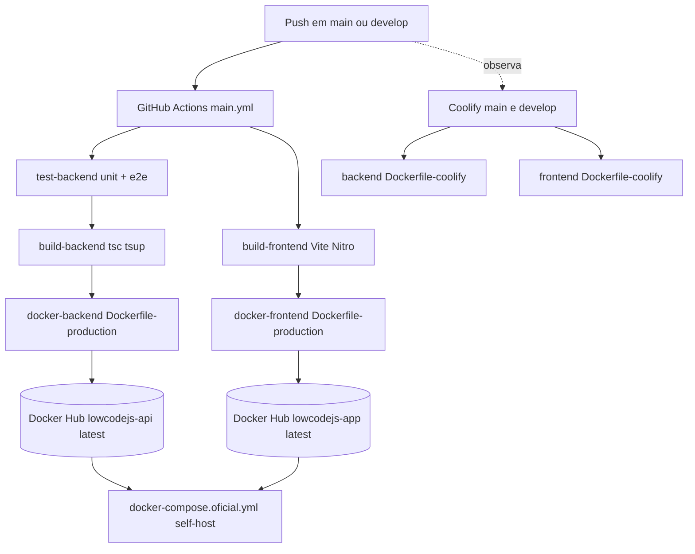
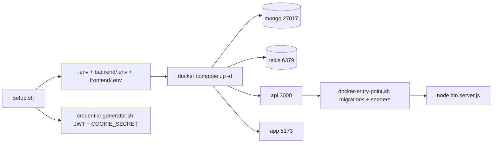
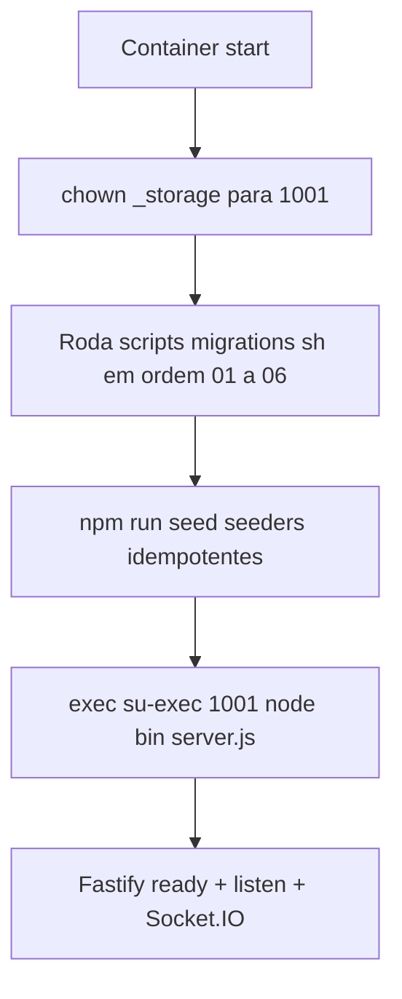

# 09 — Deploy & Setup

> **Fonte:** código-fonte do monorepo LowCodeJS, branch `develop`.
> **Escopo:** este documento descreve o **setup local** (`setup.sh`,
> `credential-generator.sh`, `docker compose up -d`, seed), as **variáveis de
> ambiente** do backend (validadas em `backend/start/env.ts`), o que **vive no
> documento `Setting`** (e não no `.env`), o pipeline de **build** (`tsc` +
> `tsup` no backend; Vite/Nitro no frontend), o **CI/CD** (GitHub Actions →
> Docker Hub `:latest` + Coolify com `Dockerfile-coolify`) e a execução
> **idempotente** de migrations + seeders via `docker-entry-point.sh`.
> Evidências citadas no formato `caminho/arquivo:linha`. Tudo que não pôde ser
> determinado pelo código está marcado como **Não determinável pelo código**.
> Números canônicos reutilizados: **14 models** de sistema, **9 estilos** de
> tabela, **4 roles**, **12 permissões**, **16 tipos de campo**, **~137
> endpoints** (ver `docs/01-overview.md`).

---

## 9.1 Panorama de deploy

O LowCodeJS tem **três cenários** de execução suportados pelo repositório:

| Cenário | Arquivo de orquestração | Imagens | Quem usa |
| --- | --- | --- | --- |
| **Dev local (build local)** | `docker-compose.yml` | builda de `Dockerfile-local` (api/app) | desenvolvimento |
| **Self-host oficial** | `docker-compose.oficial.yml` | `marcosjhollyfer/lowcodejs-{api,app}:latest` (Docker Hub) | VPS sem Coolify |
| **Coolify (build/deploy automático)** | painel Coolify | builda de `Dockerfile-coolify` (api/app) | branches `main` + `develop` |



> Diagrama também em `docs/_assets/09-pipeline-cicd.mmd`.
> Evidências: `.github/workflows/main.yml:4-30`, `docker-compose.oficial.yml:25,49`,
> `backend/Dockerfile-coolify`, `frontend/Dockerfile-coolify`.

---

## 9.2 Setup local

### 9.2.1 Pré-requisitos

Conforme `install.md:5-7`: **Docker** + **Docker Compose** (recomendado),
**Node.js 18+** e **npm** (para dev local fora de container), e **Git Bash**
(obrigatório no Windows, pois os scripts `setup.sh` / `credential-generator.sh`
são shell scripts POSIX).

> Os Dockerfiles e o CI usam **Node 24** (`backend/Dockerfile-production:1`,
> `.github/workflows/main-test-backend.yml:17`); o `install.md` cita Node 18+
> como mínimo para rodar local.

### 9.2.2 `setup.sh` — bootstrap do ambiente

Execução na raiz (`install.md:15-18`):

```bash
chmod +x ./setup.sh
./setup.sh
```

O script (`setup.sh`) executa, em ordem:

| Passo | Ação | Evidência |
| --- | --- | --- |
| 1 | Verifica que está na raiz (existe `docker-compose.yml` ou `docker-compose.oficial.yml`) | `setup.sh:59-62` |
| 2 | Verifica `./.env.example` e `./credential-generator.sh` | `setup.sh:64-74` |
| 3 | Copia `.env.example → .env` e `.env.test.example → .env.test` (se existir) | `setup.sh:82-88` |
| 4 | `chmod +x credential-generator.sh` e o executa (gera JWT + cookie secret) | `setup.sh:90-92` |
| 5 | Interpola variáveis `${VAR}` no `.env` via `envsubst` (com fallback `sed` manual) | `setup.sh:100-142` |
| 6 | Separa o `.env` em `backend/.env` (sem `VITE_*`) e `frontend/.env` (só `VITE_*`) | `setup.sh:150-162` |

Ao final, imprime os próximos passos (`setup.sh:164-181`): subir o stack,
rodar o seed e os endereços de acesso (frontend `:5173`, backend `:3000`, docs
`/documentation`).

> **Variante VPS:** `./setup.sh --frontend-url` (`setup.sh:50-53`) **não**
> recria o `.env`; em vez disso copia os artifacts do container `lowcodejs-app`
> para o volume `lowcodejs_lowcodejs-app-public/_data` e faz **`sed`** trocando
> `http://localhost:3000` pela `APP_SERVER_URL` real (`setup.sh:9-47`). É o passo
> de pós-deploy do fluxo `docker-compose.oficial.yml` (`setup.sh:171-175`).

### 9.2.3 `credential-generator.sh` — JWT + cookie secret

Gera, para cada arquivo `.env` e `.env.test` (se existir):

| Credencial | Como é gerada | Evidência |
| --- | --- | --- |
| `JWT_PRIVATE_KEY` | `openssl genrsa 2048` → `base64` (sem quebras de linha) | `credential-generator.sh:16,21-26` |
| `JWT_PUBLIC_KEY` | `openssl rsa -pubout` → `base64` | `credential-generator.sh:17,22,26` |
| `COOKIE_SECRET` | `openssl rand -hex 32` | `credential-generator.sh:29` |

O script **remove** as chaves antigas (`sed`) e **anexa** as novas ao final do
arquivo (`credential-generator.sh:31-45`); arquivos temporários `.pem` são
apagados (`credential-generator.sh:48`). É chave **RS256** em base64 — o mesmo
formato que `@fastify/jwt` espera (`JWT_PUBLIC_KEY`/`JWT_PRIVATE_KEY` em
`backend/start/env.ts:12-13`).

> **Aviso de segurança** (`install.md:180`, `.env.example:84`): **nunca** use as
> chaves placeholder (`GENERATE_YOUR_OWN_*`, `.env.example:91-97`) em produção.

### 9.2.4 Subir o stack + seed

```bash
docker compose up -d                          # mongo, redis, api, app
docker exec -it low-code-js-api npm run seed  # seeders idempotentes
```

`docker compose up -d` sobe os 4 serviços **core** (`docker-compose.yml`); o
seed pode ser disparado manualmente (`install.md:48-50`) **ou** roda
automaticamente no boot do container via `docker-entry-point.sh` (ver §9.7).

| Serviço | Container | Imagem / build | Porta host | Evidência |
| --- | --- | --- | --- | --- |
| `mongo` | `low-code-js-mongo` | `mongo:latest` | `27017` | `docker-compose.yml:4-22` |
| `redis` | `low-code-js-redis` | `redis:7-alpine` | `6379` | `docker-compose.yml:77-92` |
| `api` | `low-code-js-api` | build `backend/Dockerfile-local` | `${APP_SERVER_PORT}:3000` | `docker-compose.yml:24-53` |
| `app` | `low-code-js-app` | build `frontend/Dockerfile-local` | `${APP_CLIENT_PORT}:5173` | `docker-compose.yml:55-75` |
| `mcp` *(profile `ai`)* | `low-code-js-mcp` | `marcosjhollyfer/lowcodejs-mcp:latest` | `${MCP_PORT:-3001}:3000` | `docker-compose.yml:94-114` |

O serviço `api` define `depends_on` com `condition: service_healthy` para
`mongo` e `redis` (`docker-compose.yml:39-43`); `app` depende de `api` saudável
(`docker-compose.yml:70-72`). Healthcheck da API:
`curl -f http://localhost:3000/health-check` (`docker-compose.yml:48-49`).

> O `docker-compose.override.yml` (carregado automaticamente pelo Compose)
> remapeia apenas a porta do Redis para `6380:6379`
> (`docker-compose.override.yml:1-4`).

**Assistente IA (opcional):** `docker compose --profile ai up -d` sobe o
container `mcp` (`docker-compose.yml:95`, `install.md:68-94`); a **chave OpenAI**
e o toggle ficam no `Setting` (ver §9.6), não no `.env`.



> Diagrama também em `docs/_assets/09-fluxo-setup-local.mmd`.

### 9.2.5 Dev nativo (backend/frontend fora de container)

`install.md:98-123`: sobe só `mongo`+`redis` em Docker
(`docker compose up -d mongo redis --build`) e roda backend (`npm install` →
`npm run seed` → `npm run dev`) e frontend (`npm install` → `npm run dev`)
direto na máquina. Os defaults de `.env.example` apontam para `127.0.0.1`
justamente para esse cenário (`.env.example:1-12`).

---

## 9.3 Variáveis de ambiente do backend

Todas validadas com **Zod** em `backend/start/env.ts:7-52`. O loader escolhe
`.env.test` quando `NODE_ENV === 'test'`, senão `.env`
(`backend/start/env.ts:4-5`). Se a validação falha, o processo **lança erro** e
não sobe (`backend/start/env.ts:54-59`).

| Variável | Obrig./Default | Tipo / transform | Descrição | Evidência |
| --- | --- | --- | --- | --- |
| `DATABASE_URL` | **obrigatória** | `string().trim()` | Connection string MongoDB (host + auth). Em Compose é sobrescrita para `mongo:27017` | `env.ts:8` |
| `DB_DATABASE` | `lowcodejs` | `string` | Nome do DB **system** (14 models nativos) | `env.ts:9` |
| `DB_DATA_DATABASE` | `lowcodejs_data` | `string` | Nome do DB **data** (collections dinâmicas por `table.slug`, via `getDataConnection()`) | `env.ts:10` |
| `JWT_PUBLIC_KEY` | **obrigatória** | `string` | Chave pública RS256 em base64 | `env.ts:12` |
| `JWT_PRIVATE_KEY` | **obrigatória** | `string` | Chave privada RS256 em base64 | `env.ts:13` |
| `COOKIE_SECRET` | **obrigatória** | `string` | Secret para cookies assinados httpOnly | `env.ts:14` |
| `COOKIE_DOMAIN` | opcional | `string().optional()` | Domínio dos cookies (cross-subdomain) | `env.ts:15` |
| `NODE_ENV` | `development` | `enum(development\|test\|production)` | Ambiente de execução | `env.ts:17-19` |
| `PORT` | `3000` | `coerce.number()` | Porta HTTP do backend | `env.ts:20` |
| `DEMO_MODE` | `false` | `'true'\|'false'` → `boolean` | Habilita o seed de usuários demo (ver §9.8) | `env.ts:22-25` |
| `APP_SERVER_URL` | **obrigatória** | `string().trim()` | URL pública do backend (usada em CORS, URLs de storage local, chat) | `env.ts:27` |
| `APP_CLIENT_URL` | **obrigatória** | `string().trim()` | URL pública do frontend (CORS, chat) | `env.ts:28` |
| `ALLOWED_ORIGINS` | `https://lowcodejs.org;*.lowcodejs.org` | `string` → `string[]` (split por `;`) | Origens extra para CORS; `APP_SERVER_URL`/`APP_CLIENT_URL` são sempre incluídas | `env.ts:30-38` |
| `REDIS_URL` | `redis://localhost:6379` | `string` | Conexão Redis (cache + filas BullMQ). Em Compose vira `redis://redis:6379` | `env.ts:40` |
| `MCP_SERVER_URL` | opcional | `string().optional()` | URL do MCP server (tools do chat IA). Em Compose vira `http://mcp:3000/mcp` | `env.ts:42` |
| `STORAGE_MIGRATION_CONCURRENCY` | `5` | `coerce.number().int().min(1).max(20)` | Arquivos copiados em paralelo na migração de storage | `env.ts:44-49` |
| `EMAIL_WORKER_CONCURRENCY` | `5` | `coerce.number().int().min(1).max(50)` | Jobs de e-mail processados em paralelo pelo worker BullMQ | `env.ts:51` |

> **`DEMO_MODE`** aceita **literalmente** `"true"` ou `"false"`; qualquer outro
> valor falha a validação Zod (`env.ts:23-24`). Quando `"true"`, o transform
> retorna o booleano `true` (`env.ts:25`).

### 9.3.1 Hosts: dev nativo vs Docker Compose

Os defaults de `.env.example` apontam `127.0.0.1`/`localhost`
(`.env.example:48,60-61,104,123`) porque o cenário padrão de dev é
backend/frontend **na máquina** com mongo+redis em Docker. Quando o stack inteiro
sobe via Compose, o **próprio Compose sobrescreve** `DATABASE_URL`, `REDIS_URL`
e `MCP_SERVER_URL` com hosts internos da rede Docker:

| Variável | `.env.example` (dev nativo) | Override do Compose | Evidência |
| --- | --- | --- | --- |
| `DATABASE_URL` | `mongodb://...@127.0.0.1:27017/...` | `mongodb://...@mongo:27017/...` | `.env.example:48` / `docker-compose.yml:34` |
| `REDIS_URL` | `redis://localhost:6379` | `redis://redis:6379` | `.env.example:104` / `docker-compose.yml:35` |
| `MCP_SERVER_URL` | `http://localhost:3001/mcp` | `http://mcp:3000/mcp` | `.env.example:123` / `docker-compose.yml:36` |

Não é preciso editar o `.env` para alternar entre os modos
(`install.md:136-142`, `.env.example:9-12`).

### 9.3.2 Variáveis usadas **fora** do `env.ts`

Algumas variáveis aparecem em `.env.example` / Compose mas **não** são
consumidas por `backend/start/env.ts` (são lidas pelo Compose ou pelo
frontend):

| Variável | Onde é usada | Evidência |
| --- | --- | --- |
| `DB_USERNAME`, `DB_PASSWORD` | montam `DATABASE_URL` e credenciais do `mongo` no Compose | `docker-compose.yml:9-10,34` |
| `APP_SERVER_PORT`, `APP_CLIENT_PORT` | mapeamento de portas host nos serviços | `docker-compose.yml:31,62` |
| `VITE_API_BASE_URL` | build-time do frontend (URL da API) | `docker-compose.yml:65`; `.env.example:64` |
| `MCP_PORT`, `COMPOSE_PROFILES` | porta do `mcp` / ativação de profiles | `docker-compose.yml:100`; `.env.example:124,130` |

> O `.env.test` usado em CI define ainda `EMAIL_PROVIDER_*`,
> `FILE_UPLOAD_ACCEPTED`, `LOGO_SMALL_URL`/`LOGO_LARGE_URL`
> (`.github/workflows/main-test-backend.yml:32-38`) — esses **não** estão no
> schema de `env.ts` (são lidos do `Setting` em runtime; ver §9.6), e em CI
> servem apenas para os fixtures de teste.

---

## 9.4 Build

### 9.4.1 Backend — `tsc` + `tsup`

`npm run build` = **`tsc -b && tsup`** (`backend/package.json:10`). O `tsc -b`
faz o type-check incremental (project references) e o `tsup` empacota para
`build/` (ESM, ES2024, sem bundle de `node_modules` — ver `backend/CLAUDE.md` →
"Build & Deploy"). O entrypoint de produção é `node build/bin/server.js`
(`backend/package.json:9`).

No CI, após o build há um **prune de devDependencies** e a cópia do
`standalone.js` do Scalar para `build/dist/js`
(`.github/workflows/main-build-backend.yml:28-36`).

| Comando | Efeito | Evidência |
| --- | --- | --- |
| `npm run dev` | `node --import @swc-node/register/esm-register --watch bin/server.ts` (transpile rápido via SWC) | `backend/package.json:8` |
| `npm run build` | `tsc -b && tsup` → `build/` | `backend/package.json:10` |
| `npm start` | `node build/bin/server.js` (produção) | `backend/package.json:9` |
| `npm run seed` | `node ... database/seeders/main.ts` | `backend/package.json:11` |
| `npm run seed:prod` | `node database/seeders/main.js` (build já compilado) | `backend/package.json:12` |

### 9.4.2 Frontend — Vite + Nitro (TanStack Start)

`npm run build` builda o SSR com `NODE_OPTIONS=--max-old-space-size` elevado
(`.github/workflows/main-build-frontend.yml:24-28`, `frontend/CLAUDE.md` →
"Build & Deploy"); o output vai para `.output/` e é servido por
`node .output/server/index.mjs` (Nitro). As URLs hardcoded (`http://localhost:3000`)
são reescritas **em runtime** pelo `frontend/docker-entrypoint.sh` quando
`VITE_API_BASE_URL` difere do default (`frontend/docker-entrypoint.sh:5-10`).

### 9.4.3 Dockerfiles

| Dockerfile | Base | Uso | Entrypoint / CMD | Evidência |
| --- | --- | --- | --- | --- |
| `backend/Dockerfile-local` | `node:24-alpine` | dev (volume-mounted) | `docker-entry-point.sh` → `npm run dev` | `backend/Dockerfile-local:18-19` |
| `backend/Dockerfile-production` | `node:24-alpine` | imagem `:latest` (CI) | `docker-entry-point.sh` → `node bin/server.js`; user non-root 1001 | `backend/Dockerfile-production:39-40,29-31` |
| `backend/Dockerfile-coolify` | `node:24-alpine` multi-stage | Coolify (builda + roda) | `docker-entry-point.sh` → `node bin/server.js` | `backend/Dockerfile-coolify:12,33,39-40` |
| `frontend/Dockerfile-coolify` | `node:24-alpine` multi-stage | Coolify | `node .output/server/index.mjs`; user non-root 1001 | `frontend/Dockerfile-coolify:27,45,51` |

> **Observação (frontend Coolify):** o `ENTRYPOINT` para o
> `docker-entrypoint.sh` está **comentado** (`frontend/Dockerfile-coolify:50`),
> de modo que o container roda direto `node .output/server/index.mjs`. A
> reescrita de URL via `sed` só ocorre quando o entrypoint é efetivamente usado.

---

## 9.5 CI/CD

### 9.5.1 GitHub Actions → Docker Hub `:latest`

Workflow raiz `main.yml`, disparado em push para `main` **e** `develop`
(`.github/workflows/main.yml:4-5`). Orquestra workflows reutilizáveis:

| Job | Depende de | O que faz | Evidência |
| --- | --- | --- | --- |
| `test-backend` | — | unit (`test:unit`) + e2e (`test:e2e`, com services `mongo:7` + `redis:7-alpine`) | `main.yml:8-9`; `main-test-backend.yml` |
| `build-backend` | `test-backend` | `npm run build` + prune + artifact `backend-build` | `main.yml:11-13`; `main-build-backend.yml` |
| `build-frontend` | — (paralelo) | `npm run build` + artifact `frontend-build` | `main.yml:15-16`; `main-build-frontend.yml` |
| `docker-backend` | `build-backend` | build/push `lowcodejs-api:latest` (linux/amd64+arm64) | `main.yml:18-23`; `main-docker-backend.yml:39-48` |
| `docker-frontend` | `build-frontend` | build/push `lowcodejs-app:latest` (linux/amd64+arm64) | `main.yml:25-30`; `main-docker-frontend.yml:39-48` |

As imagens Docker são construídas a partir do **`Dockerfile-production`**
(api e app), com cache GHA, e publicadas como
`${DOCKERHUB_USERNAME}/lowcodejs-{api,app}:latest`
(`main-docker-backend.yml:43-48`, `main-docker-frontend.yml:43-48`). Segredos
`DOCKERHUB_USERNAME` / `DOCKERHUB_TOKEN` vêm do repositório (`main.yml:21-23`).

Essas imagens `:latest` são exatamente as que alimentam o
`docker-compose.oficial.yml` (`docker-compose.oficial.yml:25,49`).

> **Nota:** embora o `main.yml` rode também em push de `develop`, ambas as
> imagens são publicadas com a tag fixa **`:latest`** (não há tag por
> branch/commit no workflow). **Não determinável pelo código** se há proteção
> que restrinja o push a `main` apenas — o gatilho declarado inclui ambas as
> branches.

### 9.5.2 Coolify (`main` + `develop`)

Conforme `CLAUDE.md` (raiz, seção "Deploy (CI/CD)"): **Coolify** observa as
branches `main` e `develop` e faz build/deploy automático a partir de
`backend/Dockerfile-coolify` e `frontend/Dockerfile-coolify`. As variáveis de
ambiente são configuradas no **painel do Coolify**.

**Build args do frontend** (injetados como `ARG`/`ENV` no estágio de build do
`frontend/Dockerfile-coolify:15-25`):

| Build arg | Papel | Evidência |
| --- | --- | --- |
| `VITE_API_BASE_URL` | URL da API embutida no bundle | `frontend/Dockerfile-coolify:15,21` |
| `APP_SERVER_URL` | URL pública do backend | `frontend/Dockerfile-coolify:16,22` |
| `APP_CLIENT_URL` | URL pública do frontend | `frontend/Dockerfile-coolify:17,23` |
| `LOGO_SMALL_URL` / `LOGO_LARGE_URL` | logos default no build | `frontend/Dockerfile-coolify:18-19,24-25` |

> Logos, branding, locale, storage, SMTP e IA **não** são build args em
> produção — vivem no documento `Setting` do MongoDB e são editados pela UI
> `/settings` (ver §9.6 e `CLAUDE.md` raiz). Os `LOGO_*_URL` no Dockerfile-coolify
> apenas semeiam defaults de build.

---

## 9.6 O que vive no `Setting` (e **não** no `.env`)

O `.env` cobre **apenas infraestrutura** (DB, JWT, cookies, CORS, Redis, MCP,
workers). Tudo que é **configuração de domínio** vive no documento singleton
`Setting` (collection do DB system) e é editado pela UI `/settings` (usuário
**MASTER**) ou pelo **Setup Wizard** no primeiro acesso
(`backend/CLAUDE.md` → "Variaveis de Ambiente"; `install.md:29-32,158-160`).

| Grupo | Campos no `Setting` | Comportamento | Evidência |
| --- | --- | --- | --- |
| **Branding / locale** | `SYSTEM_NAME`, `SYSTEM_DESCRIPTION`, `LOGO_SMALL_URL`, `LOGO_LARGE_URL`, `LOCALE` (default `pt-br`) | carregados no SSR via server function (`__root.tsx`) | `docs/01-overview.md` §1.4.3; `frontend/CLAUDE.md` |
| **Upload / paginação** | aceite de arquivos, limites, perPage | lidos em runtime | `backend/CLAUDE.md` |
| **Storage S3** | `STORAGE_DRIVER` (`local`/`s3`), `STORAGE_ENDPOINT`, `STORAGE_REGION`, `STORAGE_BUCKET`, `STORAGE_ACCESS_KEY`, `STORAGE_SECRET_KEY` | no boot, `syncStorageEnv()` sincroniza `Setting → process.env` | `backend/CLAUDE.md` → "Storage"; `config/setting-env-sync.ts` |
| **E-mail SMTP** | `EMAIL_PROVIDER_HOST`, `_PORT`, `_USER`, `_PASSWORD`, `_FROM` (todos nullable) | `NodemailerEmailService` lê do `Setting` a cada envio; se faltar credencial, retorna `{ success:false }` sem lançar erro | `backend/CLAUDE.md` → "Email (SMTP)" |
| **IA / OpenAI** | `OPENAI_API_KEY`, `AI_ASSISTANT_ENABLED` | `chat.socket` lê do model a cada conexão (não usa `process.env`) | `backend/CLAUDE.md` → "AI/Chat"; `chat.socket.ts` |

> Por isso, no `.env.example`, as seções **ARMAZENAMENTO** e **ASSISTENTE IA**
> são apenas comentários explicativos (`.env.example:66-70,114-124`): não há
> variável de driver/credencial S3 nem chave OpenAI para definir ali.

---

## 9.7 Inicialização em container (`docker-entry-point.sh`)

Em container, antes de iniciar o servidor, o **`backend/docker-entry-point.sh`**
roda como `ENTRYPOINT` (`backend/Dockerfile-production:39`,
`backend/Dockerfile-coolify:39`). Sequência (`backend/docker-entry-point.sh`):



> Diagrama também em `docs/_assets/09-entrypoint-boot.mmd`.

| Passo | Comando | Detalhe | Evidência |
| --- | --- | --- | --- |
| 1 | `chown -R 1001:1001 _storage` | ajusta permissões do storage local | `docker-entry-point.sh:6` |
| 2 | loop `for script in scripts/migrations/*.sh` | roda **todas** as 6 migrations shell em ordem alfabética | `docker-entry-point.sh:16-20` |
| 3 | `runas npm run seed` (ou `node main.js`) | executa seeders como user 1001 (`su-exec`) | `docker-entry-point.sh:22-27` |
| 4 | `exec su-exec 1001 "$@"` | troca para o CMD (`node bin/server.js`) já como non-root | `docker-entry-point.sh:29-33` |

### 9.7.1 Migrations idempotentes (`scripts/migrations/*.sh`)

Cada `*.sh` localiza o `migrate-*.ts/.js` e o executa; a **idempotência** vive
no script Node (marcadores no `Setting` singleton). Os scripts shell rodam em
**todo boot** — quando já aplicada, a migration é no-op com uma query
(`backend/CLAUDE.md` → "Migrations").

| Script | Migration | Idempotência | Evidência |
| --- | --- | --- | --- |
| `01-dual-connection.sh` | copia collections dinâmicas do DB system → DB data | marker `MIGRATION_DUAL_CONNECTION_AT` | `scripts/migrations/01-dual-connection.sh:2-5` |
| `02-group-native-fields.sh` | garante 5 campos nativos em subtabelas `FIELD_GROUP` | verifica presença antes de inserir | `scripts/migrations/02-group-native-fields.sh:2-5` |
| `03-backfill-storage-location.sh` | backfill `location`/`migration_status` em `Storage` | marker `MIGRATION_STORAGE_LOCATION_AT` | `scripts/migrations/03-backfill-storage-location.sh:2-5` |
| `04-backfill-relationship-create-records.sh` | backfill de registros de criação em campos RELATIONSHIP | marker no `Setting` | `scripts/migrations/04-backfill-relationship-create-records.sh:2-4` |
| `05-extension-slots.sh` | renomeia `slot` → `slots` (array) em extensões | marker no `Setting` | `scripts/migrations/05-extension-slots.sh:2-5` |
| `06-relationship-table-id.sh` | backfill `relationship.table._id` em Fields RELATIONSHIP | marker `MIGRATION_RELATIONSHIP_TABLE_ID_AT` | `scripts/migrations/06-relationship-table-id.sh:2-5` |

> **Atenção (`03`):** no estado atual da branch, o corpo do
> `03-backfill-storage-location.sh` está **comentado**
> (`scripts/migrations/03-backfill-storage-location.sh:24-28`) — ele apenas
> imprime a mensagem e **não executa** a migration `migrate-backfill-storage-location`.
> A população do campo `location` ocorre, na prática, junto à feature de
> storage-migration (ver `backend/CLAUDE.md` → "Backfill").

---

## 9.8 Seeders idempotentes

`npm run seed` executa `database/seeders/main.ts`, que descobre os
`*.seed.(ts|js)`, valida o filename, **ordena por timestamp** e executa
sequencialmente; em falha, loga o arquivo e faz `process.exit(1)`
(`backend/CLAUDE.md` → "Seeders").

| Seeder | Dados | Idempotência | Evidência |
| --- | --- | --- | --- |
| `1720448435-permissions.seed.ts` | **12 permissões** (CREATE/UPDATE/REMOVE/VIEW × TABLE/FIELD/ROW) | upsert por `slug` com `$set` | `database/seeders/1720448435-permissions.seed.ts` |
| `1720448445-user-group.seed.ts` | **4 grupos** (MASTER, ADMINISTRATOR, MANAGER, REGISTERED) | metadados `$set`; `permissions` via `$setOnInsert` (preserva customização manual) | `database/seeders/1720448445-user-group.seed.ts` |
| `1720465893-settings.seed.ts` | `Setting` singleton; marca `SETUP_COMPLETED=true` se já existe MASTER, senão `$setOnInsert: {}` | upsert do singleton | `database/seeders/1720465893-settings.seed.ts` |
| `1778025600-demo-users.seed.ts` | usuários demo (`admin@admin.com` / `registered@registered.com`) | **gated por `DEMO_MODE=true`**; `$set` em todos os campos, senha re-hashada a cada seed; no-op silencioso fora de demo | `database/seeders/1778025600-demo-users.seed.ts`; `.env.example:29-34` |

> O usuário **MASTER não tem seed** — é criado pelo **Setup Wizard** na primeira
> execução (`POST /setup/step/admin`); ver `docs/01-overview.md` §1.3. As 12
> permissões e os 4 grupos seedados são os mesmos números canônicos do RBAC
> (ver `docs/06-security.md` e `docs/05-domain-rules.md`).

> **`DEMO_MODE`:** use `"true"` **apenas** em instâncias demo públicas — as
> credenciais são conhecidas e a senha é re-hashada a cada `npm run seed`
> (`.env.example:29-34`).

---

## 9.9 Self-host com `docker-compose.oficial.yml`

Para VPS sem Coolify, o `docker-compose.oficial.yml` usa as imagens `:latest`
do Docker Hub (sem build local):

| Serviço | Container | Imagem | Porta host | Evidência |
| --- | --- | --- | --- | --- |
| `mongo` | `lowcodejs-mongo` | `mongo:latest` (volume `lowcodejs-mongo-data`) | — (rede interna) | `docker-compose.oficial.yml:5-21,75-76` |
| `api` | `lowcodejs-api` | `marcosjhollyfer/lowcodejs-api:latest` | `${APP_SERVER_PORT:-3000}:3000` | `docker-compose.oficial.yml:24-45` |
| `app` | `lowcodejs-app` | `marcosjhollyfer/lowcodejs-app:latest` | `${APP_CLIENT_PORT:-5173}:3000` | `docker-compose.oficial.yml:48-71` |

Fluxo (`setup.sh:171-175`, `install.md`):

```bash
# 1. Ajustar APP_SERVER_URL no .env (ex.: http://SEU_IP:3000)
# 2. Subir o stack oficial
docker compose -f docker-compose.oficial.yml up -d
# 3. Reescrever a URL da API nos artifacts do frontend
./setup.sh --frontend-url
# 4. Seed (caso não tenha rodado via entrypoint)
docker exec lowcodejs-api node database/seeders/main.js
```

> No `oficial.yml`, o `app` expõe a porta **interna 3000** (Nitro,
> `NITRO_PORT=3000`) mapeada no host para `5173`
> (`docker-compose.oficial.yml:55-58`), e recebe `VITE_API_BASE_URL` de
> `APP_SERVER_URL` (`docker-compose.oficial.yml:54`). O storage local é
> persistido no volume `lowcodejs-storage:/app/_storage`
> (`docker-compose.oficial.yml:33-34`).

---

## 9.10 Acessos e healthcheck

| Recurso | URL (dev local) | Evidência |
| --- | --- | --- |
| Frontend | `http://localhost:5173` | `install.md:56`; `setup.sh:178` |
| Backend (API) | `http://localhost:3000` | `install.md:57`; `setup.sh:179` |
| Docs OpenAPI (Scalar) | `http://localhost:3000/documentation` | `install.md:58`; `backend/CLAUDE.md` |
| OpenAPI JSON | `http://localhost:3000/openapi.json` | `backend/CLAUDE.md` |
| Health-check (liveness) | `http://localhost:3000/health-check` | `docker-compose.yml:49`; `docs/10-observability.md` §10.1 |

---

## 9.11 Reset / limpeza

Para remover containers, imagens e volumes (apaga **todos** os dados),
`install.md:184-199`:

```bash
docker compose --profile s3 --profile ai down
docker system prune -f -a --volumes
docker volume rm low-code-js_mongo-volume
```

> **Atenção:** isso apaga o banco. Em produção, faça **backup** dos volumes
> `mongo-data` e `storage` antes de qualquer reset.

---

## 9.12 Resumo operacional

- **Setup**: `./setup.sh` (gera `.env`, JWT, cookie secret, separa
  backend/frontend) → `docker compose up -d` → seed (manual ou via entrypoint).
- **Env do backend**: 18 chaves validadas por Zod em `backend/start/env.ts`;
  5 são **obrigatórias** (`DATABASE_URL`, `JWT_PUBLIC_KEY`, `JWT_PRIVATE_KEY`,
  `COOKIE_SECRET`, `APP_SERVER_URL`, `APP_CLIENT_URL` — 6 contando ambas as URLs).
- **Config de domínio** (branding, locale, S3, SMTP, IA) **não** está no `.env`:
  vive no `Setting` (UI `/settings`, MASTER).
- **Build**: backend `tsc -b && tsup` → `build/`; frontend Vite/Nitro →
  `.output/`.
- **CI/CD**: GitHub Actions (`main`+`develop`) → testes → build → Docker Hub
  `:latest`; Coolify observa `main`+`develop` e builda de `Dockerfile-coolify`.
- **Boot em container**: `docker-entry-point.sh` roda 6 migrations idempotentes
  + seeders (4) antes de `node bin/server.js`.
</content>
</invoke>
