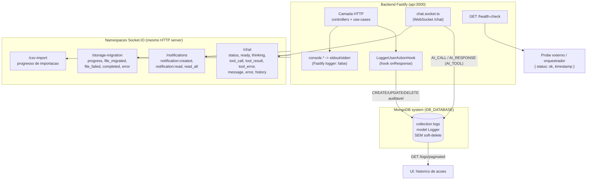
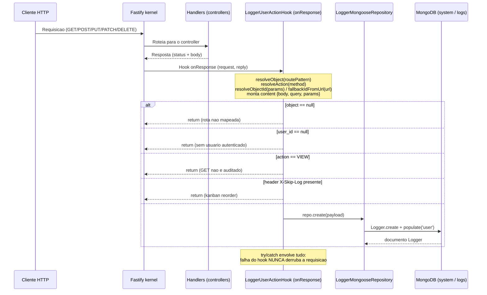

# 10 — Observabilidade

> **Fonte:** código-fonte do LowCodeJS, branch `develop` (backend Fastify 5 + MongoDB).
> **Escopo:** auditoria de ações de usuário (model/recurso `Logger`), health-check,
> logging do Fastify, eventos de WebSocket e lacunas de observabilidade (métricas/tracing).
> Evidências citadas no formato `caminho/arquivo.ts:linha`. Tudo que não pôde ser
> determinado pelo código está marcado como **Não determinável pelo código**.

---

## 10.1 Panorama

A observabilidade do LowCodeJS é deliberadamente **enxuta** e centrada em **auditoria
de ações de usuário**, não em telemetria operacional. As superfícies existentes são:

| Superfície | Tipo | Persistência | Quem produz | Quem consome |
| --- | --- | --- | --- | --- |
| Model `Logger` / collection `logs` | Trilha de auditoria | MongoDB (system DB) | Hook `onResponse` + `chat.socket.ts` | `GET /logs/paginated` (UI) |
| `console.*` (info/error/warn/log) | Logs de processo | stdout/stderr efêmero | Toda a aplicação | **Não determinável pelo código** (captura externa) |
| `GET /health-check` | Liveness probe | — (resposta síncrona) | `health-check.controller.ts` | Probe externo / orquestrador |
| Namespaces Socket.IO | Eventos em tempo real | — (efêmero, in-memory) | sockets `/chat`, `/notifications`, `/storage-migration`, `/csv-import` | clientes WebSocket |

> Diagrama também disponível em `docs/_assets/10-observabilidade-superficies.mmd`.

---

## 10.2 Model `Logger` (collection `logs`)

Arquivo: `backend/application/model/logger.model.ts`. Tipo em
`backend/application/core/entity.core.ts:619` (`ILogger`).

O `Logger` é o **único model do sistema sem soft-delete** — não possui os campos
`trashed`/`trashedAt` presentes em todos os outros 13 models, e é o único que **não**
declara `{ id: false }`. Vive na **conexão system** (`DB_DATABASE`, default `lowcodejs`),
na collection `logs` (`logger.model.ts:48`).

### Schema

| Campo | Tipo Mongoose | Required | Default | Evidência |
| --- | --- | --- | --- | --- |
| `_id` | ObjectId (auto) | — | auto | `logger.model.ts:14` |
| `url` | String | **sim** | — | `logger.model.ts:15` |
| `user` | ObjectId → `User` | não | `null` | `logger.model.ts:16-21` |
| `action` | String enum `E_LOGGER_ACTION_TYPE` | **sim** | — | `logger.model.ts:22-26` |
| `object` | String enum `E_LOGGER_OBJECT_TYPE` | **sim** | `null` | `logger.model.ts:27-32` |
| `object_id` | String | não | `null` | `logger.model.ts:33-37` |
| `content` | Mixed | não | `null` | `logger.model.ts:38-42` |
| `createdAt` | Date (auto) | — | timestamps | `logger.model.ts:44` |
| `updatedAt` | Date (auto) | — | timestamps | `logger.model.ts:44` |

> **Incerteza / contradição no schema:** o campo `object` declara
> `required: true` **e** `default: null` simultaneamente (`logger.model.ts:30-31`).
> Na prática, como todas as escritas conhecidas sempre fornecem `object` (ver §10.3 e
> §10.4) e o hook aborta quando `object` é `null` (`logger.hook.ts:222`), a contradição
> não chega a ser exercida — mas é um defeito latente no schema. No tipo, `object`
> aceita `null` (`entity.core.ts:625-627`), divergindo do `required: true` do schema.

> **Sem índices explícitos.** O schema do `Logger` não declara nenhum `Schema.index(...)`.
> Consultas por `user`, `action`, `object`, `createdAt` e `search` (regex) percorrem a
> collection sem índice de suporte além do `_id` padrão — ponto de atenção de
> performance conforme a collection cresce (a collection **não** é purgada por nenhuma
> rotina visível no código; ver §10.7).

### Enums de auditoria

`E_LOGGER_ACTION_TYPE` (`entity.core.ts:591-598`) — 6 valores:

| Valor | Significado / origem |
| --- | --- |
| `VIEW` | Leituras (GET). **Nunca persistido** pelo hook HTTP (abortado em `logger.hook.ts:232`) |
| `CREATE` | Mapeado de `POST` (`logger.hook.ts:16`) |
| `UPDATE` | Mapeado de `PUT` e `PATCH` (`logger.hook.ts:18-19`) |
| `DELETE` | Mapeado de `DELETE` (`logger.hook.ts:20`) |
| `AI_CALL` | Chamada de tool MCP pelo assistente IA (`chat.socket.ts:399`) |
| `AI_RESPONSE` | Resultado/erro de tool MCP (`chat.socket.ts:450,476`) |

`E_LOGGER_OBJECT_TYPE` (`entity.core.ts:600-617`) — 16 valores:
`TABLE`, `FIELD`, `ROW`, `MENU`, `USER`, `EXTENSION`, `GROUP_FIELD`, `GROUP_ROW`,
`PAGE`, `PERMISSION`, `PROFILE`, `SETTING`, `SETUP`, `STORAGE`, `USER_GROUP`, `AI_TOOL`.

> **Incerteza — cobertura parcial dos object types:** o `OBJECT_MAP` do hook
> (`logger.hook.ts:28-49`) só resolve **14** dos 16 valores a partir da URL:
> `GROUP_ROW`, `FIELD`, `ROW`, `TABLE`, `USER`, `USER_GROUP`, `MENU`, `EXTENSION`,
> `PAGE`, `PERMISSION`, `PROFILE`, `SETTING`, `SETUP`, `STORAGE`. **Não há** entrada
> para `GROUP_FIELD` (rotas `/groups/.../fields` casam primeiro em `/groups` →
> `GROUP_ROW`, não `GROUP_FIELD` — `logger.hook.ts:33` antes de `:35`) nem para
> `AI_TOOL` (este só é gravado fora do hook, pelo `chat.socket.ts`). Ou seja:
> `GROUP_FIELD` está definido no enum mas **nunca é produzido** pelo código atual.

---

## 10.3 Auditoria via hook `onResponse` (`hooks/logger.hook.ts`)

Registro: `kernel.addHook('onResponse', LoggerUserActionHook)` em
`backend/start/kernel.ts:142`. Roda **após** a resposta ser enviada, de forma
assíncrona em relação ao cliente — o custo da escrita do log não bloqueia o retorno
ao usuário.

### O que é registrado (e o que NÃO é)

O hook deriva cada campo do log a partir da requisição:

| Campo do log | Como é resolvido | Evidência |
| --- | --- | --- |
| `action` | `ACTION_MAP[method]` (GET→VIEW, POST→CREATE, PUT/PATCH→UPDATE, DELETE→DELETE); fallback `VIEW` | `logger.hook.ts:15-21,130-132` |
| `object` | `resolveObject(routePattern)` — primeiro `match` de `OBJECT_MAP` contido no padrão da rota | `logger.hook.ts:118-128,216` |
| `object_id` | `resolveObjectId(params)` por prioridade (`itemId`→`messageId`→`fieldId`→`rowId`→`_id`→`id`→`slug`→`groupSlug`); fallback `fallbackIdFromUrl(url)` | `logger.hook.ts:137-171,217-218` |
| `url` | `request.url` (URL real, com query) | `logger.hook.ts:241` |
| `user_id` | `response.request.user?.sub` (do JWT) ou `null` | `logger.hook.ts:219` |
| `content` | objeto `{ body?, query?, params? }` montado condicionalmente | `logger.hook.ts:193-213` |

Observações sobre `content` (`logger.hook.ts:189-213`):
- só monta `body` para métodos com corpo (`POST`/`PUT`/`PATCH`);
- se o corpo **não** for JSON, grava `{ raw: '[Non-JSON payload]' }` (ex.: multipart);
- `query` e `params` só entram se não vazios; se nada se aplica, `content = null`.

### Guardas — quando o hook NÃO grava nada (early return)

| Condição | Motivo declarado no código | Evidência |
| --- | --- | --- |
| `object === null` | Rota não mapeia para nenhum objeto conhecido (ex.: `/health-check`, `/authentication/*`) | `logger.hook.ts:222` |
| `user_id` ausente | Sem identidade o log vira ruído ("Anônimo") — exclui SSR, endpoints públicos, healthchecks | `logger.hook.ts:226` |
| `action === VIEW` | GETs não são auditados: carregar uma página dispara muitas leituras paralelas que poluiriam o histórico | `logger.hook.ts:232` |
| Header `X-Skip-Log` presente | Reordenação kanban (posicionamento sem mudança de coluna); o frontend envia `X-Skip-Log: true` | `logger.hook.ts:237` |

> O header `X-Skip-Log` está liberado no CORS (`kernel.ts:109`), permitindo que o
> frontend cross-origin envie esse opt-out de log. Contexto da feature: redução de ruído
> de logs do kanban (ver `docs/superpowers/plans/2026-05-25-kanban-log-noise.md`).

### Resiliência do hook

Todo o corpo de `LoggerUserActionHook` está em `try/catch` (`logger.hook.ts:179,249-252`);
falhas na escrita do log são apenas logadas via `console.error('[Logger Hook] ...')` e
**nunca derrubam a requisição**. A instância do repositório é obtida via
`getInstanceByToken<LoggerContractRepository>(LoggerMongooseRepository)`
(`logger.hook.ts:180-182`).

> Diagrama também disponível em `docs/_assets/10-fluxo-logger-hook.mmd`.

### Repositório `Logger`

`backend/application/repositories/logger/logger-mongoose.repository.ts` implementa
`LoggerContractRepository` (`.../logger-contract.repository.ts`). Métodos: `create`,
`findById`, `findMany`, `update`, `count`. Notas:
- `create` grava `user: user_id ?? null` e faz `populate({ path: 'user' })`
  (`logger-mongoose.repository.ts:62-70`);
- `findMany` ordena por `createdAt: desc` por padrão (`:97-101`);
- `buildWhereClause` (`:18-53`) suporta filtros por `user_id`, `actions[]`, `objects[]`,
  range `dateFrom`/`dateTo` e `search` por regex em `url`/`object_id`/`action`/`object`
  (`:42-50`). O `search` aplica `normalize()` ao termo (`:43`).

> **Incerteza — `update` existe mas não tem chamador conhecido:** o contrato e a
> implementação expõem `update()` (`logger-contract.repository.ts:34`), porém logs de
> auditoria são tipicamente imutáveis; nenhum recurso REST de logs invoca `update`
> (o único recurso é `paginated`, somente leitura). **Não determinável pelo código** se
> há uso fora do diretório `resources/logs/`.

---

## 10.4 Auditoria de IA (MCP) via `chat.socket.ts`

Diferente das ações HTTP, as interações do assistente IA são auditadas **diretamente**
no socket do chat — não passam pelo hook `onResponse` (são WebSocket, não HTTP). O código
chama `Logger.create(...)` no model, sem usar o repositório (`chat.socket.ts:396,447,473`).

| Evento auditado | `action` | `object` | `url` (sintético) | `object_id` | `content` | Evidência |
| --- | --- | --- | --- | --- | --- | --- |
| Tool MCP invocada | `AI_CALL` | `AI_TOOL` | `mcp://<tool>` | nome da tool | `args` | `chat.socket.ts:396-405` |
| Resultado da tool | `AI_RESPONSE` | `AI_TOOL` | `mcp://<tool>/result` | nome da tool | `{ preview, length }` | `chat.socket.ts:447-456` |
| Erro da tool | `AI_RESPONSE` | `AI_TOOL` | `mcp://<tool>/error` | nome da tool | `{ error }` | `chat.socket.ts:473-482` |

Cada `Logger.create(...)` é fire-and-forget com `.catch()` que apenas loga
(`[MCP Log] create error:`), sem impactar o fluxo do chat. As mesmas operações também
emitem para o cliente via `console.log('[MCP Log] ...')` (stdout) e via eventos Socket.IO
(`tool_call`/`tool_result`/`tool_error` — ver §10.6).

> **Incerteza — `user` recebe `user.sub` (string), não ObjectId tipado:** no chat o campo
> é gravado como `user: user.sub` (`chat.socket.ts:398`), enquanto no caminho HTTP o
> repositório grava `user: user_id ?? null`. O Mongoose faz cast de string para ObjectId,
> mas vale registrar a divergência de caminho de escrita.

---

## 10.5 Health-check (`GET /health-check`)

Arquivo: `backend/application/resources/health-check.controller.ts`. Controller com
`@Controller()` vazio + `@GET({ url: '/health-check' })`, **sem nenhum middleware** —
endpoint **público** (não exige auth).

| Aspecto | Valor | Evidência |
| --- | --- | --- |
| Método/rota | `GET /health-check` | `health-check.controller.ts:6-7` |
| Auth | Nenhuma (público) | sem `onRequest` no decorator |
| Resposta `200` | `{ status: "ok", timestamp: <ISO> }` | `health-check.controller.ts:41-44` |
| Schema OpenAPI | `tags: ['Health']`, enum `status: ['ok']`, `timestamp` date-time | `health-check.controller.ts:9-37` |

> **Limitação — é um liveness puro, não readiness.** O handler responde `200` de forma
> incondicional, sem verificar dependências (MongoDB, Redis, conexão `data`, MCP, workers
> BullMQ). O servidor só aceita conexões após `kernel.ready()` + `kernel.listen()`
> (`bin/server.ts:85-87`), então o `200` indica que o **processo HTTP está vivo**, mas
> **não** garante que o banco ou as filas estejam saudáveis. Não há endpoint de readiness
> separado nem checagem de dependências no código.

> **Nota de path:** o endpoint canônico é `/health-check`. O inventário de API também
> referencia um path `/health` em alguns contextos; **no código** o único healthcheck é
> `/health-check` (`health-check.controller.ts:7`). Outras formas: **Não determinável
> pelo código**.

---

## 10.6 Logging do Fastify e logs de processo

> **O logger nativo do Fastify está DESLIGADO:** `fastify<Server>({ logger: false, ... })`
> em `backend/start/kernel.ts:66-67`. Não há instância `pino` configurada, nem
> `requestId`/`reqId` automático, nem log estruturado de request/response do framework.

Em consequência, **todo o logging operacional é feito via `console.*`** espalhado pelo
código, escrevendo em stdout/stderr de forma **não estruturada** (texto livre, sem
correlação por request). Exemplos representativos:

| Origem | Chamada | Evidência |
| --- | --- | --- |
| Error handler global (fallback 500) | `console.error(error)` | `kernel.ts:202` |
| Hook de log (falha de auditoria) | `console.error('[Logger Hook] ...')` | `logger.hook.ts:251` |
| Use-case de logs (erro 500) | `console.error('[logs > paginated][error]:', error)` | `paginated.use-case.ts:46` |
| Boot do servidor | `console.info('HTTP Server running ...')`, `'Socket.IO ... initialized'`, etc. | `bin/server.ts:88,95-143` |
| Storage / migração | `console.info('[Storage] Driver: ...')`, `'[StorageMigration] Sweep boot: ...'` | `bin/server.ts:51,76` |
| Chat / MCP | `console.log('[MCP Log] ...')`, `console.error('[MCP Log] ...')` | `chat.socket.ts:395,404,446,455,472` |

### Tratamento de erros (correlato de observabilidade)

O error handler global (`kernel.setErrorHandler`, `kernel.ts:145-209`) normaliza erros
em `{ message, code, cause, errors? }` (PT-BR) para 4 famílias: `HTTPException`,
`ZodError`, `FST_ERR_VALIDATION` (AJV) e fallback `500 SERVER_ERROR`. Apenas o **fallback
500** emite `console.error(error)` (`kernel.ts:202`) — erros de domínio tratados
(`HTTPException`, validação) **não** geram log de servidor, apenas resposta ao cliente.

> **Lacunas de logging:**
> - Sem log estruturado (JSON) → dificulta ingestão por agregadores (ELK, Loki, etc.).
> - Sem correlação por request (sem `requestId`/`traceId`).
> - Sem níveis de log configuráveis por ambiente (é `console.*` direto; granularidade
>   fixa no código).
> - O destino dos logs (arquivo, coletor) **não é definido no código** — depende da
>   captura do runtime/container. **Não determinável pelo código.**

---

## 10.7 Eventos de WebSocket (Socket.IO)

Todos os namespaces Socket.IO rodam no **mesmo HTTP server** do Fastify, inicializados em
`bin/server.ts:94-125`, autenticados pelo mesmo JWT RS256 dos cookies. São canais de
**telemetria em tempo real** para o cliente (efêmeros, não persistidos) — exceto o `/chat`,
cujas interações de IA também são gravadas no `Logger` (§10.4).

| Namespace | Init | Eventos emitidos | Evidência |
| --- | --- | --- | --- |
| `/chat` | `initChatSocket` (`server.ts:94`) | `status`, `ready`, `thinking`, `tool_call`, `tool_result`, `tool_error`, `message`, `error`, `history` (`E_CHAT_EVENT`) | `entity.core.ts:133-143`; `chat.socket.ts:390,441,467,488` |
| `/notifications` | `initNotificationsSocket` (`server.ts:100`) | `notification:created`, `notification:read`, `notification:read_all` (`E_NOTIFICATION_EVENT`) | `entity.core.ts:152-156`; `notifications.socket.ts:9-11` |
| `/storage-migration` | `initStorageMigrationSocket` (`server.ts:97`) | `progress`, `file_migrated`, `file_failed`, `completed`, `error` | `storage-migration.socket.ts:9-12,28-31` |
| `/csv-import` | `initCsvImportSocket` (`server.ts:123`) | progresso de importação CSV (assíncrona) | `server.ts:123-125` |

Payloads de exemplo (storage-migration), do cabeçalho do socket
(`storage-migration.socket.ts:9-12`):
- `progress` → `{ job_id, processed, total, current_filename, failed_count, eta_seconds }`
- `file_migrated` → `{ _id, filename, from, to }`
- `file_failed` → `{ _id, filename, error, attempts }`
- `completed` → `{ job_id, total, succeeded, failed, duration_ms }`

> Esses eventos são **observabilidade de progresso para o usuário**, não telemetria para
> operadores. Não há métrica agregada (ex.: contadores Prometheus) derivada deles no
> código.

---

## 10.8 Ausências: métricas e tracing

> **Não há instrumentação de métricas nem tracing distribuído no backend.** Uma busca por
> bibliotecas de observabilidade (`prom-client`, `@opentelemetry/*`, `pino`, `sentry`,
> `datadog`, `jaeger`, `newrelic`, `elastic-apm`) em `backend/package.json` **não retornou
> nenhuma dependência**.

| Capacidade | Estado no código | Observação |
| --- | --- | --- |
| Métricas (Prometheus/StatsD) | **Ausente** | Nenhum endpoint `/metrics`; nenhum coletor |
| Tracing distribuído (OpenTelemetry) | **Ausente** | Sem spans, sem propagação de contexto |
| APM (Sentry/Datadog/New Relic) | **Ausente** | Nenhum SDK no `package.json` |
| Logging estruturado (pino) | **Ausente** | `logger: false` (`kernel.ts:67`); só `console.*` |
| Readiness probe (deps) | **Ausente** | `health-check` é liveness incondicional (§10.5) |
| Retenção/rotação de `logs` | **Ausente** | Sem TTL index nem job de purga visível no código |
| Auditoria de leituras (VIEW) | **Por design ausente** | Hook aborta em GET (`logger.hook.ts:232`) |

> **Incerteza — telemetria de infraestrutura externa:** se o deploy (Coolify / Docker /
> Docker Hub) coleta métricas de container, logs de stdout ou healthchecks externamente,
> isso **não é determinável pelo código** do repositório. O `docker-compose.yml` e os
> `Dockerfile-coolify` podem definir healthcheck/coleta no nível de orquestração — fora do
> escopo deste documento (verificar no doc de Deploy).

---

## 10.9 Recurso REST de leitura: `GET /logs/paginated`

Único endpoint do recurso `logs` (`backend/application/resources/logs/paginated/`).

| Aspecto | Valor | Evidência |
| --- | --- | --- |
| Rota | `GET /logs/paginated` | `paginated.controller.ts:11-22` |
| Auth | `AuthenticationMiddleware({ optional: false })` — obrigatória | `paginated.controller.ts:24-28` |
| Permissão | **Nenhuma role explícita** (qualquer usuário autenticado) | sem `RoleMiddleware` no controller |
| Query | `page` (≥1, default 1), `perPage` (1–100, default 50), `search?`, `trashed?` | `paginated.validator.ts:3-25` |
| Resposta | `{ data: ILogger[], meta }` (paginado) | `paginated.use-case.ts:41-44` |
| Erro 500 | `LIST_LOG_PAGINATED_ERROR` | `paginated.use-case.ts:48-52` |

> **Incoerências menores observadas no código (marcar):**
> - O `validator` aceita um parâmetro `trashed` (`paginated.validator.ts:16-24`), mas o
>   model `Logger` **não tem** campo `trashed` (é o único sem soft-delete). O filtro é
>   inócuo nesse model — `buildWhereClause` (`logger-mongoose.repository.ts:18-53`) sequer
>   referencia `trashed`. Provável herança de boilerplate de paginação.
> - O `cause` do erro 500 diverge entre camadas: o use-case usa
>   `LIST_LOG_PAGINATED_ERROR` (`paginated.use-case.ts:50`), mas o schema OpenAPI documenta
>   `LIST_LOGGER_PAGINATED_ERROR` (`paginated.schema.ts:129,139`). O cliente recebe o do
>   use-case.
> - `perPage` default difere: `50` no validator de logs (`paginated.validator.ts:12`),
>   coerente com o schema (`paginated.schema.ts:28`).

> **Incerteza — quem pode ler a auditoria:** como não há `RoleMiddleware`, **qualquer
> usuário autenticado** (inclusive `REGISTERED`) pode listar `GET /logs/paginated`, e o
> `buildWhereClause` não força filtro por `user_id` quando ausente — ou seja, a listagem
> retorna logs de **todos** os usuários por padrão. Se isso é intencional ou se a UI
> restringe o acesso ao menu correspondente: **Não determinável pelo código** (depende do
> frontend / configuração de menu).

---

## 10.10 Sugestões de stack de observabilidade

> Recomendações de evolução — **não** refletem o estado atual do código (que é o descrito
> acima). Marcadas como sugestão para não confundir com fato.

| Pilar | Lacuna atual | Sugestão de stack |
| --- | --- | --- |
| **Logs estruturados** | `logger: false` + `console.*` não estruturado | Ativar `pino` no Fastify (`logger: true` com `transport` JSON), incluir `reqId`; enviar a Loki/ELK/CloudWatch |
| **Métricas** | nenhuma | `fastify-metrics` (ou `prom-client`) expondo `/metrics`; Prometheus + Grafana |
| **Tracing** | nenhum | OpenTelemetry SDK (auto-instrumentation Fastify + Mongoose + ioredis + Socket.IO) → Jaeger/Tempo |
| **APM/erros** | só `console.error` no fallback 500 | Sentry/GlitchTip no error handler global e nos `.catch()` fire-and-forget (hook, MCP, workers) |
| **Readiness** | health-check incondicional | endpoint que verifica `mongoose` (system+data), Redis e filas BullMQ; usar como readiness probe no orquestrador |
| **Retenção de auditoria** | collection `logs` cresce sem limite | TTL index em `createdAt` **ou** arquivamento; índices em `{ user, createdAt }`, `{ object, action, createdAt }` para acelerar `findMany`/`search` |
| **Métricas de filas/WS** | só eventos efêmeros | exportar gauges de BullMQ (waiting/active/failed) e contadores de conexões Socket.IO por namespace |

---

## 10.11 Resumo

- **Auditoria de ações** é o coração da observabilidade: model `Logger` (collection `logs`,
  system DB, sem soft-delete) alimentado por um hook `onResponse` que registra **apenas
  mutações autenticadas** (CREATE/UPDATE/DELETE), nunca leituras (VIEW), nunca anônimos,
  com opt-out via `X-Skip-Log`. O chat IA grava `AI_CALL`/`AI_RESPONSE` à parte.
- **Health-check** é um liveness público e incondicional (`{ status: ok, timestamp }`),
  sem checagem de dependências.
- **Logging do Fastify** está desligado (`logger: false`); o que existe é `console.*`
  não estruturado em stdout/stderr.
- **WebSocket** provê telemetria de progresso em tempo real (chat, notificações, migração
  de storage, import CSV), efêmera.
- **Métricas e tracing nativos não existem** — nenhuma dependência de observabilidade no
  `package.json`. Stack sugerida: pino + Prometheus/Grafana + OpenTelemetry + Sentry,
  além de readiness probe e retenção/índices para a collection `logs`.
