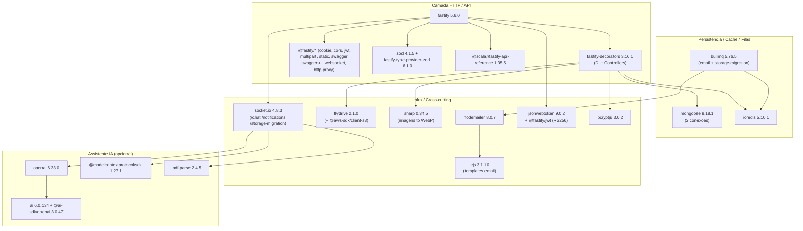

# 11 — Dependências

> **Fonte:** `backend/package.json` e `frontend/package.json` do monorepo
> LowCodeJS, branch `develop`. Todas as versões abaixo são **literais** dos
> manifests (faixa `^`/`~` reproduzida do arquivo), sem inferência.
> **Escopo:** este documento inventaria as dependências de runtime
> (`dependencies`) e de desenvolvimento (`devDependencies`) do backend e do
> frontend, com **uso** (onde/para quê) e **criticidade** (impacto se removida).
> Evidências apontam para `caminho/arquivo.ts` confirmando o consumo real da
> biblioteca no código. O que não é decidível pelo manifest é marcado
> **Não determinável pelo código**.
>
> Números canônicos do inventário (reusados de `docs/01-overview.md`): 14 models
> de sistema, 9 estilos de tabela, 4 papéis (`E_ROLE`), 12 permissões atômicas,
> 16 tipos de campo (`E_FIELD_TYPE`) e ~137 endpoints REST.

---

## 11.1 Convenções

- **Versão**: faixa exata declarada no `package.json` (`^x.y.z` = compatível com
  minor/patch; `~x.y.z` = apenas patch; `latest` = sempre a mais recente no
  install — ver §11.6).
- **Criticidade**:
  - **Núcleo** — sem ela a aplicação não sobe/compila (Fastify, React, Mongoose,
    Vite, TypeScript).
  - **Alta** — habilita um recurso central do produto (auth, storage, filas,
    tabelas dinâmicas, formulários).
  - **Média** — recurso importante mas não-bloqueante (IA, gráficos, editores
    ricos, export CSV).
  - **Baixa** — utilitário/qualidade-de-vida ou dev-only.
- **Uso**: a coluna cita o subsistema e, quando aplicável, o arquivo que importa
  a lib (evidência de consumo real, não apenas presença no manifest).

> O `backend/CLAUDE.md` e o `frontend/CLAUDE.md` mantêm tabelas "Tech Stack"
> resumidas; este documento é o inventário **completo e versionado** de ambos os
> manifests.

---

## 11.2 Backend — diagrama do stack

O diagrama abaixo organiza as dependências de runtime do backend por camada
(HTTP/API, Persistência/Cache/Filas, Infra/Cross-cutting, Assistente IA). Cópia
em `docs/_assets/11-dependencies-backend-stack.mmd` (sem cerca markdown).

---

## 11.3 Backend — dependências de runtime (`dependencies`)

`backend/package.json` é `"type": "module"` (ESM puro), `version 1.0.0`,
`license MIT`. As 42 dependências de runtime abaixo são as declaradas em
`backend/package.json:56-99`.

### 11.3.1 HTTP / Framework / DI

| Pacote | Versão | Uso | Criticidade |
| ------ | ------ | --- | ----------- |
| `fastify` | `^5.6.0` | Framework HTTP base; kernel em `start/kernel.ts` (registra plugins, error handler, listen) | **Núcleo** |
| `fastify-decorators` | `^3.16.1` | DI + decorators de Controller/Inject; bootstrap dos controllers no kernel; registro em `application/core/di-registry.ts` | **Núcleo** |
| `fastify-plugin` | `^5.0.1` | Empacota plugins Fastify sem encapsulamento de escopo | **Alta** |
| `fastify-type-provider-zod` | `^6.1.0` | Type provider que liga schemas Zod à validação/serialização do Fastify | **Alta** |
| `@fastify/cookie` | `^11.0.2` | Cookies httpOnly **assinados** (`COOKIE_SECRET`); base da sessão JWT | **Alta** |
| `@fastify/cors` | `^11.1.0` | CORS allowlist (origens fixas + glob de `ALLOWED_ORIGINS`); `start/kernel.ts` | **Alta** |
| `@fastify/jwt` | `^10.0.0` | Registro JWT **RS256** com chaves base64; `cookieName: accessToken` (ver `docs/06-security.md:43-56`) | **Alta** |
| `@fastify/multipart` | `^9.2.1` | Upload multipart (limite 5MB); pipeline de `FILE`/Storage | **Alta** |
| `@fastify/static` | `^9.1.3` | Servir arquivos do driver `local` (`_storage/`) | **Alta** |
| `@fastify/http-proxy` | `^11.4.2` | Proxy de arquivos quando driver = `s3` (alternativa ao static) | **Média** |
| `@fastify/swagger` | `^9.5.1` | Geração do documento OpenAPI a partir dos schemas | **Média** |
| `@fastify/swagger-ui` | `^5.2.3` | UI Swagger para a especificação OpenAPI | **Baixa** |
| `@fastify/websocket` | `^11.2.0` | Plugin WebSocket registrado no kernel (suporte a upgrade) | **Média** |
| `@scalar/fastify-api-reference` | `^1.35.5` | Referência de API navegável em `/documentation` (Scalar) | **Baixa** |

### 11.3.2 Persistência / Cache / Filas

| Pacote | Versão | Uso | Criticidade |
| ------ | ------ | --- | ----------- |
| `mongoose` | `^8.18.1` | ODM MongoDB; **2 conexões** (system + data via `getDataConnection()`), `config/database.config.ts`; 14 models de sistema + `buildTable()` runtime | **Núcleo** |
| `ioredis` | `^5.10.1` | Cliente Redis (`config/redis.config.ts`); backbone das filas BullMQ | **Alta** |
| `bullmq` | `^5.76.5` | Filas Redis: e-mail (`email-queue/`), migração de storage (`storage-migration/`) e import CSV (`csv-import/`) | **Alta** |

### 11.3.3 Auth / Segurança

| Pacote | Versão | Uso | Criticidade |
| ------ | ------ | --- | ----------- |
| `jsonwebtoken` | `^9.0.2` | Sign/verify de tokens fora do ciclo HTTP (ex.: decode no Socket.IO, utils JWT) | **Alta** |
| `bcryptjs` | `^3.0.2` | Hash/compare de senhas de usuário (salt 10) e de campos `PASSWORD` em rows (cost 12) — `docs/06-security.md:28-29` | **Alta** |

### 11.3.4 Validação

| Pacote | Versão | Uso | Criticidade |
| ------ | ------ | --- | ----------- |
| `zod` | `^4.1.5` | Validação de input (validators), env (`start/env.ts`), manifests de extensão e schemas OpenAPI | **Núcleo** |
| `ajv-errors` | `^3.0.0` | Mensagens customizadas para validação AJV nativa do Fastify | **Baixa** |

### 11.3.5 Storage / Arquivos / Imagem

| Pacote | Versão | Uso | Criticidade |
| ------ | ------ | --- | ----------- |
| `flydrive` | `^2.1.0` | Abstração de storage local↔S3 (DriveManager); `config/storage.config.ts` | **Alta** |
| `@aws-sdk/client-s3` | `^3.1014.0` | Driver S3 do Flydrive (operações de bucket) | **Alta** |
| `@aws-sdk/s3-request-presigner` | `^3.1014.0` | URLs pré-assinadas para objetos S3 | **Média** |
| `sharp` | `^0.34.5` | Processamento de imagem → WebP no upload; `application/services/storage/process-file.ts` | **Alta** |

### 11.3.6 E-mail / Templates / Filas auxiliares

| Pacote | Versão | Uso | Criticidade |
| ------ | ------ | --- | ----------- |
| `nodemailer` | `^8.0.7` | Envio SMTP (config do `Setting`, não env); `services/email/nodemailer-email.service.ts` | **Alta** |
| `ejs` | `^3.1.10` | Render de templates de e-mail (`templates/email/`: notification, sign-up) | **Média** |

> **Nota de versão:** o `backend/CLAUDE.md` cita "Nodemailer 7.0.11", mas o
> manifest declara `nodemailer ^8.0.7` (`backend/package.json:91`). A fonte
> canônica é o manifest: **8.0.7**.

### 11.3.7 Tempo real

| Pacote | Versão | Uso | Criticidade |
| ------ | ------ | --- | ----------- |
| `socket.io` | `^4.8.3` | Servidor WebSocket dos namespaces `/chat`, `/notifications`, `/storage-migration`; `application/resources/chat/chat.socket.ts` | **Alta** |

### 11.3.8 Assistente IA (opcional, profile `ai`)

| Pacote | Versão | Uso | Criticidade |
| ------ | ------ | --- | ----------- |
| `openai` | `^6.33.0` | Cliente OpenAI no chat IA (config no `Setting`) | **Média** |
| `ai` | `^6.0.134` | Vercel AI SDK (orquestração de mensagens/tools) | **Média** |
| `@ai-sdk/openai` | `^3.0.47` | Provider OpenAI para o AI SDK | **Média** |
| `@modelcontextprotocol/sdk` | `^1.27.1` | Cliente MCP (descoberta dinâmica de tools no chat) | **Média** |
| `pdf-parse` | `^2.4.5` | Extração de texto de PDFs anexados ao chat | **Baixa** |

### 11.3.9 Dados / CSV / Utilitários

| Pacote | Versão | Uso | Criticidade |
| ------ | ------ | --- | ----------- |
| `@json2csv/node` | `^7.0.6` | Geração de CSV para exportações (tabelas, rows, usuários, grupos, menu) | **Média** |
| `csv-parser` | `^3.2.0` | Parser de CSV no import assíncrono de rows (`services/csv-import/`) | **Média** |
| `date-fns` | `^4.1.0` | Manipulação/format de datas (formatos `E_FIELD_FORMAT`, sandbox `utils`) | **Média** |
| `date-fns-tz` | `^3.2.0` | Conversões de timezone sobre `date-fns` | **Baixa** |
| `slugify` | `^1.6.6` | Geração de `slug` de tabela/campo (`core/field-slug.core.ts`) | **Alta** |
| `glob` | `^13.0.6` | Varredura de filesystem (loader de extensões, seeders/migrations) | **Média** |
| `js-yaml` | `^4.1.1` | Parse de YAML (configs/manifests) | **Baixa** |
| `reflect-metadata` | `^0.2.2` | Metadados de decorators (DI fastify-decorators); importado no setup de testes e boot | **Núcleo** |
| `dotenv` | `^17.2.2` | Carga de `.env`/`.env.test` antes da validação Zod (`start/env.ts`) | **Alta** |

---

## 11.4 Backend — dependências de desenvolvimento (`devDependencies`)

Declaradas em `backend/package.json:26-55`. Destaque para **transpilação rápida
(`@swc-node`/SWC), build (`tsup`), testes (`vitest`/`supertest`) e lint
(`eslint`/`typescript-eslint`/`prettier`)**.

| Pacote | Versão | Uso | Criticidade |
| ------ | ------ | --- | ----------- |
| `typescript` | `^5.9.2` | Linguagem + checagem de tipos (`tsc -b`) | **Núcleo (dev)** |
| `tsup` | `^8.5.0` | Bundler de build → `/build` (ESM, ES2024, sem node_modules); `tsup.config.ts` | **Núcleo (dev)** |
| `@swc-node/register` | `^1.11.1` | Loader ESM com SWC para `npm run dev`/`seed`/migrations (transpila TS on-the-fly) | **Alta (dev)** |
| `@swc/core` | `^1.15.8` | Engine SWC usado por `@swc-node` e `unplugin-swc` | **Alta (dev)** |
| `unplugin-swc` | `^1.5.9` | Integração SWC com o pipeline de teste (Vitest) | **Média (dev)** |
| `vitest` | `^4.0.16` | Runner de testes unit + e2e (`vitest.config.ts`, `vitest.e2e.config.ts`) | **Alta (dev)** |
| `supertest` | `^7.1.4` | Requests HTTP nos testes e2e (`*.controller.spec.ts`) | **Alta (dev)** |
| `vite-tsconfig-paths` | `^6.0.3` | Resolução de path aliases (`@/*`) no Vitest | **Média (dev)** |
| `eslint` | `^9.35.0` | Linter (flat config, `eslint.config.js`) | **Média (dev)** |
| `@eslint/js` | `^9.35.0` | Regras base recomendadas do ESLint | **Baixa (dev)** |
| `typescript-eslint` | `^8.43.0` | Regras/parser ESLint para TypeScript | **Média (dev)** |
| `eslint-plugin-import` | `^2.32.0` | Lint de ordem/validade de imports | **Baixa (dev)** |
| `eslint-import-resolver-typescript` | `^4.4.4` | Resolver de imports TS para `eslint-plugin-import` | **Baixa (dev)** |
| `eslint-import-resolver-alias` | `^1.1.2` | Resolver de aliases para `eslint-plugin-import` | **Baixa (dev)** |
| `eslint-plugin-prettier` | `^5.5.4` | Integra Prettier como regra ESLint | **Baixa (dev)** |
| `prettier` | `^3.6.2` | Formatação de código | **Baixa (dev)** |
| `globals` | `^16.4.0` | Lista de globals para o ESLint flat config | **Baixa (dev)** |
| `husky` | `^9.1.7` | Git hooks (`prepare`) | **Baixa (dev)** |
| `@types/node` | `^24.3.1` | Tipos do Node.js | **Média (dev)** |
| `@types/bcryptjs` | `^2.4.6` | Tipos de `bcryptjs` | **Baixa (dev)** |
| `@types/ejs` | `^3.1.5` | Tipos de `ejs` | **Baixa (dev)** |
| `@types/js-yaml` | `^4.0.9` | Tipos de `js-yaml` | **Baixa (dev)** |
| `@types/jsonwebtoken` | `^9.0.10` | Tipos de `jsonwebtoken` | **Baixa (dev)** |
| `@types/nodemailer` | `^7.0.4` | Tipos de `nodemailer` | **Baixa (dev)** |
| `@types/pdf-parse` | `^1.1.5` | Tipos de `pdf-parse` | **Baixa (dev)** |
| `@types/sharp` | `^0.31.1` | Tipos de `sharp` | **Baixa (dev)** |
| `@types/supertest` | `^6.0.3` | Tipos de `supertest` | **Baixa (dev)** |
| `@types/ws` | `^8.18.1` | Tipos de `ws` (WebSocket subjacente) | **Baixa (dev)** |

> **Atenção a desalinhamentos de major nos `@types`:** `@types/nodemailer
> ^7.0.4` vs runtime `nodemailer ^8.0.7`, e `@types/sharp ^0.31.1` vs runtime
> `sharp ^0.34.5`. Pode haver lacunas de tipagem; o impacto exato é **Não
> determinável pelo código** sem rodar `tsc`.

---

## 11.5 Frontend — dependências de runtime (`dependencies`)

`frontend/package.json` é `"type": "module"`, `private: true`, `license MIT`.
Há também um bloco `overrides` forçando `dompurify ^3.4.3`
(`frontend/package.json:144-146`) — provavelmente para resolver transitivamente
uma versão segura. As dependências abaixo são as de `frontend/package.json:16-123`.

### 11.5.1 Core React + SSR (TanStack Start)

| Pacote | Versão | Uso | Criticidade |
| ------ | ------ | --- | ----------- |
| `react` | `^19.2.0` | UI library | **Núcleo** |
| `react-dom` | `^19.2.0` | Render DOM/hydration | **Núcleo** |
| `@tanstack/react-start` | `~1.168.1` | Meta-framework SSR (Nitro); entry/SSR | **Núcleo** |
| `@tanstack/react-router` | `~1.170.1` | Roteamento file-based; `router.tsx` + `routeTree.gen.ts` | **Núcleo** |
| `@tanstack/router-plugin` | `~1.168.1` | Plugin Vite que gera o route tree | **Núcleo** |
| `@tanstack/react-router-ssr-query` | `~1.167.0` | Integração Router + Query no SSR | **Alta** |
| `nitro` | `latest` | Servidor SSR (preset node-server) usado pelo TanStack Start | **Núcleo** |

> As 4 libs `@tanstack/react-*` de roteamento/start usam faixa `~` (apenas
> patch), sinalizando acoplamento forte entre versões — atualizações de minor
> são intencionalmente travadas.

### 11.5.2 Estado, dados e formulários (TanStack + Zustand)

| Pacote | Versão | Uso | Criticidade |
| ------ | ------ | --- | ----------- |
| `@tanstack/react-query` | `^5.66.5` | Server-state; integrado ao Router via context (`lib/query-client.ts`) | **Núcleo** |
| `@tanstack/react-table` | `^8.21.3` | Tabela headless (data-table + dynamic-table) | **Alta** |
| `@tanstack/react-form` | `^1.0.0` | Gestão de formulários (`integrations/tanstack-form/`, 40 field components) | **Alta** |
| `@tanstack/react-virtual` | `^3.13.20` | Virtualização de listas/tabelas grandes | **Média** |
| `zustand` | `^5.0.9` | Client-state com persistência localStorage (`stores/authentication.ts`) | **Alta** |
| `@hookform/resolvers` | `^5.2.2` | Resolvers (Zod) para validação de formulários | **Média** |
| `react-hook-form` | `^7.68.0` | Form library complementar (em fluxos específicos) | **Média** |
| `axios` | `^1.13.2` | HTTP client + interceptors (`lib/api.ts`, refresh/401) | **Alta** |
| `zod` | `^4.2.1` | Validação compartilhada (`lib/schemas.ts`, env) | **Alta** |
| `@t3-oss/env-core` | `^0.13.8` | Validação tipada de env vars (`env.ts`) | **Média** |

> **Skew de Zod entre apps:** backend `zod ^4.1.5` vs frontend `zod ^4.2.1`
> (mesmo major 4, minors distintos). Schemas Zod **não** são compartilhados
> entre os dois manifests — cada app declara o seu.

### 11.5.3 UI — Radix / design system / estilo

| Pacote | Versão | Uso | Criticidade |
| ------ | ------ | --- | ----------- |
| `radix-ui` | `^1.4.3` | Pacote agregador Radix (primitivos) | **Alta** |
| `@radix-ui/react-*` (24 pacotes) | ver lista abaixo | Primitivos acessíveis individuais (dialog, select, dropdown, tooltip, etc.); design system `components/ui/` | **Alta** |
| `@base-ui/react` | `^1.0.0` | Primitivos Base UI (complementa Radix) | **Média** |
| `tailwindcss` | `^4.0.6` | CSS utility-first v4 (`styles.css`) | **Núcleo** |
| `@tailwindcss/vite` | `^4.0.6` | Plugin Tailwind v4 para Vite | **Núcleo** |
| `tailwind-merge` | `^3.0.2` | Merge de classes Tailwind sem conflito (`cn()`) | **Alta** |
| `class-variance-authority` | `^0.7.1` | Variantes de componente (CVA) | **Alta** |
| `clsx` | `^2.1.1` | Composição condicional de classes (`cn()`) | **Alta** |
| `tw-animate-css` | `^1.3.6` | Animações utilitárias para Tailwind | **Baixa** |
| `lucide-react` | `^0.544.0` | Ícones SVG | **Média** |
| `next-themes` | `^0.4.6` | Alternância de tema (dark mode) | **Baixa** |
| `cmdk` | `^1.1.1` | Command palette (busca/atalhos) | **Baixa** |
| `sonner` | `^2.0.7` | Toast notifications | **Média** |
| `vaul` | `^1.1.2` | Drawer component | **Baixa** |
| `embla-carousel-react` | `^8.6.0` | Carrossel | **Baixa** |
| `input-otp` | `^1.4.2` | Campo de OTP (códigos) | **Baixa** |
| `react-resizable-panels` | `^4.7.0` | Painéis redimensionáveis | **Baixa** |
| `react-day-picker` | `^9.12.0` | Date picker (calendário) | **Média** |

Os 24 primitivos Radix individuais (`frontend/package.json:24-49`):
`react-accordion ^1.2.12`, `react-alert-dialog ^1.1.15`,
`react-aspect-ratio ^1.1.8`, `react-avatar ^1.1.11`, `react-checkbox ^1.3.3`,
`react-collapsible ^1.1.12`, `react-context-menu ^2.2.16`,
`react-dialog ^1.1.15`, `react-dropdown-menu ^2.1.16`,
`react-hover-card ^1.1.15`, `react-label ^2.1.8`, `react-menubar ^1.1.16`,
`react-navigation-menu ^1.2.14`, `react-popover ^1.1.15`,
`react-progress ^1.1.8`, `react-radio-group ^1.3.8`,
`react-scroll-area ^1.2.10`, `react-select ^2.2.6`, `react-separator ^1.1.8`,
`react-slider ^1.3.6`, `react-slot ^1.2.4`, `react-switch ^1.2.6`,
`react-tabs ^1.1.13`, `react-toggle ^1.1.10`, `react-toggle-group ^1.1.11`,
`react-tooltip ^1.2.8`. (Total Radix = 24 individuais + agregador `radix-ui`.)

### 11.5.4 Editores ricos e código

| Pacote | Versão | Uso | Criticidade |
| ------ | ------ | --- | ----------- |
| `@monaco-editor/react` | `^4.7.0` | Editor de código (campo `FieldCodeEditor`, scripts da sandbox); ~2MB, lazy | **Média** |
| `@tiptap/react` | `^3.13.0` | Editor WYSIWYG (rich-editor); ~500KB, lazy | **Média** |
| `@tiptap/starter-kit` | `^3.13.0` | Conjunto base de extensões Tiptap | **Média** |
| `@tiptap/extension-*` (16 pacotes) | `^3.20.0`–`^3.22.5` | Extensões Tiptap: link, image, table, mention, highlight, task-list, text-align, underline, etc. | **Baixa** |
| `@tiptap/suggestion` | `^3.22.5` | Sugestões (menções no editor) | **Baixa** |
| `tiptap-markdown` | `^0.9.0` | Serialização Markdown ↔ Tiptap | **Baixa** |

As 16 extensões Tiptap (`frontend/package.json:64-79`): `character-count`,
`color`, `highlight`, `image`, `link`, `mention ^3.22.5`, `placeholder`,
`table`, `table-cell`, `table-header`, `table-row`, `task-item`, `task-list`,
`text-align`, `text-style`, `underline` (as não-marcadas em `^3.20.0`).

### 11.5.5 Conteúdo, markdown e PDF

| Pacote | Versão | Uso | Criticidade |
| ------ | ------ | --- | ----------- |
| `react-markdown` | `^10.1.0` | Render de markdown (chat IA, conteúdo) | **Média** |
| `remark-gfm` | `^4.0.1` | GitHub Flavored Markdown | **Baixa** |
| `remark-breaks` | `^4.0.0` | Quebras de linha em markdown | **Baixa** |
| `rehype-raw` | `^7.0.0` | HTML bruto em markdown | **Baixa** |
| `rehype-highlight` | `^7.0.2` | Syntax highlight em blocos de código | **Baixa** |
| `@react-pdf/renderer` | `^4.3.2` | Geração de PDF no cliente | **Média** |
| `react-pdf-html` | `^2.1.5` | HTML → PDF (sobre `@react-pdf/renderer`) | **Baixa** |
| `react-to-print` | `^3.2.0` | Impressão de componentes | **Baixa** |

### 11.5.6 Visualização, DnD, máscaras e tempo real

| Pacote | Versão | Uso | Criticidade |
| ------ | ------ | --- | ----------- |
| `recharts` | `^2.15.4` | Gráficos do dashboard | **Média** |
| `@dnd-kit/core` | `^6.3.1` | Drag-and-drop (reordenação de menus/campos/kanban) | **Média** |
| `@dnd-kit/sortable` | `^10.0.0` | Listas ordenáveis sobre `@dnd-kit/core` | **Média** |
| `@dnd-kit/utilities` | `^3.2.2` | Utilitários de transform do dnd-kit | **Baixa** |
| `socket.io-client` | `^4.8.3` | Cliente WebSocket (chat, notificações, migração); par do `socket.io` 4.8.3 do backend | **Alta** |
| `@ai-sdk/react` | `^3.0.136` | Hooks de IA no cliente (chat) | **Média** |
| `ai` | `^6.0.134` | AI SDK no cliente (mesma do backend) | **Média** |
| `imask` | `^7.6.1` | Máscaras de input (CPF/CNPJ/telefone — `E_FIELD_FORMAT`) | **Média** |
| `react-imask` | `^7.6.1` | Wrapper React para `imask` | **Média** |
| `date-fns` | `^4.1.0` | Datas (mesma major do backend) | **Média** |
| `jsonwebtoken` | `^9.0.3` | Decode de JWT no cliente/SSR | **Baixa** |
| `pako` | `^2.1.0` | Compressão (gzip/deflate) — provável payloads/transferência | **Baixa** |
| `react-error-boundary` | `^6.1.1` | Boundaries de erro de query (com `QueryErrorResetBoundary`) | **Média** |
| `@tanstack/react-devtools` | `^0.7.0` | Devtools agregadas (runtime, dev-facing) | **Baixa** |
| `@tanstack/react-query-devtools` | `^5.84.2` | Devtools do React Query | **Baixa** |
| `@tanstack/react-router-devtools` | `~1.167.0` | Devtools do Router | **Baixa** |
| `vite-tsconfig-paths` | `^5.1.4` | Path aliases (`@/*`); presente em `dependencies` | **Média** |

> **Observação:** `@tanstack/*-devtools` e `vite-tsconfig-paths` estão em
> `dependencies` (não `devDependencies`) no manifest do frontend — refletido
> acima conforme o arquivo.

---

## 11.6 Frontend — dependências de desenvolvimento (`devDependencies`)

Declaradas em `frontend/package.json:124-143`. Destaque para **build (`vite`),
testes (`vitest`/Testing Library/`jsdom`), plugin React e tipos**.

| Pacote | Versão | Uso | Criticidade |
| ------ | ------ | --- | ----------- |
| `vite` | `^7.1.7` | Build tool + dev server SSR (porta 5173); `vite.config.ts` | **Núcleo (dev)** |
| `@vitejs/plugin-react` | `^5.0.4` | Plugin React (Fast Refresh) para Vite | **Núcleo (dev)** |
| `typescript` | `^5.7.2` | Linguagem + tipos (`tsconfig.json`, ES2024) | **Núcleo (dev)** |
| `vitest` | `^3.0.5` | Runner de testes do frontend | **Alta (dev)** |
| `@testing-library/react` | `^16.2.0` | Testes de componentes React | **Alta (dev)** |
| `@testing-library/dom` | `^10.4.0` | Queries DOM para Testing Library | **Média (dev)** |
| `jsdom` | `^27.0.0` | Ambiente DOM para Vitest | **Alta (dev)** |
| `@tanstack/devtools-vite` | `^0.3.11` | Integração das devtools TanStack com Vite | **Baixa (dev)** |
| `@tanstack/eslint-config` | `^0.3.0` | Config ESLint padrão TanStack | **Média (dev)** |
| `eslint-plugin-prettier` | `^5.5.4` | Prettier como regra ESLint | **Baixa (dev)** |
| `prettier` | `^3.5.3` | Formatação | **Baixa (dev)** |
| `husky` | `^9.1.7` | Git hooks (`prepare`) | **Baixa (dev)** |
| `@tailwindcss/typography` | `^0.5.19` | Plugin `prose` do Tailwind (markdown estilizado) | **Baixa (dev)** |
| `web-vitals` | `^5.1.0` | Métricas de performance (Core Web Vitals) | **Baixa (dev)** |
| `@types/node` | `^22.10.2` | Tipos Node (frontend) | **Média (dev)** |
| `@types/react` | `^19.2.0` | Tipos React 19 | **Alta (dev)** |
| `@types/react-dom` | `^19.2.0` | Tipos React DOM 19 | **Alta (dev)** |
| `@types/jsonwebtoken` | `^9.0.10` | Tipos de `jsonwebtoken` | **Baixa (dev)** |

> **Skew Vitest entre apps:** backend usa `vitest ^4.0.16` enquanto o frontend
> usa `vitest ^3.0.5` (majors diferentes). É esperado em monorepo sem workspace
> hoisting — cada app fixa o seu runner.
>
> **Skew `@types/node`:** backend `^24.3.1` vs frontend `^22.10.2`.

---

## 11.7 Pontos de atenção (skews e particularidades)

| Item | Detalhe | Onde |
| ---- | ------- | ---- |
| `nitro: "latest"` | Única dependência com faixa `latest` — versão não-determinística no install; risco de quebra silenciosa em CI | `frontend/package.json:95` |
| Faixas `~` no TanStack Start/Router | Router/Start/Plugin/SSR-Query travados em patch (`~1.16x`/`~1.170`) por acoplamento de framework | `frontend/package.json:57-63` |
| `overrides.dompurify ^3.4.3` | Override transitivo forçando versão (provável correção de segurança) | `frontend/package.json:144-146` |
| Zod major 4 em ambos, minors distintos | backend `^4.1.5`, frontend `^4.2.1` — schemas não compartilhados | manifests |
| Vitest major distinto | backend `^4.0.16`, frontend `^3.0.5` | manifests |
| `nodemailer` doc vs manifest | `backend/CLAUDE.md` cita 7.0.11; manifest = `^8.0.7` (canônico) | `backend/package.json:91` |
| `@types/*` defasados | `@types/nodemailer ^7` vs `nodemailer ^8`; `@types/sharp ^0.31` vs `sharp ^0.34` | `backend/package.json` |
| `@tanstack/*-devtools` em `dependencies` | Devtools e `vite-tsconfig-paths` fora de `devDependencies` no frontend | `frontend/package.json` |

> A avaliação de **CVEs/segurança das versões** acima e o impacto real de cada
> skew em runtime são **Não determináveis pelo código** sem `npm audit`/build —
> aqui registramos apenas o que os manifests declaram. Dívida técnica
> relacionada está em `docs/12-technical-debt.md`.

---

### Diagramas (assets)

- `docs/_assets/11-dependencies-backend-stack.mmd` — stack de runtime do backend
  por camada (§11.2). Cópia do bloco `mermaid` acima, sem cerca markdown.
