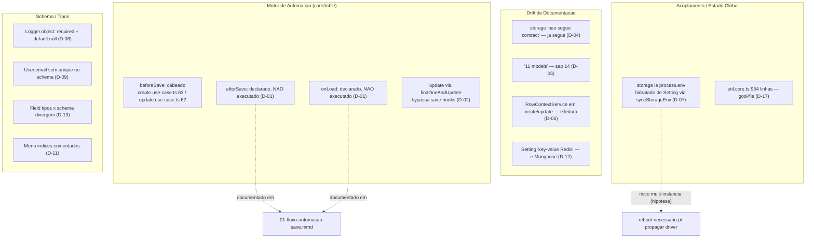

# 12 — Dívida Técnica

> **Fonte:** código-fonte do monorepo LowCodeJS (branch `develop`), arquivos `CLAUDE.md` de cada camada e os diagramas em `docs/_assets/`.
> **Escopo:** dívida técnica observável — marcadores `TODO`/`FIXME`/`HACK`, inconsistências entre documentação e implementação, pontos de acoplamento e riscos. Cada item tem evidência rastreável em `caminho/arquivo.ts:linha`. Itens sem evidência direta no código são marcados como **hipótese** ou **Não determinável pelo código**.
> **Convenção:** "Onde" cita o arquivo/linha de origem. Prioridade: **Alta** (corretude/segurança/risco de dados) · **Média** (manutenção/consistência) · **Baixa** (cosmético/doc).

---

## 1. Sumário executivo

A base é coesa e segue padrões claros (Either, Contract+Implementation, DI explícita em `di-registry.ts`). A dívida concentra-se em **três frentes**:

1. **Lacunas funcionais no motor de automação (sandbox de scripts):** apenas `beforeSave` está cabeado; `afterSave` e `onLoad` são declarados no schema e na documentação, mas **não são executados em lugar nenhum** do core. O `update` de rows usa `findOneAndUpdate`, que ignora middlewares de documento Mongoose.
2. **Drift de documentação:** vários `CLAUDE.md` descrevem o sistema como ele *era* (storage "não segue contract pattern", "11 models", `RowContextService` chamado em create/update). O código já evoluiu — a doc não acompanhou.
3. **Acoplamento por estado global mutável:** a configuração de storage trafega via `process.env`, sincronizada a partir do documento `Setting` por efeito colateral (`syncStorageEnv`).

Nenhum marcador `TODO`/`FIXME`/`HACK` foi encontrado no código de produção do backend/frontend — apenas em templates de geração de extensão (`scripts/make-extension.mjs`, `.claude/skills/.../templates/*.md`), o que é esperado e **não** é dívida.

---

## 2. Tabela priorizada

| # | Item | Onde | Impacto | Sugestão | Prioridade |
|---|------|------|---------|----------|------------|
| D-01 | `afterSave` e `onLoad` declarados mas **nunca executados** | `table.model.ts` (subdoc `Methods`), `create.use-case.ts:63`, `update.use-case.ts:62`; grep por `afterSave`/`depois_salvar`/`carregamento_formulario` em `resources/**/*.use-case.ts` → **0 matches** | Usuário configura script `afterSave`/`onLoad` na UI e ele silenciosamente não roda. Diagrama `01-fluxo-automacao-save.mmd:15-18` promete `afterSave`. | Cabear os dois hooks nos use-cases de row (e onLoad no fluxo de carregamento de formulário) **ou** remover/ocultar os campos na UI e na doc até implementar | **Alta** |
| D-02 | `update` de row usa `findOneAndUpdate` + `$set` → bypassa middleware de documento Mongoose | `row-mongoose.repository.ts:164-177` | Hooks `pre('save')`/virtuals/validators de documento não disparam no update. `setFieldAndUpdate`/`addGroupItem` usam `.save()`, mas o update principal não — comportamento inconsistente entre operações | Padronizar: ou tudo via `findOneAndUpdate` (e mover lógica para use-case, como já é hoje) ou documentar explicitamente que save-hooks de documento não são suportados | **Alta** |
| D-03 | `beforeSave` no **create** roda em caminho que reexecuta lógica de resolução de USER duas vezes | `create.use-case.ts:63-148` (bloco `beforeSaveCode`) vs. `update.use-case.ts:62-136` | Conforme nota de memória do projeto (*"beforeSave dupla execução no create"*), o create tem ramo extra de hidratação de campos USER antes do script. Risco de efeitos colaterais duplicados (ex.: `email.send` no script disparar 2×) — **hipótese**, depende do conteúdo do script | Auditar com teste e2e que conte invocações de `email.send`/`console.log` no `beforeSave` durante um create; consolidar num único ponto de execução | **Alta** |
| D-04 | Storage marcado como "não segue contract pattern", mas **já segue** | `services/storage/CLAUDE.md` e `services/CLAUDE.md` ("Ainda nao segue o pattern contract. Candidato a formalizacao futura") vs. `storage.service.ts:16` (`implements StorageContractService`) + `di-registry.ts:142` | Doc desatualizada induz a refatoração desnecessária. `storage/CLAUDE.md` ainda descreve "Implementacao com AWS SDK S3 + fs nativo" num único arquivo, mas a impl está dividida em `local-storage.service.ts`/`s3-storage.service.ts` com fachada em `storage.service.ts` | Atualizar os dois `CLAUDE.md`: remover a nota "não segue contract" e refletir a estrutura `local`/`s3`/fachada atual | **Média** |
| D-05 | Documentação cita **"11 models"**; existem **14 arquivos** `*.model.ts` | `model/CLAUDE.md` ("Os 11 models"), `application/CLAUDE.md`, `backend/CLAUDE.md:60-64,226` (DI "11 repositorios") vs. `Glob backend/application/model/*.model.ts` → 14 arquivos (faltam na doc: `extension`, `logger`, `notification`) | Inventário desatualizado: `extension`, `logger` e `notification` não constam nas tabelas de models nem na lista de DI da doc, embora estejam registrados em `di-registry.ts:4-176` | Atualizar contagem para 14 models de sistema (+ Row dinâmico sem model fixo) e listar `Extension`, `Logger`, `Notification` | **Média** |
| D-06 | `RowContextService` documentado como chamado em create/update, mas é usado só em **leitura** | `row-context/CLAUDE.md` ("Chamado em use-cases de table-rows/create e table-rows/update antes de persistir") vs. uso real em `paginated`/`show`/`reaction`/`evaluation` use-cases (grep); `create.use-case.ts`/`update.use-case.ts` **não injetam** `RowContextContractService` | Doc engana sobre quando metadados de autoria são preenchidos. Se a intenção era preencher na escrita, há um gap funcional; se na leitura, a doc está errada | Confirmar a intenção: corrigir a doc para "fluxos de leitura" ou cabear o serviço no create/update | **Média** |
| D-07 | Acoplamento por **estado global mutável**: storage lê de `process.env`, hidratado do `Setting` por efeito colateral | `setting-env-sync.ts:3-9`, chamado em `bin/server.ts:50`, `setting/update/update.use-case.ts:41`, `setup/storage/submit.use-case.ts:76`; consumido em `storage.config.ts:11-37`, `s3-storage.service.ts:26-31`, `content-disposition.hook.ts:107` | Fonte de verdade dupla (Mongo `Setting` × `process.env`). Em deploy **multi-instância**, trocar o driver na UI de uma instância não propaga `process.env` para as outras até reboot — **hipótese** (não há broadcast/pub-sub de invalidação visível no código) | Encapsular leitura de config de storage num provider que leia do `Setting`/cache com invalidação, em vez de `process.env`; ou documentar a limitação multi-instância | **Média** |
| D-08 | `Logger.object`: `required: true` **e** `default: null` simultaneamente (contradição no schema) | `logger.model.ts:27-32` | Default `null` num enum `required` viola o próprio required; em insert sem `object`, Mongoose grava `null` num campo que deveria ser obrigatório → log de auditoria potencialmente inconsistente | Remover `default: null` (deixar required puro) ou tornar `required: false`, conforme a semântica desejada | **Média** |
| D-09 | E-mail do `User` **sem `unique` no schema**; unicidade garantida só em use-case | `user.model.ts` (campo `email` sem índice unique) vs. checagem em `sign-up.use-case.ts:33-39` (`findByEmail` → `Conflict`) | Race condition: duas requisições simultâneas de sign-up com o mesmo email passam pela checagem antes do insert e criam duplicatas (a verificação não é atômica) | Adicionar índice único parcial em `email` (respeitando soft-delete) como rede de segurança, mantendo a mensagem PT-BR no use-case | **Média** |
| D-10 | `in-memory-storage.service.ts` existe mas **não é registrado no DI**; testes não têm fake de storage no registry | `services/storage/in-memory-storage.service.ts` (existe) vs. `di-registry.ts:142` (registra sempre `StorageService` real); uso só direto em specs (`storage/upload/upload.use-case.spec.ts`, etc.) | Padrão Contract+InMemory descrito em `services/CLAUDE.md` está incompleto para storage; testes que dependem do registry batem na impl real | Avaliar registro condicional do in-memory em ambiente de teste, ou documentar que storage é injetado manualmente nos specs | **Baixa** |
| D-11 | Índices de `Menu` comentados/desativados no código (`{slug:1}{unique}`, `{trashed:1}`) | `menu.model.ts` (índices comentados, conforme nota de inventário) | Slugs de menu podem colidir sem garantia de banco; falta de índice `trashed` pode degradar listagens grandes — **hipótese de performance** | Decidir e reativar índices necessários ou remover o código morto comentado | **Baixa** |
| D-12 | `setting/CLAUDE.md` (repositories) descreve `Setting` como "key-value no Redis", mas é Mongoose | `repositories/CLAUDE.md` ("Pattern diferente (key-value no Redis)") vs. `setting-mongoose.repository.ts` (Mongoose) e `setting.model.ts` (singleton Mongo) | Doc engana sobre a camada de persistência do `Setting` | Corrigir a doc: `Setting` é um singleton no MongoDB system | **Baixa** |
| D-13 | `Field.defaultValue` / `widthIn*` / `dropdown` / `category`: tipo (entity.core) diverge do schema Mongoose | `field.model.ts` (schema) vs. `entity.core.ts` (tipos): `defaultValue` tipado `string|string[]|null` mas schema é `Mixed`; `widthIn*` tipo permite `null` mas schema tem default numérico; `dropdown`/`category` default é função→`null` (não `[]`) | Tipos TS não refletem o que o banco aceita/grava; consumidores podem assumir formatos errados | Alinhar tipos a `Mixed`/defaults reais ou normalizar no toJSON; cobrir com teste | **Baixa** |
| D-14 | "Sem sandbox" para extensões — privilégio total assumido | `extensions/CLAUDE.md` ("extensões rodam com privilégios totais — o desenvolvedor assume o risco") | Extensão maliciosa/buggy tem acesso irrestrito a repos/serviços do core (diferente do sandbox VM dos scripts de usuário). Risco aceito conscientemente, mas é dívida de segurança latente | Manter decisão documentada; se extensões de terceiros entrarem no roadmap, planejar isolamento (permissões declarativas + boundary) | **Baixa** (Alta se abrir p/ terceiros) |
| D-15 | URLs custom de módulo de extensão **não suportadas** (marcado "Fase 4/Fase 6") | `extensions/CLAUDE.md:136-138` ("URLs custom ... ainda não são suportadas ... ficam para Fase 6") | Menu sempre aponta para URL canônica `/e/<pkg>/<id>`; aliases (ex.: `/home`) impossíveis hoje | Implementar splat-route com resolução runtime quando priorizado; rastrear como feature pendente | **Baixa** |
| D-16 | `HandlerFunctionAsync` mantido só por **compatibilidade retroativa** (código de transição) | `handler.ts:70-113` (comentário "Convenience export for backwards compatibility") | Superfície de API dupla para executar scripts (`executeScript` × `HandlerFunctionAsync`); shim com `type: 'unknown'` hardcoded | Confirmar se há callers restantes; se não, remover o shim | **Baixa** |
| D-17 | `util.core.ts` com 954 linhas (god-file de builders) | `application/core/util.core.ts` (954 linhas, per `core/CLAUDE.md`) — concentra `buildSchema`/`buildTable`/`buildPopulate`/`buildQuery`/`buildOrder`/`normalize`/`findReverseRelationships` | Arquivo central muito grande dificulta navegação e teste isolado; alto acoplamento aferente (todo o fluxo de rows depende dele) | Quebrar por responsabilidade (já há `core/builders/` — migrar gradualmente) | **Baixa** |

---

## 3. Detalhamento dos itens de prioridade Alta

### D-01 · Hooks `afterSave` e `onLoad` declarados, nunca executados

O subdocumento `Methods` da tabela declara os três momentos:

```
methods: { onLoad: { code }, beforeSave: { code }, afterSave: { code } }
```

(`table.model.ts`, default `{ onLoad:{code:null}, beforeSave:{code:null}, afterSave:{code:null} }`).

Porém, nos use-cases de row, **apenas `beforeSave`** é lido e executado:

- `create.use-case.ts:63` — `const beforeSaveCode = table.methods?.beforeSave?.code;`
- `update.use-case.ts:62` — idem.

A busca por `afterSave`, `depois_salvar` e `carregamento_formulario` em `backend/application/resources/**/*.use-case.ts` retorna **zero ocorrências**. Ou seja, o sandbox suporta os três momentos (`sandbox.ts`/`types.ts` expõem `moment: 'depois_salvar' | 'carregamento_formulario'`), mas o core nunca os invoca.

> O diagrama `docs/_assets/01-fluxo-automacao-save.mmd` (e o bloco mermaid equivalente na doc de automação) **documenta** o passo `afterSave` como se existisse — ver linhas 15-18. Isso confirma a divergência doc × código.

**Risco:** silêncio. O usuário salva um script `afterSave`/`onLoad` na UI, a plataforma aceita e persiste, e nada acontece em runtime — sem erro, sem aviso.

### D-02 · `update` ignora middleware de documento Mongoose

```ts
// row-mongoose.repository.ts:164-177
async update(payload: RowUpdatePayload): Promise<IRow> {
  const row = await model
    .findOneAndUpdate({ _id: payload._id }, { $set: payload.data }, { new: true })
    .populate(populate);
  return this.transformRow(row);
}
```

`findOneAndUpdate` é uma operação de **query**, não de documento — `pre('save')`/`post('save')` e setters de documento não disparam. Em contraste, `setFieldAndSave` (`:222-233`), `addGroupItem` (`:237-255`) e `updateGroupItem` (`:257-283`) usam `.save()`. Essa inconsistência é a raiz prática do D-01 (se algum dia se quisesse cabear `afterSave` em hook Mongoose, o update não o acionaria).

### D-03 · Possível dupla execução de `beforeSave` no create

No create (`create.use-case.ts:63-148`), antes de chamar o script há um ramo que resolve campos `USER` (busca usuários, monta `scriptDoc` com objetos de usuário) — esse ramo **não existe** no mesmo formato no update. A nota de memória do projeto registra explicitamente *"beforeSave dupla execução no create"*. Como o conteúdo do script é definido pelo usuário, o efeito concreto (ex.: `email.send` disparado 2×) é **hipótese** e precisa de teste e2e contando invocações para confirmar/refutar.

---

## 4. Diagrama — Mapa de dívida × camadas



> O mesmo conteúdo (sem a cerca markdown) está em `docs/_assets/12-divida-tecnica-mapa.mmd`.

---

## 5. Notas de método e limites

- **Marcadores de código:** a varredura por `TODO`/`FIXME`/`HACK`/`XXX`/`@deprecated`/`gambiarra` (case-insensitive) **não** encontrou ocorrências no código de produção de `backend/` ou `frontend/src/`. As únicas ocorrências de `TODO` estão em geradores de boilerplate (`scripts/make-extension.mjs`, `.claude/skills/lowcodejs-extension/templates/*.md`) — esperadas, **não** são dívida.
- **Branch:** a leitura foi feita na branch ativa do checkout. O CLAUDE.md aponta `develop` como branch de doc; eventuais divergências entre `develop` e a branch de trabalho atual **não foram determinadas pelo código**.
- **Itens marcados como hipótese** (D-03 efeito concreto, D-07 multi-instância, D-11 performance) requerem teste de runtime/observação para confirmação; o código sozinho não prova o impacto.
- **Métricas de cobertura de teste, dependências desatualizadas (npm audit) e profiling:** **Não determinável pelo código** estaticamente — exigem execução de `npm test`/`npm audit`/profiler, fora do escopo desta varredura.
