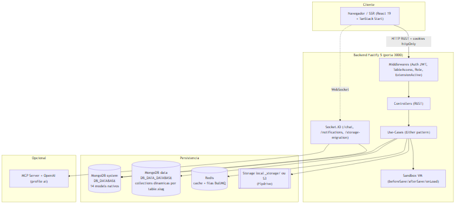

# Documentação Técnica — LowCodeJS

Documentação gerada a partir da análise do código-fonte (branch `develop`).
Plataforma **low-code** para criação de aplicações com tabelas dinâmicas, formulários,
dashboards e automações: **React 19 (TanStack Start SSR) + Fastify 5 + MongoDB/Mongoose +
Redis/BullMQ + Flydrive (local/S3) + Socket.IO + MCP/OpenAI (opcional)**.

## Índice

| # | Documento | Conteúdo |
|---|-----------|----------|
| 01 | [Visão Geral](01-overview.md) | Objetivo, problema, público-alvo, funcionalidades, fluxos. |
| 02 | [Arquitetura](02-architecture.md) | Camadas (Controller→Validator→UseCase→Repository), DI, 2 conexões MongoDB, kernel/plugins, frontend SSR, diagramas. |
| 03 | [Banco de Dados](03-database.md) | 14 models de sistema + Row dinâmico, campos, índices, relacionamentos, soft-delete, enums. |
| — | [dbdiagram.dbml](dbdiagram.dbml) | Modelo DBML completo (importável em dbdiagram.io). |
| 04 | [API REST](04-api.md) | ~137 rotas (136 core + 7 de extensões) por recurso, auth/permissão, WebSocket, OpenAPI. |
| 05 | [Regras de Negócio](05-domain-rules.md) | RBAC, visibilidade/colaboração, 9 estilos de tabela, schema dinâmico, sandbox, extensões, notificações. |
| 06 | [Segurança](06-security.md) | JWT RS256 + cookies, RBAC/middlewares, bcrypt, isolamento da VM, achados. |
| 07 | [Escalabilidade](07-scalability.md) | 2 conexões Mongo, cache, filas BullMQ, populate dinâmico, export CSV, paginação. |
| 08 | [Infraestrutura](08-infrastructure.md) | Docker Compose (dev/oficial), Dockerfiles, storage local/S3, Redis, SMTP, MCP, WebSocket + diagrama. |
| 09 | [Deploy & Setup](09-deployment.md) | `setup.sh`, variáveis de ambiente, build, CI/CD (Actions/Coolify), seeders, migrations. |
| 10 | [Observabilidade](10-observability.md) | Model + hook de Logger, `/health`, recurso de logs, eventos WebSocket. |
| 11 | [Dependências](11-dependencies.md) | Pacotes backend/frontend, versões, uso e criticidade. |
| 12 | [Dívida Técnica](12-technical-debt.md) | Inconsistências doc×código e refatorações priorizadas. |

## Como usar

- **Diagramas Mermaid** renderizam direto no GitHub/GitLab; cópias `.mmd` (fonte) e `.png` (render)
  ficam em [`_assets/`](_assets/).
- **DBML**: copie [`dbdiagram.dbml`](dbdiagram.dbml) em <https://dbdiagram.io> para o ER completo
  (validado com `@dbml/cli`: 15 tabelas, 19 enums).
- **API interativa**: Swagger/Scalar em `http://localhost:3000/documentation` com o backend rodando
  (`/openapi.json` para o spec bruto).

## ⚠️ Achados que exigem atenção (ver 06 e 12)

1. **`afterSave` e `onLoad` declarados mas nunca executados** no core — só `beforeSave` está cabeado.
   O usuário configura o script na UI, a plataforma persiste e **nada roda em runtime, sem erro**
   (`12-technical-debt.md` D-01; `create.use-case.ts:63`).
2. **`update` de row usa `findOneAndUpdate` + `$set`** → bypassa middlewares de documento Mongoose
   (`pre/post('save')`), comportamento inconsistente com `addGroupItem`/reactions que usam `.save()`
   (D-02; `row-mongoose.repository.ts:164-177`).
3. **`User.email` sem índice `unique` no schema** — unicidade garantida só no use-case (não atômica) →
   risco de duplicata em sign-ups concorrentes (D-09; `user.model.ts`).
4. **`Logger.object`: `required: true` + `default: null`** (contradição de schema → log de auditoria
   potencialmente inconsistente) (D-08; `logger.model.ts:27-32`).
5. **Extensões rodam com privilégios totais** (sem sandbox, diferente dos scripts de usuário) — risco
   latente, crítico se abrir para terceiros (D-14; `extensions/CLAUDE.md`).

> **Notas de precisão**: este conjunto documenta o estado do código no momento da análise (branch
> `develop`). Onde algo não pôde ser determinado pelo código, está sinalizado como **"Não determinável
> pelo código"**. Os `CLAUDE.md` de algumas camadas têm *drift* (ex.: citam "11 models"/storage "não
> segue contract pattern") — os números canônicos aqui (14 models, 9 estilos, 4 roles, 12 permissões,
> 16 tipos de campo) vêm do código-fonte. Ver `12-technical-debt.md` D-04/D-05/D-12.
