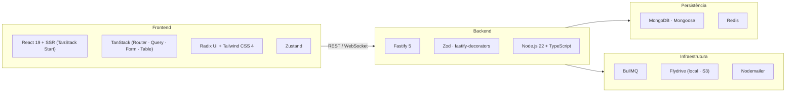
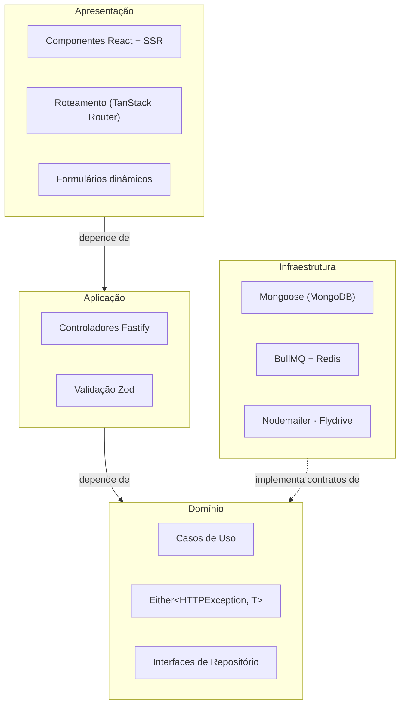
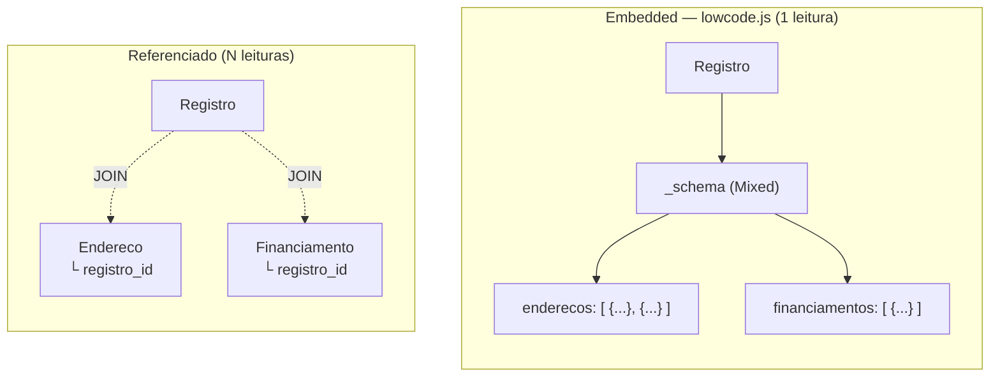

# Diagramas SBES — Design Spec

**Data:** 2026-05-17  
**Contexto:** Revisor pediu diagramas para ilustrar stack e camadas no artigo SBES.  
**Ferramenta:** Mermaid (exportar para PNG/SVG via mermaid-cli ou mermaid.live).

---

## Figura 1 — Stack de Desenvolvimento (seção 3.1)



**Caption:** Stack de desenvolvimento do lowcode.js, organizada por camada tecnológica.

---

## Figura 2 — Arquitetura em Camadas (seção 3.3)



**Caption:** Arquitetura em camadas do lowcode.js. Setas sólidas indicam dependência; seta tracejada indica implementação de interface (Regra de Dependência — camadas internas não dependem das externas).

---

## Figura 3 — Padrões de Projeto em Ação (seção 3.2)

```mermaid
sequenceDiagram
  participant Br as Browser
  participant Ctrl as Controlador Fastify
  participant UC as Caso de Uso
  participant Repo as IRepositório
  participant DB as MongoDB

  Br->>Ctrl: HTTP Request
  Ctrl->>Ctrl: Zod.parse(body)
  Ctrl->>UC: execute(params)
  UC->>Repo: findById(id)
  Repo->>DB: query
  DB-->>Repo: documento
  Repo-->>UC: Right(entity)
  UC-->>Ctrl: Right(result)
  Ctrl-->>Br: HTTP 200

  note over UC,Repo: DI container resolve IRepositório → MongooseRepositório
  note over Repo,Ctrl: Either&lt;HTTPException, T&gt; — pontos de falha explícitos no contrato
```

**Caption:** Fluxo de uma requisição HTTP ilustrando os padrões Repository, Either e injeção de dependência em ação conjunta.

---

## Figura 4 — Embedded Documents vs. Referências (seção 3.4)



**Caption:** Modelo embedded (lowcode.js) recupera grupos de campos em uma única leitura; modelo referenciado exige uma leitura por coleção relacionada.

---

## Exportar para imagem

```bash
# Via mermaid-cli (instalar uma vez: npm i -g @mermaid-js/mermaid-cli)
mmdc -i docs/superpowers/specs/2026-05-17-sbes-diagramas-design.md -o fig1-stack.png
```

Ou colar cada bloco em https://mermaid.live e baixar SVG/PNG.
