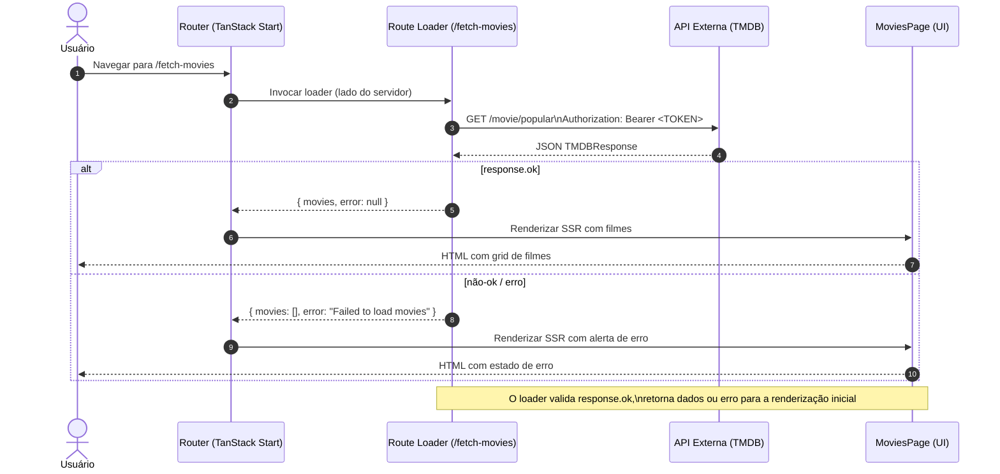

Este guia demonstra como integrar chamadas a APIs externas na sua aplicação TanStack Start usando route loaders. Vamos usar a API do TMDB para buscar filmes populares com TanStack Start e entender como buscar dados em uma aplicação TanStack Start.

O código completo deste tutorial está disponível no [GitHub](https://github.com/shrutikapoor08/tanstack-start-movies).

## O que você vai aprender

1. Configurar a integração com uma API externa no TanStack Start
1. Implementar route loaders para busca de dados no lado do servidor
1. Construir componentes de UI responsivos com dados buscados
1. Lidar com estados de carregamento e gerenciamento de erros

## Pré-requisitos

- Conhecimento básico de React e TypeScript
- Node.js (v18+) e `pnpm` instalados na sua máquina
- Uma chave de API do TMDB (gratuita em [themoviedb.org](https://www.themoviedb.org))

## Bom saber

- [TanStack Router](/router/latest/docs/framework/react/routing/routing-concepts)

## Configurando um projeto TanStack Start

Primeiro, vamos criar um novo projeto TanStack Start:

```bash
pnpx create-start-app movie-discovery
cd movie-discovery
```

Quando esse script for executado, ele fará algumas perguntas de configuração. Você pode escolher as opções que preferir ou simplesmente pressionar enter para aceitar os padrões.

Opcionalmente, você pode passar a flag `--add-on` para obter opções como Shadcn, Clerk, Convex, TanStack Query, etc.

Assim que a configuração estiver concluída, instale as dependências e inicie o servidor de desenvolvimento:

```bash
pnpm i
pnpm dev
```

## Entendendo a estrutura do projeto

Neste ponto, a estrutura do projeto deve se parecer com isto:

```text
/movie-discovery
├── src/
│   ├── routes/
│   │   ├── __root.tsx                    # Layout raiz
│   │   ├── index.tsx                     # Página inicial
│   │   └── fetch-movies.tsx              # Rota de busca de filmes
│   ├── types/
│   │   └── movie.ts                      # Definições de tipos de filmes
│   ├── router.tsx                        # Configuração do router
│   ├── routeTree.gen.ts                  # Árvore de rotas gerada
│   └── styles.css                        # Estilos globais
├── public/                               # Arquivos estáticos
├── vite.config.ts                         # Configuração do TanStack Start
├── package.json                          # Dependências do projeto
└── tsconfig.json                         # Configuração do TypeScript

```

Depois que o projeto estiver configurado, você pode acessar sua aplicação em `localhost:3000`. Você deverá ver a página de boas-vindas padrão do TanStack Start.

## Passo 1: Configurar um arquivo `.env` com TMDB_AUTH_TOKEN

Para buscar filmes da API do TMDB, você precisa de um token de autenticação. Você pode obtê-lo gratuitamente em themoviedb.org.

Primeiro, vamos configurar as variáveis de ambiente para nossa chave de API. Crie um arquivo `.env` na raiz do seu projeto:

```bash
touch .env

```

Adicione seu token de API do TMDB neste arquivo:

```dotenv
TMDB_AUTH_TOKEN=your_bearer_token_here
```

_Importante_: Certifique-se de adicionar `.env` ao seu arquivo `.gitignore` para manter suas chaves de API seguras.

## Passo 2: Definindo os tipos de dados

Vamos criar interfaces TypeScript para nossos dados de filmes. Crie um novo arquivo em `src/types/movie.ts`:

```ts
// src/types/movie.ts
export interface Movie {
  id: number;
  title: string;
  overview: string;
  poster_path: string | null;
  backdrop_path: string | null;
  release_date: string;
  vote_average: number;
  popularity: number;
}

export interface TMDBResponse {
  page: number;
  results: Movie[];
  total_pages: number;
  total_results: number;
}
```

## Passo 3: Criando a rota com a função de busca na API

Para chamar a API do TMDB, vamos criar uma server function que busca dados no servidor. Essa abordagem mantém nossas credenciais de API seguras, nunca as expondo ao cliente.
Vamos criar nossa rota que busca dados da API do TMDB. Crie um novo arquivo em `src/routes/fetch-movies.tsx`:

```typescript
// src/routes/fetch-movies.tsx
import { createFileRoute } from "@tanstack/react-router";
import type { Movie, TMDBResponse } from "../types/movie";
import { createServerFn } from "@tanstack/react-start";

const API_URL =
  "https://api.themoviedb.org/3/discover/movie?include_adult=false&include_video=false&language=en-US&page=1&sort_by=popularity.desc";

const fetchPopularMovies = createServerFn().handler(
  async (): Promise<TMDBResponse> => {
    const response = await fetch(API_URL, {
      headers: {
        accept: "application/json",
        Authorization: `Bearer ${process.env.TMDB_AUTH_TOKEN}`,
      },
    });

    if (!response.ok) {
      throw new Error(`Failed to fetch movies: ${response.statusText}`);
    }

    return response.json();
  },
);

export const Route = createFileRoute("/fetch-movies")({
  component: MoviesPage,
  loader: async (): Promise<{ movies: Movie[]; error: string | null }> => {
    try {
      const moviesData = await fetchPopularMovies();
      return { movies: moviesData.results, error: null };
    } catch (error) {
      console.error("Error fetching movies:", error);
      return { movies: [], error: "Failed to load movies" };
    }
  },
});
```

_O que está acontecendo aqui:_

- `createServerFn()` cria uma função exclusiva do servidor que roda apenas no servidor, garantindo que nossa variável de ambiente `TMDB_AUTH_TOKEN` nunca seja exposta ao cliente. A server function faz uma requisição autenticada à API do TMDB e retorna a resposta JSON parseada.
- O route loader executa no servidor quando um usuário visita /fetch-movies, chamando nossa server function antes da página renderizar
- O tratamento de erros garante que o componente sempre receba uma estrutura de dados válida -- seja os filmes ou um array vazio com uma mensagem de erro
- Esse padrão fornece renderização no lado do servidor, segurança de tipos automática e manipulação segura de credenciais de API de forma nativa.

## Passo 4: Construindo os componentes de filmes

Agora vamos criar os componentes que exibirão nossos dados de filmes. Adicione estes componentes ao mesmo arquivo `fetch-movies.tsx`:

```tsx
// Componente MovieCard
const MovieCard = ({ movie }: { movie: Movie }) => {
  return (
    <div
      className="bg-white/10 border border-white/20 rounded-lg overflow-hidden backdrop-blur-sm shadow-md hover:shadow-xl transition-all duration-300 hover:scale-105"
      aria-label={`Movie: ${movie.title}`}
      role="group"
    >
      {movie.poster_path && (
        
      )}
      <div className="p-4">
        <MovieDetails movie={movie} />
      </div>
    </div>
  );
};

// Componente MovieDetails
const MovieDetails = ({ movie }: { movie: Movie }) => {
  return (
    <>
      <h3 className="text-lg font-semibold mb-2 line-clamp-2">{movie.title}</h3>
      <p className="text-sm text-gray-300 mb-3 line-clamp-3 h-10">
        {movie.overview}
      </p>
      <div className="flex justify-between items-center text-xs text-gray-400">
        <span>{movie.release_date}</span>
        <span className="flex items-center">
          ⭐️ {movie.vote_average.toFixed(1)}
        </span>
      </div>
    </>
  );
};
```

## Passo 5: Criando o componente MoviesPage

Por fim, vamos criar o componente principal que consome os dados do loader:

```tsx
// Componente MoviesPage
const MoviesPage = () => {
  const { movies, error } = Route.useLoaderData();

  return (
    <div
      className="flex items-center justify-center min-h-screen p-4 text-white"
      style={{
        backgroundColor: "#000",
        backgroundImage:
          "radial-gradient(ellipse 60% 60% at 0% 100%, #444 0%, #222 60%, #000 100%)",
      }}
      role="main"
      aria-label="Popular Movies Section"
    >
      <div className="w-full max-w-6xl p-8 rounded-xl backdrop-blur-md bg-black/50 shadow-xl border-8 border-black/10">
        <h1 className="text-3xl mb-6 font-bold text-center">Popular Movies</h1>

        {error && (
          <div
            className="text-red-400 text-center mb-4 p-4 bg-red-900/20 rounded-lg"
            role="alert"
          >
            {error}
          </div>
        )}

        {movies.length > 0 ? (
          <div
            className="grid grid-cols-1 md:grid-cols-2 lg:grid-cols-3 xl:grid-cols-4 gap-6"
            aria-label="Movie List"
          >
            {movies.slice(0, 12).map((movie) => (
              <MovieCard key={movie.id} movie={movie} />
            ))}
          </div>
        ) : (
          !error && (
            <div className="text-center text-gray-400" role="status">
              Loading movies...
            </div>
          )
        )}
      </div>
    </div>
  );
};
```

### Entendendo como tudo funciona junto



Vamos detalhar como as diferentes partes da nossa aplicação funcionam juntas:

1. Route loader: Quando um usuário visita `/fetch-movies`, a função loader executa no servidor
2. Chamada à API: O loader chama `fetchPopularMovies()` que faz uma requisição HTTP ao TMDB
3. Renderização no lado do servidor: Os dados são buscados no servidor, reduzindo a carga no lado do cliente
4. Renderização do componente: O componente `MoviesPage` recebe os dados via `Route.useLoaderData()`
5. Renderização da UI: Os cards de filmes são renderizados com os dados buscados

## Passo 6: Testando sua aplicação

Agora você pode testar sua aplicação visitando [http://localhost:3000/fetch-movies](http://localhost:3000/fetch-movies). Se tudo estiver configurado corretamente, você deverá ver um grid de filmes populares com seus pôsteres, títulos e avaliações. Sua aplicação deve ficar assim:


## Conclusão

Você construiu com sucesso uma aplicação de descoberta de filmes que se integra a uma API externa usando TanStack Start. Este tutorial demonstrou como usar route loaders para busca de dados no lado do servidor e como construir componentes de UI com dados externos.

Embora buscar dados em tempo de build no TanStack Start seja perfeito para conteúdo estático como posts de blog ou páginas de produtos, não é ideal para aplicações interativas. Se você precisa de recursos como atualizações em tempo real, cache ou rolagem infinita, vai querer usar o [TanStack Query](/query/latest) no lado do cliente. O TanStack Query facilita o gerenciamento de dados dinâmicos com cache integrado, atualizações em segundo plano e interações fluidas com o usuário. Ao usar TanStack Start para conteúdo estático e TanStack Query para funcionalidades interativas, você obtém páginas com carregamento rápido e toda a funcionalidade moderna que os usuários esperam.
