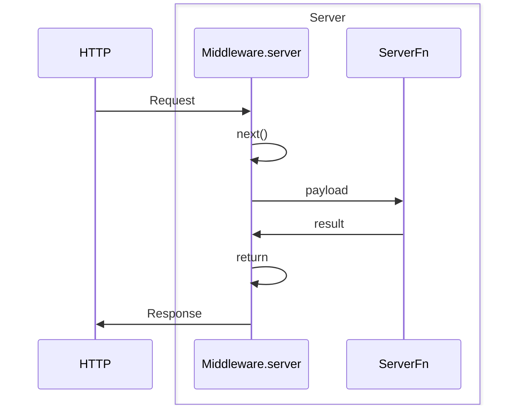
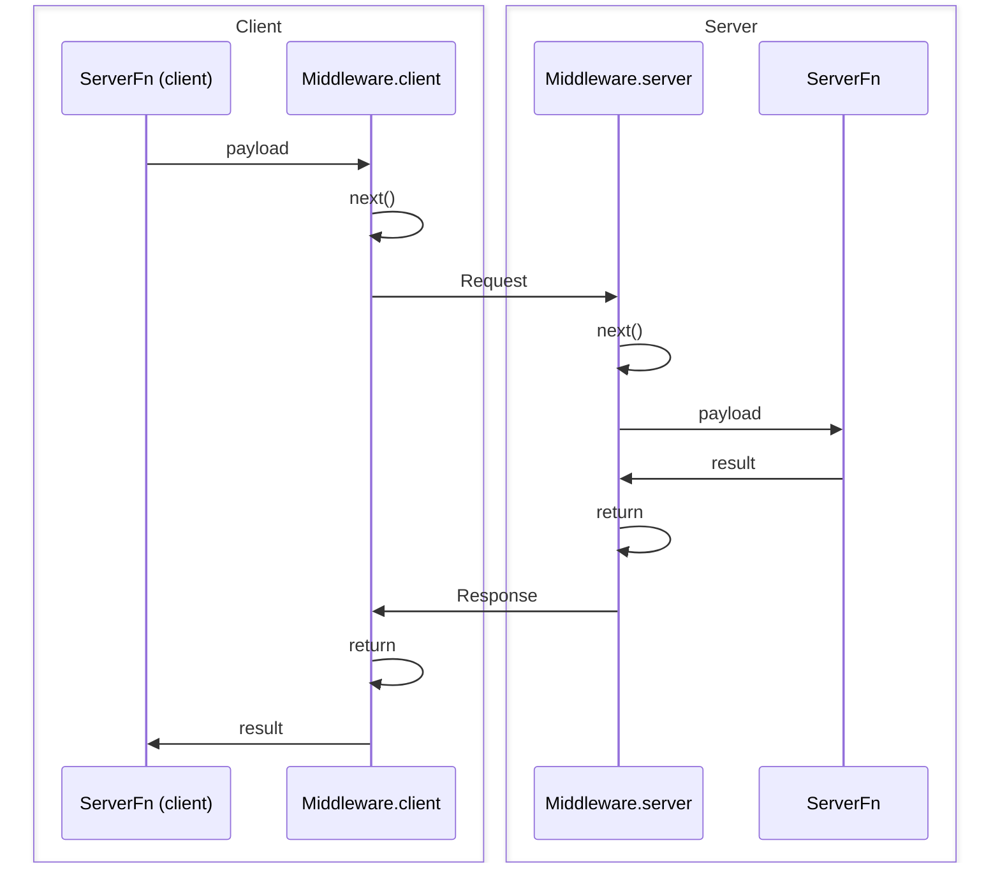

## O que é Middleware?

Middleware permite que você personalize o comportamento tanto de rotas de servidor como GET/POST/etc (incluindo requisições para SSR da sua aplicação) quanto de server functions criadas com `createServerFn`. Middleware é composável e pode até depender de outros middlewares para criar uma cadeia de operações que são executadas hierarquicamente e em ordem.

### Que tipos de coisas posso fazer com Middleware?

- **Autenticação**: Verificar a identidade de um usuário antes de executar uma server function.
- **Autorização**: Verificar se um usuário possui as permissões necessárias para executar uma server function.
- **Logging**: Registrar requisições, respostas e erros.
- **CSP**: Configurar Content Security Policy e outras medidas de segurança.
- **Observabilidade**: Coletar métricas, traces e logs.
- **Fornecer Contexto**: Anexar dados ao objeto de requisição para uso em outros middlewares ou server functions.
- **Tratamento de Erros**: Tratar erros de forma consistente.
- E muito mais! As possibilidades dependem de você!

## Tipos de Middleware

Existem dois tipos de middleware: **request middleware** e **server function middleware**.

- **Request middleware** é usado para personalizar o comportamento de qualquer requisição de servidor que passe por ele, incluindo server functions.
- **Server function middleware** é usado para personalizar o comportamento de server functions especificamente.

> [!NOTE]
> Server function middleware é um subconjunto do request middleware que possui funcionalidades extras especificamente para server functions, como a capacidade de validar dados de entrada ou executar lógica no lado do cliente tanto antes quanto depois da execução da server function.

### Principais Diferenças

| Recurso           | Request Middleware                 | Server Function Middleware |
| ----------------- | ---------------------------------- | -------------------------- |
| Escopo            | Todas as requisições do servidor   | Apenas server functions    |
| Métodos           | `.server()`                        | `.client()`, `.server()`   |
| Validação de Entrada | Não                             | Sim (`.inputValidator()`)  |
| Lógica no Cliente | Não                                | Sim                        |
| Dependências      | Pode depender de request middleware | Pode depender de ambos os tipos |

> [!NOTE]
> Request middleware não pode depender de server function middleware, mas server function middleware pode depender de request middleware.

## Conceitos Fundamentais

### Composição de Middleware

Todo middleware é composável, o que significa que um middleware pode depender de outro middleware.

```tsx
import { createMiddleware } from "@tanstack/react-start";

const loggingMiddleware = createMiddleware().server(() => {
  //...
});

const authMiddleware = createMiddleware()
  .middleware([loggingMiddleware])
  .server(() => {
    //...
  });
```

### Avançando na Cadeia de Middleware

Middleware permite encadeamento via `next`, o que significa que você deve chamar a função `next` no método `.server` (e/ou no método `.client` se estiver criando um server function middleware) para executar o próximo middleware na cadeia. Isso permite que você:

- Interrompa a cadeia de middleware e retorne antecipadamente
- Passe dados para o próximo middleware
- Acesse o resultado do próximo middleware
- Passe contexto para o middleware envolvente

```tsx
import { createMiddleware } from "@tanstack/react-start";

const loggingMiddleware = createMiddleware().server(async ({ next }) => {
  const result = await next(); // <-- Isso executará o próximo middleware na cadeia
  return result;
});
```

## Request Middleware

Request middleware é usado para personalizar o comportamento de qualquer requisição de servidor que passe por ele, incluindo rotas de servidor, SSR e server functions.

Para criar um request middleware, chame a função `createMiddleware`. Você pode chamar esta função com a propriedade `type` definida como 'request', mas este é o valor padrão, então você pode omiti-la se preferir.

```tsx
import { createMiddleware } from "@tanstack/react-start";

const loggingMiddleware = createMiddleware().server(() => {
  //...
});
```

### Métodos Disponíveis

Request middleware possui os seguintes métodos:

- `middleware`: Adicionar um middleware à cadeia.
- `server`: Definir a lógica do lado do servidor que o middleware executará antes de qualquer middleware aninhado e, por fim, de uma server function, e também fornecer o resultado para o próximo middleware.

### O método `.server`

O método `.server` é usado para definir a lógica do lado do servidor que o middleware executará antes de qualquer middleware aninhado, e também fornecer o resultado para o próximo middleware. Ele recebe o método `next` e outros elementos como contexto e o objeto de requisição:

```tsx
import { createMiddleware } from "@tanstack/react-start";

const loggingMiddleware = createMiddleware().server(
  ({ next, context, request }) => {
    return next();
  },
);
```

Para visualizar rapidamente essa troca, aqui está um diagrama:



### Usando Request Middleware com Rotas de Servidor

Você pode usar request middleware com rotas de servidor de duas formas:

#### Todos os Métodos da Rota de Servidor

Para que uma rota de servidor use middleware para todos os métodos, passe um array de middleware para a propriedade `middleware` do objeto construtor de métodos.

```tsx
import { createMiddleware } from "@tanstack/react-start";

const loggingMiddleware = createMiddleware().server(() => {
  //...
});

export const Route = createFileRoute("/foo")({
  server: {
    middleware: [loggingMiddleware],
    handlers: {
      GET: () => {
        //...
      },
      POST: () => {
        //...
      },
    },
  },
});
```

#### Métodos Específicos da Rota de Servidor

Você pode passar middleware para métodos específicos da rota de servidor usando o utilitário `createHandlers` e passando um array de middleware para a propriedade `middleware` do objeto do método.

```tsx
import { createMiddleware } from "@tanstack/react-start";

const loggingMiddleware = createMiddleware().server(() => {
  //...
});

export const Route = createFileRoute("/foo")({
  server: {
    handlers: ({ createHandlers }) =>
      createHandlers({
        GET: {
          middleware: [loggingMiddleware],
          handler: () => {
            //...
          },
        },
      }),
  },
});
```

## Server Function Middleware

Server function middleware é um **subconjunto** do request middleware que possui funcionalidades extras especificamente para server functions, como a capacidade de validar dados de entrada ou executar lógica no lado do cliente tanto antes quanto depois da execução da server function.

Para criar um server function middleware, chame a função `createMiddleware` com a propriedade `type` definida como 'function'.

```tsx
import { createMiddleware } from "@tanstack/react-start";

const loggingMiddleware = createMiddleware({ type: "function" })
  .client(() => {
    //...
  })
  .server(() => {
    //...
  });
```

### Métodos Disponíveis

Server function middleware possui os seguintes métodos:

- `middleware`: Adicionar um middleware à cadeia.
- `inputValidator`: Modificar o objeto de dados antes que ele seja passado para este middleware, para qualquer middleware aninhado e, eventualmente, para a server function.
- `client`: Definir a lógica do lado do cliente que o middleware executará no cliente antes (e depois) que a server function faça a chamada ao servidor para executar a função.
- `server`: Definir a lógica do lado do servidor que o middleware executará no servidor antes (e depois) que a server function seja executada.

> [!NOTE]
> Se você está (esperamos que sim) usando TypeScript, a ordem desses métodos é imposta pelo sistema de tipos para garantir máxima inferência e segurança de tipos.

### O método `.client`

O método `.client` é usado para definir a lógica do lado do cliente que o middleware irá envolver a execução e o resultado da chamada RPC ao servidor.

```tsx
import { createMiddleware } from "@tanstack/react-start";

const loggingMiddleware = createMiddleware({ type: "function" }).client(
  async ({ next, context, request }) => {
    const result = await next(); // <-- Isso executará o próximo middleware na cadeia e, eventualmente, o RPC para o servidor
    return result;
  },
);
```

### O método `.inputValidator`

O método `inputValidator` é usado para modificar o objeto de dados antes que ele seja passado para este middleware, para middlewares aninhados e, por fim, para a server function. Este método deve receber uma função que recebe o objeto de dados e retorna um objeto de dados validado (e opcionalmente modificado). É comum usar uma biblioteca de validação como `zod` para isso.

```tsx
import { createMiddleware } from "@tanstack/react-start";
import { zodValidator } from "@tanstack/zod-adapter";
import { z } from "zod";

const mySchema = z.object({
  workspaceId: z.string(),
});

const workspaceMiddleware = createMiddleware({ type: "function" })
  .inputValidator(zodValidator(mySchema))
  .server(({ next, data }) => {
    console.log("Workspace ID:", data.workspaceId);
    return next();
  });
```

### Usando Server Function Middleware

Para que um middleware envolva uma server function específica, você pode passar um array de middleware para a propriedade `middleware` da função `createServerFn`.

```tsx
import { createServerFn } from "@tanstack/react-start";
import { loggingMiddleware } from "./middleware";

const fn = createServerFn()
  .middleware([loggingMiddleware])
  .handler(async () => {
    //...
  });
```

Para visualizar rapidamente essa troca, aqui está um diagrama:



## Gerenciamento de Contexto

### Fornecendo Contexto via `next`

A função `next` pode ser opcionalmente chamada com um objeto que possui uma propriedade `context` com um valor do tipo objeto. Quaisquer propriedades que você passar para esse valor `context` serão mescladas no `context` pai e fornecidas ao próximo middleware.

```tsx
import { createMiddleware } from "@tanstack/react-start";

const awesomeMiddleware = createMiddleware({ type: "function" }).server(
  ({ next }) => {
    return next({
      context: {
        isAwesome: Math.random() > 0.5,
      },
    });
  },
);

const loggingMiddleware = createMiddleware({ type: "function" })
  .middleware([awesomeMiddleware])
  .server(async ({ next, context }) => {
    console.log("Is awesome?", context.isAwesome);
    return next();
  });
```

### Enviando Contexto do Cliente para o Servidor

**O contexto do cliente NÃO é enviado ao servidor por padrão, pois isso poderia acabar enviando grandes payloads ao servidor de forma não intencional.** Se você precisar enviar contexto do cliente para o servidor, deve chamar a função `next` com uma propriedade `sendContext` e um objeto para transmitir quaisquer dados ao servidor. Quaisquer propriedades passadas para `sendContext` serão mescladas, serializadas e enviadas ao servidor junto com os dados, e estarão disponíveis no objeto de contexto normal de qualquer middleware de servidor aninhado.

```tsx
import { createMiddleware } from "@tanstack/react-start";

const requestLogger = createMiddleware({ type: "function" })
  .client(async ({ next, context }) => {
    return next({
      sendContext: {
        // Envia o workspace ID para o servidor
        workspaceId: context.workspaceId,
      },
    });
  })
  .server(async ({ next, data, context }) => {
    // Incrível! Temos o workspace ID vindo do cliente!
    console.log("Workspace ID:", context.workspaceId);
    return next();
  });
```

#### Segurança do Contexto Enviado pelo Cliente

Você pode ter notado que no exemplo acima, embora o contexto enviado pelo cliente seja type-safe, ele não é obrigatoriamente validado em tempo de execução. Se você passar dados dinâmicos gerados pelo usuário via contexto, isso pode representar uma preocupação de segurança, então **se você estiver enviando dados dinâmicos do cliente para o servidor via contexto, você deve validá-los no middleware do lado do servidor antes de usá-los.**

```tsx
import { createMiddleware } from "@tanstack/react-start";
import { zodValidator } from "@tanstack/zod-adapter";
import { z } from "zod";

const requestLogger = createMiddleware({ type: "function" })
  .client(async ({ next, context }) => {
    return next({
      sendContext: {
        workspaceId: context.workspaceId,
      },
    });
  })
  .server(async ({ next, data, context }) => {
    // Valida o workspace ID antes de usá-lo
    const workspaceId = zodValidator(z.number()).parse(context.workspaceId);
    console.log("Workspace ID:", workspaceId);
    return next();
  });
```

### Enviando Contexto do Servidor para o Cliente

Similar ao envio de contexto do cliente para o servidor, você também pode enviar contexto do servidor para o cliente chamando a função `next` com uma propriedade `sendContext` e um objeto para transmitir quaisquer dados ao cliente. Quaisquer propriedades passadas para `sendContext` serão mescladas, serializadas e enviadas ao cliente junto com a resposta, e estarão disponíveis no objeto de contexto normal de qualquer middleware de cliente aninhado. O objeto retornado ao chamar `next` no `client` contém o contexto enviado do servidor para o cliente e é type-safe.

> [!WARNING]
> O tipo de retorno de `next` no `client` só pode ser inferido a partir de middlewares conhecidos na cadeia de middleware atual. Portanto, o tipo de retorno mais preciso de `next` está no middleware no final da cadeia de middleware.

```tsx
import { createMiddleware } from "@tanstack/react-start";

const serverTimer = createMiddleware({ type: "function" }).server(
  async ({ next }) => {
    return next({
      sendContext: {
        // Envia a hora atual para o cliente
        timeFromServer: new Date(),
      },
    });
  },
);

const requestLogger = createMiddleware({ type: "function" })
  .middleware([serverTimer])
  .client(async ({ next }) => {
    const result = await next();
    // Incrível! Temos a hora vinda do servidor!
    console.log("Time from the server:", result.context.timeFromServer);

    return result;
  });
```

## Middleware Global

Middleware global é executado automaticamente para cada requisição na sua aplicação. Isso é útil para funcionalidades como autenticação, logging e monitoramento que devem se aplicar a todas as requisições.

> [!NOTE]
> O arquivo `src/start.ts` não está incluído no template padrão do TanStack Start. Você precisará criar este arquivo quando quiser configurar middleware global ou outras opções a nível de Start.

### Request Middleware Global

Para que um middleware seja executado em **cada requisição tratada pelo Start**, crie um arquivo `src/start.ts` e use a função `createStart` para retornar a configuração do seu middleware:

```tsx
// src/start.ts
import { createStart, createMiddleware } from "@tanstack/react-start";

const myGlobalMiddleware = createMiddleware().server(() => {
  //...
});

export const startInstance = createStart(() => {
  return {
    requestMiddleware: [myGlobalMiddleware],
  };
});
```

> [!NOTE]
> O **request** middleware global é executado antes de **cada requisição, incluindo rotas de servidor, SSR e server functions**.

### Server Function Middleware Global

Para que um middleware seja executado em **cada server function da sua aplicação**, adicione-o ao array `functionMiddleware` no seu arquivo `src/start.ts`:

```tsx
// src/start.ts
import { createStart } from "@tanstack/react-start";
import { loggingMiddleware } from "./middleware";

export const startInstance = createStart(() => {
  return {
    functionMiddleware: [loggingMiddleware],
  };
});
```

### Ordem de Execução do Middleware

O middleware é executado com prioridade para dependências, começando pelo middleware global, seguido pelo server function middleware. O exemplo a seguir registrará nesta ordem:

- `globalMiddleware1`
- `globalMiddleware2`
- `a`
- `b`
- `c`
- `d`
- `fn`

```tsx
import { createMiddleware, createServerFn } from "@tanstack/react-start";

const globalMiddleware1 = createMiddleware({ type: "function" }).server(
  async ({ next }) => {
    console.log("globalMiddleware1");
    return next();
  },
);

const globalMiddleware2 = createMiddleware({ type: "function" }).server(
  async ({ next }) => {
    console.log("globalMiddleware2");
    return next();
  },
);

const a = createMiddleware({ type: "function" }).server(async ({ next }) => {
  console.log("a");
  return next();
});

const b = createMiddleware({ type: "function" })
  .middleware([a])
  .server(async ({ next }) => {
    console.log("b");
    return next();
  });

const c = createMiddleware({ type: "function" })
  .middleware()
  .server(async ({ next }) => {
    console.log("c");
    return next();
  });

const d = createMiddleware({ type: "function" })
  .middleware([b, c])
  .server(async () => {
    console.log("d");
  });

const fn = createServerFn()
  .middleware([d])
  .server(async () => {
    console.log("fn");
  });
```

## Modificação de Requisição e Resposta

### Lendo/Modificando a Resposta do Servidor

Middleware que usa o método `server` é executado no mesmo contexto que as server functions, então você pode seguir exatamente os mesmos [Utilitários de Contexto de Server Function](./server-functions.md#server-function-context) para ler e modificar qualquer coisa sobre os headers da requisição, códigos de status, etc.

### Modificando a Requisição do Cliente

Middleware que usa o método `client` é executado em um **contexto completamente diferente do lado do cliente** em relação às server functions, então você não pode usar os mesmos utilitários para ler e modificar a requisição. No entanto, você ainda pode modificar a requisição retornando propriedades adicionais ao chamar a função `next`.

#### Definindo Headers Personalizados

Você pode adicionar headers à requisição de saída passando um objeto `headers` para `next`:

```tsx
import { createMiddleware } from "@tanstack/react-start";
import { getToken } from "my-auth-library";

const authMiddleware = createMiddleware({ type: "function" }).client(
  async ({ next }) => {
    return next({
      headers: {
        Authorization: `Bearer ${getToken()}`,
      },
    });
  },
);
```

#### Mesclagem de Headers entre Middlewares

Quando múltiplos middlewares definem headers, eles são **mesclados juntos**. Middlewares posteriores podem adicionar novos headers ou sobrescrever headers definidos por middlewares anteriores:

```tsx
import { createMiddleware } from "@tanstack/react-start";

const firstMiddleware = createMiddleware({ type: "function" }).client(
  async ({ next }) => {
    return next({
      headers: {
        "X-Request-ID": "12345",
        "X-Source": "first-middleware",
      },
    });
  },
);

const secondMiddleware = createMiddleware({ type: "function" }).client(
  async ({ next }) => {
    return next({
      headers: {
        "X-Timestamp": Date.now().toString(),
        "X-Source": "second-middleware", // Sobrescreve o primeiro middleware
      },
    });
  },
);

// Os headers finais incluirão:
// - X-Request-ID: '12345' (do primeiro)
// - X-Timestamp: '<timestamp>' (do segundo)
// - X-Source: 'second-middleware' (o segundo sobrescreve o primeiro)
```

Você também pode definir headers diretamente no local da chamada:

```tsx
await myServerFn({
  data: { name: "John" },
  headers: {
    "X-Custom-Header": "call-site-value",
  },
});
```

**Precedência de headers (todos os headers são mesclados, valores posteriores sobrescrevem anteriores):**

1. Headers de middlewares anteriores
2. Headers de middlewares posteriores (sobrescrevem anteriores)
3. Headers no local da chamada (sobrescrevem todos os headers de middleware)

#### Implementação Personalizada de Fetch

Para casos de uso avançados, você pode fornecer uma implementação personalizada de `fetch` para controlar como as requisições de server functions são feitas. Isso é útil para:

- Adicionar interceptadores de requisição ou lógica de retry
- Usar um cliente HTTP personalizado
- Testes e mocking
- Adicionar telemetria ou monitoramento

**Via Client Middleware:**

```tsx
import { createMiddleware } from "@tanstack/react-start";
import type { CustomFetch } from "@tanstack/react-start";

const customFetchMiddleware = createMiddleware({ type: "function" }).client(
  async ({ next }) => {
    const customFetch: CustomFetch = async (url, init) => {
      console.log("Request starting:", url);
      const start = Date.now();

      const response = await fetch(url, init);

      console.log("Request completed in", Date.now() - start, "ms");
      return response;
    };

    return next({ fetch: customFetch });
  },
);
```

**Diretamente no Local da Chamada:**

```tsx
import type { CustomFetch } from "@tanstack/react-start";

const myFetch: CustomFetch = async (url, init) => {
  // Adicione lógica personalizada aqui
  return fetch(url, init);
};

await myServerFn({
  data: { name: "John" },
  fetch: myFetch,
});
```

#### Precedência de Override do Fetch

Quando implementações personalizadas de fetch são fornecidas em múltiplos níveis, a seguinte precedência se aplica (da maior para a menor prioridade):

| Prioridade      | Origem             | Descrição                                            |
| --------------- | ------------------ | ---------------------------------------------------- |
| 1 (mais alta)   | Local da chamada   | `serverFn({ fetch: customFetch })`                   |
| 2               | Middleware posterior | Último middleware na cadeia que fornece `fetch`      |
| 3               | Middleware anterior | Primeiro middleware na cadeia que fornece `fetch`    |
| 4               | createStart        | `createStart({ serverFns: { fetch: customFetch } })` |
| 5 (mais baixa)  | Padrão             | Função `fetch` global                                |

**Princípio chave:** O local da chamada sempre tem prioridade. Isso permite que você sobrescreva o comportamento do middleware para chamadas específicas quando necessário.

```tsx
import { createMiddleware, createServerFn } from "@tanstack/react-start";
import type { CustomFetch } from "@tanstack/react-start";

// Middleware define um fetch que adiciona logging
const loggingMiddleware = createMiddleware({ type: "function" }).client(
  async ({ next }) => {
    const loggingFetch: CustomFetch = async (url, init) => {
      console.log("Middleware fetch:", url);
      return fetch(url, init);
    };
    return next({ fetch: loggingFetch });
  },
);

const myServerFn = createServerFn()
  .middleware([loggingMiddleware])
  .handler(async () => {
    return { message: "Hello" };
  });

// Usa o loggingFetch do middleware
await myServerFn();

// Sobrescreve com um fetch personalizado para esta chamada específica
const testFetch: CustomFetch = async (url, init) => {
  console.log("Test fetch:", url);
  return fetch(url, init);
};
await myServerFn({ fetch: testFetch }); // Usa testFetch, NÃO loggingFetch
```

**Exemplo de Middleware Encadeado:**

Quando múltiplos middlewares fornecem fetch, o último tem prioridade:

```tsx
import { createMiddleware, createServerFn } from "@tanstack/react-start";
import type { CustomFetch } from "@tanstack/react-start";

const firstMiddleware = createMiddleware({ type: "function" }).client(
  async ({ next }) => {
    const firstFetch: CustomFetch = (url, init) => {
      const headers = new Headers(init?.headers);
      headers.set("X-From", "first-middleware");
      return fetch(url, { ...init, headers });
    };
    return next({ fetch: firstFetch });
  },
);

const secondMiddleware = createMiddleware({ type: "function" }).client(
  async ({ next }) => {
    const secondFetch: CustomFetch = (url, init) => {
      const headers = new Headers(init?.headers);
      headers.set("X-From", "second-middleware");
      return fetch(url, { ...init, headers });
    };
    return next({ fetch: secondFetch });
  },
);

const myServerFn = createServerFn()
  .middleware([firstMiddleware, secondMiddleware])
  .handler(async () => {
    // A requisição terá X-From: 'second-middleware'
    // porque o fetch do secondMiddleware sobrescreve o fetch do firstMiddleware
    return { message: "Hello" };
  });
```

**Fetch Global via createStart:**

Você pode definir um fetch personalizado padrão para todas as server functions da sua aplicação fornecendo `serverFns.fetch` em `createStart`. Isso é útil para adicionar interceptadores de requisição globais, lógica de retry ou telemetria:

```tsx
// src/start.ts
import { createStart } from "@tanstack/react-start";
import type { CustomFetch } from "@tanstack/react-start";

const globalFetch: CustomFetch = async (url, init) => {
  console.log("Global fetch:", url);
  // Adicione lógica de retry, telemetria, etc.
  return fetch(url, init);
};

export const startInstance = createStart(() => {
  return {
    serverFns: {
      fetch: globalFetch,
    },
  };
});
```

Este fetch global tem prioridade menor que o fetch de middleware e do local da chamada, então você ainda pode sobrescrevê-lo para server functions ou chamadas específicas quando necessário.

> [!NOTE]
> O fetch personalizado só se aplica no lado do cliente. Durante o SSR, as server functions são chamadas diretamente sem passar pelo fetch.

## Ambiente e Performance

### Tree Shaking de Ambiente

A funcionalidade de middleware sofre tree shaking baseado no ambiente para cada bundle produzido.

- No servidor, nada sofre tree shaking, então todo o código usado em middleware será incluído no bundle do servidor.
- No cliente, todo o código específico do servidor é removido do bundle do cliente. Isso significa que qualquer código usado no método `server` é sempre removido do bundle do cliente. O código de validação de `data` também será removido.
