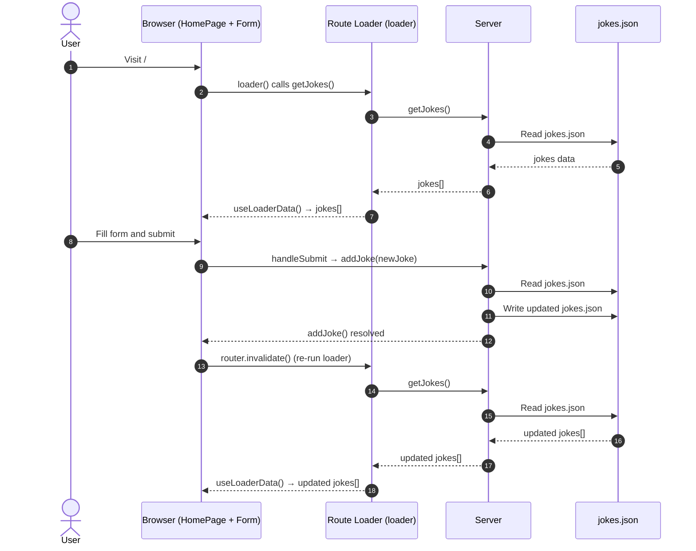

Este tutorial irá guiá-lo na construção de uma aplicação full-stack completa usando TanStack Start. Você criará um app DevJokes onde os usuários podem visualizar e adicionar piadas com temática de desenvolvedor, demonstrando conceitos-chave do TanStack Start, incluindo server functions, armazenamento de dados baseado em arquivos e componentes React.

Aqui está uma demonstração do app em funcionamento:

<iframe width="560" height="315" src="https://www.youtube.com/embed/zd0rtKbtlgU?si=7W1Peoo0W0WvZmAd" title="YouTube video player" frameborder="0" allow="accelerometer; autoplay; clipboard-write; encrypted-media; gyroscope; picture-in-picture; web-share" referrerpolicy="strict-origin-when-cross-origin" allowfullscreen></iframe>

O código completo deste tutorial está disponível no [GitHub](https://github.com/shrutikapoor08/devjokes).

## O que Você Vai Aprender

1. Configurar um projeto TanStack Start
2. Implementar server functions
3. Ler e escrever dados em arquivos
4. Construir uma interface completa com componentes React
5. Usar o TanStack Router para busca de dados e navegação

## Pré-requisitos

- Conhecimento básico de React e TypeScript.
- Node.js e `pnpm` instalados na sua máquina

## Bom saber

- [Server Side Rendering (SSR)](/router/latest/docs/framework/react/guide/ssr)
- [Conceitos do TanStack Router](/router/latest/docs/framework/react/routing/routing-concepts)
- [Conceitos do React Query](/query/latest/docs/framework/react/overview)

## Configurando um Projeto TanStack Start

Primeiro, vamos criar um novo projeto TanStack Start:

```bash
pnpm create @tanstack/start@latest devjokes
cd devjokes
```

Quando esse script for executado, ele fará algumas perguntas de configuração. Você pode escolher as opções que funcionam para você ou simplesmente pressionar enter para aceitar os padrões.

Opcionalmente, você pode passar a flag `--add-on` para obter opções como Shadcn, Clerk, Convex, TanStack Query, etc.

Após a configuração estar completa, instale as dependências e inicie o servidor de desenvolvimento:

```bash
pnpm i
pnpm dev
```

Para este projeto, precisaremos do pacote `uuid`:

```bash
# Instalar uuid para gerar IDs únicos
pnpm add uuid
```

## Entendendo a estrutura do projeto

Neste ponto, a estrutura do projeto deve se parecer com isto -

```
/devjokes
├── src/
│   ├── routes/
│   │   ├── demo/                         # Rotas de demonstração
│   │   ├── __root.tsx                    # Layout raiz
│   │   └── index.tsx                     # Página inicial
│   ├── components/                       # Componentes React
│   ├── data/                             # Arquivos de dados
│   ├── router.tsx                        # Configuração do router
│   ├── routeTree.gen.ts                  # Árvore de rotas gerada
│   └── styles.css                        # Estilos globais
├── public/                               # Recursos estáticos
├── vite.config.ts                        # Configuração do TanStack Start
├── package.json                          # Dependências do projeto
└── tsconfig.json                         # Configuração do TypeScript
```

Essa estrutura pode parecer intimidadora no início, mas aqui estão os arquivos-chave nos quais você precisa focar:

1. `src/router.tsx` - Configura o roteamento da sua aplicação
2. `src/routes/__root.tsx` - O componente de layout raiz onde você pode adicionar estilos e componentes globais
3. `src/routes/index.tsx` - Sua página inicial

Após o projeto estar configurado, você pode acessar seu app em `localhost:3000`. Você deverá ver a página de boas-vindas padrão do TanStack Start.

Neste ponto, seu app terá esta aparência:


## Passo 1: Lendo Dados de um Arquivo

Vamos começar criando um sistema de armazenamento baseado em arquivos para nossas piadas.

### Passo 1.1: Criar um Arquivo JSON com Piadas

Vamos configurar uma lista de piadas que podemos usar para renderizar na página. Crie um arquivo `jokes.json` dentro de `src/data`:

```bash
touch src/data/jokes.json
```

Agora, vamos adicionar algumas piadas de exemplo a este arquivo:

```json
[
  {
    "id": "1",
    "question": "Why don't keyboards sleep?",
    "answer": "Because they have two shifts"
  },
  {
    "id": "2",
    "question": "Are you a RESTful API?",
    "answer": "Because you GET my attention, PUT some love, POST the cutest smile, and DELETE my bad day"
  },
  {
    "id": "3",
    "question": "I used to know a joke about Java",
    "answer": "But I ran out of memory."
  },
  {
    "id": "4",
    "question": "Why do Front-End Developers eat lunch alone?",
    "answer": "Because, they don't know how to join tables."
  },
  {
    "id": "5",
    "question": "I am declaring a war.",
    "answer": "var war;"
  }
]
```

### Passo 1.2: Criar Tipos para Nossos Dados

Vamos criar um arquivo para definir nossos tipos de dados. Crie um novo arquivo em `src/types/index.ts`:

```typescript
// src/types/index.ts
export interface Joke {
  id: string;
  question: string;
  answer: string;
}

export type JokesData = Joke[];
```

### Passo 1.3: Criar Server Functions para Ler o Arquivo

Vamos criar um novo arquivo `src/serverActions/jokesActions.ts` para criar uma server function que realize uma operação de leitura e escrita. Criaremos uma server function usando [`createServerFn`](https://tanstack.com/start/latest/docs/framework/react/server-functions).

```tsx
// src/serverActions/jokesActions.ts
import { createServerFn } from "@tanstack/react-start";
import * as fs from "node:fs";
import type { JokesData } from "../types";

const JOKES_FILE = "src/data/jokes.json";

export const getJokes = createServerFn({ method: "GET" }).handler(async () => {
  const jokes = await fs.promises.readFile(JOKES_FILE, "utf-8");
  return JSON.parse(jokes) as JokesData;
});
```

Neste código, estamos usando `createServerFn` para criar uma server function que lê as piadas do arquivo JSON. A função `handler` é onde estamos usando o módulo `fs` para ler o arquivo.

### Passo 1.4: Consumir a Server Function no Lado do Cliente

Agora, para consumir essa server function, podemos simplesmente chamá-la no nosso código usando o TanStack Router, que já vem incluso com o TanStack Start!

Agora vamos criar um novo componente `JokesList` para renderizar as piadas na página com um toque de estilização Tailwind.

```tsx
// src/components/JokesList.tsx
import { Joke } from "../types";

interface JokesListProps {
  jokes: Joke[];
}

export function JokesList({ jokes }: JokesListProps) {
  if (!jokes || jokes.length === 0) {
    return <p className="text-gray-500 italic">No jokes found. Add some!</p>;
  }

  return (
    <div className="space-y-4">
      <h2 className="text-xl font-semibold">Jokes Collection</h2>
      {jokes.map((joke) => (
        <div
          key={joke.id}
          className="bg-white p-4 rounded-lg shadow-md border border-gray-200"
        >
          <p className="font-bold text-lg mb-2">{joke.question}</p>
          <p className="text-gray-700">{joke.answer}</p>
        </div>
      ))}
    </div>
  );
}
```

Agora vamos chamar nossa server function dentro de `index.tsx` usando o TanStack Router, que já vem incluso com o TanStack Start!

```jsx
// src/routes/index.tsx
import { createFileRoute } from "@tanstack/react-router";
import { getJokes } from "./serverActions/jokesActions";
import { JokesList } from "./JokesList";

export const Route = createFileRoute("/")({
  loader: async () => {
    // Carrega os dados das piadas quando a rota é acessada
    return getJokes();
  },
  component: App,
});

const App = () => {
  const jokes = Route.useLoaderData() || [];

  return (
    <div className="max-w-2xl mx-auto py-12 px-4 space-y-6">
      <h1 className="text-4xl font-bold text-center mb-10">DevJokes</h1>
      <JokesList jokes={jokes} />
    </div>
  );
};
```

Quando a página carregar, `jokes` já terá os dados do arquivo `jokes.json`!

Com um pouco de estilização Tailwind, o app deve ficar assim:


## Passo 2: Escrevendo Dados em um Arquivo

Até agora, conseguimos ler o arquivo com sucesso! Podemos usar a mesma abordagem para escrever no arquivo `jokes.json` usando `createServerFunction`.

### Passo 2.1: Criar Server Function para Escrever no Arquivo

É hora de modificar o arquivo `jokes.json` para que possamos adicionar novas piadas a ele. Vamos criar outra server function, mas desta vez com o método `POST` para escrever no mesmo arquivo.

```tsx
// src/serverActions/jokesActions.ts
import { createServerFn } from "@tanstack/react-start";
import * as fs from "node:fs";
import { v4 as uuidv4 } from "uuid"; // Adicione este import
import type { Joke, JokesData } from "../types";

const JOKES_FILE = "src/data/jokes.json";

export const getJokes = createServerFn({ method: "GET" }).handler(async () => {
  const jokes = await fs.promises.readFile(JOKES_FILE, "utf-8");
  return JSON.parse(jokes) as JokesData;
});

// Adicione esta nova server function
export const addJoke = createServerFn({ method: "POST" })
  .inputValidator((data: { question: string; answer: string }) => {
    // Validar dados de entrada
    if (!data.question || !data.question.trim()) {
      throw new Error("Joke question is required");
    }
    if (!data.answer || !data.answer.trim()) {
      throw new Error("Joke answer is required");
    }
    return data;
  })
  .handler(async ({ data }) => {
    try {
      // Ler as piadas existentes do arquivo
      const jokesData = await getJokes();

      // Criar uma nova piada com um ID único
      const newJoke: Joke = {
        id: uuidv4(),
        question: data.question,
        answer: data.answer,
      };

      // Adicionar a nova piada à lista
      const updatedJokes = [...jokesData, newJoke];

      // Escrever as piadas atualizadas de volta no arquivo
      await fs.promises.writeFile(
        JOKES_FILE,
        JSON.stringify(updatedJokes, null, 2),
        "utf-8",
      );

      return newJoke;
    } catch (error) {
      console.error("Failed to add joke:", error);
      throw new Error("Failed to add joke");
    }
  });
```

Neste código:

- Estamos usando `createServerFn` para criar server functions que rodam no servidor mas podem ser chamadas a partir do cliente. Essa server function é usada para escrever dados no arquivo.
- Primeiro vamos usar `inputValidator` para validar os dados de entrada. Essa é uma boa prática para garantir que os dados que estamos recebendo estejam no formato correto.
- Vamos realizar a operação de escrita propriamente dita na função `handler`.
- `getJokes` lê as piadas do nosso arquivo JSON.
- `addJoke` valida os dados de entrada e adiciona uma nova piada ao nosso arquivo.
- Estamos usando `uuidv4()` para gerar IDs únicos para nossas piadas.

### Passo 2.2: Adicionando um Formulário para Adicionar Piadas ao Nosso Arquivo JSON

Agora, vamos modificar nossa página inicial para exibir piadas e fornecer um formulário para adicionar novas. Vamos criar um novo componente chamado `JokeForm.jsx` e adicionar o seguinte formulário a ele:

```tsx
// src/components/JokeForm.tsx
import { useState } from "react";
import { useRouter } from "@tanstack/react-router";
import { addJoke } from "../serverActions/jokesActions";

export function JokeForm() {
  const router = useRouter();
  const [question, setQuestion] = useState("");
  const [answer, setAnswer] = useState("");
  const [isSubmitting, setIsSubmitting] = useState(false);
  const [error, setError] = useState<string | null>(null);

  return (
    <form onSubmit={handleSubmit} className="mb-8">
      {error && (
        <div className="bg-red-100 text-red-700 p-2 rounded mb-4">{error}</div>
      )}

      <div className="flex flex-col sm:flex-row gap-4 mb-8">
        <input
          id="question"
          type="text"
          placeholder="Enter joke question"
          className="w-full p-2 border rounded focus:ring focus:ring-blue-300 flex-1"
          value={question}
          onChange={(e) => setQuestion(e.target.value)}
          required
        />

        <input
          id="answer"
          type="text"
          placeholder="Enter joke answer"
          className="w-full p-2 border rounded focus:ring focus:ring-blue-300 flex-1 py-4"
          value={answer}
          onChange={(e) => setAnswer(e.target.value)}
          required
        />

        <button
          type="submit"
          disabled={isSubmitting}
          className="bg-blue-500 hover:bg-blue-600 text-white font-medium rounded disabled:opacity-50 px-4"
        >
          {isSubmitting ? "Adding..." : "Add Joke"}
        </button>
      </div>
    </form>
  );
}
```

### Passo 2.3: Conectar o Formulário à Server Function

Agora, vamos conectar o formulário à nossa server function `addJoke` na função `handleSubmit`. Chamar uma server action é simples! É apenas uma chamada de função.

```tsx
//JokeForm.tsx
import { useState } from "react";
import { useRouter } from "@tanstack/react-router";
import { addJoke } from "../serverActions/jokesActions";

export function JokeForm() {
  const router = useRouter();
  const [question, setQuestion] = useState("");
  const [answer, setAnswer] = useState("");
  const [isSubmitting, setIsSubmitting] = useState(false);
  const [error, setError] = useState<string | null>(null);

  const handleSubmit = async () => {
    if (!question || !answer || isSubmitting) return;
    try {
      setIsSubmitting(true);
      await addJoke({
        data: { question, answer },
      });

      // Limpar formulário
      setQuestion("");
      setAnswer("");

      // Atualizar dados
      router.invalidate();
    } catch (error) {
      console.error("Failed to add joke:", error);
      setError("Failed to add joke");
    } finally {
      setIsSubmitting(false);
    }
  };

  return (
    <form onSubmit={handleSubmit} className="mb-8">
      {error && (
        <div className="bg-red-100 text-red-700 p-2 rounded mb-4">{error}</div>
      )}
      <div className="flex flex-col sm:flex-row gap-4 mb-8">
        <input
          id="question"
          type="text"
          placeholder="Enter joke question"
          className="w-full p-2 border rounded focus:ring focus:ring-blue-300 flex-1"
          value={question}
          onChange={(e) => setQuestion(e.target.value)}
          required
        />
        <input
          id="answer"
          type="text"
          placeholder="Enter joke answer"
          className="w-full p-2 border rounded focus:ring focus:ring-blue-300 flex-1 py-4"
          value={answer}
          onChange={(e) => setAnswer(e.target.value)}
          required
        />
        <button
          type="submit"
          disabled={isSubmitting}
          className="bg-blue-500 hover:bg-blue-600 text-white font-medium rounded disabled:opacity-50 px-4"
        >
          {isSubmitting ? "Adding..." : "Add Joke"}
        </button>
      </div>
    </form>
  );
}
```

Com isso, nossa interface deve ficar assim:


## Entendendo Como Tudo Funciona Junto

Vamos detalhar como as diferentes partes da nossa aplicação funcionam juntas:

1. **Server Functions**: Rodam no servidor e lidam com operações de dados
   - `getJokes`: Lê as piadas do nosso arquivo JSON
   - `addJoke`: Adiciona uma nova piada ao nosso arquivo JSON

2. **TanStack Router**: Gerencia roteamento e carregamento de dados
   - A função loader busca os dados das piadas quando a rota é acessada
   - `useLoaderData` torna esses dados disponíveis no nosso componente
   - `router.invalidate()` atualiza os dados quando adicionamos uma nova piada

3. **Componentes React**: Constroem a interface da nossa aplicação
   - `JokesList`: Exibe a lista de piadas
   - `JokeForm`: Fornece um formulário para adicionar novas piadas

4. **Armazenamento Baseado em Arquivos**: Armazena nossas piadas em um arquivo JSON
   - A leitura e escrita são gerenciadas pelo módulo `fs` do Node.js
   - Os dados são persistidos entre reinicializações do servidor

## Como os Dados Fluem Pela Aplicação

### Fluxo de Dados



Quando um usuário visita a página inicial:

1. A função `loader` na rota chama a server function `getJokes()`
2. O servidor lê o `jokes.json` e retorna os dados das piadas
3. Esses dados são passados para o componente `HomePage` através do `useLoaderData()`
4. O componente `HomePage` passa os dados para o componente `JokesList`

Quando um usuário adiciona uma nova piada:

1. Ele preenche o formulário e o envia
2. A função `handleSubmit` chama a server function `addJoke()`
3. O servidor lê as piadas atuais, adiciona a nova piada e escreve os dados atualizados de volta no `jokes.json`
4. Após a operação ser concluída, chamamos `router.invalidate()` para atualizar os dados
5. Isso aciona o loader novamente, buscando as piadas atualizadas
6. A interface é atualizada para mostrar a nova piada na lista

Aqui está uma demonstração do app em funcionamento:

<iframe width="560" height="315" src="https://www.youtube.com/embed/zd0rtKbtlgU?si=7W1Peoo0W0WvZmAd" title="YouTube video player" frameborder="0" allow="accelerometer; autoplay; clipboard-write; encrypted-media; gyroscope; picture-in-picture; web-share" referrerpolicy="strict-origin-when-cross-origin" allowfullscreen></iframe>

## Problemas Comuns e Depuração

Aqui estão alguns problemas comuns que você pode encontrar ao construir sua aplicação TanStack Start e como resolvê-los:

### Server Functions Não Funcionando

Se suas server functions não estiverem funcionando como esperado:

1. Verifique se você está usando o método HTTP correto (`GET`, `POST`, etc.)
2. Certifique-se de que os caminhos dos arquivos estão corretos e acessíveis pelo servidor
3. Verifique o console do servidor para mensagens de erro
4. Certifique-se de que você não está usando APIs exclusivas do cliente nas server functions

### Dados da Rota Não Carregando

Se os dados da rota não estiverem carregando corretamente:

1. Verifique se sua função loader está implementada corretamente
2. Confirme que você está usando `useLoaderData()` corretamente
3. Procure por erros no console do navegador
4. Certifique-se de que sua server function está funcionando corretamente

### Problemas no Envio de Formulário

Se os envios de formulário não estiverem funcionando:

1. Verifique se há erros de validação na sua server function
2. Confirme que a prevenção de evento do formulário (`e.preventDefault()`) está funcionando
3. Certifique-se de que as atualizações de estado estão acontecendo corretamente
4. Procure por erros de rede nas Ferramentas de Desenvolvedor do navegador

### Problemas de Leitura/Escrita de Arquivos

Ao trabalhar com armazenamento baseado em arquivos:

1. Certifique-se de que os caminhos dos arquivos estão corretos
2. Verifique as permissões dos arquivos
3. Certifique-se de que você está lidando corretamente com operações assíncronas usando `await`
4. Adicione tratamento de erros adequado para operações com arquivos

## Conclusão

Parabéns! Você construiu um app full-stack DevJokes usando TanStack Start. Neste tutorial, você aprendeu:

- Como configurar um projeto TanStack Start
- Como implementar server functions para operações de dados
- Como ler e escrever dados em arquivos
- Como construir componentes React para sua interface
- Como usar o TanStack Router para roteamento e busca de dados

Esta aplicação simples demonstra o poder do TanStack Start para construir aplicações full-stack com uma quantidade mínima de código. Você pode estender este app adicionando funcionalidades como:

- Categorias de piadas
- Capacidade de editar e excluir piadas
- Autenticação de usuários
- Votação para piadas favoritas

O código completo deste tutorial está disponível no [GitHub](https://github.com/shrutikapoor08/devjokes).
